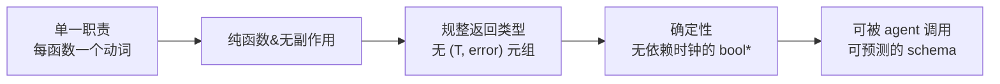
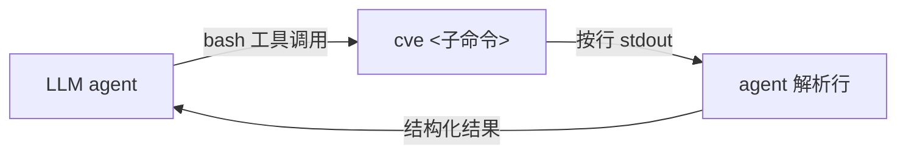
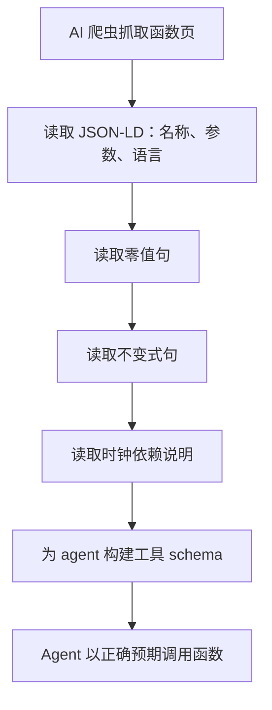
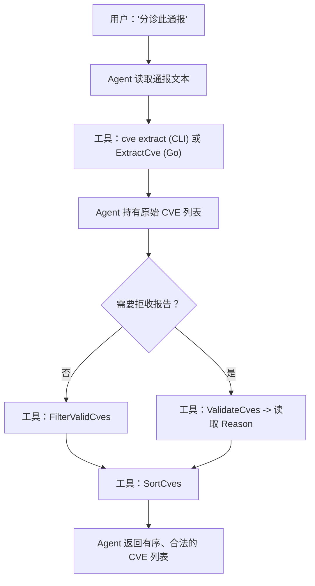
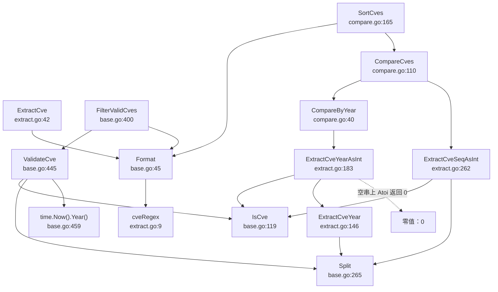

# AI Agent 集成

`cve` 包以 **AI First** 理念构建：每个公开函数都有单一职责的签名、规整的返回类型、且无隐藏副作用，因此语言模型无需阅读源码即可可靠调用。同样的设计也延伸到 `cve` CLI，其按行输出的 stdout 专为 agent 循环解析而设计。本页讲解库的形态如何使其对 LLM 工具调用友好、如何向 AI 爬虫暴露函数语义、以及如何将 `ExtractCve` + `FilterValidCves` 串联为端到端的漏洞提取流水线。

:::tip 适用读者
将 CVE 处理接入 LLM agent、RAG 流水线或自动化分诊流程的工程师。你应已了解本包的[基础用法](/zh/guide/basic-usage)；本页聚焦 API 的*面向机器*属性，而非面向人的属性。
:::

## 为何采用 AI First 的 API 形态

LLM 工具调用的可靠性取决于它所包裹的函数。模型必须从简短的签名和文档字符串中推断参数类型、返回形态与失败模式——任何含糊之处都会退化为随规模恶化的猜测游戏。`cve` 包正是带着这一约束编写的，因此每个入口都遵循四条不变式：



`*` 唯一感知时钟的函数族是年份边界检查——`ValidateCve`、`ValidateCves`、`IsCveYearOk` 与 `IsCveYearOkWithCutoff` 都会查阅 `time.Now().Year()`。这是有意为之（CVE 年份受当前公历年约束），agent 应将其视为一条刻意且已文档化的规则，而非意外。

| 不变式 | 对 agent 的含义 | 体现之处 |
| --- | --- | --- |
| 单一职责 | 函数名即动词；无开关切换无关行为 | `ExtractCve`、`SortCves`、`DiffCves` |
| 纯函数 & 无副作用 | 相同输入两次调用得到相同输出；无 I/O、不修改全局状态 | 除 `GenerateFakeCve`（随机）外所有公开函数 |
| 规整返回类型 | 返回 `string`、`[]string`、`bool` 或 `int`——绝不返回 `(value, error)` | 每个公开函数 |
| 确定性 | 今天返回的 bool 明天也返回同一 bool | 除上述年份边界族外的所有函数 |

"无 `(T, error)` 元组"这条规则影响最为深远。*可能*失败的函数（解析年份、编译通配符）在内部处理失败，返回安全的零值（`""`、`0`、`false`、`nil`），而非冒泡错误。因此 agent 永远不必在 `err != nil` 上分支——它可以直接串联调用。

```go
// 无需错误处理：ExtractCveYear 对非 CVE 返回 ""，
// strconv.Atoi 对非数字年份返回 0。流水线继续运行。
year := cve.ExtractCveYearAsInt("not-a-cve") // -> 0
if year >= 1999 {
    // 安全跳过，无崩溃，无需向 LLM 上报错误
}
```

🤖 对工具调用 agent 而言这是无价之宝：每个包装器的 JSON schema 为 `{ input: string, output: string | string[] | boolean | integer }`，无可选的错误字段，因此模型可在不为每步预留回退分支的情况下规划调用链。

## 模型可信赖的函数签名

由于每个公开函数都遵循上述不变式，agent 的工具定义可折叠为少数几种形态。下表将每个公开函数映射到 LLM 会宣告的 schema；注意它们都不携带错误通道。

| 函数 | 签名 | Agent schema（输入 → 输出） | 给模型的备注 |
| --- | --- | --- | --- |
| `Format` | `(cve string) string` | `string → string` | 幂等；对已格式化的输入调用也安全 |
| `IsCve` | `(text string) bool` | `string → boolean` | 仅校格式；容忍首尾空白 |
| `ValidateCve` | `(cve string) bool` | `string → boolean` | 增加年份 + 序列号规则 |
| `ValidateCves` | `(cveSlice []string) []CveValidationResult` | `string[] → object[]` | 每个对象含 `cve`、`valid`、`reason` |
| `FilterValidCves` | `(cveSlice []string) []string` | `string[] → string[]` | 静默丢弃非法项，归一化存活项 |
| `ExtractCve` | `(text string) []string` | `string → string[]` | 未找到时返回 `[]`（绝不以 `nil` 充当错误） |
| `ExtractFirstCve` | `(text string) string` | `string → string` | 未找到时返回 `""` |
| `CompareCves` | `(cveA, cveB string) int` | `string, string → integer` | `-1` / `0` / `1` |
| `SortCves` | `(cveSlice []string) []string` | `string[] → string[]` | 不修改输入；返回新切片 |
| `GenerateCve` | `(year, seq int) string` | `integer, integer → string` | 不对入参做合法性检查 |

⚠️ 唯一不可作为确定性函数呈现给 agent 的是 `GenerateFakeCve() string`：其序列号取自 `time.Now().Nanosecond()`，因此同一纳秒内的两次调用可能冲突。它用于测试夹具和占位数据，而非生成真实标识符——请在工具描述中标记这一点，以免模型提议将其用于实际 CVE 分配。

确定性但感知时钟的函数族在任何你生成的工具描述中都值得专门说明：

```text
ValidateCve(cve)：当 CVE 格式合法、且年份落在
[1999, 当前年份] 区间、且序列号为正整数时返回 true。上限
依赖系统时钟，因此今天无效的 CVE 在下一年可能变为
有效。勿跨年份边界缓存该布尔值。
```

⚡ 告诉模型结果*为何*会随时间变化，远比隐藏时钟依赖有用——这让 agent 能自行决定何时重新求值，而非信任过期答案。

## 作为 LLM 可调用面的 CLI

并非每个 agent 运行时都能加载 Go 共享库。`cve` CLI 通过稳定、按行输出的 stdout 暴露同样的函数，任何 shell 调用型 agent 都可消费。每个子命令每行打印一个结果，无表头、无颜色、无进度噪声——正是 `bash` 工具调用想要的形态。



extract 子命令是最干净的示例。`cve extract` 从参数或 stdin 读取文本，并将找到的每个 CVE 每行打印一个——因此 agent 可将任意通报文本管道输入并得到干净的列表：

```bash
# Agent 经 stdin 喂入通报文本，按行读取 CVE
echo "Affected by CVE-2021-44228 and CVE-2022-12345, see CVE-2021-45046" \
  | cve extract
# CVE-2021-44228
# CVE-2021-45046
# CVE-2022-12345
```

批量校验命令返回更丰富但仍按行的格式，agent 可按 `✓` / `✗` 标记切分：

```bash
cve validate-batch "CVE-2022-12345,not-a-cve,CVE-1998-1"
# ✓ CVE-2022-12345
# ✗ not-a-cve — invalid CVE format
# ✗ CVE-1998-1 — year 1998 is before 1999
```

| CLI 命令 | 包装 | Agent 应预期的输出形态 |
| --- | --- | --- |
| `cve extract [text...]` | `ExtractCve` | 每行一个 CVE；空输出表示未找到 |
| `cve extract first` / `last` | `ExtractFirstCve` / `ExtractLastCve` | 单行，未找到时为空字符串 |
| `cve extract year` / `seq` / `split` | `ExtractCveYear` / `ExtractCveSeq` / `Split` | `split` 在年份与序列号间用 TAB 分隔 |
| `cve validate-batch <list>` | `ValidateCves` | 每行 `✓ <cve>` 或 `✗ <cve> — <reason>` |
| `cve filter-valid <list>` | `FilterValidCves` | 每行一个归一化的 CVE，丢弃非法项 |

📌 两条属性使该面对 agent 友好。其一，**位置参数加 stdin 回退**：agent 可将短字符串作为参数传入、长文档通过管道传入，无需解析任何开关。其二，**退出码有意义**——extract 命令在无输入时退出码为 `1`，因此 agent 无需解析输出即可检测到"无事可做"。

## JSON-LD 与机器可读元数据

要让 AI 爬虫（搜索 agent、文档索引器或 RAG 摄取机器人）*理解*一个函数做什么，描述该函数的页面必须携带结构化元数据，而非仅散文。文档站点为每个函数页标注 JSON-LD，将函数描述为 `SoftwareSourceCode` / `APIReference` 实体，因此爬虫无需重读 markdown 即可提取名称、签名与用途。

函数页推荐使用的 JSON-LD 块如下（置于页面的 front matter 或 head 中）：

```json
{
  "@context": "https://schema.org",
  "@type": "SoftwareSourceCode",
  "name": "ExtractCve",
  "description": "Extract all CVE identifiers from arbitrary text and normalize them to uppercase.",
  "programmingLanguage": "Go",
  "codeSampleType": "full",
  "targetProduct": {
    "@type": "SoftwareApplication",
    "name": "cve-skills"
  },
  "argument":
    [
      { "@type": "PropertyValue", "name": "text", "description": "The text to scan for CVE identifiers." }
    ]
}
```

| 字段 | 爬虫为何关心 |
| --- | --- |
| `@type: SoftwareSourceCode` | 表明这是可调用代码而非教程——爬虫将其作为 API 面索引 |
| `name` + `programmingLanguage` | 让 agent 将 `ExtractCve` 与其他库中同名函数区分开 |
| `argument` | 无需抓取散文即向模型提供参数名与用途 |
| `targetProduct` | 将函数绑定到 `cve-skills` 包，使多库 agent 能正确路由调用 |

🧩 将此与稳定的 URL 方案配合，agent 即拥有按引用调用函数所需的一切：`/zh/api/functions/extract-cve` 处的页面既是人类文档，也是机器可抓取的能力描述符。当 agent 在生成的代码中遇到未知的函数名时，可 `GET` 该 URL、读取 JSON-LD、并判断调用是否形式正确。

## 帮助 AI 爬虫把握函数语义

结构化元数据告诉爬虫函数*是什么*；周围的散文必须告诉它*函数如何表现*。三条文档约定可防止 LLM 误用 API：

1. **写明零值。** 每个"可能失败"的函数都应在签名附近的正文中写明它在坏输入上返回什么。`ExtractCve` 返回空切片（不是 `nil`、不是错误）；`ExtractFirstCve` 返回 `""`；`ExtractCveYearAsInt` 返回 `0`。知道零值的 agent 可安全短路。
2. **写明不变式。** "不修改输入"、"返回新切片"、"结果已大写并去首尾空白"——这些是 agent 串联调用时依赖的承诺。`SortCves` 与 `FilterValidCves` 都保证归一化；`DiffCves` / `IntersectCves` / `UnionCves` 都保证去重与排序。
3. **写明时钟依赖。** 年份边界族是唯一不确定的面，且必须在同一句话中与规则一同点明，以免模型跨年份边界缓存 `ValidateCve` 的结果。



📖 一条有用的自检：把每个函数页当作仅凭其本身即可编译出 JSON 工具 schema 来读。若你无法从中推导出参数类型、返回类型、失败时的零值、以及结果跨调用是否稳定，那么该页对 AI 读者而言就是不完整的——即便它对人读起来毫无问题。

## 构建漏洞提取流水线

针对安全通报的标准 AI 工作流是：取原始文本、抽出每个形似 CVE 的词元、丢弃并非真正 CVE 的那些、并将干净列表交给下游逻辑（存储、去重、分诊）。`cve` 包在每个阶段以一个函数映射到这条流水线：

```mermaid
flowchart LR
    T["原始通报文本"] --> X["ExtractCve"]
    X -->|"["CVE-...", "cve-...", "CVE-1998-1"]"| V["FilterValidCves"]
    V -->|"归一化 + 仅合法"| S["SortCves"]
    S -->|"有序、去重"| D["存储 / 分诊 / RAG"]
```

每个箭头都是单次函数调用，中间无需错误处理，因为每个阶段在空或坏输入上都返回安全的零值：

```go
package main

import (
    "fmt"

    "github.com/scagogogo/cve"
)

func main() {
    advisory := `
        The vendor patched CVE-2021-44228 (Log4Shell) alongside CVE-2021-45046.
        A legacy notice still references cve-1998-1234, which predates the
        CVE program's 1999 start and should be dropped. See also CVE-2022-12345.
    `

    // 阶段 1：抽取每个形似 CVE 的词元。
    raw := cve.ExtractCve(advisory)
    // ["CVE-2021-44228", "CVE-2021-45046", "CVE-1998-1234", "CVE-2022-12345"]

    // 阶段 2：仅保留合法项（格式 + 年份 + 序列号），并归一化。
    clean := cve.FilterValidCves(raw)
    // ["CVE-2021-44228", "CVE-2021-45046", "CVE-2022-12345"]
    //   -- CVE-1998-1234 被丢弃：年份 1998 < 1999

    // 阶段 3：排序以稳定下游存储。
    ordered := cve.SortCves(clean)
    // ["CVE-2021-44228", "CVE-2021-45046", "CVE-2022-12345"]

    for _, id := range ordered {
        fmt.Println(id)
    }
}
```

注意使该流水线在 agent 循环内健壮的三条属性：

- **幂等阶段。** 对已干净的输入运行 `FilterValidCves` 是空操作（全部通过），因此流水线可安全重试或在部分结果上重跑。
- **与顺序无关的存活项。** `FilterValidCves` 归一化大小写与空白，因此通报里写的是 `CVE-2021-44228` 还是 `cve-2021-44228` 都无所谓——存储的标识符相同。
- **需要时的无损报告。** 若 agent 必须*解释* `CVE-1998-1234` 为何被丢弃（用于审计日志），将阶段 2 换成 `ValidateCves` 并读取 `Reason` 字段——流水线其余部分保持不变。

| 阶段 | 函数 | 丢弃任何内容？ | 解释丢弃？ | 归一化？ |
| :-: | --- | :-: | :-: | :-: |
| 1 | `ExtractCve` | 否——保留每个匹配正则的词元 | 否 | 是（大写） |
| 2 | `FilterValidCves` | 是——移除非法 CVE | 否 | 是（大写 + 去首尾空白） |
| 2' | `ValidateCves`（替代） | 否——保留全部，逐项标记 | 是——每行一个 `Reason` | 否（保留原样） |
| 3 | `SortCves` | 否 | 否 | 是（大写 + 去首尾空白） |

🤖 在阶段 2 上于 `FilterValidCves` 与 `ValidateCves` 之间的选择，是 agent 需要做的唯一分支决策：*我要干净列表，还是要拒收报告？* 将这单一决策编码进 agent 的提示，流水线的其余部分即是一条直线串联。

## 端到端 agent 循环草图

将各部分组合起来，一个摄取通报并返回经分诊、去重的 CVE 列表的最小 agent 循环如下：



无论 agent 直接调用 Go 函数（经工具包装器）还是 shell 出 CLI，同一循环都成立——语义相同，仅调用约定不同。这种对称正是 AI First 设计的用意所在：模型可一次学会本包，并通过其运行时所暴露的任一界面加以应用。

## 小结

- `cve` 包是 AI First 的：单一职责、纯函数、规整返回类型、且（几乎）确定——唯一感知时钟的面是年份边界族，且已如此文档化。
- 每个公开函数在坏输入上返回安全的零值而非错误，因此 agent 可串联调用而无需为每步预留回退分支。
- `cve` CLI 通过按行输出的 stdout 镜像库，赋予 shell 调用型 agent 同等能力且无解析歧义。
- 用 JSON-LD 标注函数页可让 AI 爬虫以结构化数据提取名称、签名与用途，将文档变为机器可抓取的能力描述符。
- 漏洞提取流水线是一条直线串联——`ExtractCve` → `FilterValidCves` → `SortCves`——在需要拒收报告时带一条到 `ValidateCves` 的可选分支。

## 图解参考

两张图补充上面的流水线草图：一张 ASCII 决策树展示单个词元如何流经验证层，一张 mermaid 图展示各公开入口与所委托的内部辅助函数之间的运行时调用关系。

第一张图追踪单个词元从原始通报文本到最终存储 CVE 的全过程，标明在每一层由哪个函数拒收。注意 `ExtractCve` 永不拒收正则匹配——过滤发生在下游的 `FilterValidCves` / `ValidateCves`，这正是流水线能在不动阶段 1 的前提下替换阶段 2 的原因。

```text
                    原始通报文本
                          |
                          v
              +-----------------------+
              | ExtractCve            |
              | 正则: (?i)(CVE-       |
              |   \d+-\d+)  extract.go:9
              +-----------------------+
                          |
              匹配词元（已大写）
                          |
              +-----------------------+
              | IsCve（仅校格式）     |
              | 正则: ^\s*CVE-        |
              |  \d+-\d+\s*$ base.go:14
              +-----------------------+
                 |                  |
              通过               失败
                 |                  |
                 v                  v
        +-----------------+   拒收：
        | 年份落在        |   "invalid CVE format"
        | [1999, 当前]    |
        | base.go:459     |
        +-----------------+
           |            |
        通过          失败
           |            |
           v            v
   +---------------+  拒收：
   | 序列号 > 0     |  "year ... before 1999"
   | base.go:459   |  或 "... after current year"
   +---------------+
      |          |
   通过       失败
      |          |
      v          v
  存储 CVE      拒收：
              "sequence number
               must be positive"
```

第二张图展示内部委托图：哪个公开函数调用了哪个公开或包级函数。这对 agent 作者很重要，因为一个函数的*确定性*与*时钟感知*会传播到所有调用它的函数——`SortCves` 调用 `CompareCves`，`CompareCves` 调用 `CompareByYear`，`CompareByYear` 调用 `ExtractCveYearAsInt`，正是年份提取的零值行为使 `SortCves` 在垃圾输入上也安全。



## 深入解析

五个 API 表层未点明、但 agent 作者或文档索引器应知的实现细节：

1. **`ExtractCve` 在无匹配时返回 `nil`，而非预分配的空切片。** `cveRegex.FindAllString(text, -1)`（extract.go:43）在零匹配时返回 `nil`，而 `ExtractCve` 未对其包装。在 Go 中，`nil` 与 `[]string{}` 在 `len()` 和 `range` 下等价，且在 JSON 中都序列化为 `[]`——因此"返回 `[]`、绝不返回错误"的流水线契约仍然成立。但若 agent 包装器用 `reflect.DeepEqual(got, []string{})` 断言"空结果"，会得到 `false`；请改用 `len(got) == 0`。

2. **`SortCves` *不* 去重。** 尽管流水线箭头标注"有序、去重"，`SortCves`（compare.go:165-176）仅复制、格式化并 `sort.Slice` 输入——它从不碰集合。去重只存在于 `RemoveDuplicateCves`、`IntersectCves`、`UnionCves` 与 `DiffCves`，它们都构建 `map[string]struct{}`。若通报两次提及同一 CVE 而你想要集合，请在 `SortCves` 之后再调 `RemoveDuplicateCves`，或走 `UnionCves(list, nil)`，后者一次遍历同时去重与排序（filter.go:284-305）。

3. **`CompareByYear` 返回原始差值，而非 `{-1,0,1}`。** `CompareCves` 归一化为 `-1/0/1`（compare.go:110-128），但 `CompareByYear`（compare.go:40-42）原样返回 `yearA - yearB`——因此 `CompareByYear("CVE-2020-1", "CVE-2024-1")` 为 `-4`，而非 `-1`。若 agent 在两者间切换并假设三元返回，将误排。`SubByYear` 是 `CompareByYear` 的别名，故承载相同的"差值而非三元"契约。

4. **年份边界族每次调用都读 `time.Now()`，无缓存。** `ValidateCve`（base.go:459）、`IsCveYearOkWithCutoff`（base.go:231-234）与 `GetRecentCves`（filter.go:187-190）都直接调用 `time.Now().Year()`。包内无"当前年份"快照，因此该族在跨年边界时正确，代价是每次调用一次（可忽略的）系统调用。对 agent 的实际后果：勿跨年边界缓存 `ValidateCve` 的布尔值，亦勿假设同一请求内两次调用共享缓存的年份——若时钟推进，上限可能在两次调用间变化。

5. **`GenerateFakeCve` 的随机性是纳秒取模，非密码学级。** 序列号为 `10000 + time.Now().Nanosecond()%90000`（generate.go:100-104），落在 `[10000, 99999]`。因其取自 `Nanosecond()`（十亿态范围）对 `90000` 取模，同一纳秒内必撞，且分布受取模偏置。它可用于测试夹具与占位数据，但 agent 不得将其呈现为唯一 ID 生成器——请如本页前面的表格所建议，在工具描述中标记这一点。

## 延伸阅读

- [ExtractCve](/zh/api/functions/extract-cve) — 提取流水线的入口
- [FilterValidCves](/zh/api/functions/filter-valid-cves) — 阶段 2 使用的归一化存活项过滤器
- [ValidateCves](/zh/api/functions/validate-cves) — 带 `Reason` 链的批量校验，是 `FilterValidCves` 的报告替代
- [SortCves](/zh/api/functions/sort-cves) — 收尾流水线的排序辅助
- [校验策略](/zh/guide/validation-strategy) — 四个校验入口之间的分层关系
- [基础用法](/zh/guide/basic-usage) — 面向人的本包入门
