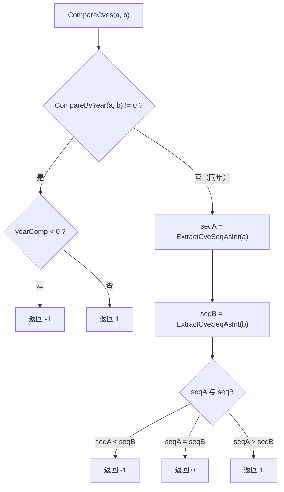
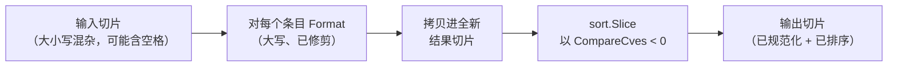
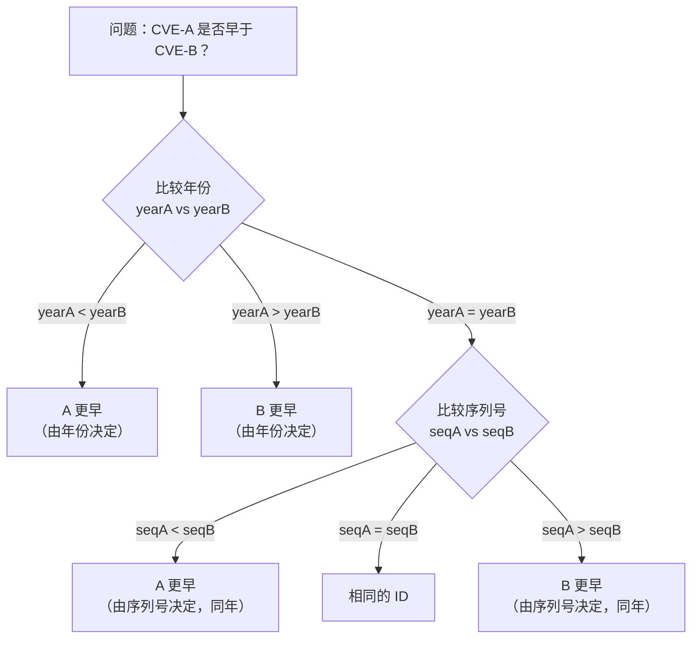
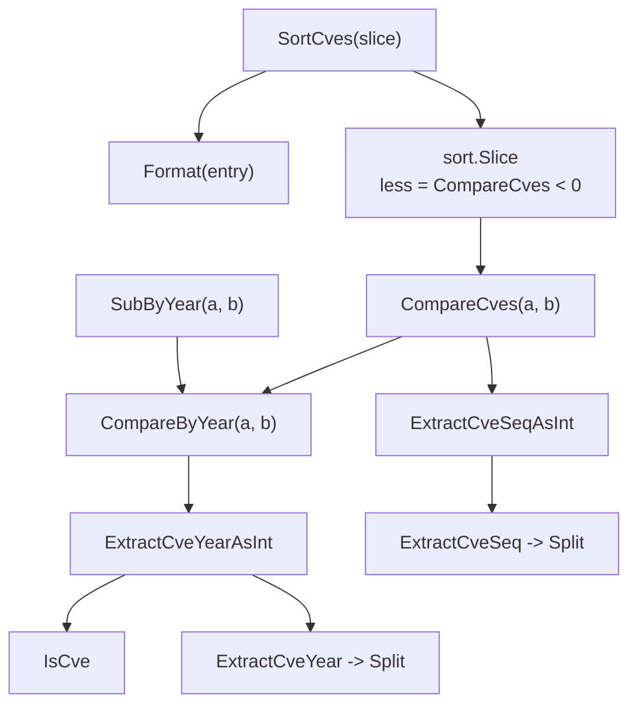

# 比较与排序

`cve` 包提供两个返回形态刻意不同的比较原语、一个规范化格式的稳定排序，以及一个年份差别名。它们合在一起覆盖了你可能需要的每一种排序场景：完整的按时间排序、仅按年份分桶，以及衡量两个标识符之间的间距。本页逐函数讲解 `compare.go`，解释两个比较器为何在设计上分道扬镳，并展示 `SortCves` 如何将它们层层封装进单次 O(n log n) 调用。

:::tip 适用读者
你已经会调用 `ExtractCve` 或 `Format`，想要理解排序语义——何时该用 `CompareByYear`、何时该用 `CompareCves`，`SortCves` 在输出时对输入做了什么处理，以及为何年份先于序列号比较。
:::

## 两个比较器，两份契约

该包暴露两个看起来可互换、但返回值根本不同的比较函数。选错一个是 CVE 流水线中最常见的排序 bug 来源，因此这一区别值得精确说明。

`CompareByYear(cveA, cveB string) int` 返回两个年份的**算术差**：

```go
func CompareByYear(cveA, cveB string) int {
    return ExtractCveYearAsInt(cveA) - ExtractCveYearAsInt(cveB)
}
```

返回值是 `yearA - yearB`，而非符号归一化的三态。对于 `CVE-2020-1111` 与 `CVE-2022-2222`，它返回 `-2`，恰好同时编码了方向与间距的大小。相比之下，`CompareCves(cveA, cveB string) int` 返回严格的三态 `-1`、`0` 或 `1`：

```go
func CompareCves(cveA, cveB string) int {
    yearComp := CompareByYear(cveA, cveB)
    if yearComp != 0 {
        if yearComp < 0 {
            return -1
        }
        return 1
    }
    seqA := ExtractCveSeqAsInt(cveA)
    seqB := ExtractCveSeqAsInt(cveB)
    if seqA < seqB {
        return -1
    } else if seqA > seqB {
        return 1
    }
    return 0
}
```

下表一目了然地概括了契约差异。

| 维度 | `CompareByYear` | `CompareCves` |
|---|---|---|
| 返回形态 | `yearA - yearB`（任意 int） | 仅 `-1` / `0` / `1` |
| 比较字段 | 仅年份 | 先年份，再序列号 |
| 数值有意义吗？ | 是——值即年份差 | 否——只有符号有意义 |
| 序列号决胜 | 否（同年 → `0`） | 是 |
| 典型用途 | 分桶、间距测量 | 全序、排序 |

### 为何两份形态分道扬镳

这种分离是有意为之。`CompareByYear` 是一个**测量**原语：调用方问"这两个相差多少年？"，一次裸减法即可回答。`CompareCves` 是 `sort.Interface` 意义上的**比较器**原语：它必须满足三分律（`a < b`、`a == b`、`a > b` 三者恰有一个成立），调用方只会在符号上分支。从比较器返回 `2` 或 `-7` 对 `sort.Slice` 是合法的，但对阅读调用处的人来说会感到意外，因此实现将其归一化为 `-1/0/1`。



注意 `CompareCves` 在内部复用 `CompareByYear`，而非重新实现年份逻辑。这让年份提取契约只存在于唯一一处——`ExtractCveYearAsInt`——因此未来对年份解析的任何改动都会自动传播。

## SortCves：O(n log n) 且带稳定格式化

`SortCves(cveSlice []string) []string` 是对标识符列表排序的主力函数。它依次做三件事：分配一个新的结果切片、用 `Format` 规范化每个条目、用 `CompareCves` 作为小于谓词进行排序。

```go
func SortCves(cveSlice []string) []string {
    result := make([]string, len(cveSlice))
    for i, cve := range cveSlice {
        result[i] = Format(cve)
    }
    sort.Slice(result, func(i, j int) bool {
        return CompareCves(result[i], result[j]) < 0
    })
    return result
}
```

有三个特性值得一提，因为它们决定了你如何使用结果。

**时间复杂度为 O(n log n)。** 主导开销是 `sort.Slice`，它是 introselect 风格的混合排序，平均与最坏情形均为 O(n log n)。在它之前的 `Format` 一趟是 O(n)，不改变渐近界限。

**空间复杂度为 O(n)。** 用 `make([]string, len(cveSlice))` 分配了一个全新切片；输入绝不会被修改。你可以把一个背后共享内存的切片交给 `SortCves` 而不必担心别名问题。

**排序前先规范化格式。** 因为 `Format` 会大写化并修剪，`"cve-2022-2222"` 和 `" CVE-2022-1111 "` 在结果中都会成为干净的 `CVE-YYYY-NNNNN` 字符串，比较器随后看到的大小写一致，因此它在 `IsCve`/`Split` 中基于正则的提取行为也保持一致。源码文档注释中的例子使其具象化：

```go
input := []string{"cve-2022-2222", "CVE-2022-1111"}
// SortCves 返回 ["CVE-2022-1111", "CVE-2022-2222"]
// 注意两个条目现在都是大写，
// 尽管第一个输入是小写。
```



一个细微之处：`sort.Slice` **不**稳定。若两个条目在 `CompareCves` 下相等（同年同序列号），它们在输出中的相对顺序不保证与输入一致。实践中相等的 CVE ID 即重复，它们之间的顺序无关紧要，但若你需要对相等却不同的输入保持稳定顺序，应在自己的调用方代码中改用 `sort.SliceStable`，而非 `SortCves`。

## 为何年份先于序列号

`CompareCves` 与 `SortCves` 都先比较年份，仅在年份相等时才落到序列号。这一顺序并非任意——它映射了现实中 CVE ID 的分配方式。

一个 CVE 标识符是 `CVE-YYYY-NNNNN`。年份是**预留桶**：MITRE 的 CVE 程序在某个年份内分配 ID，而年份边界几乎总是意味着更晚的发布日期。序列号只在某一年**之内**才有意义——`CVE-2022-99999` 不会告诉你它早于还是晚于 `CVE-2023-00001`，除非你先比较年份。跨不同年份比较序列号会产生语法上已排序、但时间上错误的顺序。



同样的逻辑也是 `CompareByYear` 对同年的两个 ID 一律返回 `0`（不论序列号）的原因——它是一个刻意的粗粒度比较器，专为分桶与间距测量而设计，而非全序。

## SubByYear：一个测量别名

`SubByYear(cveA, cveB string) int` 是一个薄别名，直接委托给 `CompareByYear`：

```go
func SubByYear(cveA, cveB string) int {
    return CompareByYear(cveA, cveB)
}
```

其行为与 `CompareByYear` 逐字节相同。该包保留两个名字的原因是**调用处的可读性**。当你在排序或分支时，`CompareByYear` 读起来自然（`if CompareByYear(a, b) < 0`）；当你在对间距做算术时，`SubByYear` 读起来自然（`yearsBetween := SubByYear(a, b)`）。同一实现，两套词汇。

```go
// 下面两行完全等价：
diff := cve.CompareByYear("CVE-2023-1111", "CVE-2020-2222")
diff := cve.SubByYear("CVE-2023-1111", "CVE-2020-2222")
// 两种情况下 diff == 3
```

当返回值被当作一个量而非一个符号消费时，请将 `SubByYear` 作为首选名称。

## 对无效输入的处理

这四个函数在格式错误的输入上都会优雅降级而非 panic，因为它们依赖 `ExtractCveYearAsInt` 与 `ExtractCveSeqAsInt`。两个提取器在 `IsCve` 失败或数值解析出错时都返回 `0`，这意味着无效 CVE 在比较时被视为年份 `0` / 序列号 `0`。

| 输入形态 | 提取到的年份 | 提取到的序列号 | 在 `CompareCves` 中的效果 |
|---|---|---|---|
| `CVE-2022-12345` | `2022` | `12345` | 正常比较 |
| `not-a-cve` | `0` | `0` | 排在每个合法 ID 之前 |
| `CVE-2022-ABC` | `2022` | `0` | 年份决胜正常，序列号为 `0` |
| 空字符串 `""` | `0` | `0` | 视为年份 `0` |

这是一种刻意的"软失败"选择：一个夹杂垃圾条目的嘈杂输入列表仍会产出确定性、可用的排序，而非中止排序。若你需要直接拒绝无效条目，请在调用 `SortCves` **之前**用 `FilterValidCves` 或 `ValidateCves` 过滤。

## 综合运用：一份按时间排序的报告

一个常见的现实任务是：从一段自由文本通告中提取所有 CVE、去重、按时间排序、并报告年份跨度。每一步都对应本页中的一个函数。

```go
package main

import (
    "fmt"

    "github.com/scagogogo/cve"
)

func main() {
    advisory := "Affected: cve-2022-2222, CVE-2020-1111, CVE-2022-1111, CVE-2021-44228"

    // 1. 提取文本中提到的每一个 CVE。
    ids := cve.ExtractCve(advisory)

    // 2. 按时间排序。SortCves 会规范化格式
    //    （大写、已修剪）并按年份再按序列号排序。
    sorted := cve.SortCves(ids)
    fmt.Println(sorted)
    // [CVE-2020-1111 CVE-2021-44228 CVE-2022-1111 CVE-2022-2222]

    // 3. 测量最旧与最新之间的年份跨度。
    if len(sorted) >= 2 {
        span := cve.SubByYear(sorted[len(sorted)-1], sorted[0])
        fmt.Printf("spans %d years\n", span)
        // spans 2 years
    }

    // 4. 在两个具体 ID 之间做全序检查。
    fmt.Println(cve.CompareCves("CVE-2022-1111", "CVE-2022-2222"))
    // -1  （同年，序列号更小）
}
```

这段流水线自上而下读起来就是意图：提取、排序、测量、比较。任何一步都不需要知道年份如何被解析、排序如何实现——这些细节都封装在 `compare.go` 与 `extract.go` 之内。

## 小结

- 📌 `CompareByYear` 返回原始年份差 `yearA - yearB`；`CompareCves` 返回严格的 `-1/0/1` 三态。按你需要数值还是符号来选择。
- 🧩 `CompareCves` 先比较年份再比较序列号，第一段复用 `CompareByYear`。
- ⚡ `SortCves` 时间 O(n log n)、空间 O(n)，绝不修改输入，并在排序前用 `Format` 规范化每个条目。
- 🤖 年份先于序列号的规则映射 CVE 预留语义：年份是桶，序列号只在某年内才有意义。
- 🛠️ `SubByYear` 是 `CompareByYear` 的可读性别名——行为相同，当返回值被当作量使用时优先选用。
- ⚠️ 无效输入软失败：格式错误的 CVE 被视为年份 `0` / 序列号 `0`。若需严格拒绝请先过滤。
- ✅ 要生成按时间排序的报告，串联 `ExtractCve` → `SortCves` → `SubByYear`。

## 图解参考

下面两张图从两个角度展示同一条 `SortCves` 流水线。第一张是 ASCII 数据流，跟踪具体输入切片如何穿过三个阶段；第二张是 mermaid 调用图，展示公共函数如何层层委托到提取原语。

### ASCII 数据流

这一视角跟踪一段具体输入切片在 `SortCves` 中的命运。注意 `Format` 一趟会先抹平大小写与首尾空格差异，**然后**比较器才看到这些值，因此 `CompareCves` 这一阶段始终作用于规范的 `CVE-YYYY-NNNNN` 字符串。

```text
+-------------------------+      +---------------------------+      +------------------------------+
|  输入切片               |      |  阶段 1：Format 一趟      |      |  阶段 2：拷贝进结果切片      |
|  （大小写混杂/含空格）  |----->|  对每个条目 Format()       |----->|  result[i] = Format(cve)     |
|                         |      |  -> 大写 + 已修剪          |      |  （全新 make，len = n）      |
+-------------------------+      +---------------------------+      +------------------------------+
                                                                              |
                                                                              v
            +-------------------------------------+      +----------------------------------------------+
            |  阶段 3：sort.Slice(result, less)    |<-----+  less(i,j) = CompareCves(result[i],result[j]) < 0
            |  introselect，O(n log n)            |      |  年份经 ExtractCveYearAsInt（失败回退 0）    |
            |  对相等元素**不**稳定               |      |  序列号经 ExtractCveSeqAsInt  （失败回退 0）  |
            +-------------------------------------+      +----------------------------------------------+
                              |
                              v
            +-------------------------------------------------+
            |  输出切片                                        |
            |  ["CVE-2020-1111","CVE-2021-44228",            |
            |   "CVE-2022-1111","CVE-2022-2222"]              |
            |  （已规范化 + 已按时间排序）                     |
            +-------------------------------------------------+
```

### mermaid 调用图

这一视角展示 `compare.go` 与 `extract.go` 中各函数之间的静态委托树。`CompareCves` 复用 `CompareByYear` 而非重新实现年份段，二者最终都汇入同一组 `ExtractCveYearAsInt` / `ExtractCveSeqAsInt` 提取器——这正是为何对年份解析的任何单点修复都会自动传播到全部比较器。



## 深入解析

浏览 `compare.go` 时几处容易漏掉的细节：

**两条进入提取器的调用路径。** `ExtractCveYearAsInt`（extract.go:183）先以 `IsCve` 守卫，失败返回 `0`，再调用 `ExtractCveYear` → `Split`。`ExtractCveSeqAsInt`（extract.go:262）走的却是另一条路：它调用 `ExtractCveSeq`（其内部守卫 `IsCve`，失败返回 `""`），随后 `strconv.Atoi("")` 得到 `0`。净效果相同——无效 ID 一律解析为年份 `0` / 序列号 `0`——但两条路径抵达该结果所经的代码不同，因此未来重构必须同时保持二者返回 `0`，才能维持软失败的排序契约。

**`sort.Slice` 不稳定，而 `CompareCves` 返回 `0` 正是陷阱所在。** `sort.Slice`（compare.go:171）采用 Go 的 pdqsort，不保留相等元素的输入顺序。由于 `CompareCves` 把任何同年同序列号的对都折叠为 `0`，输入中的重复 ID 在输出中可能以任意顺序出现。关键在于"何谓相等"：`Format` 只大写化并修剪（base.go:46），**不**对序列号补零，而 `CompareCves` 经由 `ExtractCveSeqAsInt` 解析为 `int` 后再比较。于是 `CVE-2022-1` 与 `CVE-2022-0001` 文本不同却比较为**相等**（`Atoi("1") == Atoi("0001") == 1`），其相对顺序因此不被保留。若需要宽度归一的同一性，请先用 `FormatSeq`。

**`CompareByYear` 为数值复用，`CompareCves` 为正确性复用。** `CompareCves`（compare.go:111）先调用 `CompareByYear`，事后再归一化符号。这意味着每次比较中年份段恰好计算一次，序列号段（两次 `ExtractCveSeqAsInt`）仅在年份打平时才运行。这一顺序是一个小而实在的性能抉择：年份提取是一次 `IsCve` + 一次 `Split`，在常见的跨年比较中跳过序列号提取，可避免在已大致有序的数据上每次比较多跑两次正则匹配。

**`SubByYear` 为何与 `CompareByYear` 并存。** 二者逐字节相同（compare.go:72 直接穿透委托）。其存在是为了调用处可读性，而非行为：`SubByYear` 暗示"我在对间距做算术"，`CompareByYear` 暗示"我在符号上分支"。读 `yearsBetween := SubByYear(a, b)` 的人知道数值会被消费；读 `if CompareByYear(a, b) < 0` 的人知道只有符号会被消费。删掉任一名字都不会改变任何输出，却会抹去这一信号。

**与字符串排序的历史对照。** 对 CVE ID 直接 `sort.Strings` 是字典序，会把 `CVE-2022-10000` 排到 `CVE-2022-9999` 之后（因为 `'1' < '9'`，字典序比较从左到右逐字符走，10000 的首位 `1` 小于 9999 的首位 `9`），数值上却错了。通过 `ExtractCveYearAsInt`/`ExtractCveSeqAsInt` 把年份与序列号都解析为 `int`，`CompareCves` 彻底绕开了变长序列号陷阱——代价是每个打平年份的比较多两次 `strconv.Atoi` 调用。

## 延伸阅读

- [`CompareByYear` 与 `CompareCves` API 参考](/zh/api/functions/compare-cves)
- [`SortCves` API 参考](/zh/api/functions/sort-cves)
- [`SubByYear` API 参考](/zh/api/functions/sub-by-year)
- [从文本中提取 CVE](/zh/api/extract) — 喂给上述排序流水线的 `ExtractCve` 步骤
- [格式化与校验](/zh/guide/formatting-normalization) — 为何 `Format` 在 `SortCves` 中先于比较运行
