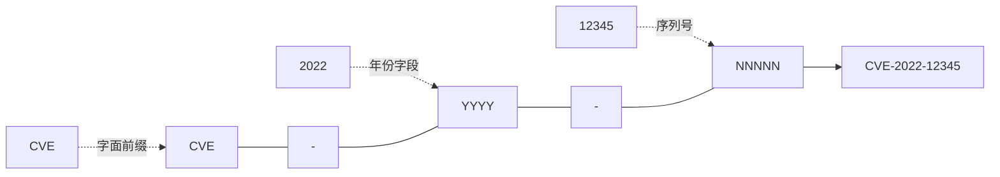
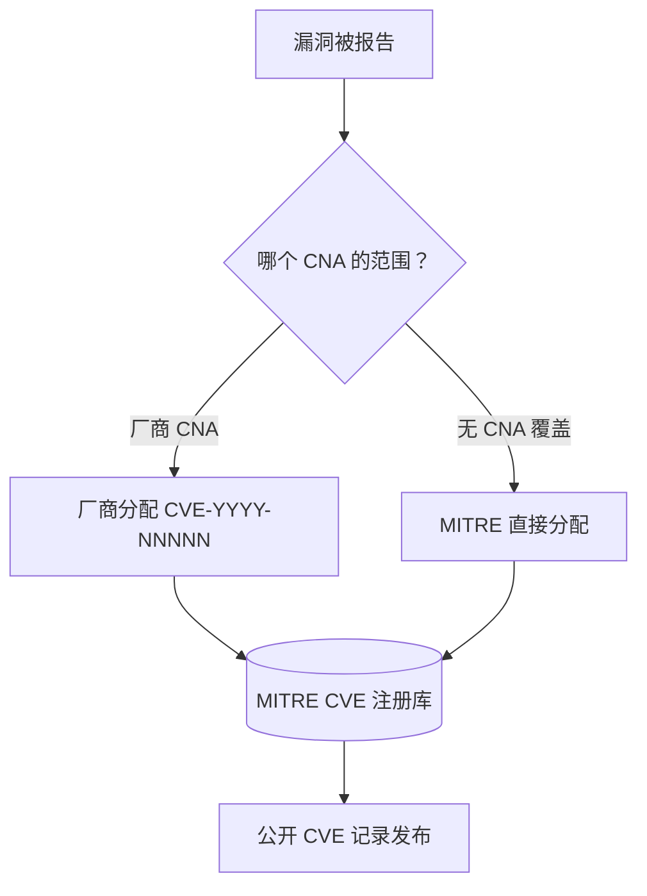
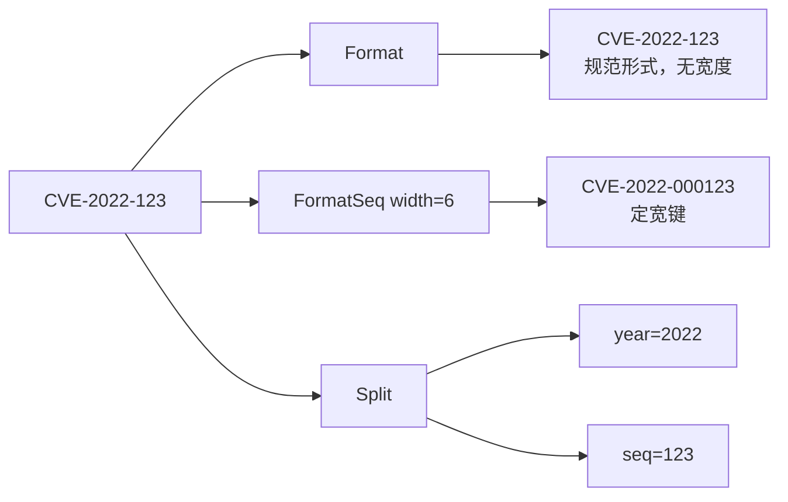
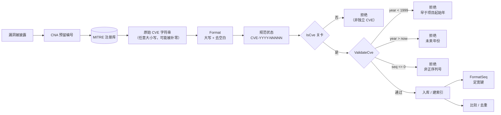

# CVE 编号体系

📌 CVE 编号体系是公开披露网络安全漏洞的通用命名方案。每一个编号都遵循固定语法 `CVE-YYYY-NNNNN`，其中 `YYYY` 是编号被分配或预留的年份，`NNNNN` 是在该年份内唯一的序列号。本页讲解该格式的由来、MITRE 与 CVE 编号机构（CNA）如何分配编号、为何年份从 1999 起、序列号如何增长，以及为何整个方案需要标准化。随后将每一条规则回扣到 `cve` 包中的 `Format` 与 `IsCve` 函数，说明库如何对齐官方规范。

:::tip 适用读者
构建漏洞数据库、安全订阅源导入器，或需要发出与识别 CVE 编号的工具的开发者；需要理解格式"为何如此"再行依赖的架构师；以及任何曾疑惑为何 `CVE-1998-1` 被拒绝、为何同一个 CVE 既能是 `CVE-2022-12345` 又能是 `CVE-2022-00012345` 的人。
:::

## 格式的由来

`CVE-YYYY-NNNNN` 语法并非随意的约定。它是 CVE 项目定义并维护的对外编号格式，该项目由 MITRE 公司运营，受 CVE 编号机构监督。该格式有三个固定结构元素：

| 段 | 含义 | 约束 |
| --- | --- | --- |
| `CVE` | 标识其为 CVE 的字面前缀 | 规范形式始终大写；输入时大小写不敏感 |
| `YYYY` | 分配或预留年份 | 4 位年份，`1999` 至当前年份 |
| `NNNNN` | 年份内序列号 | 一位或多位数字，单调分配，规范中无固定宽度 |

连字符是分隔符，不是装饰——它是编号的一部分。这正是 `cve` 包在 `base.go` 中用两条核心正则所编码的形状：

```go
// 精确匹配CVE格式（允许两侧有空白字符）
exactCveRegex = regexp.MustCompile(`(?i)^\s*CVE-\d+-\d+\s*$`)
// 在文本中匹配CVE格式
containsCveRegex = regexp.MustCompile(`(?i)CVE-\d+-\d+`)
```

两个细节值得注意。其一，两条正则都使用 `(?i)` 大小写不敏感标志，对应官方项目的规则：前缀可以任意大小写 arriving，必须被标准化为大写。其二，序列号部分是 `\d+`——一位或多位数字，**无固定宽度**。这与真实 CVE 项目一致：它从未为序列号规定固定位数，而是任其增长。



## MITRE 与 CNA 分配机制

CVE 项目并没有一个集中办事员逐个敲出编号。分配是一个联邦化流程，旨在扩展到每年披露的数十万漏洞规模。

顶端是 **MITRE 公司**，它运营 CVE 项目与主注册库。MITRE 之下是 **CVE 编号机构（CNA）**——被授权在各自范围内分配 CVE 编号的机构。一个 CNA 可能是软件厂商（负责自身产品的漏洞）、漏洞赏金平台、研究团队或国家级 CERT。当漏洞被报告时，范围覆盖受影响产品的 CNA 预留或分配一个 CVE 编号，MITRE 将其记录在案。

从"漏洞被披露"到"注册库中存在编号"的流程如下：



正是这一联邦化模型决定了年份与序列号字段的结构。**年份字段**记录编号被分配的 *时间*（或其预留所在年份块），让各方对"这是 2022 年的问题"有共同认知。**序列号**从按年份划分的池中分配，因此从同一年份取号的 CNA 只要取到不同序列号便不会冲突。固定的 `CVE-YYYY-NNNNN` 形状让来自数百家独立 CNA 的编号能归并为一个全局唯一、可排序的键。

## 年份字段：为何从 1999 起

CVE 项目自 **1999** 年起以 `CVE-YYYY-NNNNN` 语法发布编号。不存在年份早于 1999 的官方 CVE 记录。任何形如 `CVE-1998-NNNNN` 或更早的编号，按定义都不是真实 CVE——它是笔误、虚构示例，或恰好匹配正则的非 CVE 编号。

这一历史事实直接编码在源码中。库 `base.go` 中的年份边界助手硬编码了下限：

```go
func IsCveYearOkWithCutoff(cve string, cutoff int) bool {
    year := extractYear(cve)
    return year >= 1999 && year <= time.Now().Year()+cutoff
}
```

常量 `1999` 并非来自配置。它是 CVE 项目本身的固定属性，因此库将其视为不变量而非可调项。同一个 `1999` 也出现在 `ValidateCve` 与内部 `validateSingleCve` 中，使每个校验入口共享相同的下限。

上限是 **当前公历年份**，在调用时通过 `time.Now().Year()` 计算。年份超过当前年份的 CVE 形迹可疑——MITRE 不可能分配出"未来"记录——因此此类编号默认被拒绝。这是库对 CVE 项目合理可签发内容保持诚实的方式。

⚠️ `IsCveYearOkWithCutoff` 的 `cutoff` 参数向前放宽上限（以接纳预留与预发布的 CVE），但它 **从不** 放宽 1999 下限。即便 cutoff 极大，`CVE-1998-12345` 仍被拒绝。

## 序列号分配与增长规则

年份字段有界，序列号却开放。官方规则很简单：

1. **序列号是正整数**，从按年份划分的池中分配。库在 `ValidateCve` 中以 `seqInt > 0` 编码此规则，故 `CVE-2022-0` 被拒绝。
2. **无固定宽度。** 早期 CVE 记录序列号很短（`CVE-1999-0001`）；近年序列号已达五六位（`CVE-2021-44228`、`CVE-2024-3094`）。规范不做前补零。
3. **序列号在年份内单调分配**，但未必稠密。CNA 可能预留一整块却不尽数使用，因此空缺是正常的，"缺失"的序列号并不意味编号无效。

由于规范不强制固定宽度，各订阅源各执一词：有的为展示或数据库存储将序列号前补零到定宽，有的省略前导零。同一个逻辑 CVE 因而可能呈现为 `CVE-2022-123` 或 `CVE-2022-000123`。库的 `FormatSeq` 正为弥合此分歧而存在，在不改动年份的前提下按调用方指定宽度重建序列号：

```go
func FormatSeq(cve string, width int) string {
    if !IsCve(cve) {
        return cve
    }
    year, seq := Split(cve)
    seqInt, err := strconv.Atoi(seq)
    if err != nil {
        return cve
    }
    return fmt.Sprintf("CVE-%s-%0*d", year, width, seqInt)
}
```

`FormatSeq` 先以 `IsCve` 守卫（非 CVE 输入原样返回），再 `Split` 出年份与序列号，最后用 `%0*d` 按调用方宽度前补零重新拼接。这是库对一个有意将序列号宽度留白的规范的务实回应：保持规范形式无宽度，但为需要定宽键的调用方提供定宽形式。

规范形式、定宽形式与底层年份、序列号之间的关系如下：



## 为何需要标准化

漏洞编号只有在各方就"它命名什么"达成一致时才有用。若无单一规范形式，同一个漏洞会变成三条不同记录：一个订阅源里是 `cve-2021-44228`，另一个是 `CVE-2021-44228`，第三个给序列号前补零成 `CVE-2021-0044228`。去重失败、跨公告关联失败，数据库的 `UNIQUE` 索引要么拒绝合法的重复，要么把同一逻辑 CVE 接受两次。

`cve` 包把标准化视为其他一切操作赖以构建的根基，并通过两个互补函数实现：

- **`Format`** —— 无条件的标准化器。它只做两件事，`strings.ToUpper(strings.TrimSpace(cve))`，再无其他。它不校验、不重排段、不动序列号宽度。包内每个比较、分组、去重或存储 CVE 的函数都先把值过一遍 `Format`，使所有下游逻辑在同一规范形状上运转，无论输入多杂乱。
- **`IsCve`** —— 格式守门人。仅当字符串 *恰好* 是一个 CVE 编号（可选地被空白环绕）时才返回 `true`，使用 `exactCveRegex`。这正是区分"`Format` 后看着规范"与"确为 CVE"的关键。像 `not-a-cve` 这样的字符串会被 `Format` 大写成 `NOT-A-CVE`，但仍被 `IsCve` 拒绝。

```go
func Format(cve string) string {
    return strings.ToUpper(strings.TrimSpace(cve))
}

func IsCve(text string) bool {
    return exactCveRegex.MatchString(text)
}
```

这种分工是刻意的。`Format` 廉价且全量——它从不失败，因此流水线可以对每个输入防御性地调用它。`IsCve` 是严格的校验，为任何依赖年份与序列号语义的逻辑把关。二者合力使库对齐官方规范：`Format` 强制执行 CVE 项目期望的"大写、无环绕空白"规范形式，`IsCve` 强制执行项目定义的 `CVE-YYYY-NNNNN` 结构。

两个函数协作的具体走查：

| 输入 | `Format` 之后 | `IsCve` 结果 | 解读 |
| --- | --- | --- | --- |
| `cve-2022-12345` | `CVE-2022-12345` | `true` | 合法，可入库 |
| `" CVE-2022-12345 "` | `CVE-2022-12345` | `true` | 容忍并去除空白 |
| `Cve-2021-44228` | `CVE-2021-44228` | `true` | 大小写已标准化 |
| `not-a-cve` | `NOT-A-CVE` | `false` | 被大写但仍被 `IsCve` 拒绝 |
| `包含CVE-2022-12345的文本` | （形状不变） | `false` | 非独立 CVE；改用 `ExtractCve` |

## 小结

- `CVE-YYYY-NNNNN` 语法是 CVE 项目官方编号格式——字面 `CVE` 前缀、4 位年份、可变宽正整数序列号，以连字符相连。
- 分配是联邦化的：MITRE 运营注册库，CNA 在各自范围内分配编号，固定格式让数百家独立 CNA 产出全局唯一、可排序的键。
- 年份下限是 **1999**，即 CVE 项目以此语法发布的首年；它硬编码于 `base.go`，为所有校验函数共享。上限是当前年份，由 `time.Now()` 计算。
- 序列号是无固定宽度的正整数；规范将宽度留白，`FormatSeq` 弥合各订阅源在前补零上的分歧。
- 标准化是本包的根基：`Format` 无条件标准化（大写、去空白），`IsCve` 严格把关结构——二者合力使库对齐官方 CVE 规范。

## 图解参考

第一张是 ASCII 决策树，描绘单个编号流经本包"标准化—校验"流水线的分支走向。它把 `Format`、`IsCve`、`Split` 与 `validateSingleCve`（base.go:328）中的年份/序列号检查之间的分工显式化：

```text
                    +---------------------+
原始输入 ---------> | Format(cve)        |
                    | ToUpper + TrimSpace |  (base.go:45)
                    +----------+----------+
                               |
                               v
                    +---------------------+
                    | IsCve(cve)?         |
                    | exactCveRegex       |  (base.go:14)
                    +----------+----------+
                               |
                  +------------+------------+
                  | 否                       | 是
                  v                          v
        "invalid CVE format"      +---------------------+
        （拒绝）                  | Split(cve)          |
                                 | year, seq           |  (base.go:265)
                                 +----------+----------+
                                            |
                     +----------------------+----------------------+
                     |                      |                      |
                     v                      v                      v
              年份非数字                序列号非数字            两者均可解析
              "year is not a           "sequence number         |
               valid number"            is not a valid          +-------------------+
                                        number"                 | yearInt < 1999?  |
                                                                +--+------------+--+
                                                                   | 是         | 否
                                                                   v            v
                                              "year %d is before 1999"   yearInt > now.Year()?
                                                                        +--+--+--+
                                                                      是 |     |否
                                                                         v     v
                                                "year %d is after current year %d"   seqInt <= 0?
                                                                                   +--+--+
                                                                                 是 |   |否
                                                                                    v   v
                                                                          "sequence number    合法
                                                                           must be positive"  （返回 true）
```

第二张是 mermaid 状态视图，描绘同一编号的生命周期——从披露、预留、标准化、入库到后续检索——强调 CVE 字符串所经历的"状态"而非函数调用图：



## 深入解析

- **两条正则，两种严格度。** `exactCveRegex`（base.go:14）用 `^\s*...\s*$` 锚定，因此 `IsCve` 会拒绝 merely *包含* CVE 的字符串，如 `"see CVE-2022-12345 below"`。`containsCveRegex`（base.go:16）去掉锚定与环绕空白容忍，正因如此 `ExtractCve` 能扫描自由文本。这一对正则编码了一条刻意策略：独立编号必须是整串（modulo 空白），而提取作用于编号仅为子串的散文式文本。

- **`Format` 刻意不做校验。** 由于 `Format`（base.go:45）仅 `strings.ToUpper(strings.TrimSpace(cve))`，它从不检查结构——`Format("not-a-cve")` 会愉快地返回 `NOT-A-CVE`。这是性能与全量性的权衡：每个下游函数都可防御性地调用 `Format`，而不会触发 panic 或错误路径，严格结构关卡被推迟到 `IsCve`。代价是调用方不可把"已格式化"等同于"合法"；本页小结后的走查表用 `not-a-cve` 行把这一区别具体化。

- **`extractYear` 与 `Split` 共享守卫，但失败模式不同。** 二者都先 `Format` 再 `strings.Split(cve, "-")` 并要求恰好三段（base.go:162-170、265-272）。`Split` 失败时返回空字符串（一种静默、全量的失败模式，适合已校验过的调用方），而 `extractYear` 返回整数 `0`——后者随即在 `IsCveYearOkWithCutoff`（base.go:233）的 `year >= 1999` 检查中失败。因此格式错误的输入被年份下限*隐式*拒绝，年份助手内部无需再设一道格式关卡。

- **两条校验路径，两种返回形态。** `ValidateCve`（base.go:445）返回裸 `bool`，是 `FilterValidCves` 所用的热路径检查。`validateSingleCve`（base.go:328）是 `ValidateCves` 背后的诊断路径，返回带可读 `Reason` 字符串的 `CveValidationResult`。这些 reason 字面量是承重耦合——`"invalid CVE format"`、`"year %d is before 1999"`、`"year %d is after current year %d"`、`"sequence number must be positive"`——任何按 `Reason` 分支的工具都与这些精确字符串绑定。另需注意 `ValidateCve` 用的是裸 `time.Now().Year()` 上限，无 `cutoff`；唯有 `IsCveYearOkWithCutoff` 放宽上限，故这两个 API 对预留/未来 CVE *不可互换*。

- **1999 下限是项目不变量，而非启发式阈值。** 字面量 `1999` 原样出现在 `IsCveYearOkWithCutoff`（base.go:233）、`validateSingleCve`（base.go:353）与 `ValidateCve`（base.go:459）三处。硬编码三次——而非从单一常量派生——是一种轻微重复，但它反映该值是 CVE 项目历史的固定属性（以此语法发布编号的首年），并非可调项。官方注册库中不可能存在 1999 年前的编号，因此没有任何 `cutoff` 参数去放宽下限；上限才是唯一可调的。

## 延伸阅读

- [格式化与标准化](/zh/guide/formatting-normalization) —— `Format` 与 `FormatSeq`，以及规范形式为何是其他一切操作的基石。
- [年份校验规则](/zh/guide/year-rules) —— 1999 下限、`time.Now()` 上限与 `cutoff` 参数。
- [校验策略](/zh/guide/validation-strategy) —— `IsCve`、`ValidateCve`、`ValidateCves` 如何在 `Format` 之上分层。
- [正则内部机制](/zh/guide/regex-internals) —— `IsCve` 与 `ExtractCve` 背后的 `exactCveRegex` 与 `containsCveRegex` 模式。
