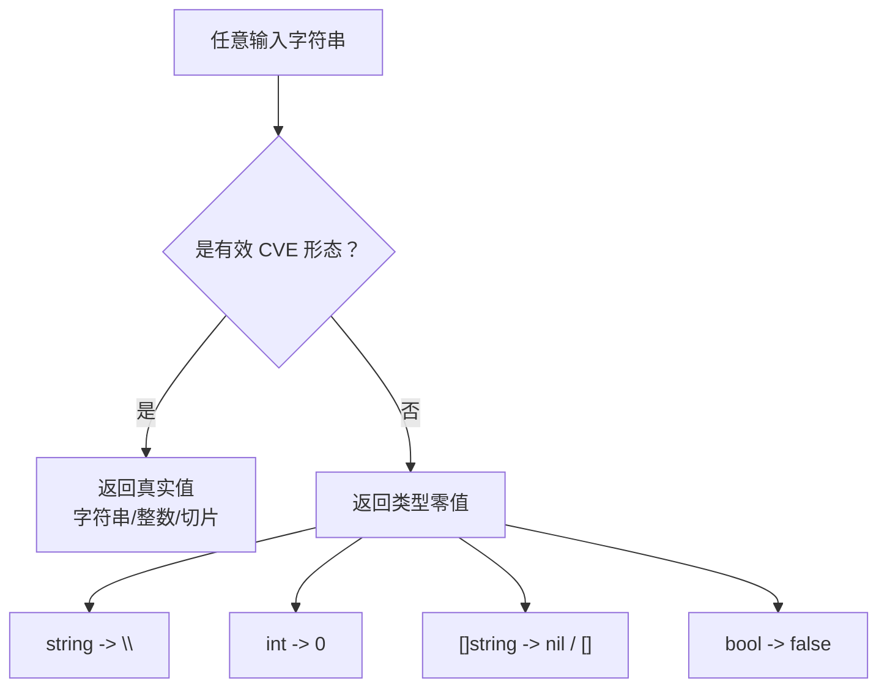
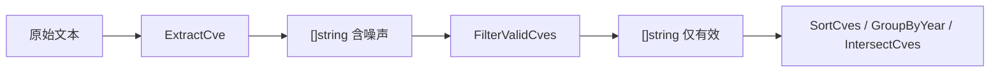

# 错误处理与边界

`cve` 包**不**遵循多数 Go 库惯用的 `result, error` 模式。几乎每个公开函数都只返回单个值——字符串、整数、切片、布尔——并以该类型的零值表示“输入无效”：`""`、`0`、`nil`、`false`。函数不会 panic，也几乎没有 `error` 返回。本页逐一记录每个函数在坏输入下的确切行为、库为何如此设计，以及当你需要在调用处检测无效性时该如何做。

:::tip 适用读者
要把本库接入可能遇到脏数据的管道的开发者——含拼写错误的安全公告文本、大小写混杂的标识符、根本不是 CVE 的片段、或来自不可信来源的范围表达式。如果你曾疑惑“为什么 `ExtractCveYearAsInt` 给我的是 `0` 而不是 error？”或“`Format` 对非 CVE 字符串会做什么？”，请看本页。
:::

## 零值约定

Go 有一套成熟的失败处理模式：返回 `(T, error)`，由调用方决定。`cve` 包在其热路径函数上有意偏离了这一模式。理由很实际：CVE 标识符出现在自由文本里，伴随噪声、大小写混杂、两侧空白，且常常只输入了一半。如果每次提取与格式化都强迫调用方解开一个 `error`，常见的“扫描一段文字、收集标识符”循环会被错误处理淹没。

因此，每个函数都选定一个零值来表示“我无法给出有意义的结果”：



| 返回类型 | 零值 | 代表函数 | 触发条件 |
| --- | --- | --- | --- |
| `string` | `""` | `ExtractCveYear`、`ExtractCveSeq`、`ExtractFirstCve` | 输入无 CVE，或部分无法解析 |
| `int` | `0` | `ExtractCveYearAsInt`、`ExtractCveSeqAsInt` | `IsCve` 失败，或 `strconv.Atoi` 失败 |
| `[]string` | `nil` | `ParseCveRange`、`FilterCvesByPattern` | 正则不匹配，或正则编译失败 |
| `[]string` | 空 `[]` | `ExtractCve`、`FilterValidCves` | 未找到 CVE，或无一通过校验 |
| `bool` | `false` | `IsCve`、`ValidateCve`、`IsCvesConsecutive` | 任意规则失败 |
| `(min, max int)` | `0, 0` | `YearRange`、`SeqRange` | 空切片，或无有效元素 |

🧩 因此“什么都没找到”的标志是一个零值，**而非**哨兵值或 error。检测它就是一次普通的相等判断：`if year == 0`、`if seq == ""`、`if cves == nil`、`if !ok`。

## Format — 永不拒绝，只做归一化

`Format(cve string) string` 是最该理解的一个函数，因为几乎所有其他函数都把它作为第一步调用。它的实现就一行：

```go
func Format(cve string) string {
    return strings.ToUpper(strings.TrimSpace(cve))
}
```

它**不**检查输入是否是 CVE，**不**对非 CVE 输入返回 error。它对你给的任何字符串先 `TrimSpace` 再 `ToUpper`，然后返回结果。这带来两个让新用户意外的后果：

1. `Format("not-a-cve")` 返回 `"NOT-A-CVE"`——一个完美地大写、完美地去除空白的字符串，但它仍然不是 CVE。
2. `Format("")` 返回 `""`，因此空输入能干净地流过，不会让下游调用方崩溃。

为什么这没问题：`Format` 的定位是归一化器，不是校验器。它的契约是“给我规范形式”，而垃圾的规范形式就是大写化、去空白的垃圾。库为它配了一个显式校验器（`IsCve` / `ValidateCve`），让在意有效性的调用方可以先检查。`FormatSeq` 展示了这个模式：它在做任何事之前先用 `if !IsCve(cve) { return cve }` 守卫，非 CVE 时原样返回输入。

```go
package main

import (
    "fmt"

    "github.com/scagogogo/cve"
)

func main() {
    for _, s := range []string{"cve-2022-12345", " CVE-2022-12345 ", "not-a-cve", ""} {
        fmt.Printf("%-20q -> %q\n", s, cve.Format(s))
    }
    // "cve-2022-12345"    -> "CVE-2022-12345"
    // " CVE-2022-12345 "  -> "CVE-2022-12345"
    // "not-a-cve"         -> "NOT-A-CVE"
    // ""                  -> ""
}
```

⚠️ 安全惯用法始终是 `if cve.IsCve(s) { ... = cve.Format(s) }`。把校验器当作闸门，`Format` 只在通过闸门的输入上执行清理。

## ExtractCveYearAsInt — 无效变为 0

`ExtractCveYearAsInt(cve string) int` 抽取年份并转为整数。它在两种情况下返回 `0`，源码对两者都写得很明确：

```go
func ExtractCveYearAsInt(cve string) int {
    if !IsCve(cve) {
        return 0
    }
    year := ExtractCveYear(cve)
    i, _ := strconv.Atoi(year)
    return i
}
```

`0` 可以来自任一分支：格式检查失败，或 `Atoi` 失败（错误被 `_` 丢弃）。实际上对于通过 `IsCve` 的输入第二个分支不可达，因为格式正则 `CVE-\d+-\d+` 保证了年份段全是数字。但函数是防御式写法，因此对任何输入 `0` 契约都成立。

这个“0 即无效”约定是比较函数的承重设计。`CompareByYear` 字面就是：

```go
func CompareByYear(cveA, cveB string) int {
    return ExtractCveYearAsInt(cveA) - ExtractCveYearAsInt(cveB)
}
```

因此 `CompareByYear("garbage", "CVE-2022-1")` 返回 `0 - 2022 = -2022`。无效输入被当作年份 0，排在所有真实 CVE 之前（真实年份从 1999 起）。`CompareCves` 同理，当年份相等时通过 `ExtractCveSeqAsInt` 回退到序列号比较——后者同样是“失败返回 0”的函数。

📌 这意味着无效标识符永远不会让排序或比较崩溃；它们会静默地聚集到排序结果的头部。如果需要排除它们，在排序前对切片跑一次 `FilterValidCves`。

## ParseCveRange — nil 表示“不是范围”

`ParseCveRange(rangeExpr string) []string` 是包里最可能收到真正不可信输入的函数，因为范围表达式来自人工编写的公告文本。它在每种失败模式下都返回 `nil`（不是空切片）：

```go
func ParseCveRange(rangeExpr string) []string {
    matches := rangeRegex.FindStringSubmatch(rangeExpr)
    if matches == nil {
        return nil
    }
    // ...
    if err != nil || startSeq > endSeq {
        return nil
    }
    // ...
}
```

失败模式有：正则不匹配、序列号无法解析、或 `startSeq > endSeq`（倒序范围）。注意 `startSeq == endSeq` 是允许的，返回单元素切片——长度为 1 的“范围”不算错误。

| 输入 | 结果 | 原因 |
| --- | --- | --- |
| `CVE-2022-1000 to CVE-2022-1003` | 4 个元素 | 合法的 `to` 形式 |
| `CVE-2022-1000..1003` | 4 个元素 | 合法的双点形式 |
| `CVE-2022-1000-1003` | 4 个元素 | 合法的连字符形式 |
| `CVE-2022-1003 to CVE-2022-1000` | `nil` | 倒序：`startSeq > endSeq` |
| `CVE-2022-1000 to CVE-2023-1005` | 6 个元素，全为 `CVE-2022-*` | 正则匹配：`to` 分支忽略结束年份并复用起始年份 |
| `CVE-2022-1000 to CVE-2023-0500` | `nil` | 起始序列号 1000 &gt; 结束序列号 0500，故 `startSeq > endSeq` |
| `not a range at all` | `nil` | 正则不匹配 |

```go
package main

import (
    "fmt"

    "github.com/scagogogo/cve"
)

func main() {
    cves := cve.ParseCveRange("CVE-2022-1000 to CVE-2022-1003")
    fmt.Printf("%#v\n", cves)
    // []string{"CVE-2022-1000", "CVE-2022-1001", "CVE-2022-1002", "CVE-2022-1003"}

    none := cve.ParseCveRange("CVE-2022-1003 to CVE-2022-1000")
    fmt.Printf("%#v  len=%d\n", none, len(none))
    // []string(nil)  len=0
}
```

正确的检查是 `if cves == nil`，或更惯用的 `if len(cves) == 0`——两者都行，因为 `nil` 切片长度为零。无需 panic 防护；函数从不 panic，只返回 `nil`。

## 如何检测无效输入

因为库通过零值传达失败，检测策略就是“拿到结果后，先检查零值再使用”。下表把每个常用函数映射到其零值与推荐守卫。

| 函数 | 零值 | 守卫表达式 | 零值含义 |
| --- | --- | --- | --- |
| `Format` | 仅 `""` 输入时为 `""` | 调用后 `if s == ""` | 输入为空（绝非错误） |
| `ExtractFirstCve` | `""` | `if id == ""` | 文本中无 CVE |
| `ExtractCveYear` | `""` | `if year == ""` | 输入非 CVE |
| `ExtractCveYearAsInt` | `0` | `if year == 0` | 输入非 CVE |
| `ExtractCveSeqAsInt` | `0` | `if seq == 0` | 输入非 CVE，或序列号非数字 |
| `ParseCveRange` | `nil` | `if cves == nil` | 不是合法范围表达式 |
| `FilterCvesByPattern` | `nil` | `if len(out) == 0` | 模式编译失败，或无匹配 |
| `IsCvesConsecutive` | `false` | `if !ok` | 年份不同，或任一无效 |
| `YearRange` | `0, 0` | `if min == 0 && max == 0` | 空输入，或无有效 CVE |

🤖 可靠的管道模式：用 `ExtractCve` 抽取，用 `FilterValidCves`（内部丢弃零值）校验，然后再排序或比较。零值永远不会到达下游逻辑，因为 `FilterValidCves` 已先行移除它们。



## 库为何这样设计

三条理由，按重要性排序：

1. **常见情况是脏文本，不是坏数据。** 多数调用作用于公告文字，而“这里没有 CVE”是正常的、预期的结果，不是异常。为“我扫了一段文字、什么都没找到”返回 error 会强迫每个调用方写同样的 `if err != nil` 样板，而这些样板几乎从不表示真正的问题。零值让正常路径只有一行。
2. **可组合性。** `SortCves`、`GroupByYear`、`CompareCves` 等函数内部调用 `ExtractCveYearAsInt` 与 `Format`。若它们返回 error，每次内部调用都要解开——而排序比较器里对畸形标识符唯一合理的动作就是“当作年份 0 继续往下”，这正是零值已经在做的事。
3. **永不 panic。** 防御式的 `Atoi`（用 `_` 丢弃错误）、切片前的 `IsCve` 守卫、正则解析的“失败返回 nil”，共同保证任何输入——无论多畸形——都不会让进程崩溃。库可安全指向任意不可信字符串。

代价是显式的：仅凭零值你无法区分“输入为空”与“输入畸形”。当这一区分重要时，改用 `ValidateCves`——包里唯一返回结构化 `CveValidationResult`、带 `Reason` 字符串解释输入*为何*失败的函数。

## 小结

- 包使用零值返回（`""`、`0`、`nil`、`false`）而非 `error`；不会 panic。
- `Format` 永不拒绝——它对你给的任何东西做大写化与去空白，因此务必先用 `IsCve` 守卫。
- `ExtractCveYearAsInt` / `ExtractCveSeqAsInt` 无效输入返回 `0`；比较把 `0` 当作“排在最前”。
- `ParseCveRange` 对不匹配、无法解析或倒序的范围返回 `nil`——用 `len(cves) == 0` 检查。
- 当你需要某行失败的*原因*时用 `ValidateCves`；其余情况零值检查是惯用检测方式。

## 图解参考

下面的决策树把单个输入字符串串起包里三类行为——归一化器（`Format`）、校验器（`IsCve` / `ValidateCve`）、提取器（`ExtractCveYearAsInt` / `ExtractCveSeqAsInt` / `ParseCveRange`）。分支点始终是"它像不像 CVE？"，而每条"否"分支都坍缩为对应类型的零值，而非抛错。

```text
                       输入字符串
                            |
                   +--------+--------+
                   |   Format(x)     |   归一化器：永不拒绝
                   |  ToUpper+Trim   |   垃圾 -> 大写化的垃圾
                   +--------+--------+
                            |
              +-------------+-------------+
              | IsCve(x)?  exactCveRegex |
              |  (?i)^\s*CVE-\d+-\d+\s*$  |
              +-------------+-------------+
                     |               |
                    是              否
                     |               |
         +-----------+---+      +----+-----------------+
         | 校验器         |      | 零值生产者             |
         | ValidateCve   |      | ExtractCveYear -> ""  |
         |  Split+Atoi   |      | ExtractCveSeq   -> "" |
         |  年份落在      |      | YearAsInt       -> 0  |
         |  [1999, now]  |      | SeqAsInt        -> 0  |
         |  seq > 0      |      | ParseCveRange   -> nil|
         +-----------+---+      +----+-----------------+
                     |               |
                    是              否  （或"是"但某段非法）
                     |               |
              返回 true      返回 false / 零值
              （有效 CVE）    （"什么都没找到"的标志）
```

第二张图把视角从"单输入决策"翻转为"把各函数串起来的调用关系"。`Format` 是通用入口；提取器/比较器一族都汇流到 `ExtractCveYearAsInt` 与 `ExtractCveSeqAsInt`，二者"失败返回 0"的契约正是 `CompareCves` / `SortCves` 在垃圾输入下不 panic 的原因；而 `ValidateCve` 是唯一产生可读 `Reason` 的路径。

```mermaid
flowchart TD
    In["任意字符串 / 切片"] --> Fmt["Format<br/>ToUpper + TrimSpace"]
    Fmt --> IsCve{"IsCve<br/>exactCveRegex"}
    IsCve -->|否| Zero["零值返回<br/>\"\" / 0 / nil / false"]
    IsCve -->|是| Split["Split<br/>strings.Split(cve, \"-\")"]
    Split --> Atoi["strconv.Atoi<br/>year 与 seq"]
    Atoi --> Bounds{"year 在 [1999, now]<br/>且 seq &gt; 0？"}
    Bounds -->|否| Zero
    Bounds -->|是| ValTrue["ValidateCve = true<br/>FilterValidCves 保留"]
    Fmt --> Ext["ExtractCveYearAsInt<br/>ExtractCveSeqAsInt"]
    Ext -->|失败 0| Cmp["CompareCves / SortCves<br/>把 0 当作 \"排在最前\""]
    Ext -->|真实值| Cmp
    Cmp --> Vres["ValidateCves<br/>[]CveValidationResult + Reason"]
```

## 深入解析

1. **`CompareByYear` 返回原始差值，而非符号。** 它的函数体就是 `return ExtractCveYearAsInt(cveA) - ExtractCveYearAsInt(cveB)`（compare.go:40-42），因此 `CompareByYear("CVE-2024-1", "CVE-2020-1")` 得到 `4`，不是 `1`。`CompareCves`（compare.go:110-128）才是把结果归一为 `-1 / 0 / 1` 的那个，而 `SortCves` 有意走 `CompareCves` 而非 `CompareByYear`，这样比较器才能遵守 `sort.Interface` 的"小于"契约、不泄漏量级。若你直接调 `CompareByYear` 来算跨度，量级是有意义的；若拿它做分支，应判断 `result < 0` / `== 0` / `&gt; 0`，而非当作三态来用。

2. **"是 CVE"与"包含 CVE"由两条不同正则掌管。** `exactCveRegex`（base.go:14）以 `^\s*CVE-\d+-\d+\s*$` 锚定，只容忍两侧空白，因此 `IsCve("see CVE-2022-1 inside")` 为 `false`。`containsCveRegex`（base.go:16）去掉锚点变成 `(?i)CVE-\d+-\d+`，因此对同样文本 `IsContainsCve` 返回 `true`。extract.go:9 的包级 `cveRegex` 又是第三份拷贝（带捕获组、大小写不敏感），供 `ExtractCve` 使用。三者都在 `var` 初始化时编译一次，热路径上没有每次 `regexp.Compile` 的开销。

3. **`FilterCvesByPattern` 是手写的 glob 转正则转译器。** 它不用 `filepath.Match`，而是逐 rune 遍历模式串（extract.go:302-314），把 `*` 改写成 `.*`，并对正则元字符 `. + ( ) [ ] { } \\ ^ $ |` 做反斜杠转义。由于其他元字符都被转义，extract.go:316 的 `regexp.Compile` 对于由 CVE 形态输入构造出的模式几乎从不失败——extract.go:318 的 `nil` 返回是给真正畸形模式（例如将来转译器 bug 引入的未转义 `]`）留的防御性死分支。该函数还对结果调 `SortCves`，因此其"编译失败返回 nil"与"无匹配返回空 `[]`"两种输出在排序开销上不同，但都使 `len(out) == 0` 判定为假。

4. **`extractYear` 是 `ExtractCveYearAsInt` 的未导出前身。** base.go:162-170 实现了同样的 `Format` → `strings.Split` → `strconv.Atoi`（错误用 `_` 丢弃）流水线，但它跳过了公开 `ExtractCveYearAsInt` 会先做的 `IsCve` 守卫。它被 `IsCveYearOkWithCutoff`（base.go:231-234）内部使用，这正是 `IsCveYearOk("CVE-1998-1")` 仍能返回 `false` 并附上精确原因"年份早于 1999"而非在格式检查处短路的原因——格式校验被委托给了边界比较，而非 `IsCve`。这是库里少数几处有意接受非 CVE 形态输入、却仍产出有意义布尔值的地方。

5. **`YearRange` 与 `SeqRange` 用哨兵值 `-1` 区分"尚无有效元素"与真正的零。** 两者都把 `min` 初始化为 `-1`（base.go:484、generate.go:533），并跳过年份/序列号 `&lt;= 0` 的元素，因此只含垃圾的列表最终返回 `0, 0`（哨兵在末尾被重置），而含一个合法 `CVE-2022-1` 的列表返回 `min == max == 2022`（或 `1`）。这是包里唯一一处 `0` *不是* 内部"此处无内容"标记的地方——作者需要一个真实年份或序列号都不可能取到的值，于是选了 `-1`，因为 CVE 年份从 1999 起、序列号必须为正。

## 延伸阅读

- [验证策略](/zh/guide/validation-strategy) — 四函数校验阶梯与 `Reason` 链
- [Format](/zh/api/functions/format) — 所有其他函数都先调用的归一化器
- [ExtractCveYearAsInt](/zh/api/functions/extract-cve-year-as-int) — 失败返回 0 的年份提取器
- [ExtractCveSeqAsInt](/zh/api/functions/extract-cve-seq-as-int) — 失败返回 0 的序列号提取器
- [ParseCveRange](/zh/api/functions/parse-cve-range) — 失败返回 nil 的范围解析器
- [FilterValidCves](/zh/api/functions/filter-valid-cves) — 从切片中丢弃零值产物
