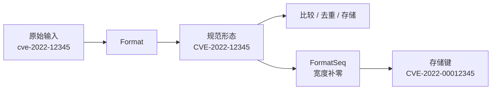
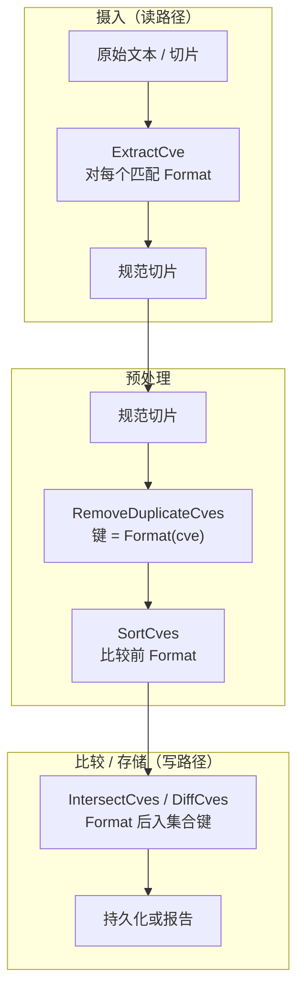
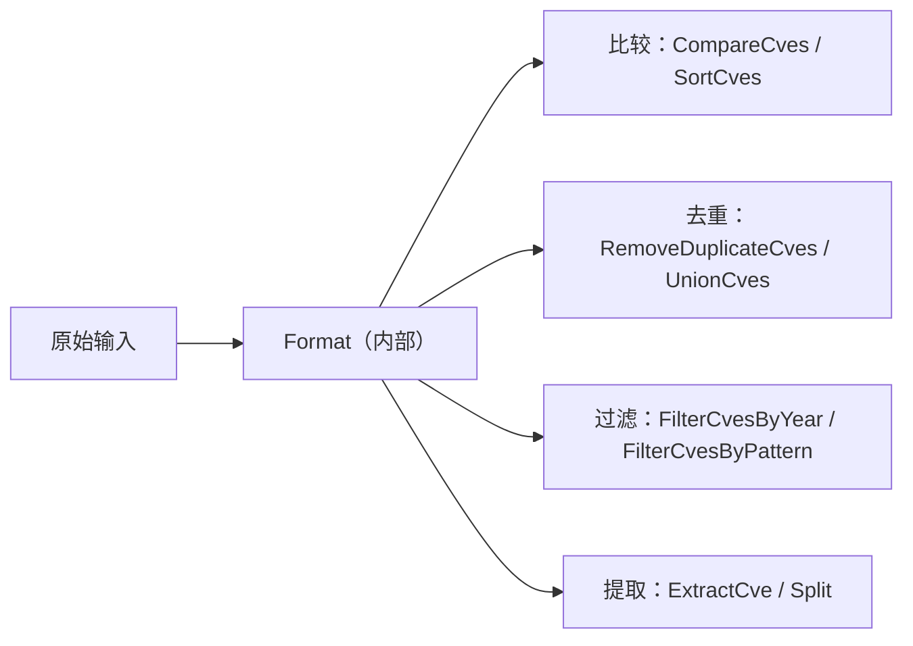
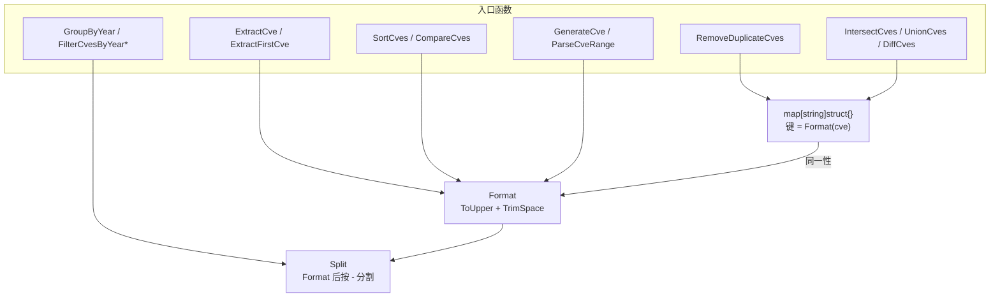

# 格式化与标准化

CVE 编号是短字符串，但在真实环境中它出现的形态五花八门：小写的 `cve-2022-12345`、带空格的、从 PDF 复制带杂散空白字符的、序列号宽度不一致的。`cve` 包把标准化视为一切操作的基石，让比较、去重和存储都基于规范形态运行，而不是在原始输入上反复打补丁。

:::tip 适用读者
从异构数据源（扫描器、安全公告、电子表格）导入 CVE 数据的开发者、构建需要可靠比较或去重的 CVE 管道的维护者，以及任何曾被 `cve-2022-1111` 与 `CVE-2022-1111` 被当作两条记录坑过的人。
:::

## 为何 CVE 需要标准化

CVE 编号看起来很刚性——`CVE-YYYY-NNNNN`——但产出它们的数据源并不规范。同一个逻辑编号至少会以三种不可靠方式出现：

| 变体来源 | 示例 | 产生原因 |
| --- | --- | --- |
| 字母大小写 | `cve-2022-12345`、`Cve-2022-12345` | 手工录入、从正文复制、或工具统一小写 |
| 首尾空格 | `" CVE-2022-12345 "` | 从 PDF 或表格单元格复制、文件末尾换行 |
| 序列号宽度 | `CVE-2022-123` 与 `CVE-2022-000123` | 部分数据源按固定宽度补零，部分省略前导零 |

如果不把这些变体归并到同一规范形态，下游逻辑会静默失效：用于去重的 `map[string]struct{}` 会同时保留 `cve-2022-1111` 和 `CVE-2022-1111`，两个列表的相等性比对会漏掉真实重叠，数据库的 `UNIQUE` 索引要么拒绝合法重复、要么接受同一个逻辑 CVE 两次。

`cve` 包用一条规则解决：**任何值在比较、分组、去重或存储之前，都必须先经过 `Format`。**



## Format 与 FormatSeq 的分工

包里暴露了两个格式化辅助函数，它们互补而非冗余：`Format` 产出其它所有函数期望的规范字符串；`FormatSeq` 产出用于展示或定宽存储的补零变体。

### Format

`Format` 只做两件事——`strings.ToUpper(strings.TrimSpace(cve))`——仅此而已。它不校验输入、不重排字段、不动序列号宽度。

```go
package main

import (
    "fmt"

    "github.com/scagogogo/cve"
)

func main() {
    fmt.Println(cve.Format(" cve-2022-12345 ")) // CVE-2022-12345
    fmt.Println(cve.Format("cve-2021-44228"))   // CVE-2021-44228
    fmt.Println(cve.Format("not-a-cve"))        // NOT-A-CVE  (不校验，仅转大写)
}
```

因为 `Format` 跳过校验，调用方可以让任意文本安全穿过它——代价是「看起来规范」不等于「是有效 CVE」。校验是 `IsCve` / `ValidateCve` 的职责，它们在依赖年份和序列号有意义的逻辑之前运行。

### FormatSeq

`FormatSeq(cve, width)` 是宽度补零辅助。它比 `Format` 更严格：先用 `IsCve` 确认输入是真实 CVE，再 `Split` 出年份和序列号，最后用 `%0*d` 重建字符串，使序列号按指定宽度前补零。

```go
package main

import (
    "fmt"

    "github.com/scagogogo/cve"
)

func main() {
    fmt.Println(cve.FormatSeq("CVE-2022-123", 6))    // CVE-2022-000123
    fmt.Println(cve.FormatSeq("CVE-2022-12345", 6))  // CVE-2022-012345
    fmt.Println(cve.FormatSeq("not-a-cve", 6))       // not-a-cve  (无效输入原样返回)
}
```

从源码可以直接得出两条结论：

1. **无效输入原样返回。** 当 `IsCve` 失败时，`FormatSeq` 返回原始字符串而非空值或错误，因此批量处理上千条字符串的管道不会因一条格式错误而崩溃。
2. **`FormatSeq` 仅在需要定宽时按需调用。** 包内其余函数从不调用 `FormatSeq`——它是给需要数据库友好键或对齐列输出的调用方准备的，并非比较或去重的前置条件。

| 维度 | `Format` | `FormatSeq` |
| --- | --- | --- |
| 返回大写 + 去空格 | 是 | 是（经 `Split`） |
| 校验 CVE 格式 | 否 | 是（`IsCve`） |
| 序列号补到定宽 | 否 | 是（`width` 参数） |
| 被其它函数内部调用 | 是，几乎无处不在 | 否，仅由调用方驱动 |
| 无效输入行为 | 照常转大写 | 原样返回 |

## 标准化在管道中的位置

标准化是一个位置，而不仅仅是一个函数。包的设计把 `Format` 放在每条读路径和写路径的最前端，让下游所有有意义的逻辑都只看到规范输入。



这个位置之所以重要，是因为集合运算和去重依赖字符串同一性。`RemoveDuplicateCves`、`IntersectCves`、`UnionCves` 和 `DiffCves` 都用 `Format(cve)` 作为 map 键来构建集合。由于查询前先 `Format`，`cve-2022-1111` 与 `CVE-2022-1111` 会哈希到同一个键并合并为一条记录——这正是在合并大小写不一致的数据源时想要的行为。

```go
// 两个数据源在大小写和首尾空格上不一致。
sourceA := []string{"cve-2022-1111", " CVE-2022-2222 "}
sourceB := []string{"CVE-2022-2222", "CVE-2022-3333"}

// UnionCves 在入集合键之前对每条记录做 Format，
// 因此结果去重且大小写一致。
all := cve.UnionCves(sourceA, sourceB)
// all = [CVE-2022-1111, CVE-2022-2222, CVE-2022-3333]
```

常见误区是摄入时格式化一次，就以为后续阶段可以跳过。包并不依赖这个假设——每个运算都防御性地重新 `Format`，所以把未格式化的原始切片直接传给 `IntersectCves` 仍能得到正确结果。代价可忽略（`ToUpper` + `TrimSpace` 分配很轻），安全却是真实的：管道中间一条未格式化记录无法污染集合。

### 存储姿态

当目标是数据库或排序后的报告时，`Format` 与 `FormatSeq` 扮演不同角色：

- 用 **`Format`** 作为所有查询和 join 指向的规范列。这是 `ExtractCve`、`SortCves` 和集合运算产出的值。
- 用 **`FormatSeq`** 仅在需要定宽键时，例如保证序列号长度不一时的字典序排列，或满足期望固定位数序列号的遗留 schema。

```go
// 用于查询和 join 的规范列。
canonical := cve.Format(raw) // CVE-2022-12345

// 用于遗留存储 / 字典序排序的定宽键。
storageKey := cve.FormatSeq(raw, 8) // CVE-2022-00012345
```

## Format 被几乎所有函数内部调用

`Format` 不是你必须记得去调的辅助——它织入了整个包。以下函数在执行真正工作前都会对输入调用 `Format`：

| 函数 | 文件 | 如何使用 `Format` |
| --- | --- | --- |
| `Split` | base.go | 按 `-` 分割前先 Format |
| `extractYear` | base.go | 提取年份前先 Format |
| `ExtractCve` / `ExtractFirstCve` | extract.go | 对每个正则匹配 Format |
| `SortCves` | compare.go | 排序前对每条 Format |
| `GroupByYear` | filter.go | 把每条 Format 后归入年份桶 |
| `FilterCvesByYear` / `FilterCvesByYearRange` | filter.go | 比较年份前先 Format |
| `FilterCvesByPattern` | filter.go | 对模式和每个候选项 Format |
| `RemoveDuplicateCves` | filter.go | 键为 `Format(cve)` |
| `IntersectCves` / `UnionCves` / `DiffCves` | filter.go | 集合键为 `Format(cve)` |
| `GenerateCve` / `ParseCveRange` | generate.go | 对每个生成的标识符 Format |

实际含义是：你几乎不需要对手交给包的数据预格式化。喂给它 `ExtractCve` 产出的原始文本、扫描器返回的杂乱切片、或分析师键入的带空格 CVE——规范形态由每个关心同一性的函数在内部一致地强制执行。



## 常见场景

### 合并两份安全公告

两份公告描述了重叠的漏洞，但大小写和空格不一致。由于 `UnionCves` 在入键前先 Format，合并结果干净。

```go
feed1 := []string{"cve-2021-44228", " CVE-2022-12345 "}
feed2 := []string{"CVE-2022-12345", "CVE-2023-99999"}
merged := cve.UnionCves(feed1, feed2)
// merged = [CVE-2021-44228, CVE-2022-12345, CVE-2023-99999]
```

### 生成定宽报告列

报告需要序列号补到一致宽度以对齐。`FormatSeq` 对无效行优雅处理——原样穿过而非中断整批。

```go
rows := []string{"CVE-2022-123", "cve-2022-12345", "see-advisory"}
for _, r := range rows {
    fmt.Println(cve.FormatSeq(r, 8))
}
// CVE-2022-00000123
// CVE-2022-00012345
// see-advisory
```

### 去重分析师录入的数据

分析师从不同工具粘贴 CVE，有的小写、有的带尾随空格。`RemoveDuplicateCves` 通过格式化后的键把它们合并。

```go
entered := []string{"CVE-2022-1111", "cve-2022-1111", " CVE-2022-1111 "}
unique := cve.RemoveDuplicateCves(entered)
// unique = [CVE-2022-1111]
```

## 小结

- CVE 编号会带大小写、空格和宽度变体出现；不做标准化，比较与去重会静默失效。
- `Format` 是规范形态原语——`ToUpper` + `TrimSpace`，不校验，几乎被内部到处调用。
- `FormatSeq` 是按需的宽度补零辅助，用于定宽存储和展示；它用 `IsCve` 校验，无效输入原样返回。
- 标准化位于每条读路径和写路径的前端，集合运算以 `Format(cve)` 为键，使大小写/空格变体正确合并。
- 你几乎不需要自己调 `Format`——`ExtractCve`、`SortCves`、集合运算和过滤器都在内部应用了它。

## 图解参考

同一条标准化管道的两个视角。第一张是单条原始字符串如何在 `Format` 与 `FormatSeq` 之间分流的决策树/流程；第二张是调用关系图，展示包内哪些函数都以 `Format` 作为共享的同一性原语汇聚。

### 单条输入字符串的决策树

```text
                    原始输入字符串
                          |
              +-----------+-----------+
              |                       |
        通过 IsCve?             未通过 IsCve?
        (CVE-\d+-\d+ ，           (如 "not-a-cve"、
         容忍大小写/空格)          "advisory-2022-1")
              |                       |
   +----------+----------+            |  FormatSeq 短路:
   |                     |            |  原样返回
Format only           FormatSeq       v
   |                     |        [原样穿透]
   v                     v
ToUpper+TrimSpace     Split -> 年份,序列号
   |                     |
   v                     v
规范形态            fmt.Sprintf("CVE-%s-%0*d", year, width, seq)
CVE-YYYY-NNNNN            |
   |                      v
   +-> 比较 /            定宽键
       去重 /            CVE-YYYY-NNNNNNNN
       存储
```

### 调用关系图：所有关心同一性的函数都汇聚到 Format



## 深入解析

1. **`Format` 有意不校验，这是设计选择。** 它的函数体只有一行 `strings.ToUpper(strings.TrimSpace(cve))`（base.go:45-47），从不检查 `CVE-` 前缀或数字段，因此 `Format("not-a-cve")` 返回 `NOT-A-CVE` 而非报错。这是个刻意的权衡：让 `Format` 成为全函数，意味着每个调用方都能让任意文本安全穿过它，不会 panic 也不会拿到哨兵值；校验被推迟到独立的 `IsCve` / `ValidateCve` 层（base.go:119、base.go:445），在真正需要 yes/no 答案的地方才回答。

2. **包的正则在匹配层就容忍大小写和空格，而不只在格式化层。** `exactCveRegex` 为 `(?i)^\s*CVE-\d+-\d+\s*$`（base.go:14）——`(?i)` 标志加 `\s*` 锚点意味着 `IsCve(" CVE-2022-12345 ")` 直接返回 `true`，无需先跑 `Format`。因此 `Format` 与正则通过两套独立机制处理同一来源的变体，这也解释了为什么 `FormatSeq` 可以在 trim *之前* 调 `IsCve` 仍得到正确结果。

3. **`FormatSeq` 有两条提前返回路径，不止一条。** 文档化的一条是 `IsCve` 失败时"无效输入原样返回"（base.go:80-82）。第二条不那么明显，是对序列号的 `strconv.Atoi` 守卫（base.go:84-87）：即便 `IsCve` 已确认是纯数字形状，`FormatSeq` 仍会把序列号重新解析为整数再用 `%0*d` 格式化。实际上正则已经保证是数字，所以这条分支是针对未来正则变更的防御——它意味着 `FormatSeq` 永远不会产出畸形的 `%0*d` 结果，要么是正确的补零 CVE，要么是原始字符串。

4. **集合运算以 `Format(cve)` 为键，而非原始字符串——这正是跨数据源合并正确的原因。** `IntersectCves`（filter.go:232）、`RemoveDuplicateCves`（filter.go:406）等集合构建器都把 `Format(cve)` 写入 `map[string]struct{}`。由于 map 键已转大写且去空格，`cve-2022-1111` 与 `CVE-2022-1111` 哈希到同一个键并合并。一个值得注意的副作用：这些函数返回的*值*也是格式化后的形态（filter.go:409、filter.go:242），所以一个以小写进入管道的切片，出来时已是规范形态，调用方无需动手。

5. **`FormatSeq` 从不在包内被调用——它是纯粹的调用方工具。** 全包 grep 显示 `FormatSeq` 的被调用数为零；只有 `Format` 被织入 `Split`、`extractYear`、提取器、排序器、过滤器和集合运算。这种分离让规范形态（`Format`）与展示形态（`FormatSeq`）解耦：比较与去重从不依赖固定序列号宽度，因此从不需要定宽输出的调用方可以完全无视 `FormatSeq`，正确性不受任何影响。

## 延伸阅读

- [Format 函数参考](/zh/api/functions/format)
- [FormatSeq 函数参考](/zh/api/functions/format-seq)
- [从文本提取 CVE](/zh/api/extract)
- [比较与排序 CVE](/zh/guide/comparison-ordering)
- [集合运算与去重](/zh/guide/set-operations-guide)
