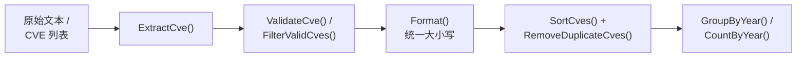
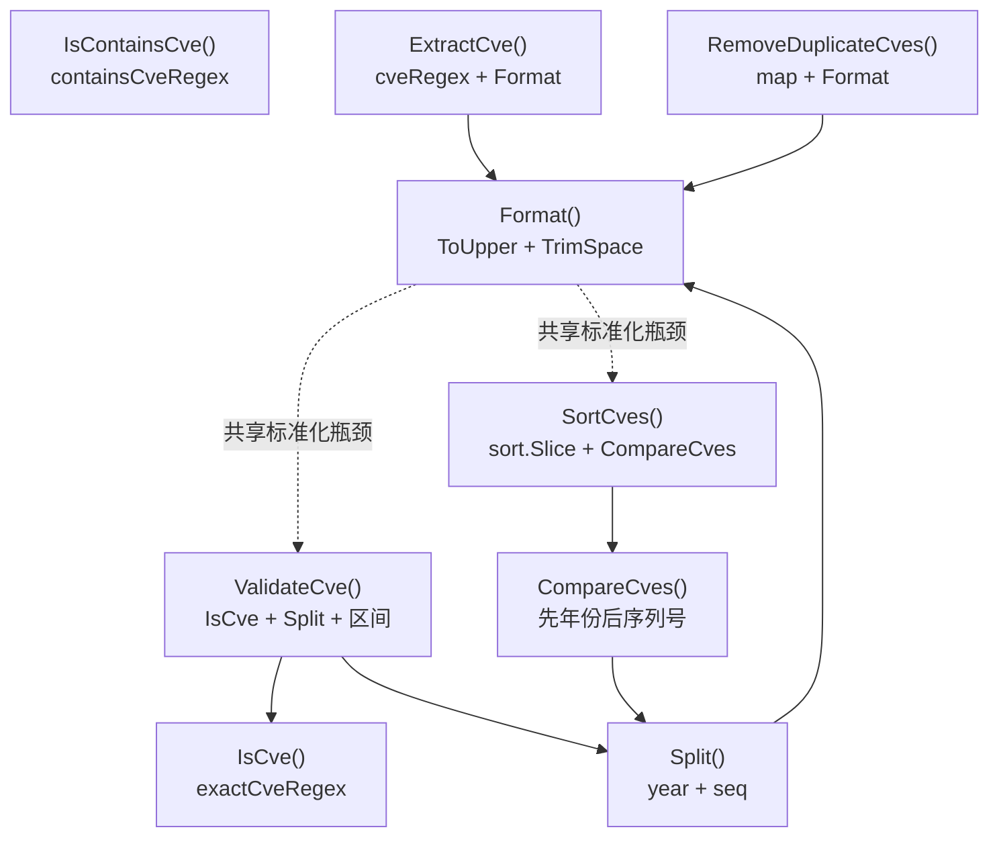

# 快速开始

欢迎使用 CVE Utils！这个指南将帮助您快速上手使用这个强大的 CVE 处理工具库。

## 安装

### 使用 go get 安装

```bash
go get github.com/scagogogo/cve-skills
```

### 验证安装

创建一个简单的测试文件来验证安装是否成功：

```go
// test.go
package main

import (
    "fmt"
    "github.com/scagogogo/cve-skills"
)

func main() {
    // 测试基本功能
    result := cve.Format("cve-2022-12345")
    fmt.Println("格式化结果:", result)

    if result == "CVE-2022-12345" {
        fmt.Println("✅ CVE Utils 安装成功！")
    } else {
        fmt.Println("❌ 安装可能有问题")
    }
}
```

运行测试：

```bash
go run test.go
```

## 基本概念

### CVE 格式

CVE (Common Vulnerabilities and Exposures) 编号遵循特定的格式：

```text
CVE-YYYY-NNNN
```

- `CVE`: 固定前缀
- `YYYY`: 4位年份
- `NNNN`: 序列号（至少4位数字）

例如：`CVE-2022-12345`、`CVE-2021-44228`

### 核心处理流程

大多数任务都串联同一组函数——提取、验证、标准化,再排序/分组:



### 主要功能分类

CVE Utils 提供的功能可以分为以下几类：

1. **格式化与验证**: 标准化和验证 CVE 格式
2. **提取方法**: 从文本中提取 CVE 信息
3. **比较与排序**: 对 CVE 进行比较和排序
4. **过滤与分组**: 按条件过滤和分组 CVE
5. **生成与构造**: 生成新的 CVE 编号

## 第一个示例

让我们从一个简单的示例开始：

```go
package main

import (
    "fmt"
    "github.com/scagogogo/cve-skills"
)

func main() {
    // 1. 格式化 CVE
    input := " cve-2022-12345 "
    formatted := cve.Format(input)
    fmt.Printf("原始输入: '%s'\n", input)
    fmt.Printf("格式化后: '%s'\n", formatted)

    // 2. 验证 CVE
    isValid := cve.ValidateCve(formatted)
    fmt.Printf("是否有效: %t\n", isValid)

    // 3. 从文本中提取 CVE
    text := "系统受到多个漏洞影响：CVE-2021-44228、CVE-2022-12345 和 cve-2023-1234"
    cves := cve.ExtractCve(text)
    fmt.Printf("提取的 CVE: %v\n", cves)

    // 4. 排序 CVE
    sorted := cve.SortCves(cves)
    fmt.Printf("排序后: %v\n", sorted)
}
```

运行结果：

```text
原始输入: ' cve-2022-12345 '
格式化后: 'CVE-2022-12345'
是否有效: true
提取的 CVE: [CVE-2021-44228 CVE-2022-12345 CVE-2023-1234]
排序后: [CVE-2021-44228 CVE-2022-12345 CVE-2023-1234]
```

## 常用操作示例

### 处理用户输入

```go
func processUserInput(input string) {
    // 检查输入是否包含 CVE
    if !cve.IsContainsCve(input) {
        fmt.Println("输入中没有找到 CVE")
        return
    }

    // 提取第一个 CVE
    firstCve := cve.ExtractFirstCve(input)
    fmt.Printf("第一个 CVE: %s\n", firstCve)

    // 验证有效性
    if cve.ValidateCve(firstCve) {
        fmt.Println("✅ CVE 格式有效")

        // 提取年份和序列号
        year, seq := cve.Split(firstCve)
        fmt.Printf("年份: %s, 序列号: %s\n", year, seq)
    } else {
        fmt.Println("❌ CVE 格式无效")
    }
}

// 使用示例
processUserInput("漏洞编号：CVE-2022-12345")
```

### 批量处理 CVE

```go
func processCveList(cveList []string) {
    fmt.Printf("原始列表 (%d 个): %v\n", len(cveList), cveList)

    // 去重
    unique := cve.RemoveDuplicateCves(cveList)
    fmt.Printf("去重后 (%d 个): %v\n", len(unique), unique)

    // 排序
    sorted := cve.SortCves(unique)
    fmt.Printf("排序后: %v\n", sorted)

    // 按年份分组
    grouped := cve.GroupByYear(sorted)
    fmt.Println("按年份分组:")
    for year, cves := range grouped {
        fmt.Printf("  %s: %v\n", year, cves)
    }

    // 获取最近2年的 CVE
    recent := cve.GetRecentCves(sorted, 2)
    fmt.Printf("最近2年: %v\n", recent)
}

// 使用示例
cveList := []string{
    "CVE-2022-1111",
    "cve-2022-1111", // 重复项（大小写不同）
    "CVE-2021-2222",
    "CVE-2023-3333",
    "CVE-2022-4444",
}
processCveList(cveList)
```

## 错误处理

CVE Utils 的大部分函数都有良好的错误处理机制：

```go
func safeProcessing() {
    // 对于无效输入，函数会返回安全的默认值

    // 无效 CVE 返回空字符串
    seq := cve.ExtractCveSeq("invalid-input")
    fmt.Printf("无效输入的序列号: '%s'\n", seq) // 输出: ''

    // 无效 CVE 返回 0
    year := cve.ExtractCveYearAsInt("invalid-input")
    fmt.Printf("无效输入的年份: %d\n", year) // 输出: 0

    // 空文本返回空切片
    cves := cve.ExtractCve("")
    fmt.Printf("空文本提取结果: %v\n", cves) // 输出: []
}
```

## 性能考虑

CVE Utils 针对性能进行了优化：

```go
func performanceExample() {
    // 对于大量数据，建议批量处理
    largeCveList := make([]string, 10000)
    for i := 0; i < 10000; i++ {
        largeCveList[i] = fmt.Sprintf("CVE-2022-%d", i+1)
    }

    start := time.Now()

    // 批量去重和排序
    unique := cve.RemoveDuplicateCves(largeCveList)
    sorted := cve.SortCves(unique)

    duration := time.Since(start)
    fmt.Printf("处理 %d 个 CVE 耗时: %v\n", len(largeCveList), duration)
    fmt.Printf("结果数量: %d\n", len(sorted))
}
```

## 下一步

现在您已经了解了 CVE Utils 的基本用法，可以：

1. 查看 [API 文档](/zh/api/) 了解所有可用函数
2. 在命令行中驱动它——查阅 [CLI 参考](/zh/cli)
3. 浏览 [使用示例](/zh/examples/) 学习更多实际应用场景
4. 查看 [基本使用指南](/zh/guide/basic-usage) 了解更多细节

如果遇到问题，请查看 [GitHub Issues](https://github.com/scagogogo/cve-skills/issues) 或提交新的问题。

## 图解参考

下图描绘单条用户输入穿越验证决策树的过程。注意 `IsCve`（精确匹配）与 `IsContainsCve`（子串匹配）把守着两个不同入口，而无效分支同样返回安全默认值而非 panic。

```text
                  用户输入字符串
                          |
            +-------------+-------------+
            |                           |
      IsContainsCve(text)         IsCve(token)
      子串扫描                    精确格式扫描
            |                           |
       找到? +-- 否 --> ""         匹配? +-- 否 --> false / 0 / ""
        | 是                          | 是
   ExtractCve(text)              Split(token) --> year, seq
   正则 FindAllString           strconv.Atoi(year, seq)
        |                              |
   []CVE（大写）         year ∈ [1999, now] 且 seq > 0?
        |                       |           |
   RemoveDuplicateCves        是           否
   map[string]struct{}         |           |
        |                 ValidateCve   安全默认值
   SortCves(slice)            返回 true    ("", 0, [])
   sort.Slice + CompareCves        |
        |                          |
   GroupByYear / CountByYear   下游使用
```

第二张图从依赖关系视角展示核心函数之间的调用关系——哪些辅助函数调用了哪些，以及 `Format()` 作为所有路径汇聚的统一标准化瓶颈所处的位置。



## 深入解析

- **两条正则、两种语义。** `base.go` 把 `exactCveRegex`（`^\s*CVE-\d+-\d+\s*$`）与 `containsCveRegex`（`CVE-\d+-\d+`）并排声明。前者带锚点，这就是为什么对同一段文本 `IsCve("...CVE-2022-12345...")` 返回 `false`、而 `IsContainsCve` 返回 `true`——按你的真实意图选函数，而不是手动加锚点。`extract.go` 另持有带捕获组的第三条 `cveRegex`，因为 `ExtractCve` 需要对任意自然语言文本做 `FindAllString`。
- **`Format()` 是唯一的标准化瓶颈。** 几乎所有公开函数（`Split`、`ExtractCve`、`SortCves`、`RemoveDuplicateCves`、`FilterCvesByPattern` 等）内部都调用 `strings.ToUpper(strings.TrimSpace(cve))`。这正是 `RemoveDuplicateCves` 能正确合并 `CVE-2022-1111` 与 `cve-2022-1111` 这类大小写变体的原因——map 的 key 永远是规范大写形式，调用方无需自行预标准化输入。
- **验证是三段式流水线，不是单条正则。** `ValidateCve`（base.go）先用 `IsCve` 验形态，再用 `Split` + `strconv.Atoi` 验数字性，最后强制 `year >= 1999 && year <= time.Now().Year() && seq > 0`。上界在调用时按实时时钟计算，所以 `CVE-2026-1` 会在跨年时从有效翻转为无效——没有硬编码的截断年份。`IsCveYearOkWithCutoff` 暴露同套检查但带 `cutoff` 参数，供预留编号场景使用。
- **`CompareCves` 是按字段比较，而非字符串比较。** `compare.go` 先解析年份（`CompareByYear`），仅当年份相等才回退到 `ExtractCveSeqAsInt` 比序列号。朴素的 `sort.Strings` 会把 `CVE-2022-9` 排到 `CVE-2022-10` 前面（字符串 "9" > "1"）；`CompareCves` 的整型回退规避了这个陷阱。`SortCves` 用 `sort.Slice` 包裹它，复杂度 O(n log n)，并返回全新标准化副本，原切片绝不被改动。
- **失败返回零值，而非 error。** `ExtractCveSeq` 返回 `""`，`ExtractCveYearAsInt` 返回 `0`，对空文本调用 `ExtractCve` 返回非 nil 但长度为 0 的切片，`FilterCvesByPattern` 仅在正则编译失败时返回 `nil`。需要区分「不存在」与「零」的调用方（例如 `CVE-0000-0` 因 `seq > 0` 不可能存在）可以把 `0` 当作「不可解析」，但不应把它与合法的零值字段混为一谈。
