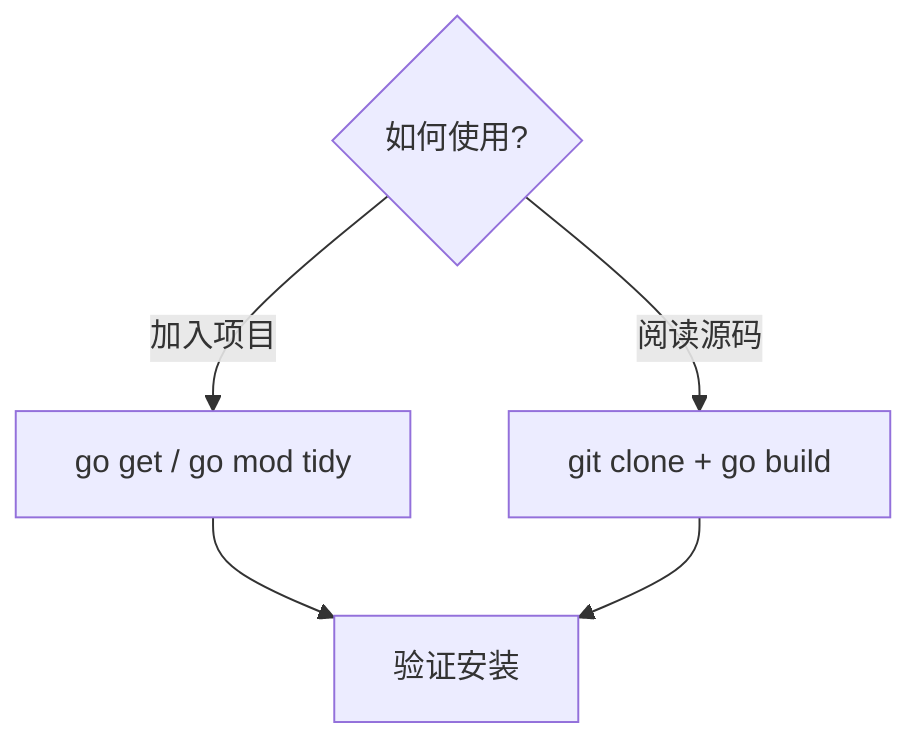
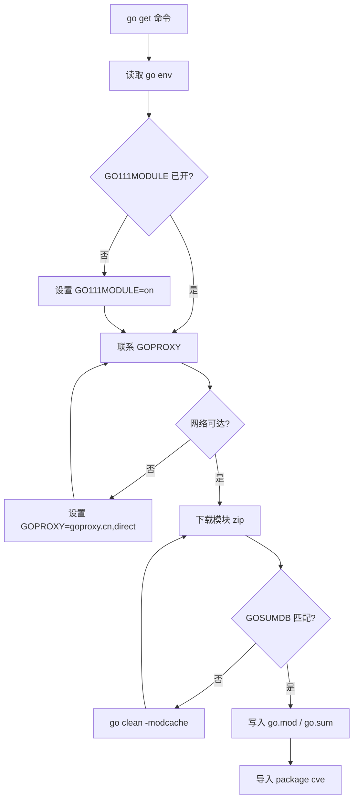

# 安装指南

本页面详细介绍如何在不同环境中安装和配置 CVE Utils。

## 系统要求

- Go 1.18 或更高版本
- 支持的操作系统：Linux、macOS、Windows

## 安装方法

### 方法一：使用 go get（推荐）

这是最简单和推荐的安装方法：

```bash
go get github.com/scagogogo/cve-skills
```

### 方法二：使用 go mod

如果您使用 Go modules，可以在项目中直接导入：

```go
import "github.com/scagogogo/cve-skills"
```

然后运行：

```bash
go mod tidy
```

### 方法三：手动下载

您也可以手动克隆仓库：

```bash
git clone https://github.com/scagogogo/cve-skills.git
cd cve
go build
```

根据使用场景选择安装方式：



## 验证安装

### 基本验证

创建一个测试文件验证安装：

```go
// verify.go
package main

import (
    "fmt"
    "github.com/scagogogo/cve-skills"
)

func main() {
    // 测试基本功能
    testCve := "CVE-2022-12345"

    // 测试格式化
    formatted := cve.Format(testCve)
    fmt.Printf("格式化测试: %s -> %s\n", testCve, formatted)

    // 测试验证
    isValid := cve.ValidateCve(testCve)
    fmt.Printf("验证测试: %s -> %t\n", testCve, isValid)

    // 测试提取
    text := "系统受到 CVE-2021-44228 影响"
    extracted := cve.ExtractCve(text)
    fmt.Printf("提取测试: %s -> %v\n", text, extracted)

    if len(extracted) > 0 && isValid {
        fmt.Println("✅ CVE Utils 安装成功！")
    } else {
        fmt.Println("❌ 安装验证失败")
    }
}
```

运行验证：

```bash
go run verify.go
```

预期输出：

```text
格式化测试: CVE-2022-12345 -> CVE-2022-12345
验证测试: CVE-2022-12345 -> true
提取测试: 系统受到 CVE-2021-44228 影响 -> [CVE-2021-44228]
✅ CVE Utils 安装成功！
```

### 完整功能测试

运行项目自带的测试套件：

```bash
# 克隆仓库（如果还没有）
git clone https://github.com/scagogogo/cve-skills.git
cd cve

# 运行所有测试
go test -v

# 运行测试并显示覆盖率
go test -v -cover
```

## 在项目中使用

### 新项目

如果您正在创建新的 Go 项目：

```bash
# 创建新项目
mkdir my-cve-project
cd my-cve-project

# 初始化 Go module
go mod init my-cve-project

# 添加 CVE Utils 依赖
go get github.com/scagogogo/cve-skills

# 创建主文件
cat > main.go << 'EOF'
package main

import (
    "fmt"
    "github.com/scagogogo/cve-skills"
)

func main() {
    cves := cve.ExtractCve("发现漏洞 CVE-2022-12345")
    fmt.Println("提取的 CVE:", cves)
}
EOF

# 运行项目
go run main.go
```

### 现有项目

如果您要在现有项目中添加 CVE Utils：

```bash
# 在项目根目录下
go get github.com/scagogogo/cve-skills

# 更新依赖
go mod tidy
```

然后在代码中导入：

```go
import "github.com/scagogogo/cve-skills"
```

## 版本管理

### 使用特定版本

如果您需要使用特定版本：

```bash
# 使用特定标签版本
go get github.com/scagogogo/cve-skills@v1.0.0

# 使用特定提交
go get github.com/scagogogo/cve-skills@commit-hash
```

### 查看当前版本

```bash
go list -m github.com/scagogogo/cve-skills
```

### 更新到最新版本

```bash
go get -u github.com/scagogogo/cve-skills
go mod tidy
```

## 常见问题

### 问题 1：Go 版本过低

**错误信息**：
```text
go: module github.com/scagogogo/cve-skills requires go >= 1.18
```

**解决方案**：
升级 Go 到 1.18 或更高版本。

### 问题 2：网络连接问题

**错误信息**：
```text
go: github.com/scagogogo/cve-skills: dial tcp: lookup github.com: no such host
```

**解决方案**：
1. 检查网络连接
2. 配置 Go 代理（如果在中国）：

```bash
go env -w GOPROXY=https://goproxy.cn,direct
go env -w GOSUMDB=sum.golang.google.cn
```

### 问题 3：模块缓存问题

**错误信息**：
```text
go: github.com/scagogogo/cve-skills@v1.0.0: invalid version: unknown revision
```

**解决方案**：
清理模块缓存：

```bash
go clean -modcache
go get github.com/scagogogo/cve-skills
```

### 问题 4：导入路径错误

**错误信息**：
```text
package github.com/scagogogo/cve-skills is not in GOROOT
```

**解决方案**：
确保使用 Go modules：

```bash
# 检查是否启用了 Go modules
go env GO111MODULE

# 如果输出不是 "on"，则启用它
go env -w GO111MODULE=on
```

## 开发环境设置

如果您想参与 CVE Utils 的开发：

### 1. 克隆仓库

```bash
git clone https://github.com/scagogogo/cve-skills.git
cd cve
```

### 2. 安装开发依赖

```bash
# 安装测试工具
go install golang.org/x/tools/cmd/cover@latest

# 安装代码格式化工具
go install golang.org/x/tools/cmd/goimports@latest
```

### 3. 运行开发测试

```bash
# 运行所有测试
go test ./...

# 运行测试并生成覆盖率报告
go test -coverprofile=coverage.out ./...
go tool cover -html=coverage.out -o coverage.html

# 格式化代码
gofmt -w .
goimports -w .
```

### 4. 构建

```bash
# 构建项目
go build

# 交叉编译（例如为 Linux 构建）
GOOS=linux GOARCH=amd64 go build
```

## 图解参考

下图描绘了一条 `go get` 请求如何穿过 Go 工具链、最终落入模块缓存，并附上选择安装方式的决策树。

```text
+-------------------+     go get github.com/scagogogo/cve-skills
|  你的 Go 项目    |  ------------------------------------------------+
|  (含 go.mod)     |                                                   |
+---------+---------+                                                   v
          | 读取 GO111MODULE、GOPROXY、GOSUMDB           +-----------------------+
          +----------------------------------------------> |  go 命令 (客户端)     |
                                                           +-----------+-----------+
                                                                       | 解析模块路径
                                                                       v
                                                       +---------------+----------------+
                                                       |  GOPROXY (goproxy.cn/direct)  |
                                                       +---------------+----------------+
                                                                       | 下载 .zip + .info
                                                                       v
                                                          +-----------------------------+
                                                          | 模块缓存 ($GOPATH/pkg)     |
                                                          +--------------+--------------+
                                                                         | 解压到包目录
                                                                         v
                                                            +----------------------------+
                                                            | GOSUMDB 校验和已验证       |
                                                            +--------------+-------------+
                                                                           | 写入 go.mod / go.sum
                                                                           v
                                                              +---------------------------+
                                                              | import "github.com/scagogogo/cve-skills"
                                                              | package cve 可用          |
                                                              +---------------------------+
```

换一个视角，下面的流程图把同一条流水线画成状态机，标出安装常见的失败分支点以及各自的恢复动作。



## 深入解析

- **模块路径与导入路径**：`go.mod` 声明的模块路径是 `github.com/scagogogo/cve-skills`，而所有源文件都声明 `package cve`（见 `base.go`、`extract.go`、`generate.go` 的首行）。这意味着 `go get` 之后你要写 `import "github.com/scagogogo/cve-skills"`，但引用标识符时却是 `cve.Format`、`cve.ValidateCve` 等。长模块路径与短包名之间的落差，是用户手写 import 时频繁出现 "cannot find package" 的根因。
- **为何最低要求 Go 1.18**：`go.mod` 钉死 `go 1.18`。库本身只用到 `strings`、`regexp`、`strconv` 标准包而非泛型，但保留 1.18 作为下限，可让所有处于维护期的 Go 工具链看到一致行为。低于 1.18 时 `go mod tidy` 会拒绝解析该模块，这正是「常见问题」中问题 1 报告的现象。
- **验证脚本为何触碰三个子系统**：`verify.go` 片段分别调用 `cve.Format`、`cve.ValidateCve`（`base.go:445`）与 `cve.ExtractCve`（`extract.go:42`），而非只调一个函数。`Format` 走 `base.go:45` 的正则归一化路径，`ValidateCve` 走 `base.go:119` 中 `IsCve` 的严格匹配器，`ExtractCve` 走文本扫描正则。三者中任一能编译并运行，即说明该包已正确接入你的模块图。
- **缓存、代理与校验和构成信任链**：`GOPROXY` 提供代码位，`GOSUMDB`（默认 `sum.golang.org`，国内镜像为 `sum.golang.google.cn`）记录每个版本的期望哈希，`$GOPATH/pkg/mod` 缓存解压后的源码。「常见问题」中的 "unknown revision" 与 "no such host" 分别对应这条链上某一环断裂，因此每个修复都只瞄准一个环境变量，而非整体重装。
- **CLI 与库共用同一模块**：仓库同时构建基于 cobra 的 CLI（`go.mod` 中 `require github.com/spf13/cobra v1.8.1`）。对根包执行 `go build` 得到的是库；CLI 入口位于同一模块内。这也是为何方法三（`git clone` + `go build`）既能内嵌库、又能直接探查命令行界面，无需单独安装步骤。

## 下一步

安装完成后，您可以：

1. 阅读 [快速开始](/zh/guide/getting-started) 学习基本用法
2. 查看 [基本使用指南](/zh/guide/basic-usage) 了解更多功能
3. 浏览 [API 文档](/zh/api/) 了解所有可用函数
4. 查看 [使用示例](/zh/examples/) 学习实际应用场景
