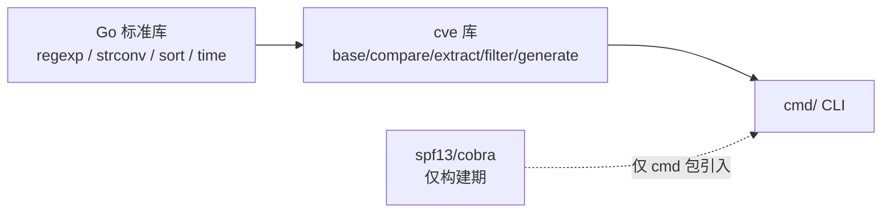
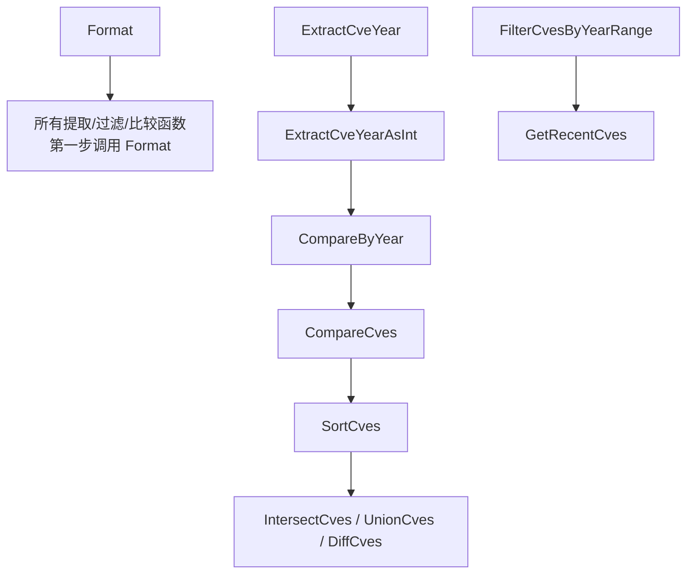
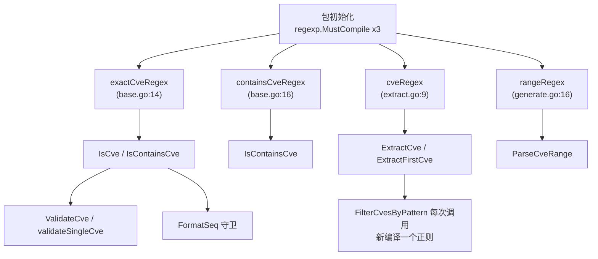

# 库设计哲学

`cve` 包是一个刻意保持小巧、刻意保持朴素的 Go 库。它没有第三方运行时依赖，对外暴露一个扁平的无状态函数命名空间，所有代码路径都汇流到同一个归一化函数 `Format`，对坏输入从不 panic，附带的 CLI 只是对同一批公开函数的薄封装，并且每个函数都有自己的 `_test.go` 文件。本页逐条讲解这些选择背后的原因、能在源码何处核验，以便后续扩展包的贡献者保持一致。

:::tip 适用读者
正在为包新增函数、新增 CLI 子命令或新校验规则的贡献者，以及评估该包是否契合自身架构的维护者。如果你曾问过“为什么没有 `error` 返回值？”“为什么 CLI 直接 import 库而不是复制逻辑？”“新增 `foo.go` 时该如何保持测试文件命名约定？”，本页就是这份契约。
:::

## 纯标准库依赖，零运行时依赖

打开 `go.mod`，直接依赖只有一项：

```
module github.com/scagogogo/cve-skills

go 1.18

require github.com/spf13/cobra v1.8.1
```

`cobra` 是 `cmd/` 包（即 CLI）的**构建期**依赖，仅被 `cmd/*.go` 引入。库本体——`base.go`、`compare.go`、`extract.go`、`filter.go`、`generate.go`、`cve.go`——不引入任何 Go 标准库之外的东西。每个文件的 import 块就是证据：

| 源码文件 | 仅引入标准库 |
| --- | --- |
| `base.go` | `fmt`、`regexp`、`strconv`、`strings`、`time` |
| `compare.go` | `sort` |
| `extract.go` | `regexp`、`strconv` |
| `filter.go` | `strconv`、`time` |
| `generate.go` | `fmt`、`regexp`、`strconv`、`time` |
| `cve.go` | _（仅包文档，无 import）_ |

📌 为什么重要：下游服务或 agent 运行时可以放心 vendor 本包，不会有传递依赖膨胀、不会陷入 `cobra` 版本错配，库本体本身也没有供应链攻击面。代价是结构化校验结果之类的便利设施需要手写（`base.go` 中的 `CveValidationResult` 结构体），而非借用某个校验框架——这是包主动接受的取舍。



## 函数式无状态 API

没有需要实例化的结构体，没有 `New()` 构造器，没有带接收者的方法，除了 `cve.go` 中唯一的 `var Version = "dev"`（特意声明为 `var` 以便 goreleaser 的 `-ldflags` 在链接期覆盖它——文档注释明确警告不能改成 `const`）外，没有任何包级可变状态。所有公开符号都是顶层函数，入参为字符串、整数或切片，返回值同样朴素：

```go
// base.go — 全部为顶层函数，无接收者
func Format(cve string) string
func IsCve(text string) bool
func Split(cve string) (year string, seq string)
func ValidateCves(cveSlice []string) []CveValidationResult

// compare.go — 纯函数，通过相互调用实现组合
func CompareByYear(cveA, cveB string) int
func SortCves(cveSlice []string) []string
```

包里唯一存在的结构体 `CveValidationResult` 是由 `ValidateCves` 返回的纯数据载体——它没有方法、不持有行为。组合靠直接函数调用完成：`CompareCves` 调 `CompareByYear`；`SortCves` 先 `Format` 再 `CompareCves`；`GetRecentCves` 完全委派给 `FilterCvesByYearRange`。



🧩 实际后果：每个函数都能从任意 goroutine 并发调用，整个包可当作黑盒测试——喂入字节、断言输出字节，无需 setup 或 teardown。

## Format 作为唯一归一化入口

几乎每个公开函数都以 `Format(cve)` 开头，或调用了一个会这样做的辅助函数。其实现只有一行：

```go
func Format(cve string) string {
    return strings.ToUpper(strings.TrimSpace(cve))
}
```

它是其余所有函数赖以为继的契约。`Split` 在切分前先 `Format`；`ExtractCveYearAsInt` 经由 `Split` 间接 `Format`；`SortCves` 在排序前对每个元素 `Format`；`FilterCvesByPattern` 对模式和每个候选都 `Format`；集合运算（`IntersectCves`、`UnionCves`、`DiffCves`）在写入去重 map 前 `Format`。结果是**任何能从这些函数幸存下来的 CVE，输出一律大写且去除了首尾空白**，无论输入有多脏。

| 函数 | 是否调用 `Format` | 位置 |
| --- | :-: | --- |
| `Split` | ✅ | 第一行，`strings.Split` 之前 |
| `ExtractCveYear` / `ExtractCveSeq` | ✅ | 经由 `Split` |
| `extractYear`（内部） | ✅ | 第一行 |
| `SortCves` | ✅ | `sort.Slice` 前逐元素 |
| `FilterCvesByPattern` | ✅ | 模式 + 每个候选 |
| `GroupByYear` / `FilterCvesByYear` / `FilterCvesByYearRange` | ✅ | 逐元素 |
| `IntersectCves` / `UnionCves` / `DiffCves` / `RemoveDuplicateCves` | ✅ | 写入 map 前 |
| `FormatSeq` | ✅ | 经由 `Split`（先过 `IsCve` 守卫） |
| `ParseCveRange` | ✅ | 每个生成元素，经由 `GenerateCve` |

⚡ 唯一刻意不做有效性校验的函数就是 `Format` 本身——它对任何输入都做归一化，因此垃圾的规范形态是“大写、去空白后的垃圾”。有效性是另一个关注点，由 `IsCve` / `ValidateCve` 承担。这种分离让包既能宽容（永不崩溃）又能严格（显式校验器）。

## 零值容错，绝不 panic

包对无效输入返回零值而非 `error`，并对每一处不安全操作都加守卫。源码中反复出现三种模式：

1. **切片前先用 `IsCve` 守卫。** `FormatSeq` 在 `!IsCve(cve)` 时原样返回；`ExtractCveSeq` 提前返回 `""`；`IsCvesConsecutive` 在任一年份为 `0` 时返回 `false`。
2. **丢弃 `strconv.Atoi` 的错误。** `extractYear` 写作 `year, _ := strconv.Atoi(split[1])`；`ExtractCveYearAsInt` 与 `ExtractCveSeqAsInt` 同样如此，失败时返回 `0`。不 panic、不传播 error——零值就是信号。
3. **正则失败返回 `nil`。** `FilterCvesByPattern` 在 `regexp.Compile` 报错时返回 `nil`；`ParseCveRange` 在范围正则不匹配或区间反向时返回 `nil`。

```go
// extract.go — 任何失败均返回 0，不返回 error
func ExtractCveYearAsInt(cve string) int {
    if !IsCve(cve) {
        return 0
    }
    year := ExtractCveYear(cve)
    i, _ := strconv.Atoi(year)
    return i
}
```

🤖 这让本包可以放心指向不可信字符串——安全公告正文、从网页抓来的范围表达式、人类粘贴的大小写混杂标识符。没有任何输入能让它崩溃。代价在 [错误处理与边界情形](/zh/guide/error-handling) 中如实记录：单凭零值无法区分“输入为空”与“输入畸形”，因此当需要知道*原因*时，请用 `ValidateCves`——它是唯一返回结构化 `Reason` 的函数。

## CLI 与库同源，逻辑不重复

`cmd/` 包不重新实现 CVE 逻辑，而是直接 import 库并调用其公开函数：

```go
// cmd/extract.go
import cvepkg "github.com/scagogogo/cve-skills"

// ...
cves := cvepkg.ExtractCve(input)   // 库函数
fmt.Println(cvepkg.ExtractFirstCve(input))
year, seq := cvepkg.Split(input)
```

每个 CLI 子命令都是一层薄适配器：(1) 通过共用的 `readInputs` 辅助从参数或 stdin 读输入；(2) 恰好调用一个库函数；(3) 打印结果。映射是一对一、可发现的：

| CLI 子命令 | 调用的库函数 |
| --- | --- |
| `cve extract` / `extract first` / `extract last` | `ExtractCve` / `ExtractFirstCve` / `ExtractLastCve` |
| `cve extract year` / `extract seq` / `extract split` | `ExtractCveYear` / `ExtractCveSeq` / `Split` |
| `cve format` | `Format` / `FormatSeq` |
| `cve validate` / `validate batch` | `ValidateCve` / `ValidateCves` |


🛠️ 收益是“构造即正确”：在库里修一个 bug，CLI 立刻免费修好；CLI 的行为完全由库的已文档化契约规定。CLI 本地代码只剩参数解析与输出格式化（`fmt.Println`、制表符分隔的 `year<TAB>seq`）。

## 可测试性 — 每个函数都有 `_test.go`

仓库为每个源码文件配一个 `_test.go`，无一例外：

| 源码文件 | 测试文件 | 覆盖内容 |
| --- | --- | --- |
| `base.go` | `base_test.go` | `Format`、`FormatSeq`、`IsCve`、`Split`、`ValidateCve`、`ValidateCves`、`FilterValidCves`、年份检查 |
| `compare.go` | `compare_test.go` | `CompareByYear`、`SubByYear`、`CompareCves`、`SortCves` |
| `extract.go` | `extract_test.go` | `ExtractCve`、`ExtractFirstCve`、`ExtractLastCve`、年份/序列号提取器、`FilterCvesByPattern` |
| `filter.go` | `filter_test.go` | `GroupByYear`、年份过滤、`GetRecentCves`、集合运算、`CountByYear`、范围统计 |
| `generate.go` | `generate_test.go` | `GenerateCve`、`GenerateFakeCve`、`ParseCveRange`、`IsCvesConsecutive` |

✅ 由于 API 无状态且纯净，测试均为表驱动、无需 fixture：每条用例就是一行 `(input, expected)`。命名约定由文件同目录共处强制执行——新增 `foo.go` 却没有 `foo_test.go`，在 `git status` 里立刻可见、过不了 review。叠加“绝不 panic”保证，从干净检出执行 `go test ./...` 一条命令即可证明整个包。

## 小结

- **纯标准库**：库本体仅引入 `fmt`/`regexp`/`strconv`/`strings`/`sort`/`time`；`cobra` 仅为 CLI 构建期依赖。
- **无状态函数**：无构造结构体、无方法、除 ldflags 注入的 `Version` 外无包级可变状态。
- **单一归一化器**：`Format` 是几乎所有函数的第一步，保证输出大写、去首尾空白。
- **零值容错**：切片前 `IsCve` 守卫、`Atoi` 错误丢弃、正则失败返回 `nil`——绝不 panic。
- **CLI 同源**：`cmd/` 直接 `import cvepkg` 并调用库函数，逻辑零重复。
- **一源码一测试**：`base_test.go` … `generate_test.go`，表驱动、无 fixture。

## 图解参考

下面两张图从不同视角描绘同一套包。ASCII 图追踪单条 CVE 字符串在归一化、校验、提取各阶段中的运行时数据流；mermaid 图描绘包级正则的生命周期，以及谁依赖哪个已编译的模式。

```text
                 原始输入字符串
                         |
                         v
        +------------------------------------------+
        | Format(cve)                              |
        |   strings.ToUpper(strings.TrimSpace(...))|
        +------------------------------------------+
                         |
                  大写、去首尾空白
                         |
              +----------+----------+
              |                     |
              v                     v
        +-----------+         +-----------------+
        | IsCve(t)  |         | Split(cve)      |
        | exactCve  |         |  以 "-" 切分     |
        | Regex     |         |  -> year, seq   |
        +-----------+         +-----------------+
              |                     |
        bool 有效?             year/seq 字符串
        |     |                  |        |
       是    否                  v        v
        |     |          +-------+   +-----------+
        |     |          | Atoi  |   | Atoi 错误  |
        |     |          | year  |   | 被丢弃     |
        |     |          +-------+   +-----------+
        |     |              |            |
        v     v              v            v
   正常路径     0/""       int year     int seq（失败为 0）
   |           零值路径     |            |
   |                        v            v
   |                  CompareByYear = yearA - yearB（原始差值）
   |                        |
   |                        v
   |                  CompareCves 归一化为 -1/0/1
   |                        |
   |                        v
   |                  SortCves -> sort.Slice
   |
   +-- ExtractCve(text) 用 containsCveRegex / cveRegex 扫描
        |                对每个匹配 Format
        v
   []string（大写、去首尾空白）
```



## 深入解析

1. **四个包级正则，init 期各编译一次。** 包在 `base.go`（第 14、16 行）顶部以 `var ... = regexp.MustCompile(...)` 声明 `exactCveRegex`、`containsCveRegex`，在 `extract.go`（第 9 行）声明 `cveRegex`，并在 `generate.go`（第 16 行）声明 `rangeRegex`。由于它们是包级变量，Go 运行时在包首次被 import 时各编译一次，并把 `*regexp.Regexp` 缓存至进程结束。这就是 `IsCve`、`ExtractCve` 等热路径每调用一次只付出 `MatchString`/`FindAllString` 代价、绝不重复编译的原因。唯一例外是 `FilterCvesByPattern`（extract.go），它因模式由调用方提供而每次调用新编译一个正则；若 `regexp.Compile` 报错则返回 `nil`，而非 panic。

2. **`CompareByYear` 返回原始差值，`CompareCves` 做归一化。** `CompareByYear`（compare.go:41）返回 `ExtractCveYearAsInt(cveA) - ExtractCveYearAsInt(cveB)`——一个不受约束的整数，可能很大（如 1999 对 2022 得 `-23`）。`CompareCves`（compare.go:110）在其外层包了一层：把任何非零的年份比较折叠为 `-1`/`1`，仅当年份相等时才继续比较序列号。`SortCves` 随后在 `sort.Slice` 内调用 `CompareCves`，因此比较器稳定且有界。这种分层意味着：想要年份差距的*数值*应调 `CompareByYear`/`SubByYear`，只想要排序应调 `CompareCves`。

3. **集合运算用 `map[string]struct{}`，而非 `map[string]bool`。** `IntersectCves`、`UnionCves`、`DiffCves`（filter.go:230、285、345）都以 `map[string]struct{}` 构建去重集合。空结构体的值存储零字节，因此 map 的内存占用只剩键字符串与哈希表开销——对于一个可能处理大批 CVE 列表的库，这是刻意之选。该模式同样见于 `RemoveDuplicateCves`（filter.go:402）以及 `IntersectCves`/`DiffCves` 内部的 `seen` 守卫，它们通过仅首次见到时追加结果切片来保持插入顺序。

4. **`Version` 是 `var` 而非 `const`，是刻意的。** `cve.go:41` 声明 `var Version = "dev"`，其文档注释明确警告不能改成 `const`。goreleaser 在链接期通过 `-ldflags "-X github.com/scagogogo/cve-skills.Version=vX.Y.Z"` 注入真实 semver；若改成 `const`，该注入会静默失效。这是整个库里唯一的包级可变状态，其存在仅为被构建工具链覆盖。

5. **`Format` 刻意不做 `IsCve` 前置校验。** 其余公开函数要么先调 `Format`，要么经由 `Split`/`ExtractCveYear` 间接调用。但 `Format` 本身（base.go:45）无条件应用 `ToUpper`+`TrimSpace`——`"garbage"` 的规范形态是 `"GARBAGE"`。这让归一化器成为一个全函数（对任意字符串都有定义），调用方无需先校验再归一化。有效性是另一条轴线，由 `IsCve`/`ValidateCve`/`ValidateCves` 承担，正因如此，包既能宽容（永不崩溃）又能严格（带 `Reason` 的显式校验器），两个关注点互不冲突。

## 延伸阅读

- [错误处理与边界情形](/zh/guide/error-handling) — 逐函数深入讲解零值约定
- [验证策略](/zh/guide/validation-strategy) — 建立在 `Format` 之上的四函数校验阶梯
- [正则内部实现](/zh/guide/regex-internals) — 三个包级正则及其保持编译态的方式
- [Format](/zh/api/functions/format) — 其余所有函数都先调用的归一化器
- [ValidateCves](/zh/api/functions/validate-cves) — 唯一返回 `Reason` 的函数
- [快速开始](/zh/guide/getting-started) — 一条命令安装库与 CLI
