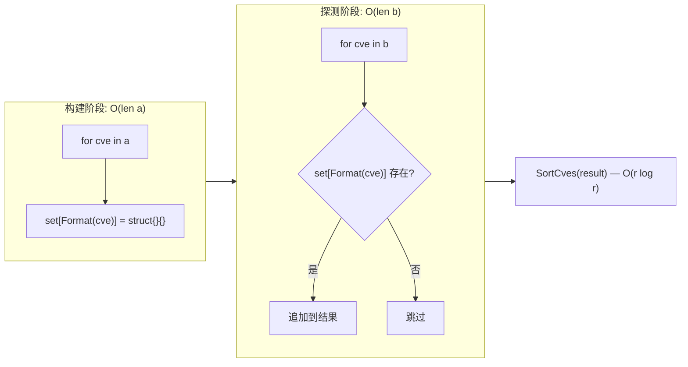
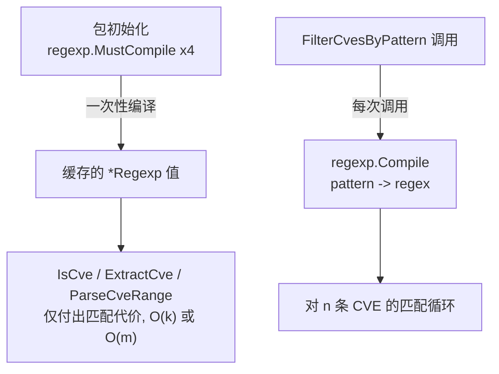
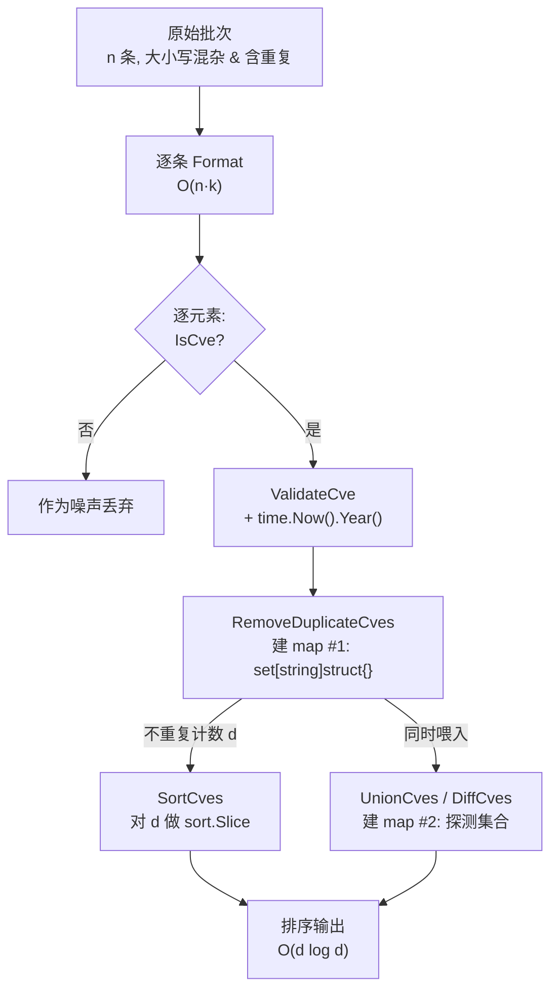

# 性能特征

`cve` 包在设计上刻意减少内存分配：多数操作是对切片的单趟扫描，正则引擎在包初始化时仅编译一次，集合运算借助 Go 的 `map[string]struct{}` 实现 O(1) 成员查询。本页汇总源码中记录的时间与空间复杂度——`O(n)`、`O(n log n)` 与 `O(n+m)`——解释 *为何* map 能给集合运算带来常数因子优势，并针对少数值得优化的热点路径给出两个具体的调节手段（对大列表先去重、复用已编译的模式正则）。

:::tip 适用读者
处理上万乃至更多 CVE 列表的工程师——数据源对账器、通报聚合器、在 CI 流水线中比对今日与昨日 CVE 集合的人。如果你每次请求只校验少量用户输入的标识符，下文复杂度与你无关；本页面向那些能在性能剖析里"看见" `SortCves` 或 `IntersectCves` 的调用方。
:::

## 复杂度全貌一览

每个触及切片的公开函数都把开销写进了源码级文档注释。下表将它们汇总到一处，并附上主要开销来源以及该函数是否分配新的结果切片。

| 函数 | 时间 | 空间 | 主要开销 | 新分配 |
| --- | --- | --- | --- | :-: |
| `Format` | O(k) | O(k) | 对长度为 k 的输入执行 `strings.ToUpper` + `TrimSpace` | ✅ |
| `IsCve` | O(k) | O(1) | 单次 `exactCveRegex.MatchString` | ❌ |
| `IsContainsCve` | O(k) | O(1) | 单次 `containsCveRegex.MatchString` | ❌ |
| `Split` | O(k) | O(k) | 按 `-` 执行 `strings.Split` | ✅ |
| `ExtractCve` | O(m) | O(n) | 对长度为 m 的文本做正则扫描，n 次匹配 | ✅ |
| `ExtractFirstCve` / `ExtractLastCve` | O(m) | O(n) | 委托给 `ExtractCve` | ✅ |
| `ExtractCveYear` / `ExtractCveYearAsInt` | O(k) | O(k) | `Split` + `strconv.Atoi` | ✅ |
| `ExtractCveSeq` / `ExtractCveSeqAsInt` | O(k) | O(k) | `Split` + `strconv.Atoi` | ✅ |
| `ValidateCve` | O(k) | O(k) | `IsCve` + `Split` + `time.Now().Year()` | ✅ |
| `ValidateCves` | O(n·k) | O(n) | 循环 `validateSingleCve` | ✅ |
| `FilterValidCves` | O(n·k) | O(n) | 循环 `ValidateCve` + `Format` | ✅ |
| `CompareByYear` / `SubByYear` | O(k) | O(k) | 两次 `ExtractCveYearAsInt` 调用 | ✅ |
| `CompareCves` | O(k) | O(k) | 年份比较 + 序列号比较 | ✅ |
| `SortCves` | O(n log n) | O(n) | 以 `CompareCves` 为比较器的 `sort.Slice` | ✅ |
| `GroupByYear` | O(n) | O(n) | 单趟写入 `map[string][]string` | ✅ |
| `FilterCvesByYear` | O(n) | O(k) | 单趟过滤；k = 命中数量 | ✅ |
| `FilterCvesByYearRange` | O(n) | O(k) | 单趟过滤；k = 命中数量 | ✅ |
| `FilterCvesByPattern` | O(n·k) | O(n) | 每次调用 `regexp.Compile` + n 次匹配 | ✅ |
| `IntersectCves` | O(n+m) | O(min(n,m)) | 在 a 上建 map + 在 b 上探测 | ✅ |
| `UnionCves` | O(n+m) | O(n+m) | 跨两个操作数建 map + 去重 | ✅ |
| `DiffCves` | O(n+m) | O(n+m) | 在 b 上建 map + 在 a 上探测 | ✅ |
| `RemoveDuplicateCves` | O(n) | O(n) | 单趟写入 `map[string]struct{}` | ✅ |
| `CountByYear` | O(n) | O(n) | 单趟写入 `map[int]int` | ✅ |
| `YearRange` | O(n) | O(1) | 单趟记录最小/最大值 | ❌ |
| `SeqRange` | O(n) | O(1) | 按年份过滤后的单趟扫描 | ❌ |
| `GenerateCve` | O(1) | O(k) | `fmt.Sprintf` + `Format` | ✅ |
| `GenerateFakeCve` | O(1) | O(k) | `time.Now()` + `GenerateCve` | ✅ |
| `ParseCveRange` | O(p) | O(p) | 一次正则 + 长度为 p 的结果切片 | ✅ |
| `IsCvesConsecutive` | O(k) | O(k) | 两对 `Extract*AsInt` | ✅ |

📖 上表中 `n` 与 `m` 为切片长度，`k` 为单条 CVE 字符串的长度（十几个字符左右——在大多数推理中实际为常数），`p` 为解析后的范围表达式宽度（`endSeq - startSeq + 1）。"新分配"一列提醒该包在设计上**不修改原切片**——没有任何函数会改写其输入切片，因此调用方可以安全地保留原始数据。

## 三大复杂度族

剥离单字符串辅助函数后，上表可归并为三个行为族，每族都有可识别的开销形状：

```mermaid
flowchart TD
    A["单字符串辅助函数<br/>Format / IsCve / Split / Extract*"] -->|O(k)| P["每标识符开销<br/>实际为常数"]
    B["线性扫描<br/>GroupByYear / FilterByYear* / CountByYear"] -->|O(n)| Q["对切片单趟扫描<br/>建 map 或过滤式 append"]
    C["排序与集合运算<br/>SortCves / Intersect / Union / Diff"] -->|O(n log n) 或 O(n+m)| R["比较器或 map 探测<br/>主导总耗时"]
```

| 族 | 代表函数 | 时间 | 何以廉价 | 何以昂贵 |
| --- | --- | --- | --- | --- |
| 单字符串 | `IsCve`、`Split`、`ExtractCveYear` | O(k) | 一次正则匹配或一次 `Split`；k ≈ 14 字符 | 此规模下无昂贵之处——k 有界 |
| 线性扫描 | `GroupByYear`、`FilterCvesByYearRange`、`RemoveDuplicateCves`、`CountByYear` | O(n) | 单趟、无嵌套循环、无排序 | 仅为输入规模 n 本身 |
| 排序与集合运算 | `SortCves`、`IntersectCves`、`UnionCves`、`DiffCves` | O(n log n) 或 O(n+m) | map 探测均摊 O(1)；排序为标准库 `sort.Slice` | `log n` 比较器因子；较大操作数上的 map 分配 |

⚡ 第三族最有意思。`SortCves` 是 O(n log n)，因为 `sort.Slice` 会调用 `CompareCves` 比较器 O(n log n) 次，而每次比较器调用要做两次 `ExtractCveYearAsInt`（其本身是一次 `Split` + `Atoi`）。集合运算 `IntersectCves` / `UnionCves` / `DiffCves` 是 O(n+m)——与两个输入长度的*和*成线性关系——因为它们从其中一个操作数建 map，再对另一个操作数的每个元素探测一次。其中没有隐藏的二次方复杂度。

## 为何 map 给集合运算带来常数因子优势

`IntersectCves`、`UnionCves` 与 `DiffCves` 形状一致：从其中一个操作数建立 `map[string]struct{}`，再遍历另一个操作数探测该 map。朴素的二重循环交集会是 O(n·m)——对两个各含 50 000 条 CVE 的列表而言就是 25 亿次比较。map 把内层探测降到均摊 O(1)，整个运算因此塌缩为 O(n+m)：



🧩 源码中三处细节使常数因子保持低位：

1. **用 `map[string]struct{}` 而非 `map[string]bool`。** `struct{}` 宽度为零，因此 map 只存键——没有布尔值的载荷开销。对 50 000 个键而言，这就是每条目分配一个值字节与完全不分配值字节的差别。
2. **预分配容量的 `make`。** `IntersectCves` 写作 `make(map[string]struct{}, len(a))` 与 `make(map[string]struct{}, len(b))`；`UnionCves` 写作 `make(..., len(a)+len(b))`。预先按容量分配 map，避免了零容量 `make` 大约会触发 `log₂(n)` 次的渐进式 rehash 与扩容。
3. **第二个 `seen` map 对探测输出去重。** 若无此 map，操作数 `b` 中的重复条目会被多次追加；`seen` map 以每元素 O(1) 的代价保证每个幸存者唯一。

代价收益：尽管 `IntersectCves` 末尾有一次 `SortCves(result)` 调用（复杂度为 O(r log r)，其中 r 为结果规模），r 受 `min(n,m)` 约束，而前面建 map 并探测的部分严格线性。对典型的通报对账工作负载而言，r 相对 n+m 很小，因此线性前缀主导，整个运算在实践中表现为 O(n+m)。

## 在昂贵运算之前对大列表去重

若干函数会在内部重新推导唯一性或对输出重新排序，如果你的输入本就已知来自多源而含重复，这就是白费功夫。最有效的单一预处理手段是 `RemoveDuplicateCves`——一次 O(n) 的单趟扫描——把它放在将列表交给 O(n log n) 或 O(n+m) 运算*之前*运行：

```go
package main

import (
    "fmt"

    "github.com/scagogogo/cve"
)

func main() {
    // 三个通报源，各自内部有重复且跨源也有重叠。
    feedA := []string{"CVE-2022-1111", "CVE-2022-2222", "CVE-2022-1111"}
    feedB := []string{"cve-2022-2222", "CVE-2022-3333", "CVE-2022-3333"}
    feedC := []string{"CVE-2022-1111", "CVE-2022-4444"}

    // 步骤 1：在任何排序或集合运算之前，先以 O(n) 对每个源去重。
    cleanA := cve.RemoveDuplicateCves(feedA)
    cleanB := cve.RemoveDuplicateCves(feedB)
    cleanC := cve.RemoveDuplicateCves(feedC)

    // 步骤 2：合并去重后的源。每次 UnionCves 为 O(n+m)；若不做
    // 步骤 1，其内部去重 map 仍需吸收这些重复项。
    merged := cve.UnionCves(cve.UnionCves(cleanA, cleanB), cleanC)

    fmt.Println(merged)
    // Output: [CVE-2022-1111 CVE-2022-2222 CVE-2022-3333 CVE-2022-4444]
}
```

⚠️ 数值上的理由：`UnionCves(a, b)` 为 O(len(a)+len(b))。若 `a` 与 `b` 各含 30 000 条记录，但跨二者仅有 20 000 条不重复，跳过去重意味着并集要建一个容纳 60 000 条的 map、执行 60 000 次探测，随后 `SortCves` 大概只排序 20 000 条幸存者——但它是按*去重前*的规模建的 map。先去重则把建 map 与探测次数都压缩到真正的不重复集合，最终排序也只跑 20 000 条，而非喂入 60 000 元素的中间结果。

同一逻辑适用于 `SortCves`：对含大量重复的列表排序是 O(n log n) 作用于 `n` 个元素，而有意义的输出只有 `distinct(n)` 条。先用 `RemoveDuplicateCves` 处理可将其转为 O(n) + O(distinct(n) · log distinct(n))，只要重复比例不可忽略，就严格更优。

| 流水线 | 不预先去重 | 先用 `RemoveDuplicateCves` |
| --- | --- | --- |
| `SortCves(duped)` | O(n log n) 作用于全部 n，含重复 | O(n) + O(d log d)，d 为不重复计数 |
| `UnionCves(dupedA, dupedB)` | map 容量 len(a)+len(b)，全部被探测 | map 容量 d_a+d_b，仅不重复项被探测 |
| `IntersectCves(dupedA, dupedB)` | 探测覆盖 b 全部，含重复 | 探测仅覆盖 b 的不重复项 |

## 正则编译：初始化时缓存，每次调用重新编译

该包在包级声明了四个正则表达式，因此它们在包初始化时只编译一次，并在进程生命周期内由所有调用共享：

```go
// base.go
var (
    exactCveRegex    = regexp.MustCompile(`(?i)^\s*CVE-\d+-\d+\s*$`)
    containsCveRegex = regexp.MustCompile(`(?i)CVE-\d+-\d+`)
)
// extract.go
var cveRegex = regexp.MustCompile(`(?i)(CVE-\d+-\d+)`)
// generate.go
var rangeRegex = regexp.MustCompile(`(?i)^\s*CVE-(\d+)-(\d+)\s*(?:to\s*CVE-\d+-(\d+)|\.\.(\d+)|\s*-\s*(\d+))\s*$`)
```

这很重要，因为 `regexp.MustCompile` 会解析并构建自动机——开销相对较高。`IsCve`、`IsContainsCve`、`ExtractCve`、`ExtractFirstCve` 与 `ParseCveRange` 都复用其包级正则，因此在热点路径上每次调用只付出*匹配*代价（与输入长度成线性），从不付出*编译*代价。



⚠️ **唯一**的例外是 `FilterCvesByPattern`。它在运行时把 glob 风格的模式（`CVE-2022-*`、`CVE-*-1234`）翻译为正则字符串，并在每次调用时执行 `regexp.Compile`（位于 extract.go 的函数体内）。该编译不被缓存——在紧凑循环中以同一模式调用 `FilterCvesByPattern` 会每次重新解析正则。

🛠️ 若 `FilterCvesByPattern` 出现在你的性能剖析中，请自行把已编译的正则提到循环外。模式到正则的翻译是确定性的，因此编译一次并复用即可把每次调用的 O(k) 解析转为一次性开销：

```go
package main

import (
    "fmt"
    "regexp"
    "strings"

    "github.com/scagogogo/cve"
)

// globToRegex 镜像 FilterCvesByPattern 内部的翻译逻辑，使你可以
// 一次编译、跨多个列表复用，而非每次调用重新编译。
func globToRegex(pattern string) *regexp.Regexp {
    pattern = cve.Format(pattern)
    var b strings.Builder
    for _, r := range pattern {
        switch r {
        case '*':
            b.WriteString(".*")
        case '.', '+', '(', ')', '[', ']', '{', '}', '\\', '^', '$', '|':
            b.WriteByte('\\')
            b.WriteRune(r)
        default:
            b.WriteRune(r)
        }
    }
    re, err := regexp.Compile(b.String())
    if err != nil {
        return nil
    }
    return re
}

func filterMany(lists [][]string, pattern string) [][]string {
    re := globToRegex(pattern) // 只编译一次
    if re == nil {
        return nil
    }
    out := make([][]string, len(lists))
    for i, list := range lists {
        var matched []string
        for _, c := range list {
            f := cve.Format(c)
            if re.MatchString(f) {
                matched = append(matched, f)
            }
        }
        out[i] = cve.SortCves(matched)
    }
    return out
}

func main() {
    lists := [][]string{
        {"CVE-2022-1111", "CVE-2023-2222"},
        {"cve-2022-3333", "CVE-2021-4444"},
    }
    for _, l := range filterMany(lists, "CVE-2022-*") {
        fmt.Println(l)
    }
}
```

## 校验热点路径上的 time.Now()

`ValidateCve` 与 `validateSingleCve` 内部隐藏着一笔更微妙的开销：每次调用都通过 `time.Now().Year()` 读取系统时钟来约束年份检查。`time.Now()` 本身很廉价（在 Linux 上是一次 `vDSO` 调用），但并非免费，且在 `ValidateCves` 与 `FilterValidCves` 中是*逐元素*调用的。

| 函数 | `time.Now()` 调用次数 | 每次调用 |
| --- | :-: | --- |
| `ValidateCve` | 1 | 每个单标识符一次 |
| `ValidateCves` | n | 切片每个元素一次 |
| `FilterValidCves` | n | 每个元素一次（它循环 `ValidateCve`） |
| `IsCve` / `IsCveYearOk` / `IsCveYearOkWithCutoff` | 0 或 1 | `IsCve` 为零次；年份辅助函数为一次 |

✅ 对几百个标识符而言无关紧要。对数十万量级的批次，若你事先知道可接受的年份窗口，`IsCveYearOkWithCutoff` 允许你固定上限并仍复用同样的谓词形式——而当你只需一道格式闸门时，单用 `IsCve` 即可完全跳过时钟读取。优先使用批量函数（`ValidateCves`、`FilterValidCves`）而非手写 `ValidateCve` 循环，并非因为时钟调用有何不同——它们并无差异——而是因为批量形式把结果切片与拒绝原因就近放在一次输出遍历中。

## 综合运用：一条调校过的对账流水线

这些手段可以组合。一个合并多源通报、只保留合法 CVE、并与昨日集合做差集的源对账作业可同时应用全部手段：


| 阶段 | 函数 | 复杂度 | 何以为正确之选 |
| --- | --- | --- | --- |
| 每源去重 | `RemoveDuplicateCves` | O(n) | 把每个下游阶段压缩到不重复集合 |
| 剔除噪声 | `FilterValidCves` | O(n·k) | 规范化为大写并丢弃格式错误的行 |
| 合并数据源 | `UnionCves` | O(n+m) | 基于 map 的并集，无二次方 |
| 与昨日做差集 | `DiffCves` | O(n+m) | 在昨日集合上建 map，在今日集合上探测 |
| 最终排序 | `SortCves` | O(d log d) | 仅作用于新的不重复集合，而非原始数据源 |

🤖 关键直觉：把 O(n) 去重尽可能往*上游*推。其后每个阶段——校验、并集、差集、排序——都跑在不重复计数 `d` 而非原始计数 `n` 之上，因此末尾的 O(n log n) 排序作用在尽可能小的输入上。这一处顺序选择，胜过比较器内部的任何微优化。

## 小结

- 三大复杂度族覆盖全包：单字符串 O(k) 辅助函数、O(n) 线性扫描、以及 O(n log n) / O(n+m) 的排序与集合运算——无隐藏的二次方。
- `IntersectCves`、`UnionCves` 与 `DiffCves` 为 O(n+m)，因为它们从其中一个操作数建立 `map[string]struct{}` 并用另一个操作数探测；`struct{}`、预分配容量的 `make` 与 `seen` map 共同压低常数因子。
- 四个正则（`exactCveRegex`、`containsCveRegex`、`cveRegex`、`rangeRegex`）在包初始化时编译一次并复用；`FilterCvesByPattern` 是唯一例外，每次调用都重新编译——请把它移出热点循环。
- 在 `SortCves` 或集合运算之前运行 `RemoveDuplicateCves`（O(n)），把每个下游阶段从原始计数 `n` 压缩到不重复计数 `d`。
- `ValidateCve` / `ValidateCves` / `FilterValidCves` 逐元素调用 `time.Now().Year()`；对超大批次优先用批量形式，并在年份窗口固定时考虑 `IsCveYearOkWithCutoff`。

## 图解参考

两张互补视角的图，展示一条 CVE 字符串如何流经包的热点路径——从原始输入到排序、去重后的结果元素。

第一张是 ASCII 决策树，描绘单个标识符进入对账流水线后的去向，标明每个变换由哪个函数负责、在何处发生分配：

```text
                    原始 CVE 字符串 (" cve-2022-1111 ")
                              |
                              v
                     +------------------+
                     |  Format (O(k))   |  strings.ToUpper + TrimSpace
                     |  分配: 1 个字符串 |  -> "CVE-2022-1111"
                     +------------------+
                              |
              +---------------+---------------+
              |                               |
              v                               v
   +---------------------+          +----------------------+
   | IsCve (O(k), 无分配) |          | ExtractCveYearAsInt  |
   | 格式闸门            |          | (O(k)) Split + Atoi  |
   | exactCveRegex.Match |          | -> 年份 int, 序列 int |
   +---------------------+          +----------------------+
              |                               |
              v                               v
   +---------------------+          +----------------------+
   | ValidateCve (O(k))  |          | CompareCves (O(k))   |
   | + time.Now().Year() |          | 先比年份, 再比序列号  |
   +---------------------+          +----------------------+
              |                               |
              +---------------+---------------+
                              |
                              v
                  +---------------------------+
                  | RemoveDuplicateCves O(n)  |  map[string]struct{}
                  | set[Format(c)] = {}       |  分配: 1 map + 结果
                  +---------------------------+
                              |
                              v
                  +---------------------------+
                  | SortCves O(n log n)       |  拷贝 -> 全部 Format
                  | sort.Slice(CompareCves)   |  分配: 1 切片
                  +---------------------------+
                              |
                              v
                  排序、去重、大写化后的输出
```

第二张是 mermaid 视角，把同一流水线画作*批量*标识符上的状态机，强调两处 map 分配点，以及 O(n) 去重如何短路掉 O(n log n) 排序的部分输入：



## 深入解析

复杂度表未揭示、但在阅读源码或分析性能剖析时却很关键的几处实现细节：

1. **`SortCves` 刻意采用非就地排序。** `compare.go:166` 先分配新切片 `result := make([]string, len(cveSlice))`，把每个元素经 `Format` 拷贝进去，然后才调用 `sort.Slice(result, ...)`。输入切片绝不会被修改——与全包"设计上不修改原切片"的契约一致——代价是在 O(n log n) 排序前多一趟 O(n) 拷贝。这一趟拷贝还顺便统一了大小写，因此比较器 `CompareCves` 永远看不到混排大小写的输入，也就无需自行处理。若你想直接对自己的切片调用 `sort.Slice` 来省掉这次拷贝，你会同时丢掉大小写规范化与不可变性保证。

2. **`CompareCves` 在触及序列号之前先按年份短路。** `compare.go:111` 先调用 `CompareByYear`；仅当年份差为零时才落到对两个操作数调用 `ExtractCveSeqAsInt`。对围绕一两个年份聚集的切片（单一通报源的常见情形），多数比较器调用只为年份付出一次 `Split + Atoi`，跳过了第二对。最坏情形——每对都跨年——也只走年份分支。`CompareByYear` 本身（`compare.go:41`）是原始减法 `yearA - yearB`，而非一连串比较，因此比较器函数体分支很轻。

3. **`RemoveDuplicateCves` 是唯一*未*预分配容量的 map。** `filter.go:402` 写作 `make(map[string]struct{})`，没有容量提示，这与 `IntersectCves`（`make(..., len(a))`）、`UnionCves`（`make(..., len(a)+len(b))`）、`DiffCves`（`make(..., len(b))`）形成对比。对 50 000 元素的输入，这意味着 map 在增长过程中大约会 rehash `log₂(50000)` ≈ 16 次。常数因子仍然很小——rehash 是均摊 O(1)——但若 `RemoveDuplicateCves` 一旦主导了你的剖析，修法很简单：一个把 map 预分配为 `len(input)` 的本地包装即可恢复集合运算已享有的同款常数因子优势。维护者让它保持不预分配，大概是因为去重本就该是廉价的上游杠杆，而非热点本身。

4. **`IntersectCves` 建*两个* map，`UnionCves` 只建*一个*。** 仔细读 `filter.go:230` 与 `filter.go:285`：`IntersectCves` 同时分配 `set`（来自操作数 `a`）*和* `seen`（来自操作数 `b`）——第二个 map 用于阻止 `b` 中的重复条目被多次追加。`UnionCves` 只需单个 `set`，因为它在把元素插入 `set` 的同时追加到 `result`，成员查询本身即去重。`DiffCves` 以 `bSet` + `aSeen` 镜像 `IntersectCves`。这正是空间列对交集标 `O(min(n,m))`、而对并集与差集标 `O(n+m)` 的原因——交集的双 map 形态把其结果约束在较小操作数之内。

5. **`IsCvesConsecutive` 在比较时不分配任何切片。** `generate.go:207` 通过 `ExtractCveYearAsInt` / `ExtractCveSeqAsInt` 把年份与序列号提取为整数再做算术比较；表中列出的 O(k) 空间来自提取器内部的 `Split` 调用，而非连续性检查本身。值得注意的是它既不排序也不建切片——因此对常见的"这两条 CVE 编号是否相邻？"问题，它比对一个双元素切片调用 `SortCves` 更廉价，后者仍需承担 `sort.Slice` 的开销。

## 延伸阅读

- [SortCves](/zh/api/functions/sort-cves) — O(n log n) 比较器驱动的排序
- [IntersectCves](/zh/api/functions/intersect-cves) — O(n+m) 基于 map 的交集
- [UnionCves](/zh/api/functions/union-cves) — O(n+m) 基于 map 的并集
- [DiffCves](/zh/api/functions/diff-cves) — O(n+m) 基于 map 的差集
- [RemoveDuplicateCves](/zh/api/functions/remove-duplicate-cves) — O(n) 去重，上游的调节杠杆
- [ExtractCve](/zh/api/functions/extract-cve) — O(m) 复用已缓存 `cveRegex` 的正则扫描
- [FilterCvesByPattern](/zh/api/functions/filter-cves-by-pattern) — 每次调用都重新编译的异类
- [校验策略](/zh/guide/validation-strategy) — 选择正确的校验层级，含 `time.Now()` 开销
