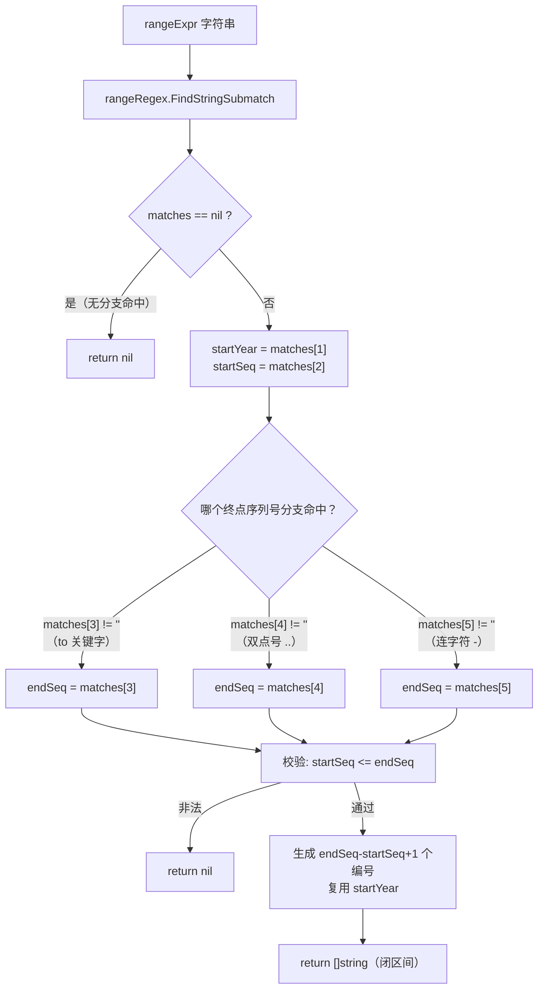
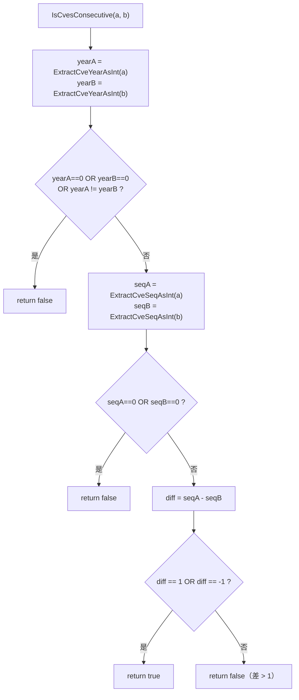
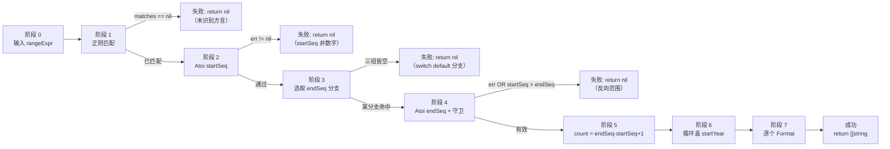

# 范围解析指南

安全公告很少逐个罗列漏洞编号。修补一连串相关漏洞的厂商公告往往写成 `CVE-2022-12345 to CVE-2022-12350`，或者紧凑形式 `CVE-2022-12345..12350`，甚至连字符形式 `CVE-2022-12345-12350`。`cve` 包把这三种写法统一收敛到一个原语——`ParseCveRange`，并搭配 `IsCvesConsecutive`，后者用于判断两个编号是否直接相邻。两者都位于 `generate.go`，共同依赖一个正则表达式 `rangeRegex` 完成核心工作。本页依次讲解三种受支持的语法、约束每个范围的同年份规则、闭区间展开逻辑，以及你在真实公告中会遇到的写法。

:::tip 适用读者
你已经在原始公告文本上调用过 `Format` 和 `ExtractCve`，现在需要把 `CVE-2022-12345..12350` 这样的范围表达式展开成它所代表的六个具体编号。若想了解 `rangeRegex` 背后的正则内部细节，请先阅读[正则匹配内部机制](/zh/guide/regex-internals)；本页聚焦解析契约与它所解锁的公告处理场景。
:::

## 三种语法，一个正则

`ParseCveRange(rangeExpr string) []string` 接受三种表示同一范围的写法。它们并非三条独立的代码路径，而是单个已编译模式 `rangeRegex` 内部的三个互斥分支：

```go
var rangeRegex = regexp.MustCompile(
    `(?i)^\s*CVE-(\d+)-(\d+)\s*(?:to\s*CVE-\d+-(\d+)|\.\.(\d+)|\s*-\s*(\d+))\s*$`,
)
```

开头的 `CVE-(\d+)-(\d+)` 无条件捕获范围的起点——起始年份进入第 1 组，起始序列号进入第 2 组。结尾的非捕获组 `(?:...)` 随后为范围的终点提供三个互斥的备选分支，且恰好只有一个会命中：

| 语法 | 示例 | 命中的捕获组 | 终点序列号来源 |
| --- | --- | --- | --- |
| `to` 关键字 | `CVE-2022-12345 to CVE-2022-12350` | `matches[3]`（`to CVE-<年份>-` 之后） | `12350` |
| 双点号 `..` | `CVE-2022-12345..12350` | `matches[4]` | `12350` |
| 连字符 `-` | `CVE-2022-12345-12350` | `matches[5]` | `12350` |

注意三个分支的共同点：每个备选分支只捕获**终点序列号**。终点年份从不从输入中读回——正则在 `to` 分支里字面匹配它（`CVE-\d+-`）但将其丢弃。实现随后把起始年份复用到每个生成的编号上，这正是下一节所述同年份约束的机制所在。



三种语法并存，是因为真实公告并不统一。`to` 形式在散文里读起来自然；`..` 形式借鉴 Go 和 Python 的范围记法，紧凑；连字符形式则是两个 CVE 编号被复制粘贴后塌缩成一个 token 的产物。`ParseCveRange` 三者全收，这样下游代码就永远不必手工归一化分隔符。

## 同年份约束

`ParseCveRange` 产出的每个范围都落在同一个日历年之内。这不是风格选择，而是由正则写法与结果组装方式共同决定的：

```go
count := endSeq - startSeq + 1
result := make([]string, count)
year, _ := strconv.Atoi(startYear)
for i := 0; i < count; i++ {
    result[i] = Format(fmt.Sprintf("CVE-%d-%d", year, startSeq+i))
}
```

循环把**起始年份**盖在每一个生成的编号上。终点年份——即便输入中存在——也从不传播到输出中。由此带来两个后果。

第一，两个 CVE 年份不一致的 `to` 表达式会被静默地归入起始年份。正则会匹配 `CVE-2022-12345 to CVE-2023-12350`，因为 `to CVE-\d+-` 这部分对第二个年份很宽容，但生成的列表从 `CVE-2022-12345` 一直到 `CVE-2022-12350`，全部盖 `2022`。第二个年份被匹配后丢弃。

第二，这意味着 `ParseCveRange` 无法表达跨年边界。一个真正从 `CVE-2022-99999` 跨到 `CVE-2023-00001` 的公告无法在此处写成单个范围——你需要调用两次 `ParseCveRange` 再拼接，或者退而用 `GenerateCve` 自行构建列表。同年份规则呼应了 CVE 编号的预留方式（年份即桶），而年份边界几乎总意味着一次独立的预留，所以把两者塌缩在一起会有误导性。

| 输入 | 起始年份 | 输入中的终点年份 | 生成列表的年份 | 是否有效？ |
| --- | --- | --- | --- | --- |
| `CVE-2022-12345 to CVE-2022-12350` | `2022` | `2022` | `2022` | ✅ 一致 |
| `CVE-2022-12345 to CVE-2023-12350` | `2022` | `2023`（丢弃） | `2022` | ⚠️ 接受，第二年份被忽略 |
| `CVE-2022-12345..12350` | `2022` | （无） | `2022` | ✅ 一致 |
| `CVE-2022-12345-12350` | `2022` | （无） | `2022` | ✅ 一致 |

如果你想在跨年 `to` 表达式出现时拒绝它而不是静默塌缩，可以在匹配成功后自行比较两个年份——本包并不暴露原始捕获组，所以实践中你会先用 `ExtractCveYearAsInt` 解析两个端点，再调用 `ParseCveRange`。

## 闭区间：两端点均包含

`ParseCveRange` 返回的是**闭**区间：起始和终止编号都出现在结果中。算术是 `count := endSeq - startSeq + 1`，那个 `+1` 正是闭区间的由来。从 `12345` 到 `12347` 的范围产出三个编号，而非两个：

```go
cves := cve.ParseCveRange("CVE-2022-12345..12347")
// cves == ["CVE-2022-12345", "CVE-2022-12346", "CVE-2022-12347"]
// count = 12347 - 12345 + 1 = 3
```

这与安全写作中对 `to` 和 `..` 的惯常理解一致——"CVE-2022-12345 to CVE-2022-12350"意味着公告同时涉及两个端点及其间的每一个编号。闭区间规则也解释了为何 `startSeq > endSeq` 会被拒绝：反向范围会让 `count` 为负，循环永不执行，所以守卫直接短路返回 `nil`：

```go
if err != nil || startSeq > endSeq {
    return nil
}
```

| 表达式 | startSeq | endSeq | count | 结果 |
| --- | --- | --- | --- | --- |
| `CVE-2022-12345..12347` | `12345` | `12347` | `3` | 3 个编号，含两端点 |
| `CVE-2022-12345 to CVE-2022-12345` | `12345` | `12345` | `1` | 单元素列表 `[CVE-2022-12345]` |
| `CVE-2022-12350 to CVE-2022-12345` | `12350` | `12345` | — | `nil`（start &gt; end） |
| `CVE-2022-12345 to CVE-2022-12ABC` | `12345` | （解析失败） | — | `nil` |

单元素情形（`start == end`）是合法的，返回单元素切片而非 `nil`。这对那些用范围写法却只命名了一个编号的公告来说是正确行为。

## IsCvesConsecutive：两个编号是否相邻？

`ParseCveRange` 把范围表达式展开成列表，而 `IsCvesConsecutive(a, b string) bool` 回答的是反向问题：给定两个具体编号，它们是否直接相邻？两个 CVE 连续，当且仅当它们同年份**且**序列号之差恰好为 1：

```go
func IsCvesConsecutive(a, b string) bool {
    yearA := ExtractCveYearAsInt(a)
    yearB := ExtractCveYearAsInt(b)
    if yearA == 0 || yearB == 0 || yearA != yearB {
        return false
    }
    seqA := ExtractCveSeqAsInt(a)
    seqB := ExtractCveSeqAsInt(b)
    if seqA == 0 || seqB == 0 {
        return false
    }
    diff := seqA - seqB
    return diff == 1 || diff == -1
}
```

三条规则值得点出，因为它们决定了哪些情形返回 false。

**必须同年份。** `CVE-2022-12345` 与 `CVE-2023-12345` 即便序列号相同也不连续——年份边界打破相邻关系，这与 `ParseCveRange` 的同年份规则如出一辙。`yearA != yearB` 会在序列号比较之前就返回 false。

**参数顺序无关。** 最后一行测试 `diff == 1 || diff == -1`，所以 `IsCvesConsecutive(a, b)` 与 `IsCvesConsecutive(b, a)` 返回相同值。连续性是对称关系，不存在"在前"或"在后"。

**非法输入按失败处理。** `ExtractCveYearAsInt` 和 `ExtractCveSeqAsInt` 在畸形编号上都返回 `0`，函数显式守卫 `yearA == 0`、`yearB == 0`、`seqA == 0`、`seqB == 0`。序列号 `0` 不是真实 CVE 序列，所以把它当作"不连续"是安全的默认值。

| 配对 (a, b) | 同年份？ | 序列号差 | 结果 |
| --- | --- | --- | --- |
| `CVE-2022-12345`, `CVE-2022-12346` | ✅ | `1` | `true` |
| `CVE-2022-12346`, `CVE-2022-12345` | ✅ | `-1` | `true`（对称） |
| `CVE-2022-12345`, `CVE-2022-12347` | ✅ | `2` | `false`（差为 2） |
| `CVE-2022-12345`, `CVE-2023-12346` | ❌ | — | `false`（年份不同） |
| `CVE-2022-12345`, `not-a-cve` | 年份 `0` | — | `false`（非法） |



当你想判断一组散落的 CVE 编号能否塌缩回一个范围表达式用于展示，或者两份提及相邻编号的公告是否在描述同一个逻辑修复时，`IsCvesConsecutive` 就是你需要的构建块。

## 安全公告中 CVE 范围的常见写法

范围表达式最常出现在厂商公告、NVD 条目和扫描器输出中。下表汇总了你在野外会遇到的各种写法，以及 `ParseCveRange` 对每种的处理。

| 公告写法 | 方言 | `ParseCveRange` 可解析？ | 说明 |
| --- | --- | --- | --- |
| `CVE-2022-12345 to CVE-2022-12350` | `to` 关键字 | ✅ | 人类可读散文中最常见 |
| `CVE-2022-12345..12350` | 双点号 | ✅ | 紧凑形式，常见于工具输出 |
| `CVE-2022-12345-12350` | 连字符 | ✅ | 与单个 CVE 有歧义；正则要求内部连字符后跟一个 `\d+` 来消歧 |
| `CVE-2022-12345 - CVE-2022-12350` | 带空格连字符 | ✅ | `\s*-\s*` 分支容忍两侧空格 |
| `CVE-2022-12345, CVE-2022-12346` | 逗号列表 | ❌ | 不是范围；用 `ExtractCve` 再 `SortCves` |
| `CVE-2022-12345+` | 加号后缀 | ❌ | 非 CVE 范围语法；被拒绝 |

连字符形式值得一谈。`CVE-2022-12345-12350` 在语法上是一个单 token，语义上却是一个范围，正则靠结构消歧：把 `CVE-2022-12345` 匹配为起点后，它要求再有一个 `-` 后跟裸 `\d+` 才算范围。若该尾部组缺失，字符串根本不会被 `rangeRegex` 匹配，`ParseCveRange` 返回 `nil`——它不会退化为把输入当成单个 CVE 处理。

一个从公告到列表的现实流水线如下：

```go
package main

import (
    "fmt"

    "github.com/scagogogo/cve"
)

func main() {
    // 1. 一份用 'to' 关键字写成的厂商公告。
    ids := cve.ParseCveRange("CVE-2022-12345 to CVE-2022-12350")
    fmt.Println(ids)
    // [CVE-2022-12345 CVE-2022-12346 CVE-2022-12347 CVE-2022-12348 CVE-2022-12349 CVE-2022-12350]

    // 2. 同一范围用紧凑双点号写法，得到相同列表。
    compact := cve.ParseCveRange("CVE-2022-12345..12350")
    fmt.Println(len(compact) == len(ids)) // true

    // 3. 检查两个相邻编号是否邻接。
    fmt.Println(cve.IsCvesConsecutive("CVE-2022-12349", "CVE-2022-12350")) // true
    fmt.Println(cve.IsCvesConsecutive("CVE-2022-12350", "CVE-2023-00001")) // false（年份边界）

    // 4. 畸形或反向范围返回 nil，而非 panic。
    fmt.Println(cve.ParseCveRange("CVE-2022-12350 to CVE-2022-12345")) // []
}
```

这条流水线有意保持宽容：三种方言可互换，非法输入退化为 `nil` 而非报错，每个生成的编号在输出前都经过 `Format` 规范化，所以大小写和空白永远不会泄露进结果。

## 小结

- 📌 `ParseCveRange` 接受三种语法——`to`、`..`、`-`——全部由单个 `rangeRegex` 模式通过三个互斥捕获分支匹配。
- 🧩 同年份约束是结构性的：终点年份被匹配但丢弃，起始年份盖在每一个生成的编号上。
- ⚡ 结果是**闭**区间（`count = endSeq - startSeq + 1`）；`startSeq &gt; endSeq` 短路返回 `nil`。
- 🤖 `IsCvesConsecutive(a, b)` 仅当两个编号同年份且序列号之差恰好为 `1` 时返回 `true`——与顺序无关，对非法输入按失败处理。
- 🛠️ 连字符形式 `CVE-2022-12345-12350` 靠结构消歧：内部连字符后必须跟裸 `\d+`，否则该字符串不是范围。
- ⚠️ 跨年范围无法在一次调用中表达；拆分调用或用 `GenerateCve` 构建列表。
- ✅ 串联 `ParseCveRange` → `IsCvesConsecutive`，把公告中的范围散文转化为具体且具备邻接感知的编号列表。

## 图解参考

第一张是 ASCII 流程图，描绘把一个范围表达式展开成闭区间编号列表的完整管线。它跟踪数据从原始输入字符串流经单个已编译正则、盖年份的循环，再到 `Format` 规范化输出的全过程：

```text
+--------------------------+
| rangeExpr（原始字符串）  |
| 如 "CVE-2022-12345..    |
|          12350"         |
+-----------+--------------+
            |
            v
+--------------------------+      nil   +---------+
| rangeRegex.              |----------->| return  |
| FindStringSubmatch       |  无匹配    |  nil    |
+-----------+--------------+           +---------+
            | matches != nil
            v
+--------------------------+
| startYear = matches[1]   |
| startSeq   = matches[2]  |
+-----------+--------------+
            |
            v
+--------------------------+
| 选取 endSeq：            |
|   matches[3] != "" ? to  |
|   matches[4] != "" ? ..  |
|   matches[5] != "" ? -   |
+-----------+--------------+
            |
            v
+--------------------------+      非法   +---------+
| startSeq > endSeq？      |----------->| return  |
| strconv 报错？           |           |  nil    |
+-----------+--------------+           +---------+
            | 通过
            v
+--------------------------+
| count = endSeq - start   |
|         Seq + 1（闭区间）|
| result := make([]string, |
|              count)      |
+-----------+--------------+
            |
            v
+--------------------------+
| for i in [0, count)：    |
|   Format("CVE-%d-%d",    |
|     startYear,           |
|     startSeq+i)          |  <-- 年份固定
+-----------+--------------+
            |
            v
+--------------------------+
| []string（闭区间、       |
|  Format 规范化、         |
|  同年份盖印）            |
+--------------------------+
```

第二张是 mermaid 时序图，从另一个视角把同一次调用重述为一系列阶段及其失败短路点，强调每个守卫在*何处*触发，而非数据形态。它让三条终止路径（正则不匹配返回 `nil`、校验失败返回 `nil`、成功）与唯一成功路径一目了然：



## 深入解析

- **单个已编译正则，无逐次调用编译。** `rangeRegex` 是包级 `var`，在加载时由 `regexp.MustCompile` 初始化（`generate.go:16`）。`ParseCveRange` 每次调用都执行 `FindStringSubmatch`，但从不重新编译模式，因此构建 NFA 的代价在程序启动时一次性支付，而非每个范围都付一次。这与 `base.go:14-16` 的 `exactCveRegex`/`containsCveRegex`、`extract.go:9` 的 `cveRegex` 是同一惯用法——本包一致地把正则上提到包作用域。

- **`default` 分支在实践中不可达，但不可或缺。** `ParseCveRange` 中的 `switch`（`generate.go:158-167`）按 `matches[3]`、`matches[4]`、`matches[5]` 分派，并带 `default: return nil`。由于 `rangeRegex` 被 `^...$` 锚定且尾部分组为必填，一次成功匹配必然恰好填满三个捕获组之一——`default` 分支对正则已接受的字符串永远不会触发。它存在的意义是防御未来对模式的放松式修改，并把函数契约写明："无终点序列号，则无结果。"

- **`IsCvesConsecutive` 的 `seq == 0` 守卫并非与年份守卫重复。** `ExtractCveYearAsInt`（`extract.go:183-190`）会调用 `IsCve`，对畸形输入返回 `0`；而 `ExtractCveSeqAsInt`（`extract.go:262-266`）**不**调用 `IsCve`——它把 `ExtractCveSeq` 的输出直接喂给 `strconv.Atoi`，后者对 `ExtractCveSeq` 在非 CVE 上返回的空字符串给出 `0, error`。像 `"CVE-2022-ABC"` 这样的字符串能通过年份检查（`2022` 可解析），但得到 `seq == 0`，因此 `IsCvesConsecutive` 中显式的 `seqA == 0 || seqB == 0` 测试（`generate.go:215`）才是真正捕获非数字序列号的那一道。删掉它，函数就会拿年份相等但序列号是垃圾的 ID 去做比较。

- **热路径上 `Format` 被调用两次，且是故意的。** 生成循环内部（`generate.go:176`）每个 ID 先由 `fmt.Sprintf("CVE-%d-%d", year, startSeq+i)` 构造，再过一遍 `Format`，即 `strings.ToUpper(strings.TrimSpace(...))`（`base.go:46`）。由于 `Sprintf` 的输出已是大写且无前后空白，`Format` 对产生的字节而言是 no-op——但它是与 `ExtractCve`、`GenerateCve` 所施加的同一道规范化，因此 `ParseCveRange` 的输出与本包其他所有生产者逐字节一致。代价是每个 ID 两次平凡的字符串遍历；收益是下游调用者可以把范围展开出的 ID 与提取出的 ID 混用，永远不必再规范化一次。

- **`ParseCveRange` 与 `IsCvesConsecutive` 并非互逆。** `ParseCveRange("CVE-2022-12345..12350")` 展开为 6 个编号，但 `IsCvesConsecutive("CVE-2022-12345", "CVE-2022-12350")` 返回 `false`——长度 &gt; 2 的范围两端点永远不是*直接*相邻的。两个函数建模的是不同关系：`ParseCveRange` 建模"落在闭区间 `[start, end]` 内"，`IsCvesConsecutive` 建模"序列号之差恰为 `1`"。因此把列表塌缩回范围表达式需要的远不止 `IsCvesConsecutive`——你需要先排序（`SortCves`），再扫描并把连续配对分组为游程，最后才能对每个游程输出 `..` 记法。

## 延伸阅读

- [`ParseCveRange` API 参考](/zh/api/functions/parse-cve-range)
- [`IsCvesConsecutive` API 参考](/zh/api/functions/is-cves-consecutive)
- [`GenerateCve` API 参考](/zh/api/functions/generate-cve) —— `ParseCveRange` 内部用来把年份盖到每个编号上的原语
- [正则匹配内部机制](/zh/guide/regex-internals) —— 逐分支拆解 `rangeRegex` 模式
- [年份校验规则](/zh/guide/year-rules) —— 为何年份是预留桶，为何年份边界会打破相邻关系
- [集合运算指南](/zh/guide/set-operations-guide) —— 每个集合辅助函数最终都调用 `SortCves`，按年份再按序列号对展开后的范围列表排序
