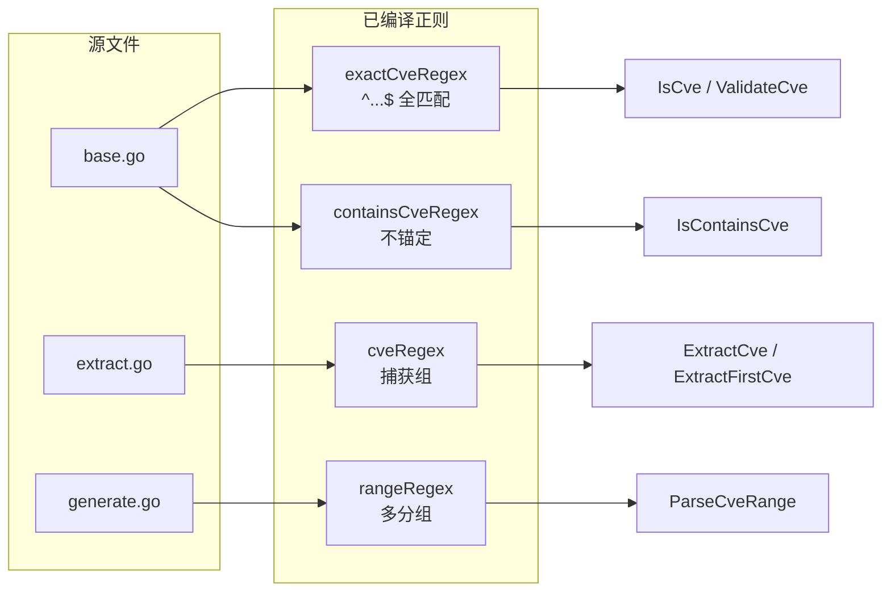
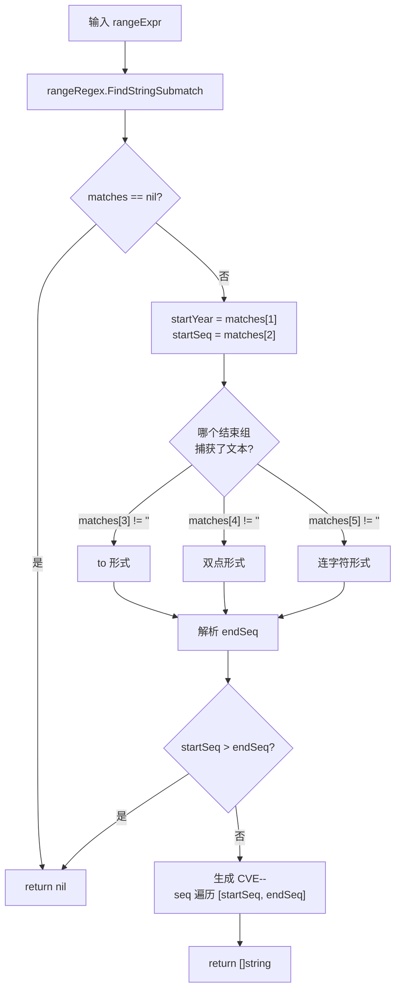
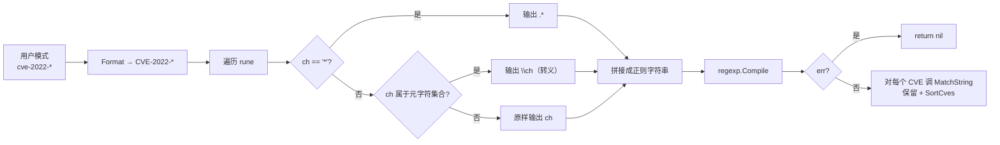
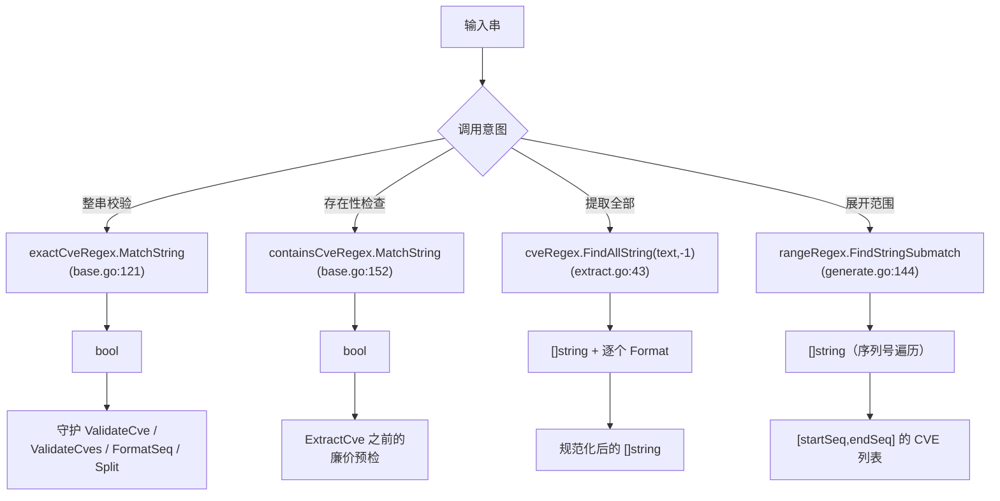

# 正则匹配原理

`cve` 包依靠四个手写的正则表达式驱动其核心能力：格式校验、自由文本扫描、标识符提取和范围展开。本页揭开正则这一层，逐一说明每个模式如何构造、为什么大小写不敏感内建于模式层、以及通配符过滤器如何把 glob 风格的 `*` 翻译成可安全编译的正则。

:::tip 适用读者
正在扩展本库、编写自定义 CVE 扫描器、或排查某个字符串为何匹配（或未匹配）的开发者。阅读前应已熟悉公开 API 表面——本页讲的是底层引擎。
:::

## 四个核心正则

四个模式都在包初始化时通过 `regexp.MustCompile` 编译一次，存入未导出的包级变量。它们永不重新编译，因此 `IsCve`、`ExtractCve` 等热路径在每次调用时不承担编译开销。

| 变量 | 定义于 | 模式（Go 原始字符串） | 锚定方式 | 用途 |
| --- | --- | --- | --- | --- |
| `exactCveRegex` | `base.go` | `` `(?i)^\s*CVE-\d+-\d+\s*$` `` | 全匹配（`^...$`） | 校验整串就是一个 CVE |
| `containsCveRegex` | `base.go` | `` `(?i)CVE-\d+-\d+` `` | 不锚定扫描 | 检测是否出现任意 CVE |
| `cveRegex` | `extract.go` | `` `(?i)(CVE-\d+-\d+)` `` | 不锚定、带捕获 | 从文本中提取所有 CVE |
| `rangeRegex` | `generate.go` | `` `(?i)^\s*CVE-(\d+)-(\d+)\s*(?:to\s*CVE-\d+-(\d+)|\.\.(\d+)|\s*-\s*(\d+))\s*$` `` | 全匹配、多分组 | 解析范围表达式 |

注意刻意的分工：`base.go` 负责校验/检测，`extract.go` 负责带捕获组的提取，`generate.go` 负责复杂得多的范围解析。每个文件只声明自己需要的正则。



## 精确 vs. 文本扫描：为何要两个模式

"整串就是一个 CVE" 与 "段落里出现了一个 CVE" 是不同的问题，本库用两个独立正则处理，而非一个可配置的正则。

`exactCveRegex` 两端锚定——`^\s*...$`——整串必须（两侧可有空白）是 `CVE-<数字>-<数字>`。其余任何形式，包括 `"see CVE-2022-12345 above"`，都会失败。它支撑 `IsCve`，而 `IsCve` 又守护着 `ValidateCve`、`ValidateCves`、`FormatSeq` 和 `Split`。

`containsCveRegex` 是同样的模式体但不带锚。它不在乎匹配周围是什么，只在乎某处存在一个 CVE 形态的子串。它支撑 `IsContainsCve`——在完整 `ExtractCve` 之前的廉价预检。

| 输入字符串 | `exactCveRegex`（`IsCve`） | `containsCveRegex`（`IsContainsCve`） |
| --- | --- | --- |
| `"CVE-2022-12345"` | 匹配 | 匹配 |
| `" CVE-2022-12345 "` | 匹配（允许空白） | 匹配 |
| `"see CVE-2022-12345 above"` | 不匹配（多余字符） | 匹配 |
| `"cve-2022-12345"` | 匹配（大小写不敏感） | 匹配 |
| `"CVE-2022-ABCD"` | 不匹配（序列号非数字） | 不匹配 |

这种不对称是有意为之：校验必须严格，检测必须宽松。若合并成一个正则，就会迫使每个调用方指定锚定模式，而这正是本库对用户隐藏的那种旋钮。

### 为何捕获组只在 `cveRegex` 里

`extract.go` 单独声明 `cveRegex`，尽管可见模式体与 `containsCveRegex` 相同。区别在于那对括号：`(?i)(CVE-\d+-\d+)`。正是这一个捕获组让 `ExtractCve` 能调用 `FindAllString` 并直接拿到 CVE 文本，再用 `Format` 归一化每个命中。`containsCveRegex` 只需要布尔结果——`MatchString`——因此不带捕获开销。

## 通过 `(?i)` 实现大小写不敏感

四个模式无一例外都以内联标志 `(?i)` 开头。这是 RE2/Syntax 的大小写不敏感开关，写在模式内部，而非通过 `regexp.MustCompile` 的标志位传入。实际效果：`cve`、`Cve`、`CVE` 匹配完全一致，输入文本中的混合同样如此。

```go
// base.go
exactCveRegex    = regexp.MustCompile(`(?i)^\s*CVE-\d+-\d+\s*$`)
containsCveRegex = regexp.MustCompile(`(?i)CVE-\d+-\d+`)

// extract.go
cveRegex = regexp.MustCompile(`(?i)(CVE-\d+-\d+)`)

// generate.go
rangeRegex = regexp.MustCompile(`(?i)^\s*CVE-(\d+)-(\d+)\s*(?:...)...`)
```

有一个细节值得讲明：`(?i)` 让模式中的*字面字母*大小写不敏感，但数字和结构性的连字符不受影响。模式中的 `CVE` 会匹配 `cve`、`CvE` 等；而 `-` 和 `\d+` 段无论输入大小写都行为一致。这也是为什么下游代码可以在匹配后安全地调用 `strings.ToUpper`——正则已接受任意大小写，`Format` 随即将其规范化为大写以便存储和比较。

本库从不使用 `regexp.MatchString(pattern, s)` 配合运行时编译的模式，也从不通过标志结构体设置 `Ignorecase`。`(?i)` 前缀是四个正则大小写不敏感的唯一、声明式来源。

## `rangeRegex`：一个模式，三种语法

`ParseCveRange` 接受三种记法来表达同一概念——同一年份内的闭区间序列号——并将它们折叠进一个正则，通过三个可选尾部实现。

```go
`(?i)^\s*CVE-(\d+)-(\d+)\s*(?:to\s*CVE-\d+-(\d+)|\.\.(\d+)|\s*-\s*(\d+))\s*$`
```

逐组解读：

- `(\d+)`（组 1）捕获起始年份。
- `(\d+)`（组 2）捕获起始序列号。
- 非捕获组 `(?: ... | ... | ... )` 随后选择三种结尾之一：
  - `to\s*CVE-\d+-(\d+)`——`to` 单词形式，结束序列号在组 3。
  - `\.\.(\d+)`——`..` 双点形式，结束序列号在组 4。
  - `\s*-\s*(\d+)`——连字符形式，结束序列号在组 5。

| 表达式 | 匹配的尾部 | 结束序列号组 |
| --- | --- | --- |
| `CVE-2022-12345 to CVE-2022-12350` | `to\s*CVE-\d+-(\d+)` | 组 3 |
| `CVE-2022-12345..12350` | `\.\.(\d+)` | 组 4 |
| `CVE-2022-12345-12350` | `\s*-\s*(\d+)` | 组 5 |

`FindStringSubmatch` 之后，`ParseCveRange` 中的 Go 代码依次检查 `matches[3]`、`matches[4]`、`matches[5]`，找出真正捕获到文本的那个结束序列号组，解析为 int，并在 `startSeq > endSeq` 时拒绝输入。由于整个模式以 `^...$` 锚定、且年份只捕获一次（组 1），起始与结束必同一年——语法上无法表达跨年范围。



## `FilterCvesByPattern`：通配符转正则

`FilterCvesByPattern` 是本库唯一在运行时根据用户输入构建正则的地方。该函数接受 glob 风格模式（`CVE-2022-*`、`CVE-*-1234`、`CVE-2022-1*`），通过逐字符（rune）遍历将其转换为已编译的 RE2 模式。

```go
pattern = Format(pattern)            // 先大写
patternParts := []rune(pattern)
var regexParts []rune
for _, ch := range patternParts {
    switch ch {
    case '*':
        regexParts = append(regexParts, []rune(".*")...)
    case '.', '+', '(', ')', '[', ']', '{', '}', '\\', '^', '$', '|':
        regexParts = append(regexParts, '\\', ch)   // 转义正则元字符
    default:
        regexParts = append(regexParts, ch)
    }
}
regex, err := regexp.Compile(string(regexParts))
```

三个设计选择值得注意：

1. **`*` 变成 `.*`，而非 `.*?`，也不加锚。** 翻译后的模式用 `MatchString` 调用，后者报告正则是否在串中*任意位置*匹配。由于结果未加约束，`CVE-2022-1*` 会匹配 `CVE-2022-12345`（`.*` 吞掉 `2345`）——若传入 `CVE-2022-1ABC` 这类内容也会匹配，因为 `.*` 不限定数字。
2. **只转义列出的元字符。** 集合为 `. + ( ) [ ] { } \ ^ $ |`。值得注意的是 `?` *不在*转义列表中，因此含 `?` 的用户模式会作为正则量词放行，而非字面量。实践中 CVE 模式不含 `?`，但这一行为是承重的、必须知晓。
3. **翻译前对模式调用 `Format`。** 这将其大写，于是 `cve-2022-*` 与 `CVE-2022-*` 行为一致，且模式中的 `CVE-` 字面量与大写化后的候选 CVE 对齐。

| 用户模式 | 翻译后的正则 | 是否匹配 `CVE-2022-12345`？ |
| --- | --- | --- |
| `CVE-2022-*` | `CVE-2022-.*` | 是 |
| `CVE-*-1234` | `CVE-.*-1234` | 否（序列号为 `12345`，非 `1234`） |
| `CVE-2022-1*` | `CVE-2022-1.*` | 是 |
| `CVE-2022-.*` | `CVE-2022-\..*`（点被转义） | 否（期望 `2022-` 后是字面点） |

最后一行是关键：已经懂正则、直接输入 `CVE-2022-.*` 的用户不会得到原始正则语义。`.` 被转义为 `\.`，于是只匹配字面点。该函数是 glob 翻译器，不是正则透传。

若 `regexp.Compile` 失败（鉴于翻译保守，这很罕见），函数返回 `nil` 而非 panic——这是刻意的选择，避免一个畸形模式拖垮可能正在过滤大批数据的调用方。



## 小结

- 四个正则分布在三个文件，驱动校验、检测、提取和范围解析，均在初始化时编译一次。
- `exactCveRegex`（锚定）与 `containsCveRegex`（不锚定）刻意分离 "是一个 CVE" 与 "包含一个 CVE"，使调用方无需配置锚定。
- `cveRegex` 复用与 `containsCveRegex` 相同的模式体，但增加捕获组，让 `ExtractCve` 能直接取出匹配文本。
- 每个模式内的 `(?i)` 是大小写不敏感的唯一来源；`Format` 随后规范化为大写。
- `rangeRegex` 将三种记法（`to`、`..`、`-`）折叠进一个锚定模式，通过三个可选的结束序列号组实现。
- `FilterCvesByPattern` 把 `*` 翻译为 `.*` 并转义固定的元字符集合；它是 glob 翻译器，不是正则透传，编译失败时返回 `nil`。

## 图解参考

两张互补的图描绘原始输入串如何流经正则层得到类型化结果。第一张是任意输入在运行时的决策路径；第二张是公开 API 与已编译正则在调用时的关系。

```text
                    +-------------------------+
       输入串   --> | 按调用意图路由         |
                    +-------------------------+
                      |        |        |
            校验      |  扫描  |  提取   |  范围
                      v        v          |        |
              +-----------+ +-----------+  |        |
              | IsCve     | | IsContain |  |        |
              | exactCve  | | contains  |  |        |
              |  Regex    | | CveRegex  |  |        |
              +-----------+ +-----------+  |        |
                      |        |          |        |
                   bool|    bool|          |        |
                      v        v          v        v
                   +----------------+ +-----------+ +-----------+
                   | ValidateCve... | | ExtractCve| | ParseCve  |
                   | (守护)         | | cveRegex  | | Range     |
                   +----------------+ | FindAll   | | rangeRegex|
                                      +-----------+ | FindSubm. |
                                                    +-----------+
                                                          |
                                                          v
                                                    []string
```

上面的 ASCII 图捕捉的是*分派*层：单个输入串按调用方意图路由到四个正则之一——布尔守护、布尔存在性检查、命中列表或展开的范围。注意 `IsCve` 作为守护喂给 `ValidateCve`/`ValidateCves`/`FormatSeq`/`Split`，而 `ExtractCve` 直接返回切片。



mermaid 图强调的是*返回类型分野*：两个正则产出布尔（守护与预检），两个产出 `[]string`（提取与生成）。布尔分支会先廉价短路，切片产出分支随后才运行。

## 深入解析

- **编译一次，永久共享。** 四个正则都位于包级 `var` 块，在进程启动时初始化（`base.go:14`、`base.go:16`、`extract.go:9`、`generate.go:16`）。`regexp.MustCompile` 在 init 时遇到坏模式会 panic，这是可接受的，因为模式都是字面量——此处的 panic 是编译期作者侧的 bug，不是运行时故障。收益在于 `IsCve`（`base.go:121`）与 `ExtractCve`（`extract.go:43`）每次调用命中的都是已编译的 `*Regexp`，单次调用成本是一次 RE2 NFA 匹配，不为模式本身分配。
- **`FindAllString(text, -1)` 是无界形式。** `extract.go:43` 传入 `-1` 作为计数，意为"全部匹配，不设上限"。对嵌入数千个 CVE 形态子串的病态输入，单次调用会分配任意大小的切片。没有流式变体；扫描不可信的超大文本时，调用方应自行预 bound 工作量（如分块），而非指望 `ExtractCve` 惰性。`ExtractFirstCve` 与 `ExtractLastCve` 正是为只需一个端点、避免物化整切片而存在。
- **`to` 形式重复字面年份，而非反向引用。** `rangeRegex` 中尾部 `to\s*CVE-\d+-(\d+)` 重新拼写 `CVE-\d+-`，而非反向引用组 1。RE2 刻意不支持反向引用，因此年份被作为独立 `\d+` 第二次匹配。这正是 `CVE-2022-12345 to CVE-2023-12350` *能匹配正则*（两个年份都是数字）但 `ParseCveRange` 的 Go 代码只读 `matches[1]` 作为年份的原因——结束年份在结构上被忽略，结果按两者都是 `matches[1]` 生成。库把范围隐式视为同年；跨年范围无法通过年份捕获表达，只能通过（被丢弃的）结束年份字面量。
- **为何用 `(?i)` 而非 `IgnoreCase` 标志或先 `ToUpper` 再匹配。** Go 的 `regexp` 包没有 `Ignorecase` 编译标志——大小写折叠*在模式内部*用 `(?i)` 表达。另一条路是匹配前把输入大写化，也能工作，但会让每次 `IsCve`/`IsContainsCve` 调用都产生一次分配。把大小写折叠进已编译的 NFA 后，匹配本身在输入上保持零分配；`Format` 只在*结果*（实际命中这个小得多的集合）上调用，而非对每个被扫描的候选串调用。这是刻意的热路径优化。
- **`FilterCvesByPattern` 是唯一运行时编译的正则——且被沙箱化。** 其余正则都是 init 时编译的字面量；`FilterCvesByPattern`（`filter.go:316`）每次调用都 `regexp.Compile`。两个后果：（1）它是唯一可能因畸形*用户*输入产生编译错误的地方，代码返回 `nil` 而非 panic（`filter.go:317-319`）；（2）由于元字符转义集合不含 `?`，含 `?` 的用户模式会作为正则量词放行。库依赖"真实 CVE 模式不含 `?`"这一不变量，但传入任意 glob 串的调用方应知晓这是"带正则泄漏的 glob"，而非严格 glob。

## 延伸阅读

- [校验](/api/format-validate)——基于 `exactCveRegex` 的公开函数
- [提取](/api/extract)——`ExtractCve`、`ExtractFirstCve`、`ExtractLastCve`
- [范围与生成](/api/generate)——`ParseCveRange`、`GenerateCve`、`GenerateFakeCve`
- [过滤与分组](/api/filter-group)——`FilterCvesByPattern` 及相关函数
