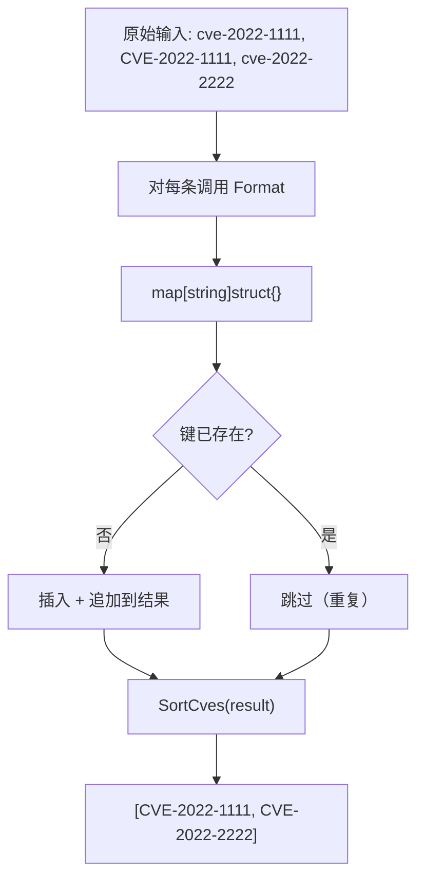
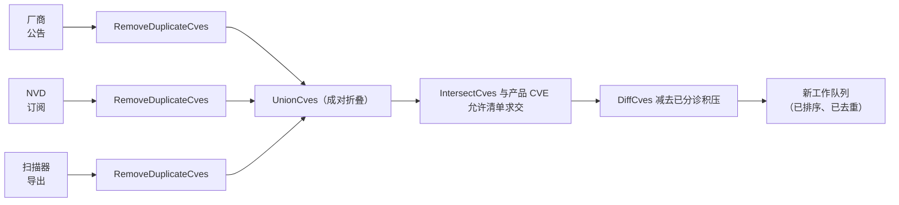
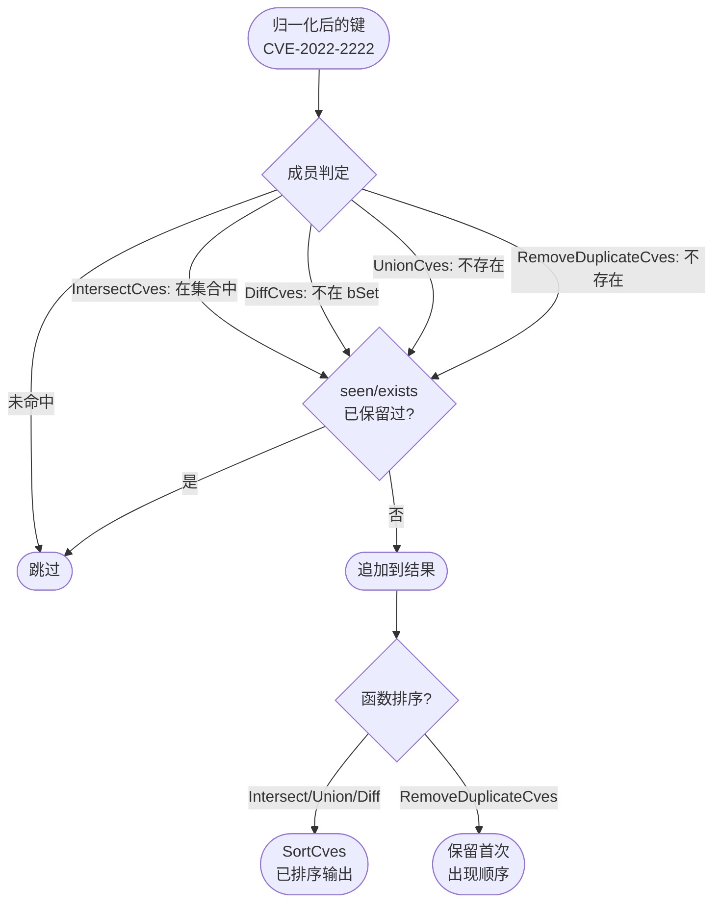

# 集合运算指南

`cve` 包在 `filter.go` 中提供四个集合论语义的辅助函数 —— `IntersectCves`、`UnionCves`、`DiffCves` 与 `RemoveDuplicateCves`。它们是核对来自独立数据源的 CVE 列表时的基本构件：厂商公告、NVD 拉取、扫描器导出、内部资产清单。四个函数都依赖同一个原语 —— 以 `Format` 归一化后的标识符为键的 Go `map[string]struct{}` —— 这正是它们 O(n+m)（去重器为 O(n)）复杂度与大小写不敏感、自动去重语义的来源。本页逐一梳理每个函数、它们共享的 map 用法，以及如何在真实的多源合并场景中组合使用。

:::tip 适用读者
已经引入本包、会对原始输入调用 `Format`，现在需要回答“两个列表里都有哪些 CVE？”、“上周以来新增了哪些？”、“给我一个没有重复的干净列表”这类问题。如果你先想了解排序那一半故事，请读 [比较与排序](/zh/guide/comparison-ordering) —— 本页每个函数最后都会调用 `SortCves`。
:::

## 共享的 map 用法

在逐一展开之前，先看它们的共同点，因为正是这套共享模式让复杂度保证成立。每个函数都会构造一到两个 `map[string]struct{}`，键**始终**是 `Format` 归一化后的 CVE —— `strings.ToUpper(strings.TrimSpace(cve))` —— 因此 `cve-2022-1111`、` CVE-2022-1111 ` 与 `CVE-2022-1111` 都坍缩到同一个 map 键上。值是空结构体 `struct{}`，占用零字节；这里把 map 当作集合用，而不是字典。

| 属性 | 保证的来源 | 对输出的影响 |
| --- | --- | --- |
| 大小写不敏感比较 | `Format` 在键化前转大写 | `cve-2022-1111` 与 `CVE-2022-1111` 视为相等 |
| 容忍空白 | `Format` 去除两端空白 | `" CVE-2022-1111 "` 匹配 `CVE-2022-1111` |
| 去重 | 第二次 `set[key] = struct{}{}` 是空操作 | 每个标识符至多存活一次 |
| 结果有序 | 最后 `return SortCves(result)` | 结果按年份、再按序列号排序 |

空结构体值是刻意的内存选择：用 `map[string]bool` 效果相同，但每条多花一个字节。在 NVD 全年数据量（数万条）规模下，每条的差异可以忽略，但它表达了意图 —— “这是集合，值无意义” —— 本包在四个函数中一致遵循这一约定。



这张图就是 `RemoveDuplicateCves` 的函数体，另外三个函数是它的变体：`IntersectCves` 多加一张 map 做成员判定，`UnionCves` 把同一循环跑两遍输入，`DiffCves` 则把成员判定取反。

## IntersectCves —— 两个列表的共有部分

`IntersectCves(a, b []string) []string` 返回**同时**出现在 `a` 和 `b` 中的标识符。实现上先从第一个列表构造集合，再遍历第二个列表，只保留其归一化形式在集合中的条目。

```go
func IntersectCves(a, b []string) []string {
    set := make(map[string]struct{}, len(a))
    for _, cve := range a {
        set[Format(cve)] = struct{}{}
    }

    var result []string
    seen := make(map[string]struct{}, len(b))
    for _, cve := range b {
        formatted := Format(cve)
        if _, inA := set[formatted]; inA {
            if _, exists := seen[formatted]; !exists {
                seen[formatted] = struct{}{}
                result = append(result, formatted)
            }
        }
    }

    return SortCves(result)
}
```

这里有两张 map。第一张 `set` 是列表 `a` 的成员索引。第二张 `seen` 用于防止列表 `b` 内部的重复：若 `b` 中出现三次 `CVE-2022-2222`，结果中仍应只出现一次。没有 `seen`，`b` 中的重复条目会按出现次数被追加。构造 `set` 是 O(n)，以常数时间查找遍历 `b` 是 O(m)，最后的 `SortCves` 是 O(k log k)（k 为交集大小）—— 因此典型输入下的主导项是 O(n+m)。

| 输入 `a` | 输入 `b` | 输出 |
| --- | --- | --- |
| `CVE-2022-1111, CVE-2022-2222` | `CVE-2022-2222, CVE-2022-3333` | `CVE-2022-2222` |
| `CVE-2022-1111` | `CVE-2023-2222` | `[]`（空） |
| `cve-2022-2222` | `CVE-2022-2222, CVE-2022-2222` | `CVE-2022-2222`（仅一份） |

典型场景是交叉比对两份安全报告。给定厂商公告与 NVD 订阅源，交集就是两方都认同影响你产品的 CVE 集合 —— 这是置信度最高、应优先分诊的工作量。

## UnionCves —— 合并且去重

`UnionCves(a, b []string) []string` 返回出现在任一列表中的所有标识符，已去重。实现是集合模式最直白的表达：一张 map、两个循环、仅在首次见到时追加。

```go
func UnionCves(a, b []string) []string {
    set := make(map[string]struct{}, len(a)+len(b))
    var result []string

    for _, cve := range a {
        formatted := Format(cve)
        if _, exists := set[formatted]; !exists {
            set[formatted] = struct{}{}
            result = append(result, formatted)
        }
    }

    for _, cve := range b {
        formatted := Format(cve)
        if _, exists := set[formatted]; !exists {
            set[formatted] = struct{}{}
            result = append(result, formatted)
        }
    }

    return SortCves(result)
}
```

注意容量提示 `len(a)+len(b)` —— map 按两列表完全不交的最坏情况预分配，所以构建过程中不会触发再哈希。两个循环里出现同样的 `if _, exists := set[formatted]; !exists` 守卫，正是它在单遍扫描内同时去除了 `a` 内、`b` 内以及两列表之间的重复。时间复杂度 O(n+m)；不交最坏情况下空间为 O(n+m)。

当你是在聚合覆盖面而非收窄范围时，并集是正确的工具。若扫描器给出一组候选 CVE、内部资产清单又追踪另一组，并集就是你的工具链应当推理的完整标识符宇宙 —— 而且由于输出已排序，下游消费者可以对它做二分查找。

## DiffCves —— a 有而 b 没有

`DiffCves(a, b []string) []string` 返回在 `a` 中出现但不在 `b` 中出现的标识符 —— 集合减法，`a \ b`。实现上先从 `b` 构造排除集合，再遍历 `a`，只保留不在该集合中的条目。

```go
func DiffCves(a, b []string) []string {
    bSet := make(map[string]struct{}, len(b))
    for _, cve := range b {
        bSet[Format(cve)] = struct{}{}
    }

    aSeen := make(map[string]struct{}, len(a))
    var result []string
    for _, cve := range a {
        formatted := Format(cve)
        if _, inB := bSet[formatted]; !inB {
            if _, exists := aSeen[formatted]; !exists {
                aSeen[formatted] = struct{}{}
                result = append(result, formatted)
            }
        }
    }

    return SortCves(result)
}
```

结构与 `IntersectCves` 镜像对称，只是成员判定取反：内层 `if` 仅当条目**不在** `bSet` 中时才保留。`aSeen` 与 `IntersectCves` 中的 `seen` 起同样的去重作用 —— 若 `a` 列了两次 `CVE-2022-1111`，结果只含一份。操作顺序很关键：先索引 `b`（O(m)），再以常数时间排除测试扫描 `a`（O(n)），总计仍是 O(n+m)。

| 输入 `a` | 输入 `b` | 输出 | 解读 |
| --- | --- | --- | --- |
| `CVE-2022-1111, CVE-2022-2222` | `CVE-2022-2222, CVE-2022-3333` | `CVE-2022-1111` | 在 `a`、不在 `b` |
| `CVE-2022-1111, CVE-2022-1111` | `CVE-2022-3333` | `CVE-2022-1111` | `a` 内重复被折叠 |

差集是变更检测原语。把昨天的 CVE 列表作为 `b`、今天的作为 `a`：`DiffCves(今天, 昨天)` 正是新到达的标识符集合 —— 也就是一个分诊管道只应处理“尚未见过”的工作队列。

## RemoveDuplicateCves —— 折叠单个列表

`RemoveDuplicateCves(cveSlice []string) []string` 是单输入的特例：去重一个列表、归一化格式、不保留任何顺序（结果**未排序** —— 与另外三个不同，没有 `SortCves` 调用）。

```go
func RemoveDuplicateCves(cveSlice []string) []string {
    cveMap := make(map[string]struct{})
    var result []string

    for _, cve := range cveSlice {
        formattedCve := Format(cve)
        if _, exists := cveMap[formattedCve]; !exists {
            cveMap[formattedCve] = struct{}{}
            result = append(result, formattedCve)
        }
    }

    return result
}
```

两个细节把它与其余三个区分开。第一，map **没有容量提示**（`make(map[string]struct{})` 而非 `make(map[string]struct{}, len(cveSlice))`）—— 一处轻微的优化缺失，但确实意味着 map 在增长时可能再哈希。第二，结果保留**首次出现顺序**而非排序：函数注释明确写道“只保留每个CVE的第一次出现”。若需要有序输出，请再链一个 `SortCves`。时间复杂度 O(n)；空间 O(n)。

这一不对称 —— 三个函数对输出排序、一个不排序 —— 值得牢记。三个二元运算排序，是因为它们的结果在概念上是无序集合，稳定的顺序让跨运行结果可比较；`RemoveDuplicateCves` 则常作为流式预处理步骤使用，调用方希望保留来自数据源的到达顺序。

## 组合实战：多源合并

真实场景很少只跑一个操作。假设你从三个数据源摄取：厂商公告（`vendor`）、NVD 拉取（`nvd`）、内部扫描器（`scanner`）。一套典型的核对管道会把四个函数串起来。



每个源先独立去重 —— `RemoveDuplicateCves` 是廉价的 O(n) 保险，防住噪声大的上游。三份清洗后的列表再用 `UnionCves` 成对折叠（`UnionCves(UnionCves(vendor, nvd), scanner)`）成一个总宇宙。`IntersectCves` 把这个宇宙收窄到你的产品实际发布的 CVE（与受影响组件的标识符允许清单求交）。最后，`DiffCves` 减去团队已分诊的积压，只留下真正的新工作 —— 已排序、已去重、可直接分配。

```go
package main

import (
    "fmt"

    "github.com/scagogogo/cve"
)

func main() {
    vendor := []string{"cve-2022-1111", "CVE-2022-2222", "CVE-2022-1111"}
    nvd := []string{"CVE-2022-2222", "CVE-2022-3333", " cve-2022-3333 "}
    scanner := []string{"CVE-2022-1111", "CVE-2023-4444"}

    // 第 1 步：独立去重每个源（保留顺序）。
    cleanVendor := cve.RemoveDuplicateCves(vendor)
    cleanNvd := cve.RemoveDuplicateCves(nvd)
    cleanScanner := cve.RemoveDuplicateCves(scanner)

    // 第 2 步：并集成一个宇宙（输出已排序）。
    universe := cve.UnionCves(cve.UnionCves(cleanVendor, cleanNvd), cleanScanner)
    fmt.Println("universe:", universe)
    // universe: [CVE-2022-1111 CVE-2022-2222 CVE-2022-3333 CVE-2023-4444]

    // 第 3 步：收窄到产品实际发布的 CVE（求交）。
    allowlist := []string{"CVE-2022-2222", "CVE-2022-3333", "CVE-2023-4444"}
    affected := cve.IntersectCves(universe, allowlist)
    fmt.Println("affected:", affected)
    // affected: [CVE-2022-2222 CVE-2022-3333 CVE-2023-4444]

    // 第 4 步：减去已分诊的积压。
    backlog := []string{"CVE-2022-2222"}
    queue := cve.DiffCves(affected, backlog)
    fmt.Println("new queue:", queue)
    // new queue: [CVE-2022-3333 CVE-2023-4444]
}
```

注意大小写与空白的噪声 —— `cve-2022-1111`、` cve-2022-3333 ` —— 永远到不了比较逻辑，因为每个函数内部都以 `Format` 为键。调用方不需要预归一化；这份职责就住在集合运算自身里。

## 小结

- 四个函数都位于 `filter.go`，共享以 `Format` 归一化后的 CVE 为键的 `map[string]struct{}`，由此免费获得大小写不敏感、容忍空白、自动去重的语义。
- `IntersectCves`、`UnionCves`、`DiffCves` 为 O(n+m)，并通过最后的 `SortCves` 返回**已排序**输出；`RemoveDuplicateCves` 为 O(n)，保留首次出现顺序（不排序）。
- 双 map 设计（`IntersectCves`、`DiffCves`）用第二张 map 防止被扫描输入中的重复；单 map 设计（`UnionCves`、`RemoveDuplicateCves`）通过存在性检查就地去重。
- 自然组合是：每个源先去重，并集成宇宙，与允许清单求交，再减去积压 —— 管道每一阶段都是亚二次的。

## 图解参考

下面的文本图把单个 CVE 在四个函数中的数据流串成一张图：它落到哪张 map、成员判定走哪个分支、最终去往何处。它把每个函数的差异压成一张图，一眼可见 `IntersectCves`/`DiffCves` 复用同一套双 map 形态，而 `UnionCves`/`RemoveDuplicateCves` 只用一张。

```text
                 原始 CVE 字符串（如 " cve-2022-2222 "）
                              |
                              v
                    +-------------------+
                    |  Format(cve)      |   strings.ToUpper + TrimSpace
                    +-------------------+
                              |
                              v   归一化后的键: "CVE-2022-2222"
                              |
  ============ IntersectCves / DiffCves（双 map） ============
                              |
              +---------------+---------------+
              |                               |
              v                               v
   +---------------------+        +---------------------+
   | 索引 map（a 或 b）  |        | 扫描 map（seen/aSeen）|
   | 第一遍构建          |        | 防止第二遍中的重复     |
   +---------------------+        +---------------------+
              |                               |
              |   对键做成员判定              |
              v                               v
        +-----------+                   +-----------+
        | 在索引中? |   Intersect: 是   | 已         |
        +-----------+   Diff: 否        | 见过?      |
              |                         +-----------+
       是/保留 |                               |
              v                               v
              +---------------+---------------+
                              |
                              v
                       追加到结果
                              |
  ============ UnionCves / RemoveDuplicateCves（单 map） ============
                              |
                              v
                   +---------------------+
                   | 单张集合 map        |   已存在? -> 跳过
                   |（仅 UnionCves      |   不存在? -> 插入 + 追加
                   |  给了容量提示）    |
                   +---------------------+
                              |
                              v
                  SortCves(result)  <-- 仅 Intersect/Union/Diff
                              |       （RemoveDuplicateCves 跳过此步）
                              v
                     已排序、已去重的 []string
```

下面的 mermaid 图从另一视角，把四个函数画成结果切片上的状态机。每个函数都是穿越三个判定状态的路径；终点状态记录条目是否存活、输出最终是否排序。这让“三排序、一不排序”这一最易踩坑的不对称成为视觉中心。



## 深入解析

- **为什么 `IntersectCves`/`DiffCves` 用双 map 优于单 map。** 朴素的单 map 交集做法是：从 `a` 构造集合，再对 `b` 中每条做成员判定并追加。这没问题——直到 `b` 有重复。没有 `seen` map（filter.go:48、:236），`b` 中出现三次的 `CVE-2022-2222` 会被追加三次。第二张 map 把“对 `b` 每条的去重”变成 O(1) 存在性检查，让整个函数保持 O(n+m)，而不是退化到 O(n+m·d)（d 为重复计数）。`DiffCves` 出于对称理由在 `a` 侧携带同样的 `aSeen` 守卫（filter.go:350）。`UnionCves` 与 `RemoveDuplicateCves` 能用单 map，是因为它们唯一的那张集合同时兼任去重索引——存在性检查与去重检查是同一行。

- **容量提示是承重的，除了一处。** `IntersectCves` 给索引 map 提示 `len(a)`、给 `seen` 提示 `len(b)`（filter.go:42、:48）；`UnionCves` 提示 `len(a)+len(b)`——完全不交的最坏情况——所以构建中绝不触发再哈希（filter.go:285）；`DiffCves` 提示 `len(b)` 与 `len(a)`（filter.go:345、:350）。`RemoveDuplicateCves` 是异类：`make(map[string]struct{})` 无提示（filter.go:402）。Go 的 map 在过载时翻倍扩容桶，所以无提示的 map 在 N 条上约重哈希 log₂(N) 次，每次复制活集合——可测但非灾难。若你在热路径里去重整年 NVD，自行预分配 map，或调用 `UnionCves(x, []string{})`，它给了正确提示。

- **`SortCves` 是隐性的 O(k log k) 尾巴。** 每个二元运算都以 `return SortCves(result)` 收尾（filter.go:247、:304、:362）。`SortCves` 分配新切片、对每条 `Format`、再用 `CompareCves` 调 `sort.Slice`（compare.go:165-176）。`CompareCves` 本身在每次比较里调 `ExtractCveYearAsInt` 再 `ExtractCveSeqAsInt`——比较器并非免费。因此 `IntersectCves` 的真实复杂度是 O(n+m + k log k · c)，其中 k 为结果规模、c 为每次比较的抽取成本。小交集（k ≪ n+m）时 map 阶段主导；两个近乎相同的大列表求并（k ≈ n+m）时排序才是主导项。这正是本包理直气壮把函数标作“O(n+m)”的原因——典型 intersect/diff 工作量下排序渐近小于线性阶段，但它不是零。

- **对称差不是原语——自行组合。** 本包暴露了交集、并集、差集，却没有 XOR（对称差：在任一列表但不在两者）。刻意的组合是 `(a \ b) ∪ (b \ a)`，即 `UnionCves(DiffCves(a, b), DiffCves(b, a))`。注意第二个 `DiffCves` 的参数顺序翻转——`DiffCves` 不可交换（`a \ b ≠ b \ a`），顺序写反在列表重叠时得到空集。两次差集加一次并集是 3·O(n+m)——仍线性，比多数调用方以为的更廉价。这是“两个快照之间变了什么”的标准形态，当你同时要新增与移除、而不仅新增时用。

- **归一化在运算内部，而非前置条件。** 每个函数在键化 map 时对每条调用 `Format`（filter.go:232、:238、:289、:297、:347、:353、:406）。这是一个有后果的设计选择：若列表含 `CVE-2022-2222-extra` 或 `not-a-cve` 这类畸形串，`Format` 仍会大写去空白（`strings.ToUpper + TrimSpace` 不做结构校验——见 base.go:45-47），成为合法的、彼此独立的 map 键。集合运算会乐于把垃圾带到输出。要把垃圾挡在外面，在集合运算上游链一个 `FilterValidCves`（base.go:400）——它先跑 `ValidateCve`（格式 + 年份区间 + 正序列号），通过后才格式化。集合函数假定输入已是 CVE 形态的串；它们归一化大小写与空白，不归一化结构。

## 延伸阅读

- [IntersectCves](/zh/api/functions/intersect-cves) —— 交集函数参考
- [UnionCves](/zh/api/functions/union-cves) —— 并集函数参考
- [DiffCves](/zh/api/functions/diff-cves) —— 差集函数参考
- [RemoveDuplicateCves](/zh/api/functions/remove-duplicate-cves) —— 去重函数参考
- [SortCves](/zh/api/functions/sort-cves) —— 每个二元运算最后的排序步骤
- [Format](/zh/api/functions/format) —— 每个集合键背后的归一化原语
- [比较与排序](/zh/guide/comparison-ordering) —— `SortCves` 与比较器如何协同
- [验证策略](/zh/guide/validation-strategy) —— 在输入进入集合运算前用 `FilterValidCves` 清洗
