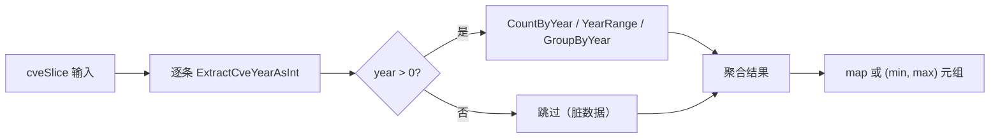
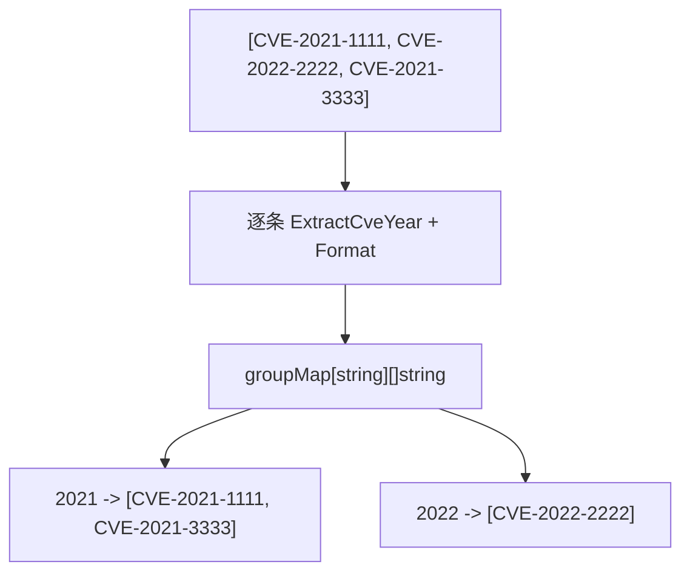
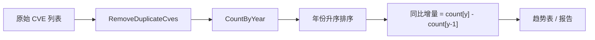
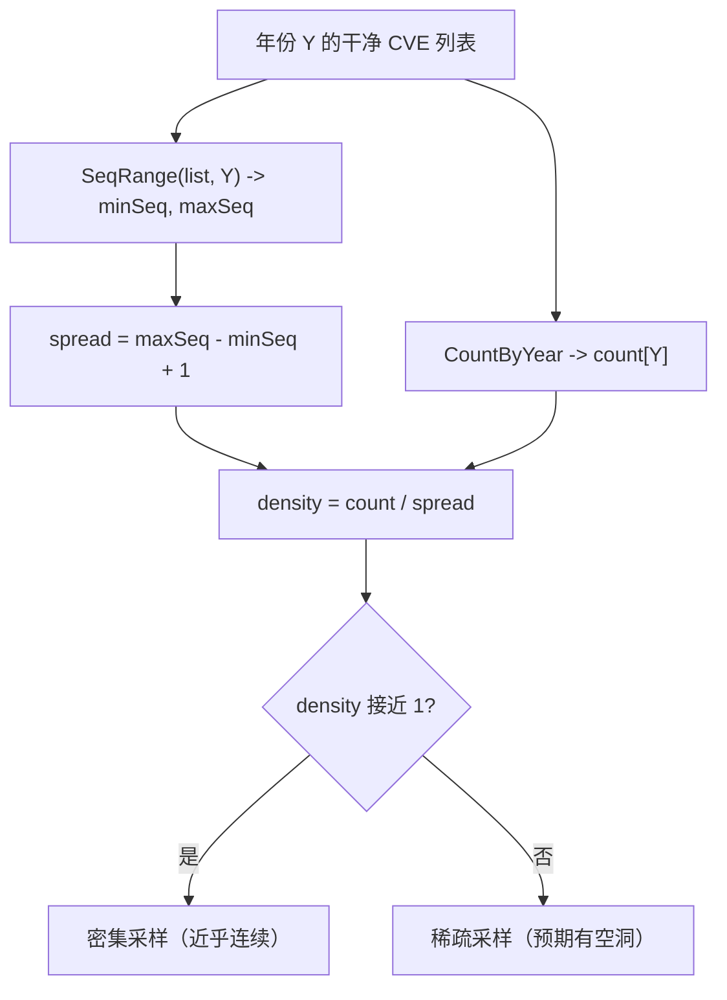
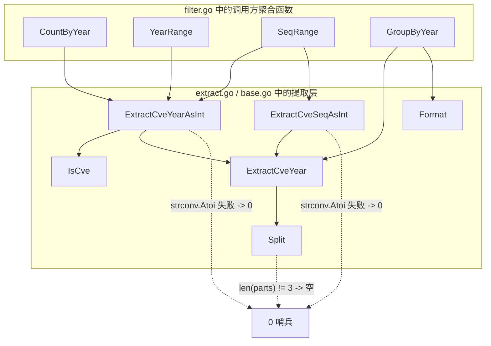

# 统计分析

`cve` 包在 `filter.go` 中提供了一组轻量统计函数 —— `CountByYear`、`YearRange`、`SeqRange` 以及分组助手 `GroupByYear` —— 它们构建在 `extract.go` 的年份/序列号提取器之上。这些函数把一串扁平的 CVE 编号转换成安全报告真正需要的数字：每年落地的 CVE 数量、数据覆盖的时间跨度，以及某一年序列号块的分配密度。这些函数都只对输入做一次线性扫描，辅助状态恒定；它们是在 `ExtractCve` 和 `RemoveDuplicateCves` 产出干净列表之后才使用的分析层。

:::tip 适用读者
你已经会提取、格式化、去重 CVE 编号，现在需要回答"我们的漏洞清单在各年份如何分布？""这份数据是否覆盖了整个报告周期？""2024 年的序列号块有多满？"等问题。本页假设你已读过[年份规则](/zh/guide/year-rules)和[格式化与标准化](/zh/guide/formatting-normalization)。
:::

## 统计工具一览

四个函数都位于 `filter.go`，共享同一设计原则：单次线性扫描、辅助状态恒定、除非调用方要求否则不排序。它们依赖的提取器（`ExtractCveYearAsInt`、`ExtractCveSeqAsInt`）定义在 `extract.go`，对任何格式异常的输入都返回 `0`，这正是统计函数能够容忍脏数据的根源。

| 函数 | 签名 | 返回值 | 依赖提取器 |
| --- | --- | --- | --- |
| `CountByYear` | `(cveSlice []string) map[int]int` | 年份 -> 数量映射 | `ExtractCveYearAsInt` |
| `YearRange` | `(cveSlice []string) (min, max int)` | 最早与最晚年份 | `ExtractCveYearAsInt` |
| `SeqRange` | `(cveSlice []string, year int) (min, max int)` | 某年序列号最小与最大值 | `ExtractCveYearAsInt` + `ExtractCveSeqAsInt` |
| `GroupByYear` | `(cveSlice []string) map[string][]string` | 年份 -> CVE 列表 | `ExtractCveYear` + `Format` |



`year > 0` 这道关卡是关键：像 `CVE-ABCD-1234` 这样的格式异常条目会让 `ExtractCveYearAsInt` 返回 `0`，统计函数会显式跳过它，而不是用伪造的"年份 0"桶污染结果。

## CountByYear —— 年度直方图

`CountByYear(cveSlice []string) map[int]int` 遍历切片，对每个条目调用 `ExtractCveYearAsInt`，并递增以年份为键的 `map[int]int`。年份解析为 `0` 的条目会被丢弃，因此返回的 map 永远不会包含 `0` 这个键。

```go
func CountByYear(cveSlice []string) map[int]int {
    result := make(map[int]int)
    for _, cve := range cveSlice {
        year := ExtractCveYearAsInt(cve)
        if year > 0 {
            result[year]++
        }
    }
    return result
}
```

该函数在构造上就不区分大小写、容忍格式差异，因为 `ExtractCveYearAsInt` 委托给 `Split`，而 `Split` 通过 `Format` 做标准化。给它 `["CVE-2022-1111", "CVE-2022-2222", "CVE-2021-3333", "cve-2022-4444"]` 会得到 `{2021: 1, 2022: 3}` —— 小写的 `cve-2022-4444` 与其大写同胞落入同一个 `2022` 桶。

| 输入 | 输出 | 说明 |
| --- | --- | --- |
| `["CVE-2022-1111", "CVE-2022-2222", "CVE-2021-3333", "cve-2022-4444"]` | `{2021: 1, 2022: 3}` | 大小写折叠进同一桶 |
| `["CVE-2022-1111", "not-a-cve"]` | `{2022: 1}` | 格式异常条目被丢弃 |
| `[]` | `{}` | 空输入，空 map |

一个实用的直方图循环：

```go
package main

import (
    "fmt"
    "sort"

    "github.com/scagogogo/cve-skills/cve"
)

func main() {
    list := []string{
        "CVE-2020-1111", "CVE-2021-2222", "CVE-2021-3333",
        "CVE-2022-4444", "CVE-2022-5555", "CVE-2022-6666",
        "cve-2022-7777",
    }
    counts := cve.CountByYear(list)

    years := make([]int, 0, len(counts))
    for y := range counts {
        years = append(years, y)
    }
    sort.Ints(years)
    for _, y := range years {
        fmt.Printf("%d: %d CVEs\n", y, counts[y])
    }
    // 2020: 1 CVEs
    // 2021: 2 CVEs
    // 2022: 4 CVEs
}
```

注意 `CountByYear` **不去重** —— 如果同一个标识符在切片中出现两次，它会被计数两次。若需要唯一计数，请先调用 `RemoveDuplicateCves`。

## YearRange 与 SeqRange —— 边界三件套

`CountByYear` 给出分布，`YearRange` 和 `SeqRange` 给出范围。它们都是刻意保持小巧的函数，但合起来能回答两类不同的报告问题。

### YearRange —— 时间跨度

`YearRange(cveSlice []string) (min, max int)` 返回列表中最早和最晚的年份。实现把 `min` 初始化为 `-1`（一个与任何合法年份都不同的哨兵值），跳过任何年份 `<= 0` 的条目，并在遍历中收紧 `min`/`max`。若列表为空或不包含合法 CVE，两个返回值都是 `0`。

```go
func YearRange(cveSlice []string) (min, max int) {
    if len(cveSlice) == 0 {
        return 0, 0
    }
    min = -1
    for _, cve := range cveSlice {
        year := ExtractCveYearAsInt(cve)
        if year <= 0 {
            continue
        }
        if min == -1 || year < min {
            min = year
        }
        if year > max {
            max = year
        }
    }
    if min == -1 {
        return 0, 0
    }
    return min, max
}
```

| 输入 | min | max | 说明 |
| --- | --- | --- | --- |
| `["CVE-2020-1111", "CVE-2022-2222", "CVE-2021-3333"]` | `2020` | `2022` | 输入未排序也无妨 |
| `[]` | `0` | `0` | 空列表守卫 |
| `["not-a-cve", "CVE-2021-2222"]` | `2021` | `2021` | 脏条目被跳过，哨兵重置 |

### SeqRange —— 某年序列号范围

`SeqRange(cveSlice []string, year int) (min, max int)` 把扫描范围收窄到单个年份，返回该年份标识符中观察到的最小和最大序列号。它沿用同样的 `-1` 哨兵模式，跳过年份不匹配目标的条目，并额外跳过序列号解析为 `<= 0` 的条目（例如格式异常的 `CVE-2022-ABC`）。

```go
func SeqRange(cveSlice []string, year int) (min, max int) {
    min = -1
    for _, cve := range cveSlice {
        cveYear := ExtractCveYearAsInt(cve)
        if cveYear != year {
            continue
        }
        seq := ExtractCveSeqAsInt(cve)
        if seq <= 0 {
            continue
        }
        if min == -1 || seq < min {
            min = seq
        }
        if seq > max {
            max = seq
        }
    }
    if min == -1 {
        return 0, 0
    }
    return min, max
}
```

| 输入 | year | min | max |
| --- | --- | --- | --- |
| `["CVE-2022-1111", "CVE-2022-5555", "CVE-2022-3333", "CVE-2021-9999"]` | `2022` | `1111` | `5555` |
| `["CVE-2022-1111"]` | `2023` | `0` | `0` | 目标年份无匹配 |

## GroupByYear —— 面向报告的分桶

`GroupByYear(cveSlice []string) map[string][]string` 是 `CountByYear` 的结构性孪生：后者返回计数，本函数返回实际标识符，键为**字符串**年份（如 `"2022"`，而非 `2022`）。每个值是一个 `[]string`，元素均为 `Format` 标准化后的标识符，因此即便输入不规范，桶内也是大写、去空白的。

```go
func GroupByYear(cveSlice []string) map[string][]string {
    groupMap := make(map[string][]string, 0)
    for _, cve := range cveSlice {
        year := ExtractCveYear(cve)
        groupMap[year] = append(groupMap[year], Format(cve))
    }
    return groupMap
}
```

与 `CountByYear` 不同，`GroupByYear` **不跳过**格式异常条目 —— 它调用 `ExtractCveYear`，后者对非 CVE 字符串返回 `""`，因此脏条目会落入 `""` 键下。若输入可能含噪声，请先用 `IsCve` 过滤，或先对源文本运行 `ExtractCve`。



一个典型的报告构建器会按年份升序遍历分组后的 map：

```go
package main

import (
    "fmt"
    "sort"

    "github.com/scagogogo/cve-skills/cve"
)

func main() {
    list := []string{
        "CVE-2021-1111", "CVE-2022-2222", "CVE-2021-3333",
        "cve-2021-4444",
    }
    grouped := cve.GroupByYear(list)

    years := make([]string, 0, len(grouped))
    for y := range grouped {
        years = append(years, y)
    }
    sort.Strings(years)
    for _, y := range years {
        fmt.Printf("%s (%d): %v\n", y, len(grouped[y]), grouped[y])
    }
    // 2021 (3): [CVE-2021-1111 CVE-2021-3333 CVE-2021-4444]
    // 2022 (1): [CVE-2022-2222]
}
```

## 年度趋势分析

组合这些原语即可得到多数漏洞报告开篇所见的年度趋势视图。配方是：去重、按年计数、按年份升序遍历，使趋势从左到右可读。



```go
package main

import (
    "fmt"
    "sort"

    "github.com/scagogogo/cve-skills/cve"
)

func main() {
    raw := []string{
        "CVE-2020-0001", "CVE-2020-0002", "CVE-2020-0003",
        "CVE-2021-0001", "CVE-2021-0002", "CVE-2021-0003", "CVE-2021-0004",
        "CVE-2022-0001", "CVE-2022-0002",
    }
    clean := cve.RemoveDuplicateCves(raw)
    counts := cve.CountByYear(clean)

    years := make([]int, 0, len(counts))
    for y := range counts {
        years = append(years, y)
    }
    sort.Ints(years)

    prev := 0
    for _, y := range years {
        delta := counts[y] - prev
        arrow := "stable"
        switch {
        case delta > 0:
            arrow = "up"
        case delta < 0:
            arrow = "down"
        }
        fmt.Printf("%d: %d CVEs (%s)\n", y, counts[y], arrow)
        prev = counts[y]
    }
    // 2020: 3 CVEs (up)
    // 2021: 4 CVEs (up)
    // 2022: 2 CVEs (down)
}
```

趋势图上有两点值得留意。其一，`CountByYear` 统计的是**分配数**，而非披露数 —— 某年计数高反映的是预留了多少标识符，这与实际被利用的数量只是松散相关。其二，当前年份永远是部分观测；`GetRecentCves` 可把比较范围限定在最近 *n* 年，避免拿半年数据与全年对比。

## 序列号密度估算

`SeqRange` 是粗略密度估算的入口。由于 CVE 序列号在年内单调分配，`(max - min)` 相对于标识符数量的比值能反映某数据集对该年分配块的采样完备程度。



```go
package main

import (
    "fmt"

    "github.com/scagogogo/cve-skills/cve"
)

func main() {
    list := []string{
        "CVE-2022-1111", "CVE-2022-2222", "CVE-2022-3333",
        "CVE-2022-4444", "CVE-2022-5555",
    }
    year := 2022

    minSeq, maxSeq := cve.SeqRange(list, year)
    counts := cve.CountByYear(list)
    n := counts[year]

    if minSeq == 0 {
        fmt.Println("no CVEs for", year)
        return
    }
    spread := maxSeq - minSeq + 1
    density := float64(n) / float64(spread)
    fmt.Printf("year %d: %d CVEs, seq %d-%d, spread %d, density %.2f\n",
        year, n, minSeq, maxSeq, spread, density)
    // year 2022: 5 CVEs, seq 1111-5555, spread 4445, density 0.00
}
```

解读密度数字时要谨慎。低密度（如上例）意味着数据集稀薄地覆盖了一个很宽的序列号范围 —— 这对精选的公告订阅流而言很典型，并非漏报的证据。接近 `1.0` 的密度则表明近乎连续的块，这正是完整 NVD 镜像应有的样子，而非选择性库存应有的样子。该估算还受 `SeqRange` 跳过规则的约束：任何序列号非数字的条目都会同时被排除在 min/max 与计数之外，因此格式异常的标识符无法虚增范围。

## 小结

- `CountByYear`、`YearRange`、`SeqRange`、`GroupByYear` 是 `filter.go` 中的分析层，均构建在 `extract.go` 的年份/序列号提取器之上。
- 四者都做单次线性扫描；`CountByYear`、`YearRange`、`SeqRange` 显式跳过格式异常条目（年份 `<= 0` 或序列号 `<= 0`），而 `GroupByYear` 会把它们归入空字符串键。
- `CountByYear` 返回以整数为键的 `map[int]int`；`GroupByYear` 返回以字符串年份为键、元素为 `Format` 标准化标识符的 `map[string][]string`。
- `YearRange` 给出数据集的时间范围；`SeqRange` 给出某年的序列号范围，可用于粗略密度估算。
- 组合 `RemoveDuplicateCves` -> `CountByYear` -> 有序遍历即可得到年度趋势图，但请记住分配数不等于披露数。

## 图解参考

下面两张图从两个互补视角重述统计流水线。第一张是纯文本数据流视图，展示一条 CVE 字符串如何被分派到四个聚合函数；第二张是依赖关系图，展示每个函数最终触达哪个提取器，以及格式异常输入的短路点位于何处。

```text
                 +-----------------------------+
                 |  cveSlice []string          |
                 +-----------------------------+
                              |
                              v
        +-----------------------------------------+
        |  逐条分派（单次线性扫描）               |
        +-----------------------------------------+
                              |
   +----------+----------+----------+-------------+
   |          |          |          |             |
   v          v          v          v             v
+------+  +--------+  +--------+  +-----------+
|Count |  |Year    |  |Seq     |  |Group      |
|ByYear|  |Range   |  |Range   |  |ByYear     |
+------+  +--------+  +--------+  +-----------+
   |          |          |          |
   v          v          v          v
map[int]  (min,max)  (min,max)  map[string]
[int]     年份        序列号      []string
   |          |          |          |
   |          |  year != 目标?     |  无 IsCve 关卡
   |          |  跳过              |  脏数据 -> "" 键
   |          |          |          |
   +----------+----------+----------+
                |
                v
   +-------------------------+
   |  提取器支撑层           |
   |  ExtractCveYearAsInt    |
   |  ExtractCveSeqAsInt     |
   |  ExtractCveYear + Format|
   +-------------------------+
```



## 深入解析

- **`-1` 哨兵是让 `0` 不歧义的关键枢纽。** `YearRange` 与 `SeqRange` 都把 `min` 初始化为 `-1`（filter.go 第 484、533 行），只有当哨兵值完整存活过整个循环后才回退为 `(0, 0)`。由于真实的 CVE 年份或序列号永远 `&gt; 0`，把 `0` 保留给"无有效观测"的返回值、把 `-1` 保留给"尚未看到任何条目"的内部状态，意味着一整列格式异常条目与空列表在结果上无法区分——这正是报告类调用方所期望的，而不是为一条全是 `not-a-cve` 的列表返回伪造的 `(0, 2022)`。

- **`CountByYear` 与 `GroupByYear` 对脏数据的处理方式相反，且这种分歧是刻意的。** `CountByYear` 以 `year &gt; 0` 设关卡（filter.go 第 445 行），格式异常条目从直方图中消失。`GroupByYear` 直接调用 `ExtractCveYear`，不做 `IsCve` 前置检查（filter.go 第 49 行），把 `Split` 返回的字符串原样入桶——对非 CVE 该值为 `""`。其理由是：`CountByYear` 喂给趋势**数字**，幻影桶会扭曲图表；`GroupByYear` 喂给**报告**，静默丢弃会把数据质量问题对操作者隐瞒。若要 `GroupByYear` 表现得像 `CountByYear`，请先用 `IsCve` 过滤，或先把源文本过一遍 `ExtractCve`。

- **四个函数的容量提示并不一致，这是一处真实（尽管微小）的分配差异。** `GroupByYear` 写成 `make(map[string][]string, 0)`（filter.go 第 47 行）——那个 `0` 是空操作提示，map 以 Go 默认的小尺寸起步，随桶增长反复 rehash。`CountByYear` 干脆写成 `make(map[int]int)`，完全不带提示（filter.go 第 442 行）。两者都没有按 `len(cveSlice)` 预设容量，尽管不同年份的上限显然就是输入长度。对这些函数面向的适中列表而言无伤大雅；若你在聚合一份百万量级的 NVD 镜像，预期会多出几次 rehash，可考虑一个预设容量的本地封装。

- **`ExtractCveYearAsInt` 比看上去更严格，因为它经由 `IsCve` 而非直接走 `Split`。** 朴素读者看到 `ExtractCveYear` -> `Split`，会以为任何 `CVE-YYYY-NNNN` 子串都能解析。实际上 `ExtractCveYearAsInt`（extract.go 第 184 行）先调用 `IsCve`，后者匹配 base.go 第 14 行的锚定正则 `^\s*CVE-\d+-\d+\s*$`。所以 `CVE-2022-12345` 能解析，但 `"see CVE-2022-12345 for details"` 返回 `0`——即便内嵌的 CVE 本身合法，外围文字会破坏锚定匹配。统计函数继承了这一严格性：请把已经提取好的标识符传给它们，而不是原始公告文本，否则计数会静默归零。

- **`SeqRange` 的密度估算受限于单调分配，而非受限于你的样本。** CVE 序列号由各 CNA 在年内单调派发，因此 `max - min + 1` 是分配块规模的*下界*，而非分配块本身——在你的 `max` 之上可能还有未占用的号段。故本页的 `density = count / spread` 是*样本*密度，作为覆盖度估计偏保守：稀疏数据集仍可能位于一个真实分配块远大于此的年份内。只在同一年份、同一观测窗口的数据集之间比较密度，绝不要跨年份、跨不同观测窗口比较。

## 延伸阅读

- [年份规则](/zh/guide/year-rules) —— 年份字段的结构以及 `ExtractCveYearAsInt` 如何解析它。
- [格式化与标准化](/zh/guide/formatting-normalization) —— 为何 `GroupByYear` 在分桶前要先应用 `Format`。
- [集合操作指南](/zh/guide/set-operations-guide) —— `RemoveDuplicateCves`，即任何统计调用之前应执行的去重步骤。
- [校验策略](/zh/guide/validation-strategy) —— `IsCve` 等校验原语，是过滤脏数据、保证统计口径干净的前置步骤。
- [正则内部实现](/zh/guide/regex-internals) —— `ExtractCve`/`Split` 背后的正则与拆分逻辑，决定统计函数对输入的容忍边界。
