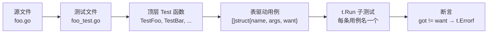

# 测试策略

`cve` 包附带 95 个测试函数，共 3,342 行测试代码，按"每个源文件一个 `*_test.go`"的方式组织，外加位于 `cmd/cmd_test.go` 的 CLI 测试层（以子进程方式驱动编译后的二进制）。本页记录这些测试的结构、运行方式，以及如何在不破坏约定使测试套件保持确定性的前提下添加新测试。

:::tip 📂 查看源码
测试文件与所覆盖的源文件并列——在 GitHub 上查看任意一个：
[`base_test.go`](https://github.com/scagogogo/cve-skills/blob/main/base_test.go) ·
[`compare_test.go`](https://github.com/scagogogo/cve-skills/blob/main/compare_test.go) ·
[`extract_test.go`](https://github.com/scagogogo/cve-skills/blob/main/extract_test.go) ·
[`filter_test.go`](https://github.com/scagogogo/cve-skills/blob/main/filter_test.go) ·
[`generate_test.go`](https://github.com/scagogogo/cve-skills/blob/main/generate_test.go) ·
[`cmd/cmd_test.go`](https://github.com/scagogogo/cve-skills/blob/main/cmd/cmd_test.go)
:::

## 测试清单

| 测试文件 | 源文件 | 测试数 | 行数 | 覆盖重点 |
|---|---|---|---|---|
| `base_test.go` | `base.go` | 11 | 656 | Format、IsCve、IsContainsCve、Split、年份校验、验证 |
| `compare_test.go` | `compare.go` | 4 | 246 | CompareByYear、SubByYear、CompareCves、SortCves |
| `extract_test.go` | `extract.go` | 8 | 380 | Extract/First/Last/Year/Seq、FilterCvesByPattern |
| `filter_test.go` | `filter.go` | 11 | 826 | GroupByYear、过滤、集合运算、去重、统计、范围 |
| `generate_test.go` | `generate.go` | 4 | 252 | GenerateCve、GenerateFakeCve、ParseCveRange、IsCvesConsecutive |
| `cmd/cmd_test.go` | `cmd/`（14 个文件） | 57 | 890 | CLI：version/help/unknown、每个子命令的正常路径 + 空输入 + 缺 flag + 父命令 Help 分支 |
| **合计** | **5 个源文件 + `cmd/`** | **95** | **3,342** | 库层（进程内）+ CLI 层（子进程） |

## 测试组织



- **每个源文件一个测试文件。** `base.go` 由 `base_test.go` 覆盖，`compare.go` 由 `compare_test.go` 覆盖，以此类推。没有跨文件的测试包；测试文件使用 `package cve`（白盒），因此必要时可引用未导出的辅助函数。
- **每个导出函数一个顶层 `Test*` 函数。** 每个导出函数都有自己的 `TestXxx`——`Format` → `TestFormat`，`IsCve` → `TestIsCve`，等等。这让测试失败自动定位：失败的函数名就在测试名里。
- **每个 `Test*` 内部表驱动。** 每个 `Test*` 声明一个 `tests := []struct{name, args, want}` 切片，用 `t.Run(tt.name, ...)` 遍历。单个测试函数通常以此方式覆盖 1–8 条用例。

## 表驱动模式

套件中的每个测试都遵循同一形状。下面是取自 `base_test.go` 中 `TestFormat` 的典型结构：

```go
func TestFormat(t *testing.T) {
    type args struct {
        cve string
    }
    tests := []struct {
        name string
        args args
        want string
    }{
        {
            name: "format CVE with mixed case and spaces",
            args: args{
                cve: " cVe-2002-100098  ",
            },
            want: "CVE-2002-100098",
        },
        // ...更多用例
    }
    for _, tt := range tests {
        t.Run(tt.name, func(t *testing.T) {
            if got := Format(tt.args.cve); got != tt.want {
                t.Errorf("Format() = %v, want %v", got, tt.want)
            }
        })
    }
}
```

全部 38 个测试共同遵守的约定：

- **`name` 是可读的句子**，不是 `case1`。子测试名如 `"format CVE with mixed case and spaces"` 描述了场景，因此失败时显示为 `--- FAIL: TestFormat/format_CVE_with_mixed_case_and_spaces`。
- **`args` 是具名结构体**，即便只有一个字段也是如此。这让调用点（`Format(tt.args.cve)`）保持可读，且未来增加参数时无需重写每条用例。
- **`want` 是期望返回值**，用单次 `got != want` 检查断言（切片/映射则用 `!reflect.DeepEqual`）。测试从不断言副作用，因为库没有副作用。
- **每个子测试只断言一次。** 若某用例需要多处检查，仍只报告一行 `t.Errorf`，包含 `got` 和 `want`，使失败可 grep。

## 切片/映射比较

对于返回切片（`[]string`）或映射（`map[string][]string`）的函数，测试用 `reflect.DeepEqual` 而非 `!=`：

```go
if !reflect.DeepEqual(got, tt.want) {
    t.Errorf("GroupByYear() = %v, want %v", got, tt.want)
}
```

`reflect.DeepEqual` 在套件中使用了 14 次——其中 9 次在 `filter_test.go`，因为该文件中返回切片/映射的函数最多（集合运算、分组、范围）。

## 时间相关测试

部分函数依赖"当前年份"（`IsCveYearOk`、`GetRecentCves`、`GenerateFakeCve`）。测试在测试时读取 `time.Now().Year()` 而非硬编码年份：

```go
// 取自 base_test.go —— IsCveYearOk 用例
{ name: "valid current year",  args: args{cve: fmt.Sprintf("CVE-%d-10086", time.Now().Year())},     want: true },
{ name: "valid past year",     args: args{cve: "CVE-1999-10086"},                                   want: true },
{ name: "future year",         args: args{cve: fmt.Sprintf("CVE-%d-10086", time.Now().Year()+1)}, want: false },
{ name: "year before 1999",    args: args{cve: "CVE-1998-10086"},                                  want: false },
```

- **为何用 `time.Now()` 而非固定年份：** 硬编码的 `"CVE-2022-..."` 用例会随日历推进从 `valid` 翻成 `future-year`，导致测试静默失效。读取 `time.Now().Year()` 让测试永远正确。
- **代价：** 这些测试无法按精确年份复现——2026 年 12 月的一次失败可能在 2027 年 1 月无法复现。这一点被接受，因为所测的*性质*（"当前年份有效，下一年无效"）本身就是时间相关的。
- **`IsCveYearOkWithCutoff`** 测试相对当前计算截止值：`cutoff: time.Now().Year() - 2019`，使"容忍 N 个未来年份"的用例随年份流逝保持有效。

## 边界用例覆盖

套件刻意探查每个函数[边界情形](/zh/api/functions/format)表中记录的边界：

| 边界类别 | 示例用例 | 所在测试 |
|---|---|---|
| 空/空白输入 | `" "`、`""` | `TestFormat`、`TestIsCve` |
| 大小写混合 | `"cVe-2007-199"` | `TestIsCve`、`TestFormat` |
| 前后空格 | `" cve-2007-199"`、`"cve-2007-199 "` | `TestIsCve` |
| 年份边界 | `1998`（早于 1999）、`1999`（首个有效）、当前年、当前+1 | `TestIsCveYearOk` |
| 序列号位数 | 1 位、4 位、5 位、6 位 | `TestExtractCve`、`TestFormatSeq` |
| 负数/不真实年份 | `0`、`9999` | `TestGenerateCve` |
| 输入含重复 | `["CVE-2022-1","CVE-2022-1"]` | `TestRemoveDuplicateCves` |
| 空切片 | `[]string{}` | `TestSortCves`、`TestGroupByYear` |
| 不相交集合的集合运算 | 不重叠列表的交/并/差 | `TestIntersectCves` 等 |

## 运行测试

```bash
# 运行整个套件
go test ./...

# 详细输出——显示每个子测试名及其通过/失败
go test -v ./...

# 运行单个测试函数
go test -run TestFormat ./...

# 按名运行单个子测试（对用例名做正则）
go test -run 'TestIsCve/year_before_1999' ./...

# 运行单个源文件的测试
go test -run 'TestExtract' ./...

# 覆盖率画像——每个源文件哪些行被覆盖
go test -coverprofile=coverage.out ./...
go tool cover -html=coverage.out     # 浏览器视图
go tool cover -func=coverage.out      # 按函数汇总
```

:::tip 🖥️ 确定性
套件完全确定——没有 `time.Sleep`、没有网络调用、没有文件系统依赖、没有运行间变化的 `math/rand` 播种。`GenerateFakeCve` 内部使用随机性，但其测试断言的是输出的*形状*（合法 CVE、当前年份前缀）而非精确值。任意次数运行套件，结果都相同。
:::

## 覆盖率哲学

套件以**边界用例的行为覆盖**为目标，并达到**库代码 100.0% 语句覆盖率**（`go test -coverprofile=... .` → `total: (statements) 100.0%`），`cmd/` CLI 层亦通过其子进程方案达到 100%（见 [CLI 层：子进程覆盖率](#cli-tier-子进程覆盖率)）。`go test -race ./...` 约 1s 通过：

- 每个导出函数（外加两个未导出辅助 `validateSingleCve` 与 `extractYear`）至少有一个 `Test*`，每个 `Test*` 至少有一条正常路径用例加一条或多条边界用例。
- 有时间相关逻辑的函数配有用例覆盖当前年、过去年、未来年。
- 返回切片的函数配有用例覆盖空输入、单元素输入、重复输入。
- 凡 `!=` 无法比较复合返回值处，均用 `reflect.DeepEqual`。
- "正则通过但 `strconv.Atoi` 溢出"的防御分支用 26 位序列号触发（如 `CVE-2022-99999999999999999999999999`）——`\d+` 匹配任意长度，但 `Atoi` 溢出 `int`，覆盖 `FormatSeq`、`validateSingleCve`、`ParseCveRange` 中原本不可达的错误路径。
- 两处结构性不可达分支已被移除而非留作死代码：`FilterCvesByPattern` 改用 `regexp.MustCompile`（转义逻辑保证产出可编译正则），`ParseCveRange` 的 `switch` 无 `default`（`rangeRegex` 不变式保证三分组恰一非空，下方 `startSeq > endSeq` 检查兜底）。
- 套件中**没有 benchmark**。性能在每页的[复杂度](/zh/api/functions/format)小节中基于源码分析记录，而非在此测量。若需基准，按同样的"每源文件"约定添加 `func BenchmarkXxx(b *testing.B)`。

## CLI 层：子进程覆盖率

`cmd/` 包是一层很薄的 cobra CLI，其 `Run` 闭包在出错时调用 `os.Exit(1)`——这是一个进程内 `go test -coverprofile` 无法捕获的调用。因此 `cmd/cmd_test.go` 通过**子进程覆盖率**方案驱动 CLI，达到 `cmd/` 包的 100%：

- **`buildCoveredBinary`** 用覆盖率插桩编译 main 包（`go build -cover -o <bin> ./cmd/cve`），输出到持久的 `os.MkdirTemp` 目录（非 `t.TempDir`——后者会被首个测试的清理删除，导致后续测试找不到二进制）。
- **`runCve(t, args...)`** 通过 `os/exec` 启动该二进制，设置 `GOCOVERDIR=<tmpdir>`，每次调用的覆盖率数据落入一个独立的临时目录（在互斥锁保护下登记到 `collectedCoverDirs` 切片）。它返回 `(stdout, stderr, exitCode)`，便于测试对三者分别断言。
- **`TestMain`** 运行全部测试后，用 `go tool covdata merge`（`-i` 逗号分隔多目录）+ `go tool covdata textfmt` 将各次调用的覆盖率合并到 `$GOCOVER_SUBPROCESS_OUT` 指定路径——一个标准 `mode: set` profile。
- **`readInputs`**（`cmd/helpers.go` 中的纯函数辅助）不含 `os.Exit`，故以进程内方式由 4 个直接测试覆盖——其中 `TestReadInputsCharDevice` 以 `/dev/null` 作为 stdin，命中进程内 stdin 永远无法成为的字符设备分支。
- **合并两套 profile。** `cmd/` 最终覆盖率是进程内 profile（覆盖 `readInputs` 100%）与子进程 profile（覆盖 `Execute`、所有 `init`、所有 `Run`/`RunE` 闭包 100%）的 OR。一个小的合并脚本按 `file:line:col` 块对计数取 OR。
- **`os.Exit` 的计数器会被 flush。** `format` 命令的空输入 `os.Exit(1)` 块在子进程 profile 中计数为 1——覆盖率计数器在进程退出前写入 `GOCOVERDIR`。因此任何仍为 0 计数的块都是真正缺失的测试，而非 flush 缺陷。

在本地复现 `cmd/` 的完整覆盖率：

```bash
# 进程内 profile（覆盖 readInputs）
go test -count=1 -coverprofile=proc.out ./cmd/

# 子进程 profile（覆盖 Execute + Run/RunE 闭包）
GOCOVER_SUBPROCESS_OUT=cli_sub.out go test -count=1 ./cmd/

# 按 per-block 计数取 OR 合并 → merged.out，再：
go tool cover -func=merged.out | grep '/cmd/'
```

`examples/` 目录（33 个可运行的 `main` 包）被刻意排除在覆盖率目标之外——它们是示例程序，非被测代码。

## 统一单一覆盖率视图

库（`go test .`）与 CLI 双 profile 合并各自报告 100%，但单一 `go test -coverpkg ./...` 无法捕获子进程覆盖（CLI 的 `Run` 闭包在派生进程中执行）。`make coverage` 用 Go 1.20+ 的 `-test.gocoverdir` 让进程内测试也产出 covdir 格式，与子进程 `GOCOVERDIR` 格式统一，再用纯 Go 的 `go tool covdata merge -pcombine` 合并两类 covdir 成单一目录，经 `textfmt` 转标准 `mode: set` profile——`go tool cover -func coverage.out` 对此单一 profile 报告 100.0%（库 + cmd）。

```bash
make coverage   # 产出 coverage.out，单一视图 100.0%
make test       # 常规单测，快速反馈
```

## 数据流

```text
+-------------------+     +-------------------------+     +---------------------------+
| 源文件: foo.go    | --> | 测试: foo_test.go       | --> | TestFoo（表驱动）         |
| func Foo(...)     |     | package cve（白盒）     |     |   tests := []struct{...}  |
+-------------------+     +-------------------------+     +-------------+-------------+
                                                                        |
                                                          for _, tt := range tests
                                                                        |
                                                                        v
                                              +-------------------------------------------+
                                              | t.Run(tt.name, func(t *testing.T){       |
                                              |   got := Foo(tt.args...)                 |
                                              |   if got != tt.want { t.Errorf(...) }    |
                                              | })                                       |
                                              +-------------------+-----------------------+
                                                                  |
                                                                  v
                                              +-------------------------------------------+
                                              | go test -v 输出：                         |
                                              |   --- PASS: TestFoo/case_name (0.00s)     |
                                              |   --- FAIL: TestFoo/other_case (0.00s)    |
                                              +-------------------------------------------+
```

## 添加新测试

新增或修改导出函数时，请遵循现有约定，保持套件统一：

1. **把测试放进对应的 `*_test.go` 文件。** `filter.go` 中的函数在 `filter_test.go` 中测试。若源文件是新增的，创建配套的 `*_test.go`，声明 `package cve`。
2. **命名为 `Test<函数名>`。** 每个导出函数一个顶层测试。
3. **使用表驱动形状。** 声明 `type args struct{...}`、含 `name`/`args`/`want` 的 `tests` 切片，用 `t.Run(tt.name, ...)` 遍历。
4. **把 `name` 写成描述场景的句子**，不要用 `case1`/`case2`。
5. **至少覆盖：一条正常路径、一条空/零值输入、一条边界。** 若函数时间相关，用 `time.Now().Year()` 添加当前年和未来年用例。
6. **返回切片或映射时用 `reflect.DeepEqual`**；标量用 `!=`。
7. **用 `t.Errorf("Foo() = %v, want %v", got, tt.want)` 断言**——保持 `got`/`want` 格式，使失败可 grep。
8. **运行 `go test -v ./...`**，确认新子测试通过且输出中的命名可读。

## 深入解析

- **白盒，同包。** 全部五个测试文件声明 `package cve`，而非 `package cve_test`。这意味着测试能看到未导出符号（万一重构引入了的话）。当前没有任何测试依赖未导出符号——这个选择是便利性的对冲，非当前所需。若包日后想冻结内部实现，切换到 `package cve_test`（黑盒）是每文件一行的改动，不会导致测试中断。
- **无测试辅助函数，无 fixture。** 套件零 `TestMain`、零共享 setup 函数、零 `t.Helper()` 包装。每个 `Test*` 自包含：就地构建自己的 `tests` 切片。这之所以可行，是因为库无状态——没有共享状态需要初始化或清理。
- **`reflect.DeepEqual` 优先于自定义相等。** 对切片返回值，测试从不先排序再比较，也不写自定义 diff；它信任对原始返回值的 `reflect.DeepEqual`。这之所以有效，是因为每个被测函数的输出已处于规范顺序（已排序，或按年份升序分组）——测试会把重排 bug 当作不匹配捕获。
- **时间相关测试用"随时间正确"换取"可复现性"。** 硬编码 `"CVE-2022-10086"` 会失效；`time.Now().Year()` 不会。这是刻意权衡：所测性质（"当前年有效，下一年无效"）本身是日历的函数，所以测试*理应*随之移动。
- **刻意不加 benchmark。** 每页的性能声明来自源码级复杂度分析，而非测量值。这让套件快（亚秒级）且自包含。需要测量数据的贡献者应在配套的 `*_test.go` 中加 `BenchmarkXxx`，而非另起 bench 文件。
- **子测试命名用空格而非下划线。** Go 的 `testing` 包在可运行测试名中把空格替换为下划线（`TestIsCve/year_before_1999`），但源 `name` 字段保留空格以提升表中可读性。这是 Go 惯用写法，与 `go test -v` 输出一致。

## 相关

- [库设计哲学](/zh/guide/library-design) — 库为何无状态，这正是测试套件如此简单的原因
- [错误处理与边界](/zh/guide/error-handling) — 测试所探查的边界用例
- [API 参考](/zh/api/) — 每个函数页列出各自的边界情形
- [CLI 约定](/zh/reference/cli-conventions) — CLI 层很薄；库测试覆盖了真正的逻辑
