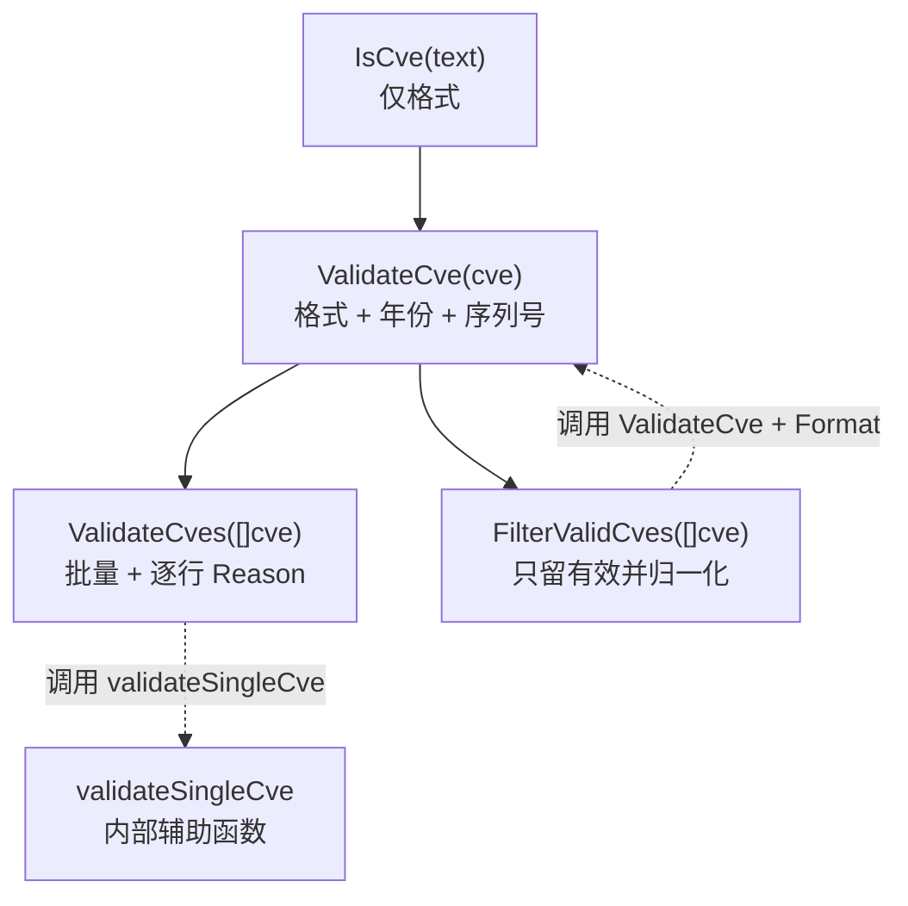
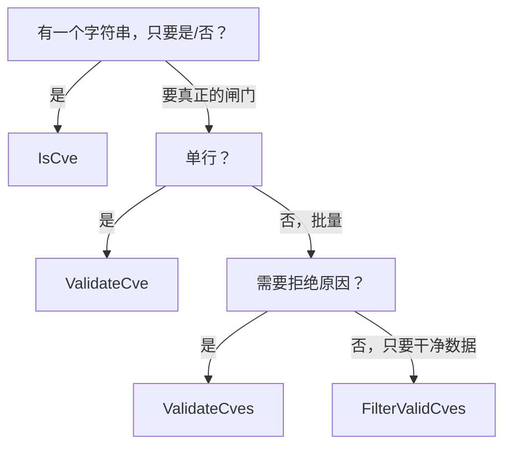
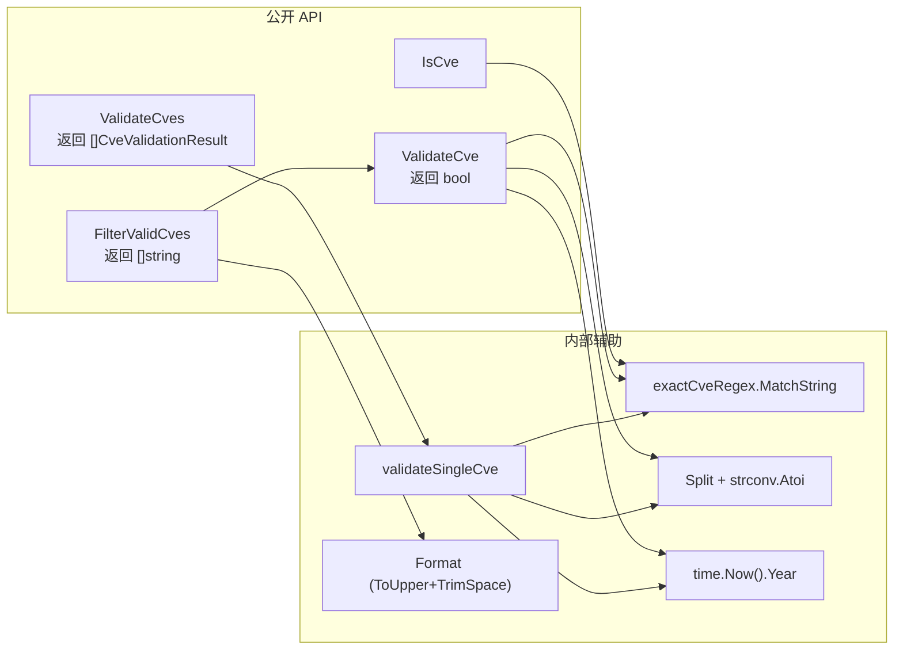

# 验证策略

`cve` 包提供四个入口判断一个字符串是否是可用的 CVE 标识符：`IsCve`、`ValidateCve`、`ValidateCves` 与 `FilterValidCves`。它们并非冗余的分层——每个都对应速度、严格度与返回信息丰富度之间的不同取舍。本页梳理它们的层次关系、`CveValidationResult.Reason` 链，以及按场景选用哪一个的决策指南。

:::tip 适用读者
需要从数据源导入 CVE、解析安全公告，或构建数据质量管道、确保单个畸形标识符不会让整批数据崩溃的开发者。如果只是想对用户输入做一次“是/否”判断，从 [IsCve](/zh/api/functions/is-cve) 开始；如果你需要向用户解释某一行为什么被拒绝，直接看 [ValidateCves](/zh/api/functions/validate-cves)。
:::

## 为什么是四个函数而不是一个

一个“验证一切”的函数会强迫每个调用方为自己不需要的工作买单。仅做格式校验的快路径对 UI 输入就足够；完整年份+序列号检查属于导入边界；批量导入者还想要逐行原因以生成拒绝报告。把这些关注点拆开，能让每个调用点既快又具表达力。

四个函数构成严格阶梯——每一层在前一层之上恰好增加一种能力：



| 函数 | 输入 | 返回 | 校验格式 | 校验年份 | 校验序列号 | 给出原因 | 归一化输出 |
| --- | --- | --- | :-: | :-: | :-: | :-: | :-: |
| `IsCve` | `string` | `bool` | ✅ | ❌ | ❌ | ❌ | ❌ |
| `ValidateCve` | `string` | `bool` | ✅ | ✅ | ✅ | ❌ | ❌ |
| `ValidateCves` | `[]string` | `[]CveValidationResult` | ✅ | ✅ | ✅ | ✅ | ❌ |
| `FilterValidCves` | `[]string` | `[]string` | ✅ | ✅ | ✅ | ❌ | ✅ |

注意最后两列的不对称：`ValidateCves` 是唯一能解释失败原因的层，而 `FilterValidCves` 是唯一把幸存者清洗为大写、可直接存储的层。

## IsCve — 仅格式的快路径

`IsCve(text string) bool` 用 `(?i)^\s*CVE-\d+-\d+\s*$` 匹配字符串。它容忍两侧空白与大小写混用，但拒绝任何不是“整个字符串”的内容。`CVE-2022-12345` 通过；`see CVE-2022-12345 for details` 失败，因为匹配外还有多余字符。

这是包里最便宜的检查——一次正则，没有解析、没有 `time.Now()` 查询、没有整数转换。当你只需判断“这个字符串长得像不像 CVE”时用它，例如决定编辑器里某个 token 是否高亮，或在用户尚未输完时给 UI 校验器短路返回。

```go
package main

import (
    "fmt"

    "github.com/scagogogo/cve"
)

func main() {
    samples := []string{
        "CVE-2022-12345",
        " cve-2022-12345 ",
        "CVE-2022-ABC",
        "see CVE-2022-12345 in the report",
        "CVE-2022-0",
    }
    for _, s := range samples {
        fmt.Printf("%-40t -> %v\n", s, cve.IsCve(s))
    }
}
```

⚠️ `IsCve` **不会**拒绝 `CVE-1998-1` 或 `CVE-9999-0`，两者都匹配格式。如果越界年份或零序列号会污染下游数据，你需要下一层。

## ValidateCve — 格式、年份与序列号

`ValidateCve(cve string) bool` 在 `IsCve` 之上叠加两条规则：

1. **年份范围** —— 年份须满足 `1999 <= year <= time.Now().Year()`。下界 1999 对应 CVE 标识符首次分配的年份；上界使用当前系统时钟，所以 `CVE-2030-1` 在日历越过 2030 后才会开始失败。
2. **正序列号** —— 序列号须能解析为整数且严格大于零，因此 `CVE-2022-0` 被拒绝。

```go
package main

import (
    "fmt"

    "github.com/scagogogo/cve"
)

func main() {
    candidates := []string{
        "CVE-2022-12345", // 有效
        "CVE-1998-12345", // 年份早于 1999
        "CVE-2030-12345", // 年份晚于当前（以 2026 年为例）
        "CVE-2022-ABC",  // 序列号非数字
        "CVE-2022-0",    // 序列号非正
    }
    for _, c := range candidates {
        fmt.Printf("%-20s valid=%v\n", c, cve.ValidateCve(c))
    }
}
```

在任何“只需一个布尔闸门、无需解释拒绝原因”的单行边界处使用 `ValidateCve`，例如在调用 `Get(year, seq)` 查找前做守卫，或在传给 `Compare*` 函数前过滤输入。配套的 `IsCveYearOk` / `IsCveYearOkWithCutoff` 辅助函数只暴露年份范围检查，当你想放宽上界（例如接受截至 `当前年 + cutoff` 的预留未来 CVE）时使用。

## ValidateCves — 带原因链的批量校验

`ValidateCves(cveSlice []string) []CveValidationResult` 遍历切片，把每个元素交给内部 `validateSingleCve` 辅助函数，后者返回 `CveValidationResult`，其中携带原始输入并在无效时附带人类可读的 `Reason`：

```go
type CveValidationResult struct {
    Cve    string // 传入时的原始标识符
    Valid  bool   // 所有规则通过时为 true
    Reason string // Valid 时为空；否则为第一条失败规则
}
```

🧩 `Reason` 链是一条短路阶梯——`validateSingleCve` 按顺序检查规则并在首次失败时停止，因此每个结果恰好报告一个原因。可能的取值按求值顺序如下：

| # | 检查的规则 | 失败时的 Reason 字符串 |
| :-: | --- | --- |
| 1 | `IsCve` 格式 | `invalid CVE format` |
| 2 | 年份可解析为整数 | `year is not a valid number` |
| 3 | 序列号可解析为整数 | `sequence number is not a valid number` |
| 4 | `year >= 1999` | `year %d is before 1999` |
| 5 | `year <= currentYear` | `year %d is after current year %d` |
| 6 | `sequence > 0` | `sequence number must be positive` |

从上往下读这张表，正是 `validateSingleCve` 走过一个输入的方式：格式正则失败的字符串永远到不了年份检查，年份早于 1999 的输入永远到不了序列号检查。结果原样保留 `Cve` 字符串，因此你可以原样回显给用户，不丢大小写与两侧空白。

```go
package main

import (
    "fmt"

    "github.com/scagogogo/cve"
)

func main() {
    raw := []string{
        "CVE-2022-12345",
        "not-a-cve",
        "CVE-1998-5",
        "CVE-2030-5",
        "CVE-2022-0",
    }
    for _, r := range cve.ValidateCves(raw) {
        if r.Valid {
            fmt.Printf("OK   %s\n", r.Cve)
        } else {
            fmt.Printf("FAIL %s  ->  %s\n", r.Cve, r.Reason)
        }
    }
}
```

📌 任何需要导入整批并产出数据质量报告的场景——CSV 导入器、数据源对账、审计日志——都应选用 `ValidateCves`。因为它绝不改动输入，报告可以精确指向出错的那一行。

## FilterValidCves — 只留有效项

`FilterValidCves(cveSlice []string) []string` 是便捷层：对每个元素运行 `ValidateCve`，只返回幸存者，且每个都经过 `Format`，因此结果统一为大写并去除两侧空白。无效项被静默丢弃——没有原因、没有索引。

```go
package main

import (
    "fmt"

    "github.com/scagogogo/cve"
)

func main() {
    raw := []string{"cve-2022-12345", "invalid", "CVE-1998-1", "CVE-2023-99999"}
    fmt.Printf("%#v\n", cve.FilterValidCves(raw))
    // 输出: []string{"CVE-2022-12345", "CVE-2023-99999"}
}
```

这是“先清洗再继续”管道的正确工具：用 `ExtractCve` 从公告中抽取标识符，交给 `FilterValidCves`，再把归一化后的切片直接送入 `SortCves`、`GroupByYear` 或 `IntersectCves` 等集合运算。静默丢弃是设计使然——如果你需要知道丢掉了什么及原因，对同一输入跑一次 `ValidateCves` 再做 diff 即可。

## 如何选择正确的层



把这张图映射到常见任务：

| 场景 | 选择 | 原因 |
| --- | --- | --- |
| 给编辑器中输入的 token 做语法高亮 | `IsCve` | 最便宜；容忍用户输入过程中的不完整内容 |
| 取记录前对单次查找做守卫 | `ValidateCve` | 一个布尔值，不为原因分配内存 |
| 必须记录每一行坏数据的 CSV/JSON 导入 | `ValidateCves` | 逐行 `Reason` 可直接进入错误报告 |
| 抽取后即存储干净 CVE 的管道 | `FilterValidCves` | 返回归一化、可直接存储的切片 |
| 接受预留的未来年份 CVE | `IsCveYearOkWithCutoff` | 用年份偏移放宽上界 |

⚡ 性能提示：`IsCve` 是单次正则，热路径上零分配；`ValidateCve` 及以上每元素多一次 `time.Now().Year()` 调用与整数解析。对几千条以上的批量，优先用批量函数而不是自己循环 `ValidateCve`——循环体相同，但一次 `ValidateCves` 调用把结果集中到一起，便于一次拒绝报告扫描。

## 小结

- 四个函数是一条阶梯：`IsCve`（格式）→ `ValidateCve`（+年份、+序列号，`bool`）→ `ValidateCves`（批量 + `Reason`）→ `FilterValidCves`（只产出干净数据）。
- `validateSingleCve` 按固定顺序短路，因此每个 `CveValidationResult.Reason` 都精确指向第一条失败的规则。
- 只有 `ValidateCves` 解释失败；只有 `FilterValidCves` 归一化幸存者——按调用方需要“为什么”还是“剩下什么”来选。
- 年份上下界为 `1999..当前年`（经 `time.Now()`），因此未来日期的 CVE 今天失败、以后通过；用 `IsCveYearOkWithCutoff` 放宽。

## 图解参考

第一张图是 ASCII 流程图，描绘单个输入字符串在 `validateSingleCve` 中被逐条规则求值的过程。自上而下读：每个方框是一条规则，侧分支是失败路径（括号内是写回 `CveValidationResult` 的确切 `Reason` 字符串），最底部是唯一把 `Valid` 置为 `true` 的路径。

```text
                 输入字符串 "cve"
                       |
                       v
              +------------------+      否
              | IsCve 格式?      |------------> Reason: "invalid CVE format"
              | (?i)^\s*CVE-     |              （提前返回，Valid=false）
              |   \d+-\d+\s*$    |
              +------------------+
                       | 是
                       v
              +------------------+      出错     Reason: "year is not a valid number"
              | strconv.Atoi    |-------------->  （Split 出的年份非数字）
              |   (year)        |
              +------------------+
                       | 成功
                       v
              +------------------+      出错     Reason: "sequence number is not a valid
              | strconv.Atoi    |-------------->   number"
              |   (seq)         |
              +------------------+
                       | 成功
                       v
              +------------------+      否        Reason: "year %d is before 1999"
              | year >= 1999 ?  |-------------->   （fmt.Sprintf，yearInt 代入）
              +------------------+
                       | 是
                       v
              +------------------+      否        Reason: "year %d is after current
              | year <=          |-------------->   year %d"（time.Now().Year()）
              |  time.Now().Year |
              +------------------+
                       | 是
                       v
              +------------------+      否        Reason: "sequence number must be positive"
              | seq > 0 ?        |-------------->
              +------------------+
                       | 是
                       v
        CveValidationResult{Cve: <原始>, Valid: true, Reason: ""}
```

第二张图切换视角，从“如何判定单个输入”转为“四个公开函数在调用时如何互相委托”。它让阶梯表里被掩盖的两个事实显形：`ValidateCve` 与 `validateSingleCve` 共用同一套规则体，但在“返回布尔还是返回结果”的接缝处分叉；`FilterValidCves` 是唯一把幸存者经 `Format` 处理后再输出的层。



## 深入解析

- **两条正则、包级变量、只编译一次。** `exactCveRegex` 与 `containsCveRegex` 在 `base.go`（第 12-17 行）以包级 `var` 块声明，在包初始化时用 `regexp.MustCompile` 编译完毕。每次 `IsCve` / `IsContainsCve` 调用都复用同一个已编译的 matcher——不存在每次调用都 `regexp.Compile` 的分配，这正是文档敢称 `IsCve` “热路径上零分配”的根因。`(?i)` 内联标志让匹配大小写不敏感，无需第二条模式。

- **`validateSingleCve` 与 `ValidateCve` 规则相同、返回类型不同。** 二者都走完同样的六步检查，但并不通过某个公共谓词串联。`validateSingleCve`（base.go:328-374）返回 `CveValidationResult`，在每一步以具体的 `Reason` 短路返回；`ValidateCve`（base.go:445-460）用 `yearErr != nil || seqErr != nil` 合并年份/序列号解析错误，再把 `yearInt >= 1999 && yearInt <= time.Now().Year() && seqInt > 0` 作为单个布尔表达式求值——它绝不产出原因，只给最终 `bool`。因此规则顺序一致，但 `ValidateCve` 无法告诉你“哪一条”失败了，这条信息只存在于 `validateSingleCve` 内部。

- **`time.Now()` 逐元素读取，而非按批缓存。** 在 `validateSingleCve` 中，`currentYear := time.Now().Year()`（base.go:359）对每个熬过格式与解析检查的元素都会执行一次。`ValidateCves` 并未把年份查询提到循环外——每个幸存元素都付一次 `time.Now()` 系统调用。对 N 条合法输入而言是 N 次而非 1 次。实践中 `time.Now()` 很便宜，但若你在紧凑管道里校验数十万行且已知截止年份，用 `IsCveYearOkWithCutoff` 配一个预算好的边界（或先用 `IsCve` 预过滤）即可避开重复的时钟读取。

- **`ValidateCves` 预分配；`FilterValidCves` 不预分配。** `ValidateCves` 用 `make([]CveValidationResult, len(cveSlice))`（base.go:320）一次性定容结果切片，无论输入多大都恰好一次分配，且下标与输入一一对应。`FilterValidCves`（base.go:400-408）声明 `var result []string`——nil 切片——随幸存者出现而 `append` 扩容。当绝大多数输入合法时会触发几次重分配；当绝大多数非法时切片始终很小，开销可忽略。这种不对称是刻意为之：`ValidateCves` 必须保留下标对应关系以供拒绝报告定位，`FilterValidCves` 只产幸存者，反而从紧凑的最终分配中受益。

- **年份下界 1999 是 CVE 计划的事实，不是 Go 约定。** 常量 `1999` 在 `IsCveYearOkWithCutoff`（base.go:233）、`validateSingleCve`（base.go:353）以及 `Reason` 字符串 `"year %d is before 1999"` 中均以字面量出现。它对应现实里 CVE 计划自 1999 年起才开始分配标识符的历史，因此任何 `CVE-1998-*` 及更早按定义都不是真实 CVE。上界刻意做成动态的 `time.Now().Year()`，这意味着同一输入会随日历推进由非法转为合法：`CVE-2030-1` 今天失败、2030 年通过。摄入预留未来 CVE 时，用 `IsCveYearOkWithCutoff(cve, k)` 把上界放宽到 `当前年 + k`。

## 延伸阅读

- [IsCve](/zh/api/functions/is-cve) — 仅格式判定参考
- [ValidateCve](/zh/api/functions/validate-cve) — 单行完整校验参考
- [ValidateCves](/zh/api/functions/validate-cves) — 批量校验与 `CveValidationResult` 参考
- [FilterValidCves](/zh/api/functions/filter-valid-cves) — 幸存者归一化过滤参考
- [IsCveYearOkWithCutoff](/zh/api/functions/is-cve-year-ok-with-cutoff) — 放宽年份范围的辅助函数
- [Format](/zh/api/functions/format) — `FilterValidCves` 所用的归一化函数
