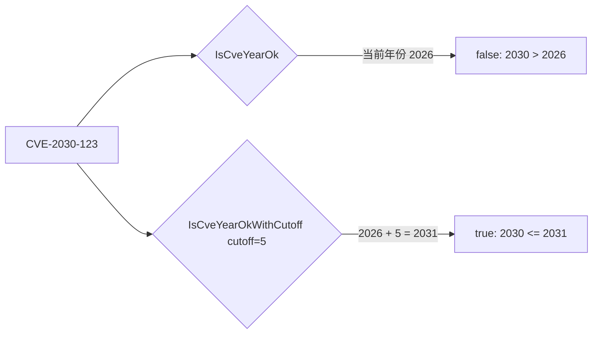
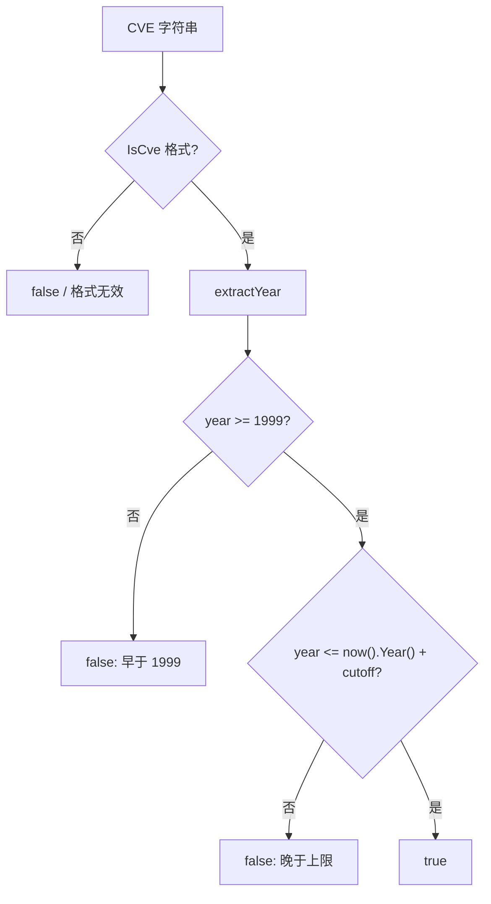
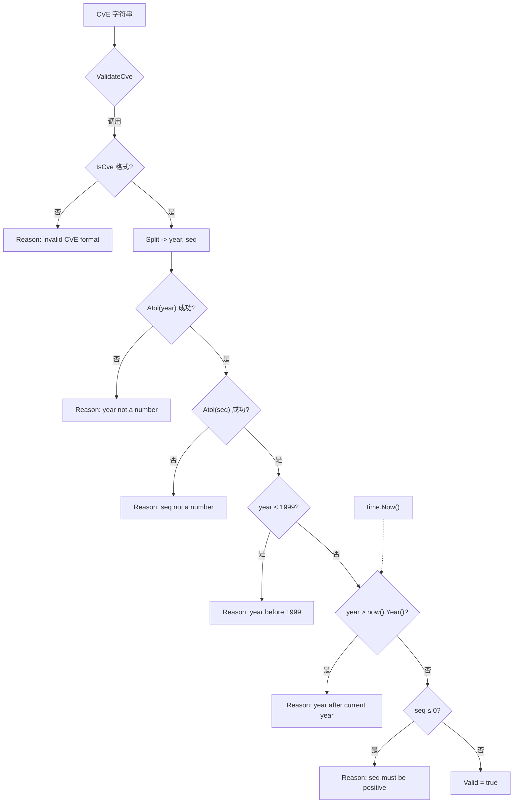

# 年份校验规则

📌 `cve` 包对每个 CVE 标识符都施加年份边界：年份必须落在 **1999**（含，下限）到**当前运行年份**（含，上限）之间。本页讲解两条边界的依据、`IsCveYearOk` 与 `IsCveYearOkWithCutoff` 的差异、二者与 `ValidateCve` 的关系，以及为何校验依赖 `time.Now()`。

:::tip 适用读者
需要过滤格式错误、历史年份或超前年份 CVE 的开发者；从多源摄取 CVE 数据流的团队；以及任何想知道为何格式合法的 `CVE-2030-12345` 仍会被拒绝的人。
:::

## 为何以 1999 作为下限

MITRE 运营的 CVE 项目自 **1999** 年度起开始以 `CVE-YYYY-NNNNN` 语法发布标识符。不存在年份早于 1999 的官方 CVE 记录，因此任何形如 `CVE-1998-NNNNN` 或更早的标识符本质上都不是真正的 CVE——它要么是笔误，要么是编造的示例，要么是恰好匹配正则的非 CVE 编号。

下限直接写死在源码中。`base.go` 中：

```go
func IsCveYearOkWithCutoff(cve string, cutoff int) bool {
	year := extractYear(cve)
	return year >= 1999 && year <= time.Now().Year()+cutoff
}
```

常量 `1999` 被硬编码而非来自配置，因为它反映的是关于 CVE 项目的历史事实，而非可调策略。同一常量也出现在 `ValidateCve` 与内部辅助函数 `validateSingleCve` 中，三个校验入口共享同一个地板值。

下表汇总各公开 API 对下限的执行方式：

| 函数 | 下限检查 | 低于 1999 时的行为 |
| --- | --- | --- |
| `IsCveYearOk` | `year >= 1999`（经 `IsCveYearOkWithCutoff`） | 返回 `false` |
| `IsCveYearOkWithCutoff` | `year >= 1999` | 返回 `false`，`cutoff` 仅影响上限 |
| `ValidateCve` | `yearInt >= 1999` | 返回 `false` |
| `validateSingleCve` | `yearInt < 1999` | 返回 `false` 并附带原因 `"year %d is before 1999"` |

⚠️ `cutoff` 参数**不会**放宽下限。即便 `cutoff` 很大，`CVE-1998-12345` 仍被拒绝。cutoff 只把窗口向未来延伸，绝不向过去延伸。

## 为何以当前年份作为上限

年份超过当前公历年的 CVE 标识符是可疑的：MITRE 不可能分配过"未来"记录。这类标识符通常来自损坏的数据、测试夹具或自行编造 ID 的来源。默认上限因此为 `time.Now().Year()`。

这一点在 `base.go` 的两处可见。较简洁的是仅校验年份的函数：

```go
func IsCveYearOkWithCutoff(cve string, cutoff int) bool {
	year := extractYear(cve)
	return year >= 1999 && year <= time.Now().Year()+cutoff
}
```

更全面的是完整校验器内部：

```go
// 基础验证规则：年份在1999至今，序列号为正整数
return yearInt >= 1999 && yearInt <= time.Now().Year() && seqInt > 0
```

由于上限在调用时由系统时钟计算，校验 `CVE-2027-1` 的结果会随日历推进而变化。今天无效的标识符，在匹配年份的 1 月 1 日可能变为有效。这是有意为之——让库对 MITRE 可能签发的记录保持诚实。

## IsCveYearOk 与 IsCveYearOkWithCutoff：cutoff 参数

`IsCveYearOk` 是一个薄封装：

```go
func IsCveYearOk(cve string) bool {
	return IsCveYearOkWithCutoff(cve, 0)
}
```

它以 `cutoff = 0` 委托给 `IsCveYearOkWithCutoff`，意味着上限恰好是当前年份。`IsCveYearOkWithCutoff` 增加了一个旋钮：将上限向前延伸 `cutoff` 年，使 `year <= time.Now().Year()+cutoff` 能放行一段可控的未来年份。

🧩 cutoff 的存在是为了处理**预留与预发布的 CVE**。MITRE 允许 CNA 提前预留成块的 ID，一条 CVE 记录可能在其年份严格"到来"之前就被公开引用（例如出现在某通报或厂商公告中），或者你处理的恰是略早于日历生成的数据流。适度的 cutoff（1–3 年）能让这些记录通过，而不必彻底关闭年份校验。

两函数对比：



实际接受的年份范围对比（假设当前年份为 2026）：

| 输入 | `IsCveYearOk` | `IsCveYearOkWithCutoff(_, 2)` | `IsCveYearOkWithCutoff(_, 5)` |
| --- | --- | --- | --- |
| `CVE-1998-1` | `false` | `false` | `false` |
| `CVE-1999-1` | `true` | `true` | `true` |
| `CVE-2026-1` | `true` | `true` | `true` |
| `CVE-2027-1` | `false` | `true` | `true` |
| `CVE-2029-1` | `false` | `false` | `true` |
| `CVE-2031-1` | `false` | `false` | `true` |
| `CVE-2032-1` | `false` | `false` | `false` |

⚡ 当你摄取可能携带预留 ID 的第三方数据流时使用 cutoff；当你想要对"MITRE 今天能否签发此记录"做最严格解释时，使用朴素的 `IsCveYearOk`。

## 与 ValidateCve 的关系与差异

`IsCveYearOk` 与 `ValidateCve` 相关但不可互换。二者共享相同的年份边界，但检查的内容不同：

| 维度 | `IsCveYearOk` | `ValidateCve` |
| --- | --- | --- |
| 检查格式？ | 否——依赖 `extractYear`，对格式错误输入返回 `0` | 是——先调用 `IsCve` |
| 检查年份？ | 是，`[1999, now]` | 是，`[1999, now]` |
| 检查序列号？ | 否 | 是，必须为正整数 |
| 支持 cutoff？ | 是，经 `IsCveYearOkWithCutoff` | 否，上限始终为当前年份 |
| 返回类型 | `bool` | `bool` |

一个关键推论：`IsCveYearOk` 无法告诉你 CVE 为何不正确，也不校验序列号。`ValidateCve` 是更严格的一体化检查。内部辅助 `validateSingleCve` 更进一步，产出带人类可读 `Reason` 的 `CveValidationResult`：

```go
if yearInt < 1999 {
	result.Valid = false
	result.Reason = fmt.Sprintf("year %d is before 1999", yearInt)
	return result
}

currentYear := time.Now().Year()
if yearInt > currentYear {
	result.Valid = false
	result.Reason = fmt.Sprintf("year %d is after current year %d", yearInt, currentYear)
	return result
}
```

⚠️ `ValidateCve` 有意**不**暴露 cutoff。如果你需要容忍未来年份的完整校验，请自行组合检查：用 `IsCve` 校格式、`IsCveYearOkWithCutoff` 校年份、再确认序列号为正。没有一个内置函数能"在放宽上限的同时做完整校验"。

## 对 time.Now() 的运行时依赖

所有年份校验最终都调用 `time.Now().Year()`。这带来几项实际影响：

1. **跨时间结果不确定。** 同一输入字符串今天可能返回 `false`，下一年却返回 `true`。任何缓存的校验结果在年份更替后都应视为过期。
2. **无依赖注入。** 当前实现直接在 `IsCveYearOkWithCutoff`、`ValidateCve` 与 `validateSingleCve` 内读取系统时钟。公开 API 无法注入固定的"当前时间"用于测试。
3. **时钟偏差有影响。** 若主机时钟错误，校验会跟随错误的年份。时钟停在 2020 的机器会拒绝每一条合法的 `CVE-2026-*` 标识符。
4. **确定性测试需控制年份而非时钟。** 由于 `cutoff` 相对 `time.Now()` 平移上限，你可以通过选取能补偿当前日期的 `cutoff` 值来编写年份稳定的测试——例如断言 `IsCveYearOkWithCutoff("CVE-2050-1", 30)` 为 `true`，无论测试何时运行都成立。

🤖 下图展示一条 CVE 如何流经各年份检查，以及 `time.Now()` 在何处介入决策：



## 使用场景

- **API 边界的严格输入校验。** 用 `ValidateCve` 在 CVE 进入数据库前拒绝格式错误、越界或零序列号的记录。硬性的 `1999` 地板与 `time.Now()` 天花板可同时防范笔误与编造 ID。
- **摄取预留 ID 的合作方数据流。** 用小 cutoff（1–3 年）包裹 `IsCveYearOkWithCutoff`，使预留或预发布的 CVE 不被误拒，同时仍过滤 `CVE-1998-*` 或 `CVE-9999-*` 这类明显错误。
- **数据质量报告。** 用 `ValidateCves` / 内部 `validateSingleCve` 路径获取逐项 `Reason` 字符串，如 `"year 1998 is before 1999"` 或 `"year 2030 is after current year 2026"`，用于审计报告。
- **长时间运行的批处理任务。** 由于上限依赖 `time.Now()`，12 月 31 日开始、1 月 1 日结束的任务可能对同一输入得到不同结果。在决策时刻重新校验，而非信任过期结果。

## 小结

- 下限 `1999` 是 CVE 项目的历史事实，硬编码于 `base.go`，为所有校验函数共享。
- 上限默认为 `time.Now().Year()`，在调用时计算，因此校验结果会随日历推进而变化。
- `IsCveYearOk` 即 `IsCveYearOkWithCutoff(cve, 0)`；`cutoff` 参数仅向前放宽上限，以放行预留与预发布的 CVE。
- `ValidateCve` 比 `IsCveYearOk` 更严格，因为它还校验格式与正序列号，但**不**接受 cutoff。
- 想要测试稳定的行为，应利用 `cutoff` 偏移当前年份，而非尝试 mock `time.Now()`。

## 图解参考

第一张图为 ASCII 流程，展示一条 CVE 字符串如何在四个校验入口之间分发、各自执行哪些检查、以及 `time.Now()` 在何处介入。第二张为 mermaid 时序视角，描绘一次 `ValidateCve` → `validateSingleCve` 调用中 CVE 可能收集到的各 Reason 的短路顺序。

```text
                     CVE 字符串 (例如 CVE-2030-12345)
                              |
          +-------------------+-------------------+
          |                   |                   |
   IsCveYearOk        IsCveYearOkWithCutoff   ValidateCve
   cutoff = 0         cutoff = N              (无 cutoff)
          |                   |                   |
          v                   v                   v
     extractYear        extractYear            IsCve? ----- 否 ---> "invalid CVE format"
          |                   |                   | 是
          v                   v             Split -> year,seq
   year >= 1999?       year >= 1999?        strconv.Atoi year/seq
     | 否  | 是        | 否  | 是             |
     v     v            v     v            yearInt < 1999?  -- 是 --> "year %d is before 1999"
   false  |           false   |                | 否
          |                   |           yearInt > now().Year()? -- 是 --> "year %d is after current year %d"
          v                   v                | 否
   year <= now+N?      year <= now+N?      seqInt <= 0? -- 是 --> "sequence number must be positive"
     | 否  | 是        | 否  | 是             | 否
     v     v            v     v                 v
   false  true        false  true           Valid = true
                            ^
                            |
                  time.Now().Year() 在调用时
                  提供上限（cutoff 仅向前平移）
```



## 深入解析

1. **`validateSingleCve` 以固定顺序短路检查。** 源码（`base.go` 第 328-374 行）按以下顺序求值：格式（`IsCve`）→ `strconv.Atoi(year)` → `strconv.Atoi(seq)` → `year < 1999` → `year > time.Now().Year()` → `seq <= 0`。首个失败的谓词胜出并成为 `Reason`；一条 CVE 在一次调用中最多收集到一个 Reason。这正是前文列举的 Reason 字符串互斥的原因——它们对应各自独立的提前返回分支，而非"全部问题清单"。

2. **`extractYear` 对格式错误输入静默返回 `0`，而 `0` 恰好不满足下限。** `extractYear`（`base.go` 第 162-170 行）调用 `Format`、按 `-` 切分、要求恰好 3 段，并忽略 `Atoi` 的错误（解析失败时返回 `0`）。由于 `0 < 1999`，仅校验年份的 `IsCveYearOk` / `IsCveYearOkWithCutoff` 是借下限的副作用拒绝格式错误字符串的，*并非*因为它们校验了格式。这就是对比表中那条非对称的根源：`IsCveYearOk("not-a-cve")` 为 `false`，但按"早于 1999"的逻辑而非"格式已校验"。

3. **字面量 `1999` 在三处重复出现，并未集中为常量。** 同一魔术数字出现在 `IsCveYearOkWithCutoff`（第 233 行）、`validateSingleCve`（第 353 行）与 `ValidateCve`（第 459 行）。没有共享常量，三者靠约定耦合。若要调整下限，需同时改这三处；现有文档所谓"三个校验入口共享同一地板值"在今天成立，恰因每处都硬编码了同一字面量。

4. **`cutoff` 仅对上限做加法，形式为 `time.Now().Year()+cutoff`。** 按第 233 行的字面读法，`cutoff` 是相对*调用时刻*平移上限，而非相对某固定纪元。两个推论：负的 `cutoff` 会把上限压到当前年份之下（拒掉同年 CVE）；而今天选定的 `cutoff` 不会随日历推进保持校准——用 `cutoff=30` 放行 `CVE-2050-1` 之所以稳定，恰因年份与 `time.Now()` 同步前进，二者差值恒定。

5. **无 `Clock` 接口意味着校验无法经公开 API 打桩。** 与接受注入的 `func() time.Time` 或 `Clock` 接口的库不同，三条年份校验路径都直接调用 `time.Now()`（`base.go` 第 233、359-360、459 行）。唯一对测试稳定的杠杆是 `cutoff` 参数，它之所以奏效，恰因被表达为相对实时钟的*差值*。这是一项刻意的简洁权衡：运动部件更少，代价是想做"时间旅行"的调用方要么包裹本包，要么计算补偿性 cutoff。

## 延伸阅读

- [Format 与 IsCve](/zh/api/functions/is-cve) — 年份校验所依赖的格式正则与 `Format`/`IsCve`。
- [ValidateCve 与 ValidateCves](/zh/api/functions/validate-cve) — 含序列号检查与 `CveValidationResult` 的完整校验。
- [FilterValidCves](/zh/api/functions/filter-valid-cves) — 基于 `ValidateCve` 的批量过滤。
- [快速开始](/zh/guide/getting-started) — `cve` 包的安装与首次运行。
