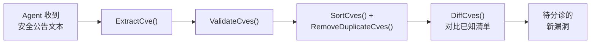
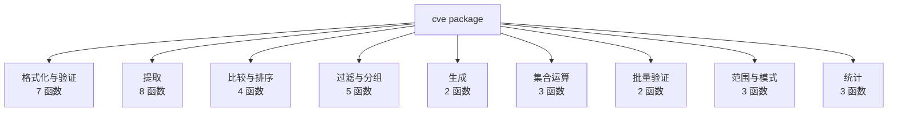

## AI Agent 如何使用它



::: code-group

```bash [安装 CLI]
# 覆盖所有主流平台的预编译二进制
go install github.com/scagogogo/cve-skills/cmd/cve@latest
# 或从 Releases 下载:
# https://github.com/scagogogo/cve-skills/releases
```

```bash [使用 CLI]
# 从任意文本提取并验证 CVE —— 确定性 stdout
echo "Affected by CVE-2021-44228 and CVE-2022-12345" | cve extract
# 34 个子命令,全部支持参数或 stdin —— 详见 CLI 参考: /zh/cli
```

```go [作为 Go 库使用]
package main

import (
    "fmt"
    "github.com/scagogogo/cve-skills" // go get github.com/scagogogo/cve-skills
)

func main() {
    text := "System affected by CVE-2021-44228 and CVE-2022-12345"

    // 提取、验证、去重、排序 —— 一条流水线
    cves := cve.SortCves(cve.RemoveDuplicateCves(cve.ExtractCve(text)))
    fmt.Println(cves) // [CVE-2021-44228 CVE-2022-12345]

    fmt.Println(cve.ValidateCve("CVE-2022-12345")) // true
}
```

:::

## 函数地图

9 大类共 30+ 函数。单一依赖，零 CVE 格式重复造轮子。



## 为什么选 CVE Utils？

| 问题 | CVE Utils 的解法 |
|------|------------------|
| 格式不一致（`cve-...`、`CVE-...`、大小写混用） | `Format()` → 标准 `CVE-YYYY-NNNNN` |
| 手写正则提取 | `ExtractCve()` 从任意文本提取 |
| Go 无原生比较/排序 | `CompareCves()` / `SortCves()` |
| 多来源合并产生重复 | `RemoveDuplicateCves()` |
| 公告里的范围描述 | `ParseCveRange()` → 展开为列表 |

🚀 **[30 秒上手 →](/zh/guide/getting-started)**
