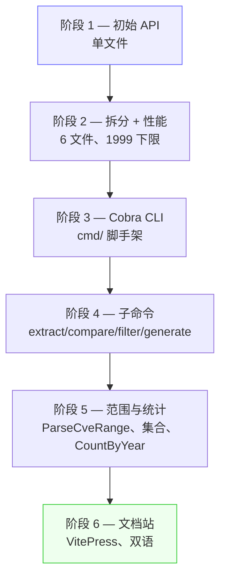
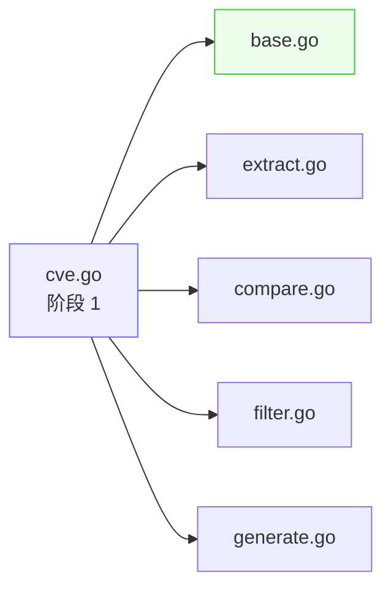
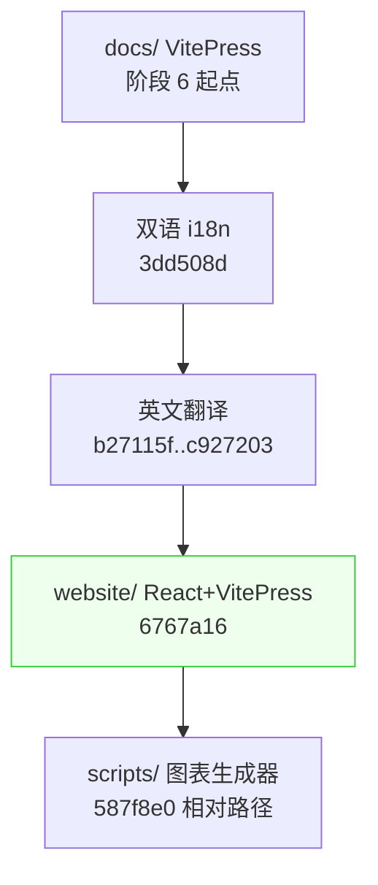
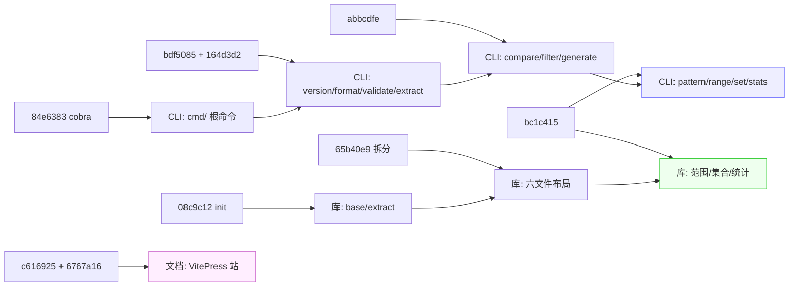

# 更新日志

`cve` 包并非一蹴而就。它从一个单文件的 Go 模块，逐个提交演进为六文件库，随后引入基于 Cobra 的 CLI，又增加了范围、通配符与统计函数，最终落地了一个中英双语的 VitePress 文档站。本页基于 git 历史重建这条演进路径，让你看清每项能力何时落地、过程中重命名或重构了什么、公共 API 如何走到今天的形态。它是函数与 CLI 参考页的阅读辅助，而非替代——下文每一条目都回指到它所描述的具体源码文件或命令。

:::tip 适用读者
任何想理解 `cve` 包为何如此组织的人：哪个文件负责哪一族函数、`SortCves` 为何不叫 `SortedCves`、年份下限为何是 1999 而非 1970、CLI 与文档站何时出现。建议与[迁移指南](/zh/reference/migration)对照阅读，把旧的临时手写代码映射到当前 API。
:::

## 如何阅读本更新日志

历史可划分为五个阶段。每个阶段是本页的一节，每节列出塑造该阶段的提交及其引入的公共面变化。下表为索引。

| 阶段 | 主题 | 标志性提交 | 新增公共面 |
| --- | --- | --- | --- |
| 1 | 单文件初始 API | `08c9c12 init` | `Format`、`IsCve`、`ExtractCve`、年份校验 |
| 2 | 拆分模块 + 性能 | `65b40e9 refactor: 拆分单一的大文件` | 六文件布局、`SortCves` 重命名、1999 下限 |
| 3 | 引入 CLI（Cobra） | `84e6383 feat(cli): add cobra` | `cmd/`、`version`、`format`、`validate` |
| 4 | CLI 子命令扩展 | `abbcdfe feat(cli): compare, filter, generate` | `extract`、`compare`、`filter`、`generate` |
| 5 | 范围、通配符、统计 | `bc1c415 feat: docs, examples, CLI` | `ParseCveRange`、`FilterCvesByPattern`、集合、统计 |
| 6 | 文档站 | `6767a16 feat: add React website` | VitePress 站、双语文档、图表 |



## 阶段 1 — 初始 API

仓库首个真正有内容的提交（`08c9c12 init`）将本包确立为 Go 模块，并在单个 `cve.go` 文件中交付了最初的 CVE 处理面。这里落地的函数是后续每个阶段都依赖的基石：标准化、格式检测、从自由文本中提取、年份校验。

| 函数 | 如今所在文件 | 自阶段 1 起的职责 |
| --- | --- | --- |
| `Format` | `base.go` | 转大写 + 去空格；标准化原语 |
| `IsCve` | `base.go` | 精确形状匹配，容忍两侧空白 |
| `IsContainsCve` | `base.go` | 在任意文本中的存在性检查 |
| `ExtractCve` | `extract.go` | 从字符串中取出所有 CVE，统一大写 |
| `IsCveYearOk` | `base.go` | 年份窗口校验 |

本阶段有两个决策值得留意，因为它们出现在之后的每个提交中。其一，`Format` 始终是标准化入口——现代包中每次比较、去重与过滤调用仍以 `Format(cve)` 为键。其二，最初的年份下限是 `1970` 而非 `1999`；这在阶段 2 才被修正。阶段 1 的提交还附带首个 GitHub Actions 工作流（`1ba5ddc`），因此 CI 从一开始就在，之后的每次重构都在测试覆盖下完成。

```go
// 阶段 1 的形态，在今天 base.go 中仍可辨认：
standardized := cve.Format("cve-2022-12345") // "CVE-2022-12345"
if cve.IsCve(userInput) {
    ids := cve.ExtractCve(report) // 大写化的匹配结果
}
```

## 阶段 2 — 拆分为模块与性能优化

单一的 `cve.go` 增长到值得拆分。提交 `65b40e9`（"拆分单一的大文件为多个小文件"）将其切为本包至今沿用的六个文件：`base.go`（标准化与验证）、`extract.go`（文本提取与年份/序号访问）、`compare.go`（比较与排序）、`filter.go`（过滤、分组与集合运算）、`generate.go`（CVE 构造），以及包入口 `cve.go`。测试文件同步拆分（`e082326`），使每个模块都有匹配的 `_test.go`。这正是参考页按文件引用函数的原因——文件边界是真实的，可追溯到本次提交。

随后的性能与正确性优化（`0534ee2`、`d98869e`）一次完成三件事：

| 提交 | 变更 | 为何重要 |
| --- | --- | --- |
| `0534ee2` | 将共享正则提升为包级变量（`exactCveRegex`、`containsCveRegex`） | 避免每次 `IsCve` / `IsContainsCve` 调用都重新编译 |
| `0534ee2` | 年份下限从 `1970` 改为 `1999` | 与 CVE 项目实际首次发布年份对齐 |
| `d98869e` | 提升 `extract.go` 中的 `cveRegex` | `ExtractCve`/`ExtractFirstCve` 共享一个已编译模式 |
| `33386ad` | `SortedCves` 重命名为 `SortCves`；`SubByYear` 改为委托 `CompareByYear` | 命名一致性；减少重复逻辑 |

`SortedCves` → `SortCves` 是历史上唯一的破坏性重命名。若你在旧代码或旧 issue 中看到 `SortedCves`，现代等价物是 [`SortCves`](/zh/api/functions/sort-cves)。变体 `IsCveYearOkWithCutoff` 在同一窗口引入（`90c5595`、`2b9b816`），让调用方可接受未来年份偏移，用于校验已预留但尚未发布的 CVE ID。



## 阶段 3 — Cobra CLI 脚手架

本库直到提交 `84e6383`（"feat(cli): add cobra dependency and cmd directory structure"）才脱离纯 Go API 形态。该提交引入了 `go.mod` 中记录的 `github.com/spf13/cobra v1.8.1` 依赖，创建了 `cmd/` 目录，并播种了两个文件：`cmd/cve/main.go`（入口）与 `cmd/root.go`（根命令）。CLI 从此成为与库并列的一等交付物，之后每个子命令都挂在这条根上。

紧接着的提交（`bdf5085`）填充了首批叶子命令：

| 命令 | 文件 | 包装 |
| --- | --- | --- |
| `version` | `cmd/version.go` | 包版本横幅 |
| `format` | `cmd/format.go` | `cve.Format` |
| `validate` | `cmd/validate.go` | `cve.IsCve`、`cve.ValidateCve`、`cve.IsCveYearOk` |
| `helpers` | `cmd/helpers.go` | 共享输出格式化工具 |

```bash
# 自本阶段起，CLI 可被安装与查询。
cve version
cve format "cve-2022-12345"
cve validate "CVE-1998-1"
```

注意 `go.mod` 锁定 `cobra v1.8.1`，`pflag v1.0.5` 与 `mousetrap v1.1.0` 为间接依赖——自本阶段起锁文件保持稳定，因此 CLI 在 `--help` 渲染与 shell 补全上的行为即为 Cobra 默认值。

## 阶段 4 — 扩展 CLI 子命令

Cobra 脚手架就位后，子命令以三个聚焦的提交落地，每个把一族库函数映射到命令组。

| 提交 | 子命令 | 文件 | 暴露的库函数 |
| --- | --- | --- | --- |
| `164d3d2` | `extract` | `cmd/extract.go` | `ExtractFirstCve`、`ExtractLastCve`、`ExtractCveYear`、`ExtractCveSeq`、`Split` |
| `abbcdfe` | `compare` | `cmd/compare.go` | `CompareByYear`、`CompareCves`、`SortCves` |
| `abbcdfe` | `filter` | `cmd/filter.go` | `FilterCvesByYear`、`FilterCvesByYearRange`、`GetRecentCves`、`GroupByYear` |
| `abbcdfe` | `generate` | `cmd/generate.go` | `GenerateCve`、`GenerateFakeCve` |

一个小型杂务提交（`0230ed3`）更新了 `.gitignore` 以忽略编译后的 CLI 二进制，`4cce5fc` 在 `docs/superpowers/plans/` 下新增了一份 CLI 开发计划文档。本阶段之后，CLI 已覆盖库的核心面——提取、比较、过滤、生成——但范围、通配符、集合与统计函数尚未接入。这一缺口正是阶段 5 所填补的。

```bash
# 阶段 4 的命令形态（至今仍是当前形态）。
cve extract first "Affected by CVE-2021-44228 and CVE-2022-12345"
cve compare "CVE-2022-1111" "CVE-2022-2222"
cve filter by-year --year 2022 --in cves.txt
cve generate --year 2022 --seq 12345
```

## 阶段 5 — 范围、通配符、集合与统计

历史上最大的单次功能性提交是 `bc1c415`（"feat: add docs, examples, and CLI for new capabilities"）。它一次落地了四个库源文件扩展（`base.go`、`extract.go`、`filter.go`、`generate.go`）、对应测试文件、十二个新示例程序（`examples/20` 至 `examples/31`）、四个新 CLI 命令与四个新 API 文档页。

本阶段新增的库函数，正是把现代包区别于简单"格式化+提取"助手的关键所在：

| 函数 | 文件 | 新增能力 |
| --- | --- | --- |
| `ValidateCves`、`FilterValidCves`、`CveValidationResult` | `base.go` | 批量校验，逐条带 `Reason` |
| `FilterCvesByPattern` | `extract.go` | `*` 通配符模式，正则已转义 |
| `ParseCveRange`、`IsCvesConsecutive` | `generate.go` | `to` / `..` / `-` 范围语法展开 |
| `IntersectCves`、`UnionCves`、`DiffCves` | `filter.go` | 集合运算，已排序去重 |
| `CountByYear`、`YearRange`、`SeqRange` | `filter.go` | 年份/序号统计 |

对应的 CLI 命令在同一提交落地：

| 命令 | 文件 | 用途 |
| --- | --- | --- |
| `pattern` | `cmd/pattern.go` | 对 CVE 列表执行 `FilterCvesByPattern` |
| `range` | `cmd/range.go` | `ParseCveRange` 展开 |
| `set` | `cmd/set.go` | `IntersectCves` / `UnionCves` / `DiffCves` |
| `stats` | `cmd/stats.go` | `CountByYear`、`YearRange`、`SeqRange` |
| `validate-batch` | `cmd/validate_batch.go` | `ValidateCves`，输出含 `Reason` |

```go
// 阶段 5 让本包成为真正的工具集。
patterned := cve.FilterCvesByPattern(list, "CVE-2022-*")
expanded := cve.ParseCveRange("CVE-2022-12345 to CVE-2022-12350")
common := cve.IntersectCves(scannerA, scannerB)
counts := cve.CountByYear(list)
minY, maxY := cve.YearRange(list)
```

本阶段定型了一个微妙但重要的设计选择：每个集合运算（`IntersectCves`、`UnionCves`、`DiffCves`）与 `FilterCvesByPattern` 内部都返回 `SortCves(result)`。这意味着其输出在不同运行与不同输入顺序下都是确定的，因而可安全地喂给测试断言与存储报告——[迁移指南](/zh/reference/migration)正依赖这一约定。

## 阶段 6 — 文档站

最后阶段是文档，而非库代码。提交 `c616925` 在 `docs/` 下新增了原始 VitePress 站，`3dd508d` 接入中英双语支持，一长串 `docs:` 提交（`b27115f`、`842395a`、`c927203`……）完成了英文翻译并修复死链。最近一次结构性提交 `6767a16`（"feat: add React website, fix security vulns, refactor Go module path"）引入了现代 `website/` React + VitePress 布局，将 Go 模块路径重构为 `github.com/scagogogo/cve-skills`，并用 `website.yml` 替换了 `docs.yml` 工作流。

你正在阅读的站点正是本阶段的产物。`scripts/` 下的 Python 图表生成器（`gen_architecture.py`、`gen_cli_tree.py`、`gen_feature_map.py`）产出各指南页使用的架构、CLI 树与特性图 PNG；提交 `587f8e0` 将其修正为使用相对路径，使其可从任意检出位置运行。

| 站点资产 | 来源 | 用途 |
| --- | --- | --- |
| 架构图 | `scripts/gen_architecture.py` | 包结构概览 |
| CLI 树 | `scripts/gen_cli_tree.py` | `cmd/` 命令层级 |
| 特性图 | `scripts/gen_feature_map.py` | 函数到能力的矩阵 |
| 双语页面 | `website/` + `website/zh/` | 中英内容对齐 |



## 小结

- 本包起步于单个 `cve.go`，含 `Format`、`IsCve`、`ExtractCve` 与一个年份校验；六文件拆分（`65b40e9`）是参考页至今引用的布局。
- 历史上唯一的破坏性重命名是 `SortedCves` → `SortCves`（`33386ad`）；年份下限从 `1970` 改为 `1999`（`0534ee2`），以匹配 CVE 项目。
- CLI 是锁定 `v1.8.1` 的 Cobra 应用，于 `84e6383` 搭建脚手架，跨 `bdf5085`、`164d3d2`、`abbcdfe` 扩展至覆盖提取、比较、过滤与生成。
- 阶段 5（`bc1c415`）是最大的功能性提交：它一次为库与 CLI 同时增加了范围、通配符、集合运算与统计。
- 文档站是最年轻的一层——原始 VitePress 见于 `c616925`，双语见于 `3dd508d`，现代 React+VitePress 布局见于 `6767a16`。

## 图解参考

下面两张图从与页首阶段表不同的角度重新呈现这六个阶段。第一张是纯文本调用图，展示一次用户输入如何流经包的文件边界；第二张是 mermaid 时间线，把提交映射到它们触及的库/CLI/文档三层。

```text
+-----------+     +-------------+     +-------------------+
| 用户文本  | --> | extract.go  | --> | ExtractCve()      |
+-----------+     +-------------+     |  - cveRegex 扫描  |
                                      |  - 逐条 Format()  |
                                      +---------+---------+
                                                |
                                                v
+-------------+     +-------------+     +-------------------+
| base.go     | <-> | compare.go  | <-> | SortCves()        |
|  Format     |     |  CompareBy  |     |  sort.Slice +     |
|  IsCve      |     |  Year/Cves  |     |  CompareCves      |
|  ValidateCve|     +-------------+     +---------+---------+
+-------------+                                   |
      ^                                           v
      |                 +-------------+   +-------------------+
      +---------------- | filter.go   |<--| 集合运算 + 统计    |
                        |  Filter...  |   | Intersect/Union/  |
                        |  GroupBy... |   | Diff/Count/Range  |
                        +------+------+   +-------------------+
                               |
                               v
                        +-------------+
                        | generate.go |
                        |  GenerateCve|
                        |  ParseCveRng|
                        +-------------+
```

这张 ASCII 图让阶段 2 的文件边界设计一目了然：`base.go` 中的 `Format` 是每个其他模块都回指的中枢，这正是阶段 1 的提交对后续每个阶段都构成承重墙的原因。



这张 mermaid 时间线把三条交付轨道（库、CLI、文档）分离开，由此可看出 CLI 轨道大约滞后库轨道一个阶段，而文档轨道直到阶段 5 库面稳定后才开始。

## 深入解析

上面按阶段叙述略过、但若你对照源码阅读则值得留意的几个细节：

1. **`exactCveRegex` 与 `containsCveRegex` 的锚点刻意不同。** `base.go` 中精确匹配器为 `^\s*CVE-\d+-\d+\s*$`（锚定、容忍两侧空白），而包含匹配器为不锚定的 `CVE-\d+-\d+`。这就是为何 `IsCve("text CVE-2022-1 text")` 返回 `false`，而对同一字符串 `IsContainsCve` 返回 `true`——两者回答不同的问题，阶段 1 的提交两者都交付，而非重载其一。`extract.go`（第 9 行）中单独的 `cveRegex` 带有捕获组，因为 `ExtractCve` 需要匹配的区间，而不仅是布尔值。

2. **`CompareByYear` 返回原始年份差，而非符号归一化的值。** `CompareByYear("CVE-2020-1","CVE-2022-1")` 返回 `-2`，而非 `-1`。`CompareCves` 随后将其折叠为 `{-1,0,1}` 供 `sort.Slice` 使用。这是刻意的两层设计：想要真实年份间隔（如"相差几年"）的调用方直接用 `CompareByYear`/`SubByYear`，而排序用归一化的 `CompareCves`。`SubByYear` 如今是对 `CompareByYear` 的一行委托，正是提交 `33386ad` 引入的去重。

3. **1999 下限在两处强制，语义略有不同。** `IsCveYearOkWithCutoff`（第 231 行）与 `ValidateCve`（第 459 行）都以 `year >= 1999` 为门槛，但 `ValidateCve` 还拒绝超过 `time.Now().Year()` 的年份且不接受偏移，而 `IsCveYearOkWithCutoff` 接受未来偏移。这正是 CLI 的 `validate` 命令（包装 `ValidateCve`）拒绝已预留但未发布的 ID，而需要接受它们的库调用方改用 `IsCveYearOkWithCutoff` 的原因——该变体在 `90c5595`/`2b9b816` 窗口引入正是为填补此缺口。

4. **集合运算与 `FilterCvesByPattern` 总是返回 `SortCves(result)`。** 看 `IntersectCves`、`UnionCves`、`DiffCves`（filter.go）与 `FilterCvesByPattern`（extract.go 第 329 行）的尾部：每个都以 `return SortCves(result)` 收尾。这是阶段 5 引入的确定性保证——输出在不同输入顺序下都稳定，CLI 的 `set` 与 `pattern` 命令因此能产出可 diff 的输出，迁移指南替换手写去重循环时也依赖这一点。

5. **`ParseCveRange` 要求起止同年且拒绝倒序范围。** `rangeRegex`（generate.go 第 16 行）只捕获一次起始年份，且只重新捕获结束*序号*，从不捕获结束年份，故 `CVE-2021-1 to CVE-2022-5` 无法匹配。函数体随后显式检查 `startSeq > endSeq` 并返回 `nil`，因此 `CVE-2022-5 to CVE-2022-1` 得到空切片而非反向展开。两条约束都是刻意的——公告中的 CVE 范围总是同年且升序——但这意味着该函数是范围*展开器*，而非通用区间解析器。

## 延伸阅读

- [迁移指南](/zh/reference/migration) — 将手写 CVE 代码映射到当前 API
- [Format 函数参考](/zh/api/functions/format)
- [SortCves 函数参考](/zh/api/functions/sort-cves)
- [ParseCveRange 函数参考](/zh/api/functions/parse-cve-range)
- [FilterCvesByPattern 函数参考](/zh/api/functions/filter-cves-by-pattern)
- [CountByYear 函数参考](/zh/api/functions/count-by-year)
- [CLI 概览与约定](/zh/cli)
