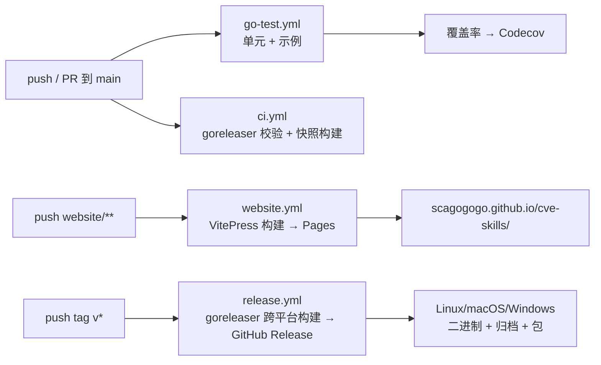

# CI/CD 流水线

仓库运行四个 GitHub Actions 工作流，共同守护 `main`、测试每次变更、发布文档站、并在打 tag 时切出跨平台发布版。本页记录每个工作流的触发条件、job、权限和产物，让贡献者知道什么时机运行什么，也让 AI Agent 能理解自己身处其间的构建流水线。

:::tip 📂 查看源码
四个工作流文件都在 [`.github/workflows/`](https://github.com/scagogogo/cve-skills/tree/main/.github/workflows)：
[`go-test.yml`](https://github.com/scagogogo/cve-skills/blob/main/.github/workflows/go-test.yml) ·
[`ci.yml`](https://github.com/scagogogo/cve-skills/blob/main/.github/workflows/ci.yml) ·
[`website.yml`](https://github.com/scagogogo/cve-skills/blob/main/.github/workflows/website.yml) ·
[`release.yml`](https://github.com/scagogogo/cve-skills/blob/main/.github/workflows/release.yml)
:::

## 流水线总览



四个工作流，三种触发，零重叠：

| 工作流 | 触发 | 用途 | 是否发布 |
|---|---|---|---|
| `go-test.yml` | 任意 push、任意 PR | 运行单元测试 + 全部示例，上传覆盖率 | 否（覆盖率到 Codecov） |
| `ci.yml` | push 到 `main`、PR 到 `main` | 校验 goreleaser 配置 + 单目标快照构建 | 否（仅 dry-run） |
| `website.yml` | push `website/**` 到 `main`、PR | 构建 VitePress 站点，部署到 GitHub Pages | 是（Pages，仅 `main`） |
| `release.yml` | push tag `v*` | goreleaser 跨平台构建 + GitHub Release | 是（Release 二进制） |

## go-test.yml — 测试与覆盖率

主要质量门禁。在**每次** push 和每个 PR 上运行，不分分支。

:::tip 📂 查看源码
[`go-test.yml`](https://github.com/scagogogo/cve-skills/blob/main/.github/workflows/go-test.yml) — 61 行，两个 job。
:::

**触发：** `on: push:` 与 `on: pull_request:`（无分支过滤——每个分支都触发）。

**Job：**

1. **`unit-tests`**（`ubuntu-latest`，Go 1.18）——检出、设置 Go、`go mod download`，然后：
   - `go test -v ./...`——详细运行 38 个测试套件。
   - `go test -race -coverprofile=coverage.txt -covermode=atomic ./...`——带竞态检测器和覆盖率插桩重跑。
   - 通过 `codecov-action@v3` 上传 `coverage.txt` 到 [Codecov](https://codecov.io)（`fail_ci_if_error: false`——覆盖率上传失败不会让构建失败）。

2. **`examples`**（`ubuntu-latest`，Go 1.18，`needs: unit-tests`）——仅在 `unit-tests` 通过后运行：
   - 遍历 `examples/*/`，在每个含 `main.go` 的目录运行 `go run .`。
   - 这保证文档中的每个可运行示例都能编译并执行——见[测试策略](/zh/guide/testing)中关于示例兼作集成测试的说明。

**权限：** 默认（只读 `contents`）。无需写令牌。

**关键设计选择：**

- **两个 job，不是一个。** 将单元测试与示例拆分，使示例 job 复用 Go setup 缓存并独立失败——坏示例不会遮蔽单元测试失败，反之亦然。
- **`-race` 仅在覆盖率运行时启用。** 详细运行是普通 `go test`；竞态检测器开销大，故只在覆盖率那一次运行，而非两次。
- **Codecov 的 `fail_ci_if_error: false`。** 覆盖率是信息性的；Codecov 宕机不应阻塞 PR。
- **固定 Go 1.18。** 精确匹配 `go.mod` 的 `go 1.18` 指令，CI 看到的语言版本与本地构建一致。

## ci.yml — goreleaser 守门

仅在 `main`（及到 `main` 的 PR）上运行的 dry-run 门禁。它的存在是为了在 `main` 上就捕获损坏的 `.goreleaser.yaml`，而不是等到有人 push 发布 tag 那天。

:::tip 📂 查看源码
[`ci.yml`](https://github.com/scagogogo/cve-skills/blob/main/.github/workflows/ci.yml) — 47 行，一个 job。
:::

**触发：** `on: push: branches: [main]` 与 `on: pull_request: branches: [main]`。

**Job：** `goreleaser-check`（`ubuntu-latest`，Go 1.18，`fetch-depth: 0`）：

1. `goreleaser check`——校验 `.goreleaser.yaml` 语法与配置。
2. `goreleaser build --snapshot --clean --single-target`——构建一个二进制（运行器原生目标），不发布。这证明构建矩阵、ldflags、`main: ./cmd/cve` 都正确。

**权限：** 仅 `contents: read`。该工作流从不发布。

**关键设计选择：**

- **`fetch-depth: 0`**——goreleaser 即便在 dry-run 中也需要完整 git 历史来解析 tag 以定版本。
- **`--single-target`**——仅构建宿主平台以保持 job 快速（秒级而非分钟级）。完整的跨平台矩阵仅在真正发布时才走。
- **无发布步骤。** 该 job 是纯校验；没有 `release:` 或 `GITHUB_TOKEN` 写。这使其在每个 PR 上运行都安全。

## website.yml — 文档部署

构建 VitePress 站点并部署到 GitHub Pages `https://scagogogo.github.io/cve-skills/`。

:::tip 📂 查看源码
[`website.yml`](https://github.com/scagogogo/cve-skills/blob/main/.github/workflows/website.yml) — 70 行，两个 job。
:::

**触发：** `on: push: branches: [main]` 带 `paths: ["website/**", ".github/workflows/website.yml"]`，PR 上同样 `paths` 过滤。仅当网站内容变更时触发。

**并发：** `group: "pages"`，`cancel-in-progress: false`——页面部署从不在传输中途互相取消；它们改为排队。

**Job：**

1. **`build`**（`ubuntu-latest`，Node 20）：
   - 在 `website/` 中 `npm ci`（从 `package-lock.json` 确定性安装）。
   - `npm run build` → `vitepress build`，输出到 `website/.vitepress/dist`。
   - `configure-pages` + `upload-pages-artifact`，`path: website/.vitepress/dist`。

2. **`deploy`**（`ubuntu-latest`，`needs: build`，`if: github.ref == 'refs/heads/main'`）：
   - 仅在 `main` push 上运行（PR 构建但不部署）。
   - `deploy-pages@v4` 将产物发布到 GitHub Pages。

**权限：** `contents: read`、`pages: write`、`id-token: write`——OIDC 令牌是现代 `deploy-pages` action 所必需的。

**关键设计选择：**

- **路径过滤。** 仅 Go 源码的 PR 不触发网站重建，保持 CI 快速。
- **PR 构建不部署。** `if: github.ref == 'refs/heads/main'` 守卫意味着 PR 仅验证站点可构建（捕获 markdown/mermaid 错误）而不发布预览。
- **`cancel-in-progress: false`。** 正在上传的 Pages 部署不会被新 push 中断；新 push 排队等候。这避免半部署站点。

## release.yml — 跨平台发布

唯一产出二进制的工作流。由 push `v*` tag 触发。

:::tip 📂 查看源码
[`release.yml`](https://github.com/scagogogo/cve-skills/blob/main/.github/workflows/release.yml) · [`.goreleaser.yaml`](https://github.com/scagogogo/cve-skills/blob/main/.goreleaser.yaml)
:::

**触发：** `on: push: tags: ["v*"]`。

**Job：** `release`（`ubuntu-latest`，Go 1.18，`fetch-depth: 0`）：

- 运行 `goreleaser/goreleaser-action@v6`，`args: release --clean`。
- goreleaser 读取 `.goreleaser.yaml` 并：
  - 运行 `before.hooks`（`go mod tidy`、`go test ./...`）。
  - 为 **4 个 OS × 4 个架构**交叉编译 `./cmd/cve`（忽略部分无效组合）——见[发布与 goreleaser](/zh/reference/release)。
  - 通过 ldflags 将版本注入 `cve.Version`。
  - 产出归档（tar.gz / zip）、Linux 包（deb/rpm/apk）、SHA-256 校验和文件、按 git 排序的 changelog。
  - 发布 GitHub Release 并附上二进制。

**权限：** `contents: write`（创建 Release）、`packages: write`。

**关键设计选择：**

- **由 tag 触发，而非分支触发。** 发布仅在维护者 push `v1.2.3` 时发生；不会因 `main` push 而误发布。
- **`fetch-depth: 0`。** goreleaser 遍历完整历史以生成前一个 tag 与新 tag 之间的 changelog。
- **`--clean` 先删除 `dist/` 目录**，防止前一次本地运行的残留产物混入发布。
- **`.goreleaser.yaml` 中的 `prerelease: auto`** 自动标记预发布 tag（如 `v1.2.3-rc1`）。

## 如何触发各工作流

```bash
# go-test.yml — 任意 push 或 PR 自动运行
git push origin my-branch
gh pr create

# ci.yml — push 到 main / PR 到 main 自动运行
git push origin main

# website.yml — website/** 在 main 上变更时运行
git push origin main   # （仅当 website/ 文件变更时）

# release.yml — push 一个 v* tag
git tag v1.2.3
git push origin v1.2.3
# → goreleaser 构建 + 发布 GitHub Release
```

## 本地等价命令（无需 CI）

```bash
# 本地复现 go-test.yml
go test -v ./...
go test -race -coverprofile=coverage.txt -covermode=atomic ./...
go tool cover -func=coverage.txt

# 本地复现 ci.yml
goreleaser check
goreleaser build --snapshot --clean --single-target

# 本地复现 website.yml
cd website && npm ci && npm run build
# 输出在 website/.vitepress/dist

# 本地复现 release.yml（不发布）
goreleaser release --snapshot --clean
```

## 数据流

```text
+-------------------+        +-------------------+        +-------------------+
|  贡献者           |        |  GitHub Actions   |        |  产物             |
|  git push / tag   | -----> |  4 个工作流       | -----> |  已发布           |
+-------------------+        +-------------------+        +-------------------+
        |                            |
        |   push 任意分支            |   go-test.yml  → 测试通过? + 覆盖率→Codecov
        |   ---------------          |   ci.yml       → goreleaser 配置有效?
        |                            |   website.yml  → 站点构建? → Pages（仅 main）
        |   push tag v*              |   release.yml  → 跨平台构建 → GitHub Release
        v                            v
   +-----------+              +----------------------+
   | 触发路由  |              | 门禁: main 必须保持  |
   +-----------+              | 绿灯后才能为发布切 tag|
                              +----------------------+
```

## 深入解析

- **四个工作流，而非一个大工作流。** 每个关注点（测试、构建校验、文档、发布）是独立文件，有自己的触发与权限。这让影响范围小：损坏的 `website.yml` 不会让 Go 发布失败，`go-test.yml` 示例的偶发不稳也不会阻塞文档部署。
- **`main` 是门禁。** `ci.yml` 与 `website.yml` 在 `main` 上运行/部署；`release.yml` 由 tag 触发。隐含契约是：保持 `main` 绿灯，再切 tag 发布——因为 `release.yml` 的 `before.hooks` 会重跑 `go test ./...`，在红的 `main` 上切 tag 会在发布时失败，而非静默发布坏二进制。
- **到处 Go 1.18。** 三个用 Go 的工作流都固定 `go-version: "1.18"`，匹配 `go.mod`。这保证 CI 按最低支持的 Go 版本构建，捕获对更新标准库特性的误用。
- **仅在需要处 `fetch-depth: 0`。** `ci.yml` 与 `release.yml` 需要完整历史（goreleaser tag 遍历）；`go-test.yml` 与 `website.yml` 用默认浅检出，因为它们从不检查 git 历史。
- **权限按工作流收紧。** `release.yml` 需 `contents: write` + `packages: write`；`website.yml` 需 `pages: write` + `id-token: write`；测试工作流啥都不需。没有工作流拥有超出其 job 所需的权限——被攻破的测试运行无法 push 发布。
- **Codecov 是 `fail_ci_if_error: false`。** 覆盖率是信号，不是门禁。这是刻意的：第三方宕机不应阻塞合并，覆盖率趋势由人工评审，CI 不强制。
- **示例在 CI 中作为集成测试运行。** `go-test.yml` 的 `examples` job 执行每个 `examples/*/main.go`，意味着 31 个文档示例被持续验证可编译可运行。破坏示例的代码改动在到达 `main` 前就会让 CI 失败。

## 相关

- [发布与 goreleaser](/zh/reference/release) — `.goreleaser.yaml` 配置详解（跨平台矩阵、ldflags、归档）
- [测试策略](/zh/guide/testing) — `go-test.yml` 单元测试 job 实际运行什么
- [下载与安装](/zh/download) — 发布二进制最终落到用户哪里
- [Version](/zh/api/functions/version) — `release.yml` 的 ldflags 注入如何设置 `cve.Version`
