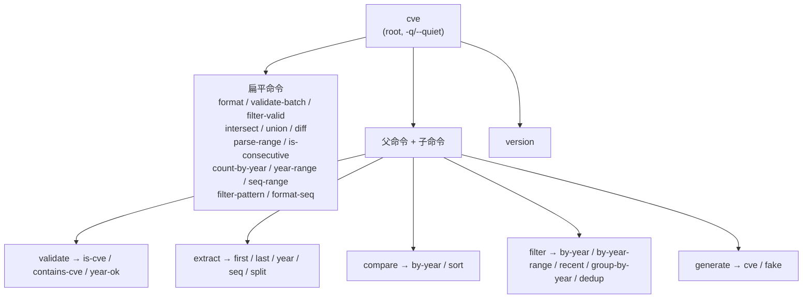
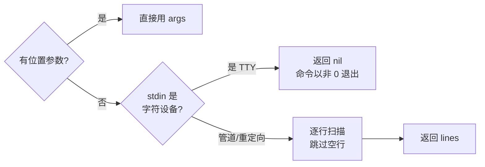
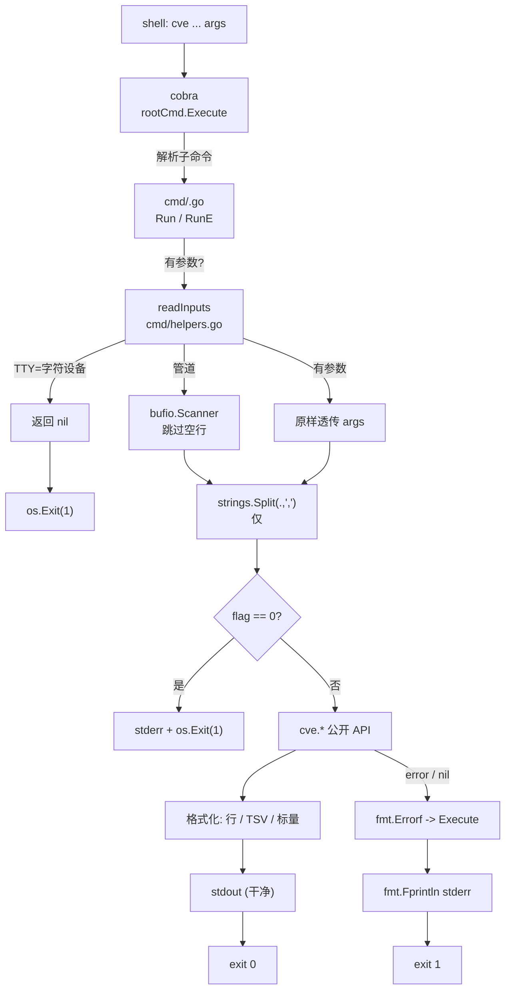

# CLI 约定

`cve` 命令行工具是库的一层薄包装，基于 [cobra](https://github.com/spf13/cobra) 构建，组织方式使**每个子命令都能安全地由脚本或 AI agent 驱动**。本页所述约定并非偶然——它们在 `cmd/` 的全部 20+ 命令中被统一执行，因此你只要为一个命令掌握了它们，就为所有命令掌握了它们。本页就是这份契约：命令层级、stdin 回退、逗号分隔列表、退出码、`--year`/`--seq` flag 风格，以及 `version` 命令。

:::tip 适用读者
需要通过脚本或 AI agent 驱动 `cve` CLI 的开发者与 agent、希望新增子命令时与既有命令行为一致的贡献者，以及任何曾被某个 CLI 的彩色输出、交互式提问或在失败时返回退出码 0 而困扰的人。如果你曾问过"这个命令读 stdin 吗？"、"`--year` 为什么用 `-y`？"、"这里退出码 1 是什么意思？"——本页就是答案。
:::

## 命令层级

根命令是 `cve`（在 `cmd/root.go` 中定义为 `Use: "cve"`）。它携带一个持久化标志（`-q, --quiet`）与一段嵌入了库 `Version` 的长描述。其下的命令分为三种形态：**扁平根命令**（`format`、`validate-batch`、`intersect`……）、**带子命令的父命令**（`validate` → `is-cve` / `contains-cve` / `year-ok`；`extract` → `first` / `last` / `year` / `seq` / `split`；`compare` → `by-year` / `sort`；`filter` → `by-year` / `by-year-range` / `recent` / `group-by-year` / `dedup`；`generate` → `cve` / `fake`），以及**仅打印帮助的裸组命令**（`filter`、`generate` 在未带子命令时调用 `cmd.Help()`）。



📌 扁平与嵌套的划分是有意为之：接收单一同质输入（一个列表、两个列表、一个 CVE）的命令保持扁平，以缩短管道；对同一输入有多种*操作模式*的命令（`validate` 检查三种不同的事，`extract` 有五种返回形态）则嵌套为子命令，使每种模式都有自己的 `Use` 行与 `--help`。

## 通过 readInputs 支持 stdin

每个接收输入的命令都通过同一个共享辅助 `readInputs`（位于 `cmd/helpers.go`）读取参数。它的契约是整个 CLI 的基石：

1. 若位置参数 `args` 非空，原样返回——stdin 绝不会被触碰。
2. 否则对 `os.Stdin` 调用 `Stat`。若它是字符设备（真实 TTY，没有管道输入），返回 `nil`——命令随后以非零码退出。
3. 否则（管道或重定向的 stdin）用 `bufio.Scanner` 逐行读取，**跳过空行**，返回收集到的切片。

```go
// cmd/helpers.go — 整个 CLI 的单一输入契约
func readInputs(args []string) []string {
    if len(args) > 0 {
        return args
    }
    stat, _ := os.Stdin.Stat()
    if (stat.Mode() & os.ModeCharDevice) != 0 {
        return nil // 无管道 → 不阻塞等待 TTY
    }
    var lines []string
    scanner := bufio.NewScanner(os.Stdin)
    for scanner.Scan() {
        line := scanner.Text()
        if line != "" {
            lines = append(lines, line)
        }
    }
    return lines
}
```

🧩 `os.ModeCharDevice` 检查使 CLI 在交互场景下也友好：不带参数、不带管道运行 `cve format` 会立即退出，而不是挂在一个闪烁的光标上等你输入再按 Ctrl-D。运行 `echo cve-2022-1 | cve format` 则会读取管道。这正是每个命令既能用作一次性调用（`cve extract year CVE-2022-12345`）、又能用作管道一环（`cat list.txt | cve extract year`）的原因。



## 逗号分隔列表

`Use` 行标注 `<cve-list>` 的命令同时接受**两种等价的列表语法**：多个位置参数（或多行 stdin），*以及*任一参数内的逗号分隔值。其机制是一行在 `cmd/validate_batch.go`、`cmd/stats.go`、`cmd/pattern.go`、`cmd/set.go` 中重复出现的代码：

```go
var cveList []string
for _, input := range inputs {
    cveList = append(cveList, strings.Split(input, ",")...)
}
```

由于 `strings.Split` 作用于*每一个*输入元素（无论它来自参数还是 stdin 一行），两种语法可自由组合：

```bash
# 对 <cve-list> 命令，以下三者等价：
cve validate-batch "CVE-2022-12345,CVE-1998-1,not-a-cve"
cve validate-batch CVE-2022-12345 CVE-1998-1 not-a-cve
printf 'CVE-2022-12345\nCVE-1998-1\nnot-a-cve\n' | cve validate-batch
```

| 命令形态 | `Use` 行 | 列表语法 | 在何处按 `,` 切分 |
| --- | --- | --- | --- |
| `validate-batch` / `filter-valid` | `<cve-list>` | 逗号 + 参数 + stdin | `cmd/validate_batch.go` |
| `count-by-year` / `year-range` | `<cve-list>` | 逗号 + 参数 + stdin | `cmd/stats.go` |
| `seq-range` | `<year> <cve-list>` | 逗号 + 参数 + stdin | `cmd/stats.go` |
| `filter-pattern` | `<pattern> <cve-list>` | 逗号 + 参数 + stdin | `cmd/pattern.go` |
| `intersect` / `union` / `diff` | `<list1> <list2>` | 每个列表内按逗号 | `cmd/set.go` |

⚡ 接收**单个 CVE**而非列表的命令——`format`、`validate`、`extract`、`compare sort`、`filter by-year` 等——*不*按逗号切分。`cve format "CVE-2022-1,CVE-2022-2"` 是一个参数，会被当作一个（非法）字符串格式化。逗号约定仅适用于 `Use` 行标注 `<cve-list>` 或 `<listN>` 的命令。

## 退出码

CLI 只用两个退出码，且处处含义相同：

| 码 | 含义 | 如何产生 |
| --- | --- | --- |
| `0` | 成功（包括**空结果**——无 stdout 输出，但无错误） | 正常 `Run` 返回，或 `RunE` 返回 `nil` |
| `1` | 错误：缺少必需 flag、无输入、非法参数，或库调用返回 `nil`/失败 | `Run` 中 `os.Exit(1)`，或 `RunE` 返回 `error` 被 `Execute` 捕获 |

根命令设置了 `SilenceUsage: true` 与 `SilenceErrors: true`（`cmd/root.go`），`Execute` 自己在退出 1 前把错误打印到 stderr。结果是**错误只出现在 stderr**——stdout 绝不会被用法横幅或 cobra 错误信息污染，这正是你能把 `cve …` 管道接入另一个 `cve …` 并信任 stdout 为纯数据的原因。

```go
// cmd/root.go — 错误进 stderr，stdout 保持干净
func Execute() {
    if err := rootCmd.Execute(); err != nil {
        fmt.Fprintln(os.Stderr, err)
        os.Exit(1)
    }
}
```

产生退出 1 的两种惯用法反复出现。用 `Run` 编写的命令在无输入或必需 flag 为零时直接调用 `os.Exit(1)`——这是 `extract`、`format`、`validate`、`compare sort` 及所有 `filter` 子命令的模式。用 `RunE` 编写的命令（较新的 `validate-batch`、`filter-valid`、`filter-pattern`、`format-seq`、集合运算、range 与 stats 命令）则返回 `fmt.Errorf(...)`，cobra 经由 `Execute` 路由到同样的 `os.Exit(1)`。两种惯用法到达同一退出码；`RunE` 额外让错误信息统一抵达 stderr。

⚠️ 注意这种不对称：**空结果是退出码 0**。`cve filter by-year --year 2099 CVE-2022-1` 不产生任何 stdout 行，但退出码为 0，因为没有出任何*错*——过滤器只是未匹配到任何内容。退出码 1 专用于"命令无法完成其工作"（无输入、缺 flag、无法解析的参数），而非"工作产出了空集"。需要区分"无匹配"与"出错"的脚本应检查退出码，而不仅是 stdout 是否为空。

## flag 风格：--year / --seq 等

CLI 中的数值 flag 遵循同一种命名风格：长形式 `--word` 配短形式 `-letter`，通过 cobra 的 `IntP` 注册以使两者都可用。该 flag **按约定为必需**——默认值为 `0`，命令检查 `if year == 0` 并以清晰的 stderr 信息退出 1，而非依赖 cobra 的 `Required: true`（后者会向 stderr 打印用法块）。

| 命令 | flag | 短形式 | 按约定必需的检查 |
| --- | --- | --- | --- |
| `filter by-year` | `--year` | `-y` | `if year == 0` → "error: --year is required" |
| `filter by-year-range` | `--start`, `--end` | `-s`, `-e` | `if startYear == 0 \|\| endYear == 0` |
| `filter recent` | `--years` | `-n` | `if years == 0` |
| `generate cve` | `--year`, `--seq` | `-y`, `-s` | `if year == 0 \|\| seq == 0` |
| `validate year-ok` | `--cutoff` | `-c` | 可选；`if cutoff > 0` 切换行为 |
| root | `--quiet` | `-q` | 持久化、可选、抑制非必要输出 |

```go
// cmd/filter.go — 规范的 flag 注册形态
filterByYearCmd.Flags().IntP("year", "y", 0, "target year (required)")
filterByYearRangeCmd.Flags().IntP("start", "s", 0, "start year (required, inclusive)")
filterByYearRangeCmd.Flags().IntP("end", "e", 0, "end year (required, inclusive)")
filterRecentCmd.Flags().IntP("years", "n", 0, "number of recent years (required)")

// cmd/generate.go — 同一形态，--year 与 --seq 配对
generateCveCmd.Flags().IntP("year", "y", 0, "CVE year (required)")
generateCveCmd.Flags().IntP("seq", "s", 0, "CVE sequence number (required)")
```

🤖 两个约定值得为脚本而牢记：(1) `--year` 恒为 `-y`、`--seq` 恒为 `-s`——这是最常用的一对，用于 `generate cve` 与 `filter by-year`。(2) 默认为 `0` 的 flag 意为*未提供*，因为 1999 是最早的合法 CVE 年份，而 0 永不是有意义的年份——故命令用 `== 0` 作为"缺失"哨兵，而非 cobra 的 required-flag 机制。唯一真正可选的 flag 是 `validate year-ok` 的 `--cutoff`：`cutoff > 0` 会从 `IsCveYearOk` 切换到 `IsCveYearOkWithCutoff`，允许向未来延展 N 年。

## 输出形态

输出刻意保持朴素且机器可读。三种形态覆盖所有命令：

| 形态 | 命令 | 示例 |
| --- | --- | --- |
| 每行一个 CVE | `format`、`extract` 家族、`compare sort`、所有 `filter` 子命令、`filter-valid`、集合运算、`parse-range` | `CVE-2022-12345` |
| 制表符分隔 `field<TAB>value` | `validate`（`cve<TAB>bool`）、`validate is-cve`、`validate year-ok`、`extract split`（`year<TAB>seq`） | `CVE-2022-12345\ttrue` |
| 裸标量 | `compare` / `compare by-year`（`-1`/`0`/`1`）、`validate contains-cve`（`true`/`false`）、`generate cve`、`version` | `-1` |

`validate-batch` 是唯一具有更丰富逐行格式的命令：合法为 `✓ CVE-2022-12345`，非法为 `✗ CVE-1998-1 — year 1998 is before 1999`（`—` 是 em-dash，其后的部分是 `CveValidationResult` 的 `Reason` 字段）。布尔值恒为字面字符串 `true` / `false`，绝不用 `1`/`0` 或 `yes`/`no`。

```bash
# 制表符分隔，每个输入一行——便于 cut -f2 只取布尔值
$ cve validate CVE-2022-12345 CVE-1998-12345
CVE-2022-12345	true
CVE-1998-12345	false
```

## version 命令

`cve version`（定义于 `cmd/version.go`）只打印一样东西：库中的 `cve.Version` 字符串。`Version` 在 `cve.go` 中声明为 `var Version = "dev"`——是 `var` 而非 `const`，正是为了让 goreleaser 能在链接期用 `-ldflags "-X github.com/scagogogo/cve-skills.Version=v1.2.3"` 覆盖它。源码构建（`go build ./cmd/cve`）报告 `dev`；发布版二进制报告注入的语义化版本。

```go
// cmd/version.go — 整个命令
var versionCmd = &cobra.Command{
    Use:   "version",
    Short: "Print the version number",
    Run: func(cmd *cobra.Command, args []string) {
        fmt.Println(cve.Version)
    },
}
```

✅ 由于 `version` 读取的是库暴露的同一个 `cve.Version` 符号，CLI 与 Go API 在版本上永远一致——不存在会失步的独立 CLI 版本字符串。根命令的长描述也嵌入了 `cve.Version`，故 `cve --help` 在概要旁展示版本。

## 小结

- **层级**：一个根 `cve` 带持久化 `-q/--quiet`；单一输入用扁平命令，多模式操作用嵌套子命令（`validate`、`extract`、`compare`、`filter`、`generate`），外加裸 `version`。
- **stdin**：`readInputs` 有参数则返回参数，否则逐行读取管道 stdin 并跳过空行，stdin 为 TTY 时返回 `nil`——没有任何命令会因等待交互输入而挂起。
- **逗号列表**：`<cve-list>` / `<listN>` 命令通过 `strings.Split` 对每个输入按 `,` 切分，使逗号分隔字符串、多个参数与多行 stdin 完全可互换。
- **退出码**：`0` 表示成功（含空结果），`1` 表示任何错误；`SilenceUsage` + `SilenceErrors` 使所有错误文本留在 stderr，stdout 保持纯数据。
- **flag 风格**：`--word`/`-letter` 经 `IntP` 注册，默认 `0` 并手工检查"必需"；`--year`/`-y` 与 `--seq`/`-s` 是规范的一对；`--cutoff`/`-c` 是唯一真正可选的 flag。
- **输出**：每行一个 CVE、制表符分隔 `field<TAB>value`、或裸标量——布尔值打印为 `true`/`false`，绝不缩写。
- **version**：打印 `cve.Version`（源码构建为 `dev`，发布构建为注入的 semver）；与库暴露的符号相同，故 CLI 与 API 永不失步。

## 图解参考

两张互补的图，描绘一次 `cve` 调用从 shell 到库的流转：第一张是经过共享辅助函数的端到端数据通路，第二张是 cobra、`cmd/*.go` 与 `cve` 包之间的运行时调用时序。

```text
                    argv / stdin
                         |
                         v
              +----------------------+
              |  cobra root command  |   cmd/root.go
              |  (cve, -q/--quiet)   |
              +----------------------+
                         |
            解析子命令 + flag
                         |
                         v
              +----------------------+
              |  cmd/<name>.go RunE  |   如 validate_batch.go
              +----------------------+
                         |
              1. readInputs(args) ----+ (参数非空? 用参数)
                         |             | (否则: TTY? nil; 否则: 扫描 stdin)
                         v             |
              +----------------------+ |
              |  规整列表:            | |
              |  strings.Split(",")  | <--' 仅 <cve-list>/<listN>
              +----------------------+
                         |
              2. 必需 flag 检查 (if year == 0 -> os.Exit(1))
                         |
                         v
              +----------------------+
              |  cve.* 库调用         |   如 cve.ValidateCveBatch
              +----------------------+
                         |
              3. 格式化输出 (每行一个 / TSV / 标量)
                         |
              +--> stdout (纯数据)
              +--> stderr (仅出错时, 经 Execute)
                         |
                         v
              exit 0 (含空结果) | exit 1 (任何错误)
```



## 深入解析

本页其余部分一笔带过的若干细节——在你扩展 CLI 或分析某条管道为何如此表现时会派上用场。

- **`SilenceUsage` + `SilenceErrors` 是 stdout 可安全管道化的根本，而非仅仅是"安静"。** `cmd/root.go` 中根命令把两者都设为 `true`，`Execute` 在 `os.Exit(1)` 前自行 `fmt.Fprintln(os.Stderr, err)`。若没有 `SilenceErrors`，cobra 会在任何 `RunE` 出错时向 **stdout** 打印 `Error: ...` 一行外加用法块——这会悄无声息地污染 `cve validate-batch A,B | cve filter-valid`。两个 flag 把这一切移到 stderr，使 stdout 仅为命令输出。这是整个 `cmd/` 包中针对脚本安全最承重的一行。

- **`Run` 与 `RunE` 是演进，而非风格之争。** 较早的命令（`extract`、`format`、`validate`、`compare sort`、各 `filter` 子命令）用 `Run` 并直接 `os.Exit(1)`——可在 `cmd/filter.go:37,41,62,66,86,90,111,138` 见到重复的 `os.Exit(1)`。较新的命令集（`validate-batch`、`filter-valid`、`filter-pattern`、`format-seq`、集合运算、range、stats）用 `RunE` 返回 `fmt.Errorf(...)`，让 cobra 经 `Execute` 统一路由。二者都到达退出 1，但新命令优先用 `RunE`，因为错误信息经单一路径落到 stderr，而非每条命令各自重写。新增命令时请以 `cmd/validate_batch.go` 为模板，而非 `cmd/filter.go`。

- **`0` 作为"flag 缺失"哨兵之所以可行，是因为 CVE 年份自 1999 起。** 每个数值 flag 都用 `IntP(..., 0, ...)` 注册并以 `== 0` 检查。这之所以安全，是因为没有合法 CVE 年份是 `0`——1999 是 `cve.IsCveYearOk` 强制的下限——也没有序列号为 `0`。它刻意避开 cobra 的 `Required: true`，后者的失败模式是向 stderr 打印用法块（可接受），但以难以定制为项目 `error: --year is required` 文案风格的方式抛出。唯一不必需的是 `validate year-ok` 的 `--cutoff`：`cutoff > 0` 是行为开关（在 `IsCveYearOkWithCutoff` 与 `IsCveYearOk` 间切换），而非存在性检查。

- **`readInputs` 刻意不区分"管道空"与"TTY"。** `os.Stdin.Stat()` 加 `os.ModeCharDevice` 测试识别真实终端并返回 `nil`，使命令退出 1 而非阻塞。但一旦 stdin 是管道，*空*管道与有内容的管道走同一个 `bufio.Scanner` 循环，分别得到 `nil` 与一个切片——空管道产出零行，多数命令随之视为"无输入"并退出 1。故 `echo -n | cve format` 退出 1（无输入），而 `cve format` 无管道也退出 1——失败相同，*原因*不同（无输入 vs TTY），且都不挂起。扫描器还跳过空行（`if line != ""`），故管道列表中的空行被静默折叠，而非产出一行空输出。

- **`version` 共享 `cve.Version` 符号，故 CLI 不会与库失步。** `cve.Version` 在 `cve.go` 中声明为 `var Version = "dev"`（是 `var` 而非 `const`，正是为让 goreleaser 的 `-ldflags "-X github.com/scagogogo/cve-skills.Version=..."` 在链接期覆盖它）。`cmd/version.go` import 库并 `fmt.Println(cve.Version)`——它不带自己的版本常量。源码构建对 CLI 与 API 都报告 `dev`；发布版二进制对两者都报告注入的 semver。没有第二个需要同步的字符串，这就是 `cve version` 与 `import "github.com/scagogogo/cve-skills"; cve.Version` 永远一致的原因。

## 延伸阅读

- [CLI 参考](/zh/cli) — 全部 20+ 子命令的逐命令参考与示例输出。
- [库设计哲学](/zh/guide/library-design) — 为何 CLI 是直接 import 库并调用其公开函数的薄包装，绝不重复逻辑。
- [错误处理与边界情况](/zh/guide/error-handling) — 支撑"空结果退出 0、错误退出 1"划分的零值约定。
- [快速开始](/zh/guide/getting-started) — 一条命令安装 CLI 并运行 `cve version`。
- [下载与安装](/zh/download) — 预编译二进制与注入 `Version` 的 goreleaser ldflags。
