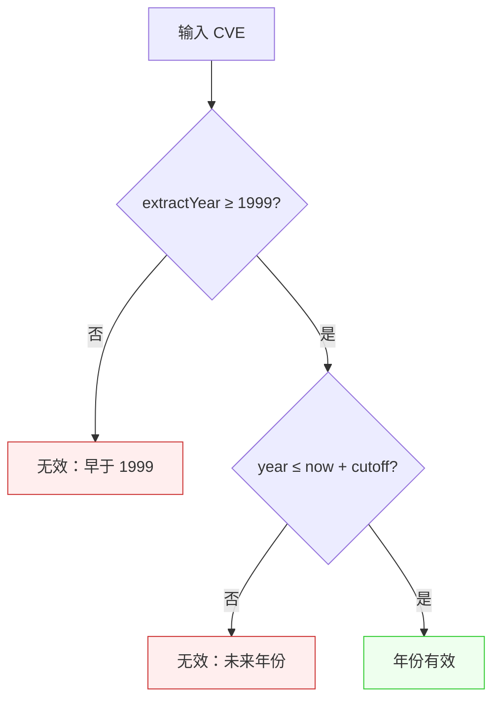
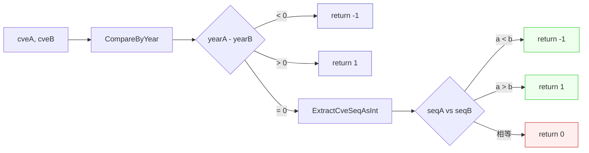

# 常见问题

本页汇总开发者在开始使用 `cve` 包及其 CLI 处理 CVE 标识符时最常遇到的问题。所有回答都直接取自源码：这里引用的每一条规则（1999 年下限、当前年份上限、大小写不敏感的正则、stdin 回退）都是 `base.go`、`extract.go`、`compare.go`、`filter.go`、`generate.go` 以及 `cmd/` CLI 中的实际行为。当某个问题有对应的单一函数或命令时，回答会直接指向它，方便你自行查阅源码。

:::tip 适用读者
正在将 `cve` 包或 `cve` CLI 集成到流水线中、遇到边界情况、校验被拒或比较结果不符合预期、希望快速获得权威答案的开发者。每个问答独立成段，可直接跳转到与你情况匹配的问题。
:::

## 格式与有效性

### `CVE-1999-*` 是合法的 CVE 吗？

是的。包的年份校验以 `1999` 作为闭区间下限，`CVE-1999-*` 能通过 `ValidateCve` 的全部检查。

CVE 计划于 1999 年开始正式发布记录，因此 `1999` 是包能接受的最早年份。`ValidateCve` 会以 `year <year> is before 1999` 为由拒绝任何严格小于 1999 的年份，而 1999 本身被接受：

```go
// CVE-1999-* 有效：1999 是闭区间下限。
cve.ValidateCve("CVE-1999-0001") // true
cve.ValidateCve("CVE-1998-0001") // false，year 1998 is before 1999
```

该下限在 `base.go` 中以字面量 `1999` 硬编码，不来自配置或数据库查询，因此不会随时间漂移。

### 序列号有位数限制吗？

没有。序列号由正则 `\d+` 匹配，对长度没有上限；包在存储和比较时将其作为整数处理，而不是固定宽度的字符串。

这一点有两层意义。其一，真实的 CVE 序列号随时间增长，经常超过四位（例如 `CVE-2021-44228`）。其二，把序列号当 *字符串* 比较是处理 CVE 时的经典错误：作为字符串 `"9999" > "10000"`，但作为整数 `9999 < 10000`。包在比较前一律转换为 `int`，因此无论位数多少都能得到正确结果：

```go
// 无宽度限制——4 位、5 位、6 位及以上的序列号都能正确比较。
cve.CompareCves("CVE-2022-10000", "CVE-2022-9999") // 1，整数下 10000 > 9999
cve.ValidateCve("CVE-2022-123456789")              // true（格式 + 年份 + 正序列号）
```

`FormatSeq(cve, width)` 是唯一施加宽度的函数，且仅用于 *显示*——它将序列号左补零到指定宽度，不会截断。长度超过 `width` 的序列号原样返回。

### 匹配区分大小写吗？

不区分。CVE 的匹配、校验、提取、比较和去重全部大小写不敏感，且每个公开函数在返回前都会统一为大写格式。

内部正则都带 `(?i)` 标志，因此 `cve-2022-12345`、`CVE-2022-12345` 和 `CvE-2022-12345` 都能匹配。`Format`（即 `strings.ToUpper(strings.TrimSpace(cve))`）会在每个比较或作为键的函数边界处应用，因此仅大小写不同的两个输入被视为同一个标识符：

```go
cve.IsCve("cve-2022-12345")               // true
cve.ExtractCve("see cve-2022-12345")      // ["CVE-2022-12345"]（已大写）
cve.RemoveDuplicateCves([]string{
    "CVE-2022-1111", "cve-2022-1111",
}) // ["CVE-2022-1111"]——大小写不敏感去重
```

在 CLI 中，这意味着你可以传入小写输入，仍会得到标准化的大写输出。

## 年份规则

### 为何年份用当前时间？

因为 CVE 计划按记录发布时分配年份，*当前* 年份是一个今天可能真实存在的 CVE 的自然上限。标注为明年的 CVE 尚未被分配。

`ValidateCve` 和 `validateSingleCve` 在调用时以 `time.Now().Year()` 计算上限，并拒绝严格超过该值的年份：

```go
currentYear := time.Now().Year()
if yearInt > currentYear {
    result.Reason = fmt.Sprintf("year %d is after current year %d", yearInt, currentYear)
}
```

这是一项合理性检查，而非安全策略——其目的是捕获诸如 `CVE-2202-1234` 之类的拼写错误和粘贴错误。其后果是同一输入在不同时间校验结果可能不同：`CVE-2025-0001` 在 2024 年无效，在 2025 年有效。如果你需要跨时间或跨环境的确定性行为，请用 `IsCveYearOkWithCutoff` 配合固定偏移量显式锁定上限。

### 如何处理未来 CVE？

使用 `IsCveYearOkWithCutoff(cve, cutoff)`，它将上限放宽 `cutoff` 年，接受小于等于 `time.Now().Year() + cutoff` 的年份。

```go
// 2024 年：2024 + 5 = 2029 为上限。
cve.IsCveYearOkWithCutoff("CVE-2026-12345", 5) // true（2026 ≤ 2029）
cve.IsCveYearOkWithCutoff("CVE-2031-12345", 5) // false（2031 > 2029）
cve.IsCveYearOk("CVE-2026-12345")              // false（2026 > 2024，无偏移）
```

偏移量的典型场景包括：处理预留或预发布阶段的 CVE ID、接入提前宣布次年分配的订阅源、编写不应在 1 月 1 日由绿变红的测试。注意 `IsCveYearOk` 就是 `IsCveYearOkWithCutoff(cve, 0)`——无偏移形式正是零偏移的特例。

年份检查的判定流程如下：



### 下限呢——能改 1999 吗？

不能。`1999` 下限是 `base.go` 中的字面常量，不是参数，也没有 `WithMinYear` 变体。这是有意为之：CVE 计划在 1999 年之前并不存在，因此任何低于该值的年份都毫无歧义地属于格式错误。

如果你确实有早于 CVE 的数据集（例如某个遗留公告库使用自己的 `CVE-1998-*` 风格 ID），正确做法是在交给包之前先过滤掉这些条目，或者用 `IsCve` 做 *仅格式* 检查以跳过年份规则：

```go
// 仅格式检查：只要形状正确就通过，不受年份影响。
cve.IsCve("CVE-1998-12345") // true（格式正确，未检查年份）
cve.ValidateCve("CVE-1998-12345") // false（年份 < 1999）
```

## CLI 行为

### CLI 如何从 stdin 读取？

当你调用某个命令时不带位置参数、且 stdin 是管道（而非终端）时，CLI 会按行从 stdin 读取 CVE 标识符，每行一个，空行会被跳过。如果传入了参数，则直接使用参数，stdin 被忽略。

该逻辑在 `readInputs` 中实现一次，由所有接受输入的子命令（`validate`、`format`、`extract`、`compare`、`filter` 等）共享：

```go
func readInputs(args []string) []string {
    if len(args) > 0 {
        return args
    }
    stat, _ := os.Stdin.Stat()
    if (stat.Mode() & os.ModeCharDevice) != 0 {
        return nil // 交互式终端，无管道输入
    }
    var lines []string
    scanner := bufio.NewScanner(os.Stdin)
    for scanner.Scan() {
        line := scanner.Text()
        if line != "" {
            lines = append(lines, line)
        }
    }
    return lines
}
```

字符设备检查意味着 CLI 不会在交互式 shell 中卡住等你输入——仅当确实有内容通过管道传入时才读取 stdin。常见用法：

```bash
# 通过管道传入一个每行一个 CVE 的文件
cat cves.txt | cve validate

# 从 stdin 的公告中提取
grep -i cve advisory.txt | cve extract

# 混合：参数优先于 stdin
cve validate CVE-2022-12345 < extra.txt   # 只校验 CVE-2022-12345
```

### CLI 区分大小写吗？

不区分——CLI 继承了库的大小写不敏感特性。每个输入在输出前都会经过 `Format`（大写 + 去空格），因此小写或大小写混用的输入会以标准化形式返回：

```bash
$ echo "cve-2022-12345" | cve validate
CVE-2022-12345	true

$ cve format cve-2022-12345
CVE-2022-12345
```

这也意味着去重类命令（`cve set union`、`cve set diff`）会把 `CVE-2022-1111` 与 `cve-2022-1111` 视为同一标识符，与库的行为一致。

### CLI 校验年份还是只校验格式？

取决于你运行哪个子命令。下表将常见检查映射到对应命令：

| 命令 | 检查内容 | 拒绝年份 &lt; 1999？ | 拒绝未来年份？ |
| --- | --- | --- | --- |
| `cve validate` | 格式 + 年份 + 正序列号 | 是 | 是（当前年份） |
| `cve validate is-cve` | 仅格式 | 否 | 否 |
| `cve validate contains-cve` | 仅子串匹配 | 否 | 否 |
| `cve validate year-ok` | 仅年份范围 | 是 | 是，除非带 `--cutoff` |

因此 `cve validate is-cve CVE-1998-12345` 返回 `true`（格式正确），而 `cve validate CVE-1998-12345` 返回 `false`（年份不通过）。请按所需严格程度选择命令。

## 生成与范围

### `GenerateCve` 会校验年份吗？

不会。`GenerateCve(year, seq)` 将两个整数格式化为 `CVE-<year>-<seq>` 并返回，不进行任何年份或序列号合理性检查，它会乐意产出 `CVE-1800-0` 或 `CVE-9999-0`：

```go
cve.GenerateCve(2022, 12345) // "CVE-2022-12345"
cve.GenerateCve(1800, 0)     // "CVE-1800-0"——无校验
```

这是有意为之：`GenerateCve` 是 *格式化器*，不是校验器。如果需要合法 CVE，请将结果交给 `ValidateCve`：

```go
id := cve.GenerateCve(year, seq)
if !cve.ValidateCve(id) {
    // 拒绝或修正
}
```

### `GenerateFakeCve` 产出什么？

一个使用当前年份、随机序列号在 `[10000, 99999]` 区间的假 CVE。随机性来自 `time.Now().Nanosecond() % 90000`，因此并非密码学随机，也不保证唯一——仅用于测试、演示和占位数据：

```go
cve.GenerateFakeCve() // 例如 "CVE-2024-54321"（当前年份，随机 5 位序列号）
```

由于使用当前年份，假 CVE 能通过 `IsCve`（格式），但不应依赖它冒充真实分配。

### CVE 范围如何展开？

`ParseCveRange(expr)` 将范围表达式展开为闭区间 `[start, end]` 内的全部 CVE 列表。它支持三种语法，均限定在同一年份内：

```go
cve.ParseCveRange("CVE-2022-12345 to CVE-2022-12347")
// ["CVE-2022-12345", "CVE-2022-12346", "CVE-2022-12347"]

cve.ParseCveRange("CVE-2022-12345..12347")  // 双点号
cve.ParseCveRange("CVE-2022-12345-12347")   // 连字符
```

起始与结束必须同一年份，且起始序列号须小于等于结束序列号；否则函数返回 `nil`。当公告写作 "CVE-2022-12345 至 CVE-2022-12350" 而你需要逐个 ID 时，就该用这个函数。

## 小结

- `CVE-1999-*` 合法：`1999` 是闭区间下限，在 `base.go` 中硬编码。
- 序列号无位数限制；包按整数比较，因此 `10000 > 9999` 是正确的。
- 所有匹配大小写不敏感（`(?i)` 正则），输出由 `Format` 统一为大写。
- 年份上限为 `time.Now().Year()`；处理未来年份请用 `IsCveYearOkWithCutoff(cve, cutoff)`。
- CLI 在无参数且 stdin 为管道时按行读取，空行会被跳过。
- `GenerateCve` 不做校验——如需合法 CVE，请搭配 `ValidateCve`。
- `ParseCveRange` 将 `to` / `..` / 连字符范围展开为同一年份内的闭区间。

## 图解参考

下面从两个互补视角展示单个 CVE 在包的校验流水线中如何从原始输入流转为可比较的标准化结果。

### ASCII 流程图：输入到结果流水线

```text
+------------------+      +------------------+      +-----------------------+
| 原始输入字符串   | ---> | Format()         | ---> | exactCveRegex (?i)    |
| " cve-2022-12345"|      | ToUpper + Trim   |      | ^\s*CVE-\d+-\d+\s*$   |
+------------------+      +------------------+      +-----------+-----------+
                                                                |
                                          +---------------------v----------------------+
                                          | IsCve() 为真?                            |
                                          |   否  --> invalid CVE format             |
                                          |   是  --> Split() -> year, seq           |
                                          +---------------------+--------------------+
                                                                |
                                          +---------------------v----------------------+
                                          | Atoi(year), Atoi(seq)                    |
                                          |   出错  --> year/seq not a valid number  |
                                          +---------------------+--------------------+
                                                                |
                                          +---------------------v----------------------+
                                          | 年份检查                                  |
                                          |   yearInt < 1999      --> before 1999    |
                                          |   yearInt > now+cut   --> future year    |
                                          +---------------------+--------------------+
                                                                |
                                          +---------------------v----------------------+
                                          | seqInt <= 0 ? --> seq must be positive   |
                                          +---------------------+--------------------+
                                                                |
                                          +---------------------v----------------------+
                                          | valid == true；输出已大写                 |
                                          | 可交给 CompareCves / SortCves            |
                                          +------------------------------------------+
```

`Format` 在每个边界都执行一次，因此让 `IsCve` 接受前后空白的同一标准化逻辑，也使下游比较与去重天然大小写不敏感。

### Mermaid 图：比较与排序状态机



`CompareCves` 在触及序列号之前会先按年份短路；同年份内比较的是 `int` 序列值——因此排序与 CVE 计划的时间顺序一致，而非朴素的字符串排序。

## 深入解析

- **1999 下限是字面量，不是参数。** `IsCveYearOkWithCutoff`（base.go）在下限处直接写死字面量 `1999`，条件为 `year >= 1999 && year <= time.Now().Year()+cutoff`。没有 `minYear` 字段、没有构造选项、也没有 `WithMinYear` 变体——不修改源码就无法放宽。`ValidateCve` 与 `validateSingleCve` 各自独立地重新推导同一个 `1999` 与同一个 `time.Now().Year()` 上限，因此库与年份检查助手是靠构造而非共享状态保持一致的。

- **比较全程基于整数。** `CompareCves`（compare.go）从不比较原始字符串 token，而是经 `ExtractCveYearAsInt`/`ExtractCveSeqAsInt` 走 `Atoi`，因此 `CVE-2022-10000` 会正确地排在 `CVE-2022-9999` 之后。`SortCves` 随后以 `CompareCves(...) < 0` 作为小于谓词驱动 `sort.Slice`，给出文档所述的 `O(n log n)` 排序。实际收益：喂入 `["CVE-2022-2222", "cve-2020-1111", "CVE-2022-1111"]` 会得到 `["CVE-2020-1111", "CVE-2022-1111", "CVE-2022-2222"]`，且大小写因逐元素 `Format` 被统一为大写。

- **校验有三条独立失败轴，而非一条。** `validateSingleCve` 返回的 `CveValidationResult`，其 `Reason` 可区分 `invalid CVE format`（正则未命中）、`year is not a valid number` / `sequence number is not a valid number`（Atoi 失败）、`year <d> is before 1999`、`year <d> is after current year <d>`、`sequence number must be positive`。各轴按序检查并短路，因此格式错误的 ID 永远到不了年份逻辑，错误年份永远到不了序列号检查。`ValidateCve` 是同一流水线的布尔投影（任一轴为假即返回 `false`），所以 `ValidateCve` 与 `ValidateCves`/`validateSingleCve` 只会在 *细节* 上不同，结论永不冲突。

- **`GenerateCve` 与 `ValidateCve` 刻意解耦。** `GenerateCve(year, seq)` 是纯 `fmt.Sprintf` 式格式化器，无任何守卫，会产出 `CVE-1800-0` 或 `CVE-9999-0`。生成与校验分离是有意为之：从解析公告字段拼装 ID 的构造器可以先产出候选，再以 `ValidateCve` 作为独立闸门。若二者合一，所有已知输入合法的内部调用方都将为冗余检查买单。

- **CLI 的 stdin 契约是单一共享助手，而非每命令各自实现。** `readInputs`（cmd/）对所有子命令应用同一条规则——参数优先，否则以 `os.ModeCharDevice` 判定 stdin 是否为管道，仅在管道时按行扫描并丢弃空行。由于库的 `Format` 在输出阶段统一执行，CLI 在 `validate`、`format`、`extract`、`compare`、`filter` 及 `set` 子命令中无需各自重写标准化，即可天然获得大小写不敏感、容忍空白的输入处理。

## 延伸阅读

- [Format 函数参考](/api/functions/format)
- [ValidateCve 函数参考](/api/functions/validate-cve)
- [IsCveYearOkWithCutoff 函数参考](/api/functions/is-cve-year-ok-with-cutoff)
- [ExtractCve 函数参考](/api/functions/extract-cve)
- [CompareCves 函数参考](/api/functions/compare-cves)
- [GenerateCve 函数参考](/api/functions/generate-cve)
- [ParseCveRange 函数参考](/api/functions/parse-cve-range)
- [年份规则指南](/guide/year-rules)
- [格式化与标准化指南](/guide/formatting-normalization)
- [校验策略指南](/guide/validation-strategy)
- [迁移指南](/zh/reference/migration)
