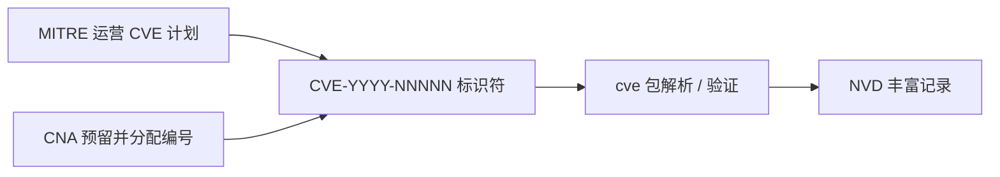
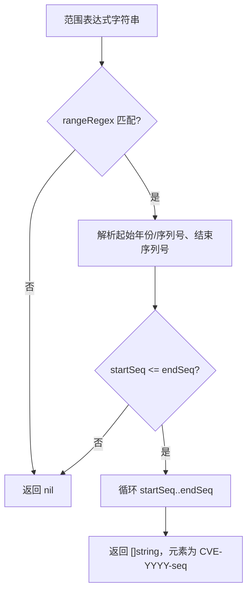
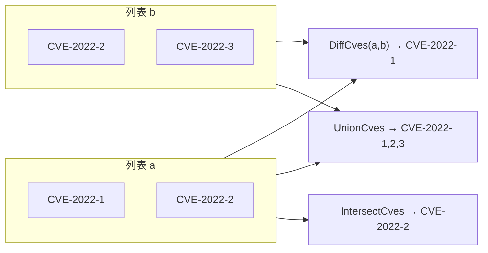
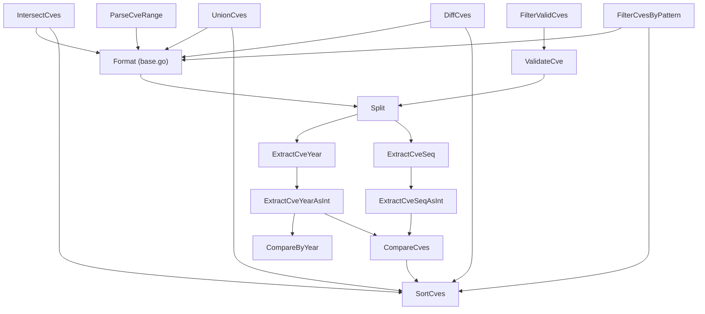

# 术语表

📌 本术语表定义 `cve` 包、其 CLI 以及本文档站点反复出现的术语。每个条目都把通俗解释与具体的源码位置或函数配对，让你能从一个术语直接跳到对应的确切行为。当某篇指南或 API 页引用了你想对照源码核实概念时，请阅读本页。

:::tip 适用读者
刚接触 CVE 生态、需要一处统一查阅缩写（CVE、CNA、MITRE、NVD）的新人，以及希望把每个术语映射到具体 Go 函数或正则表达式的开发者。
:::

## CVE、MITRE、NVD 与 CNA

这四个名称描述了 `cve` 包运行所在的生态。它们并非本库臆造，而是真实存在的组织与标识体系；但包中有若干函数假定你已经理解它们。

- **CVE** —— Common Vulnerabilities and Exposures，通用漏洞披露。一个公开编目的安全漏洞清单，每个漏洞以 `CVE-YYYY-NNNNN` 形式的字符串标识。`cve` 包把这个字符串作为核心数据类型建模；`base.go`、`extract.go`、`compare.go`、`filter.go`、`generate.go` 中的每个函数都接收、返回或操作 CVE 标识符。
- **MITRE** —— 代表美国政府运营 CVE 计划的组织。MITRE 分配与预留 CVE 编号，并发布本包所遵循的格式规范。`base.go` 中硬编码的下限年份 `1999` 正对应 MITRE 开始以 `CVE-YYYY-NNNNN` 语法发布的年份。
- **NVD** —— National Vulnerability Database，由 NIST 维护的国家漏洞数据库。NVD 为 CVE 记录补充影响分值与参考链接；它消费的正是本包解析的同一套 `CVE-YYYY-NNNNN` 标识符，因此 `SortCves` 或 `UnionCves` 导出的数据可直接被面向 NVD 的工具消费。
- **CNA** —— CVE Numbering Authority，CVE 编号授权机构。由 MITRE 授权、在预留范围内分配 CVE 编号的组织。`IsCveYearOkWithCutoff` 的 `cutoff` 参数正是为 CNA 在公开披露前预留编号块这一现实而存在。



📌 在本文档中，“CVE”既指计划本身也指单个标识符；靠上下文句子区分具体含义。

## 年份与序列号

一个 CVE 标识符由连字符分隔的两个可变部分组成：年份与序列号。本包把它们视为可独立提取、比较、过滤的字段。

```text
CVE - 2022 - 12345
 │     │      │
 │     │      └─ 序列号 (NNNNN+)
 │     └──────── 年份 (YYYY)
 └────────────── 固定前缀 "CVE"
```

- **年份（YYYY）** —— 四位日历年。`ExtractCveYear` 返回字符串形式，`ExtractCveYearAsInt` 返回 `int` 形式。有效年份必须满足 `year >= 1999 && year <= time.Now().Year()`（见 `base.go` 中的 `IsCveYearOkWithCutoff`）。格式无效时年份为 `0`。
- **序列号（NNNNN）** —— 某年内分配的正整数。`ExtractCveSeq` 返回字符串形式，`ExtractCveSeqAsInt` 返回 `int`（解析失败为 `0`）。`ValidateCve` 通过 `seqInt <= 0` 拒绝非正整数的序列号。

| 概念 | 字符串访问器 | 整数访问器 | 无效输入哨兵值 |
| --- | --- | --- | --- |
| 年份 | `ExtractCveYear` | `ExtractCveYearAsInt` | `""` / `0` |
| 序列号 | `ExtractCveSeq` | `ExtractCveSeqAsInt` | `""` / `0` |
| 两者 | `Split` 返回 `(year, seq)` | — | 两者均为 `""` |

🧩 `Split` 是两个提取器共同依赖的底层原语：它先经 `Format` 把输入转为大写，再按 `"-"` 切分，仅当切出恰好三段时才返回这两部分。

## 范围表达式

范围表达式表示同一年份内一段连续的 CVE 编号块。`generate.go` 中的 `ParseCveRange` 接受三种语法变体，全部由同一个编译好的正则匹配：

- `CVE-2022-12345 to CVE-2022-12350` —— 两个完整编号之间用单词 `to` 连接。
- `CVE-2022-12345..12350` —— 双点简写，结尾以裸序列号给出。
- `CVE-2022-12345-12350` —— 连字符简写，结尾以裸序列号给出。

```go
var rangeRegex = regexp.MustCompile(`(?i)^\s*CVE-(\d+)-(\d+)\s*(?:to\s*CVE-\d+-(\d+)|\.\.(\d+)|\s*-\s*(\d+))\s*$`)
```

解析规则直接取自 `ParseCveRange`：

1. 起止必须在**同一年份**——正则只捕获一个年份分组。
2. 起始序列号必须**小于或等于**结束序列号；否则函数返回 `nil`。
3. 范围是**闭区间**——起止两端都包含在返回切片中。

`IsCvesConsecutive` 是相关的布尔判断：当两个编号同年且序列号恰好相差 `1` 时即为连续。



## 交集、并集与差集

CVE 列表上的集合运算实现于 `filter.go`，行为与数学同名运算一致，且共享三条约定（每条实现都强制遵守）：

- **比较不区分大小写** —— 所有输入都经 `Format` 处理，因此 `"cve-2022-1"` 与 `"CVE-2022-1"` 视为同一元素。
- **去重** —— 结果绝不包含重复项；由内部的 `seen` 映射或集合映射守护。
- **输出已排序** —— 每个函数都以 `return SortCves(result)` 收尾，返回切片按年份再按序列号排序。

| 运算 | 函数 | 定义 |
| --- | --- | --- |
| 交集 | `IntersectCves(a, b)` | 同时出现在 `a` 与 `b` 中的元素 |
| 并集 | `UnionCves(a, b)` | 出现在 `a` 或 `b` 任一列表中的元素 |
| 差集 | `DiffCves(a, b)` | 在 `a` 中但不在 `b` 中的元素 |



⚠️ `DiffCves` 是有方向的：`DiffCves(a, b)` 返回 `a` 中但 `b` 中没有的编号，**并非**对称差。交换参数会得到不同结果。

## 标准化

标准化是把 CVE 字符串转换为单一规范形式的过程。在本包中它始终意味着**转为大写并去除首尾空白**，由 `base.go` 中的 `Format` 完成：

```go
func Format(cve string) string {
	return strings.ToUpper(strings.TrimSpace(cve))
}
```

每个接收或返回 CVE 字符串的公开函数内部都会调用 `Format`，因此无论输入大小写如何，内存中的表示始终是大写。两条校验正则编码了同样的预期：

- `exactCveRegex` 匹配 `^\s*CVE-\d+-\d+\s*$`（大小写不敏感），供 `IsCve` 使用。
- `containsCveRegex` 匹配 `CVE-\d+-\d+`（大小写不敏感），供 `IsContainsCve` 使用。

🤖 一项相关的、更窄的操作是 `FormatSeq`：它把序列号前补零到固定宽度（如 `CVE-2022-123` 在宽度 `6` 下变为 `CVE-2022-000123`）。它规范化的是宽度，而非大小写。

| 函数 | 规范化的内容 | 输出示例 |
| --- | --- | --- |
| `Format` | 大小写 + 首尾空格 | `" cve-2022-1 "` → `"CVE-2022-1"` |
| `FormatSeq` | 序列号宽度 | `CVE-2022-123`，宽度 `6` → `CVE-2022-000123` |

## 通配符模式

通配符模式是一种类 glob 的过滤字符串，由 `extract.go` 中的 `FilterCvesByPattern` 接受。仅支持一个元字符：`*`，匹配任意字符序列。实现上把模式转换为正则表达式，再与每个 CVE 匹配。

- `CVE-2022-*` —— 年份为 `2022` 的所有编号。
- `CVE-*-1234` —— 序列号为 `1234`、任意年份的所有编号。
- `CVE-2022-1*` —— `2022` 年中序列号以 `1` 开头的所有编号。

内部把 `*` 转为 `.*`，并转义 `.`, `+`, `(`, `)`, `[`, `]`, `{`, `}`, `\`, `^`, `$`, `|` 等正则元字符使其按字面匹配。结果经 `SortCves` 排序。


⚡ 模式会自动格式化为大写，因此 `"cve-2022-*"` 与 `"CVE-2022-*"` 等价。

## 小结

- **CVE / MITRE / NVD / CNA** 界定生态；本包硬编码的 `1999` 下限与基于 `cutoff` 的未来容限都源于 MITRE 与 CNA 的运作方式。
- **年份**与**序列号**是 CVE 的两个可变字段，由 `ExtractCveYear`/`ExtractCveSeq` 及其 `AsInt` 变体暴露，`Split` 为共用原语。
- **范围表达式**是同一年内一段连续编号块，由 `ParseCveRange` 展开为包含端点的编号列表。
- **交集、并集、差集**是不区分大小写、去重、返回排序切片的集合运算。
- **标准化**（`Format`）把每个 CVE 转为大写并去空白，使内部数据规范；`FormatSeq` 额外补齐序列号宽度。
- **通配符模式**以 `*` 为唯一元字符，由 `FilterCvesByPattern` 编译为正则。

## 图解参考

第一张图描绘单个 CVE 字符串在包内的完整流转：从原始输入到排序、去重后的输出。它标明了 `Format` 的施加位置（每个入口）、年份与序列号的切分点，以及哪些函数是终结性校验器、哪些是转换器。

```text
                 原始输入字符串
                        |
            +-----------+-----------+
            |                       |
        IsCve?                IsContainsCve?
   exactCveRegex           containsCveRegex
            |                       |
        +---+---+               ExtractCve
        |       |             (cveRegex + Format)
       是       否                  |
        |       |             +-----+-----+
   ValidateCve  |             |           |
   year>=1999   |        ExtractCveYear  ExtractCveSeq
   seq>0        |        / ExtractCveYearAsInt / ExtractCveSeqAsInt
        |       |             |           |
        v       v             v           v
   FilterValidCves        Split（共用原语，Format 后按 "-" 切分）
        |                       |
        +-----------+-----------+
                    |
            SortCves（CompareCves：先年份后序列号）
                    |
                    v
        已排序、大写、去重的 []string
```

第二张图从调用关系视角描绘公开函数之间的依赖。`Split` 与 `Format` 处于中心；`filter.go` 的集合运算和 `generate.go`/`extract.go` 的范围/通配符路径最终都汇聚到 `SortCves` 完成输出排序。



## 深入解析

- **`Format` 是大小写处理的唯一咽喉。** 每个接触 CVE 字符串的公开函数都会调用 `Format`（`base.go` 中的一行实现：`strings.ToUpper(strings.TrimSpace(cve))`）。这意味着调用方无需预先标准化——`IntersectCves`、`UnionCves`、`DiffCves`、`FilterCvesByPattern`、`SortCves` 在入口处对每个元素都施加 `Format`，因此 `"cve-2022-1"` 与 `"CVE-2022-1"` 在任何比较发生前已无差别。代价是 `Format` 的调用次数多于严格必要（例如 `ExtractCveYearAsInt` 先 `IsCve` 再 `Split`，而 `Split` 内部又调一次 `Format`），但相对保证内部状态始终规范的安全性，开销可忽略。
- **两级校验：格式 vs. 语义。** `IsCve` 是对 `exactCveRegex`（`^\s*CVE-\d+-\d+\s*$`，大小写不敏感）的纯正则测试——它接受任意数字串，包括 `CVE-0000-0` 或 `CVE-9999-000`。`ValidateCve` 在 `IsCve` 通过后叠加语义：`yearInt >= 1999 && yearInt <= time.Now().Year() && seqInt > 0`。`validateSingleCve`（供 `ValidateCves` 使用）按相同顺序逐项检查，并在每个失败点产出 `Reason` 字符串——格式、年份非数字、序列号非数字、年份早于 1999、年份晚于当前、序列号非正——正因如此批量校验能给出可逐项操作的诊断，而布尔版的 `ValidateCve` 把所有失败都折叠为 `false`。
- **`DiffCves` 的方向性与 `seen` 映射惯用法。** `DiffCves(a, b)` 先用 `b` 构建 `bSet`，再遍历 `a` 仅保留 `bSet` 中不存在者，并通过 `aSeen` 额外防止 `a` 内部重复。由于成员判定基于格式化（大写）后的键，结果对大小写稳定。`IntersectCves` 用相同模式，但 `set` 取自 `a`、`seen` 追踪输出；`UnionCves` 用单个 `set` 同时担任成员判定与去重守卫。三者都以 `return SortCves(result)` 收尾，这就是为什么每个集合运算的输出都已是排序的，尽管它们在累积阶段都不排序。
- **`ParseCveRange` 由正则驱动而非分词器。** 单个编译好的 `rangeRegex` 用三个分支（`to CVE-...`、`..NNNNN`、`-NNNNN`）分别把结束序列号捕获到第 3、4、5 分组；函数再取第一个非空分组。起始年份只捕获一次（第 1 分组），这就是“同一年份”约束在结构层面而非运行时检查中被强制的原因。闭区间展开（`make([]string, count)` 后 `for i := 0; i < count; i++` 循环调用 `GenerateCve`）预分配了精确的切片长度，避免反复扩容——对大范围是一次小而刻意的优化。
- **`CompareCves` 的排序顺序与 `CompareByYear` 捷径。** `CompareCves` 先委托给 `CompareByYear`，后者字面就是 `ExtractCveYearAsInt(cveA) - ExtractCveYearAsInt(cveB)`——返回的是原始年份差值，而非仅符号。`CompareCves` 把它折叠为 `{-1, 0, 1}`，仅在年份相等时才进入序列号比较。`SortCves` 随后用 `sort.Slice`，以 `CompareCves(...) < 0` 作为小于谓词。无效输入优雅降级：`ExtractCveYearAsInt` 对非 `IsCve` 字符串返回 `0`，因此畸形项会排到最前，而非让比较器崩溃。

## 延伸阅读

- [格式化与验证](/zh/api/format-validate) —— `Format`、`IsCve`、`ValidateCve` 及标准化背后的正则。
- [提取方法](/zh/api/extract) —— `ExtractCve`、`ExtractCveYear`、`ExtractCveSeq` 与 `FilterCvesByPattern`。
- [范围与模式](/zh/api/range-pattern) —— `ParseCveRange` 与三种范围语法。
- [集合运算](/zh/api/set-operations) —— `IntersectCves`、`UnionCves`、`DiffCves`。
- [年份校验规则](/zh/guide/year-rules) —— `1999` 下限与 `time.Now()` 上限的设计依据。
