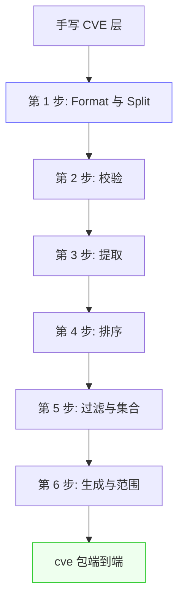
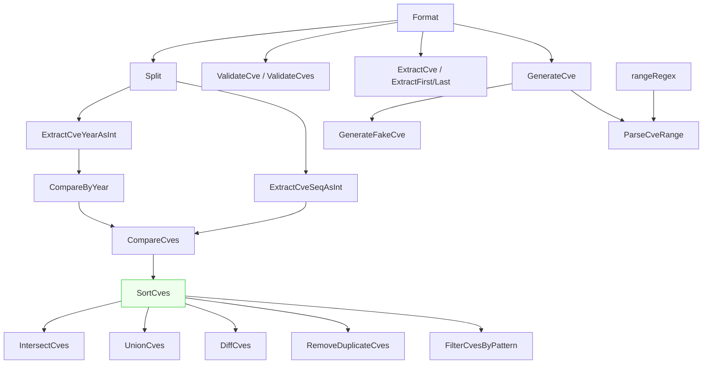

# 迁移指南

大多数接触 CVE 标识符的项目在引入库之前，都曾自己拼凑过一套临时处理逻辑：这里用 `strings.ToUpper` 统一大小写，那里用 `strings.Split(s, "-")` 取年份，再手写一个 `sort.Slice` 配上自制的比较器，外加一段复制来的正则从公告文本里捞 CVE。每段代码单独看都不大、也都没什么问题，但攒在一起就成了一盘散沙——重复、缺测试，还在边界情况上悄悄出错：大小写不同的重复项没被去重、序列号按字符串比较导致 `"9999" > "10000"`、年份校验忘了 1999 这条下限。本页把这些手写模式逐一映射到 `cve` 包的对应函数，让你可以渐进式迁移、边迁边删代码。

:::tip 适用读者
已经在自己代码库里写过 CVE 处理代码（字符串处理、正则提取、手工排序）并希望用 `cve` 包替换、同时不改变行为的开发者。每节自成一体，可以一次迁移一个模式。
:::

## 为什么要迁移

手写的 CVE 逻辑通常对自己测过的输入是对的，对作者没想到的输入是错的。`cve` 包把这些容易被忽略的约定固化进了实现：

| 关注点 | 典型手写代码 | 隐患 | 本库的做法 |
| --- | --- | --- | --- |
| 大小写 + 空白 | `strings.ToUpper(strings.TrimSpace(s))` | 该操作本身没问题——但调用方常在比较前忘记统一应用 | `Format` 在每条比较/去重/过滤路径上内部应用 |
| 年份 + 序列号拆分 | `strings.Split(s, "-")` 后取 `[1]`/`[2]` | 输入畸形时 panic 或返回空串，无长度守卫 | `Split` 对非 CVE 输入返回 `"", ""`，绝不 panic |
| 校验 | 内联 `regexp.MatchString` | 忘了 1999 下限、当前年份上限、序列号正整数规则 | `ValidateCve` / `ValidateCves` 三条规则一并强制 |
| 提取 | 局部 `regexp.MustCompile` | 忘了把匹配结果转大写，无共享模式 | `ExtractCve` 返回统一大写、按出现顺序的结果 |
| 排序 | `sort.Slice` 配基于 `Split` 的比较器 | 序列号按字符串比较：`"9999" > "10000"` | `SortCves` 先比年份再比序列号，且按整数比较 |
| 去重 | 以原始输入为键的 `map[string]struct{}` | `cve-2022-1111` 与 `CVE-2022-1111` 同时存活 | `RemoveDuplicateCves` 以 `Format(cve)` 为键 |

迁移很少是一次性的大重写。下面各节按从低到高的层次排列：先替换最底层 helper（`Format`、`Split`、校验），再在稳固的基础上替换高层函数（提取、排序、集合运算）。



## 用 Format 替换大小写与空白处理

CVE 代码里最常见的一行手写代码就是 `strings.ToUpper(strings.TrimSpace(cve))`。包里的 `Format` 恰好就是这一行，包好、命名好，调用处意图一目了然。

| 手写 | 迁移后 |
| --- | --- |
| `strings.ToUpper(strings.TrimSpace(s))` | `cve.Format(s)` |
| `strings.ToUpper(s)`（忘了 trim） | `cve.Format(s)`（顺带 trim） |
| 先 `strings.TrimSpace(s)` 后面再 `ToUpper` | `cve.Format(s)`（一次搞定） |

```go
// 迁移前：散落各处，容易漏掉一半。
func normalize(s string) string {
    return strings.ToUpper(strings.TrimSpace(s))
}

// 迁移后：一次命名调用，行为完全一致。
func normalize(s string) string {
    return cve.Format(s)
}
```

即便 `Format` 的函数体平淡无奇，把它集中起来的一个微妙理由是：包内其余函数的比较、去重、分组都以 `Format(cve)` 为键。如果边界处调用 `Format` 后把规范值往下传，所有下游 `cve` 函数就无需再各自归一化地保持一致。

注意 `Format` 刻意不做的事：不校验、不补齐序列号宽度。`"not-a-cve"` 会返回 `"NOT-A-CVE"`。若需校验，用 `IsCve` 或 `ValidateCve`；若需定宽补零，用 `FormatSeq`。

## 用 Split 替换手工拆分

用 `strings.Split(s, "-")` 取 CVE 年份和序列号是第二常见的模式，也是最脆弱的：输入畸形时切出的切片长度不对，取 `[1]` 或 `[2]` 要么 panic、要么静默取到错误字段。

| 手写 | 迁移后 | 畸形输入行为 |
| --- | --- | --- |
| `parts := strings.Split(s, "-"); year := parts[1]` | `year, _ := cve.Split(s)` | 手写：panic / 取错字段；`Split`：返回 `"", ""` |
| `parts := strings.Split(s, "-"); seq := parts[2]` | `_, seq := cve.Split(s)` | 同上 |
| `strconv.Atoi(parts[1])` 取年份 | `cve.ExtractCveYearAsInt(s)` | 失败返回 `0`，而非一个要被忽略的 error |

```go
// 迁移前：对 "CVE-2022"（只有两段）会 panic。
parts := strings.Split(raw, "-")
year, _ := strconv.Atoi(parts[1])
seq, _ := strconv.Atoi(parts[2])

// 迁移后：绝不 panic，坏输入返回零值。
yearStr, seqStr := cve.Split(raw)
year, _ := strconv.Atoi(yearStr)
seq, _ := strconv.Atoi(seqStr)

// 或干脆跳过 Atoi，直接用 int 提取器：
yearInt := cve.ExtractCveYearAsInt(raw) // 无效则 0
seqInt := cve.ExtractCveSeqAsInt(raw)   // 无效则 0
```

`Split` 内部先调用 `Format`，所以输入无需预先归一化；它还在索引前检查 `len(split) != 3`——正是手写版常漏掉的那道守卫。

## 用 IsCve 与 ValidateCve 替换内联正则校验

内联 `regexp` 校验通常有两种写法，都不完整。第一种只校验形状（`CVE-\d+-\d+`），照单全收 `CVE-1998-1` 和 `CVE-9999-0`。第二种加了年份上下界检查，却忘了序列号必须是正整数。

| 手写意图 | 迁移后 | 收益 |
| --- | --- | --- |
| `regexp.MustCompile(\`CVE-\d+-\d+\`).MatchString(s)` | `cve.IsCve(s)` | 允许两侧空白；包初始化时一次编译 |
| 手写的 形状+年份+序列号 校验 | `cve.ValidateCve(s)` | 一并强制 1999 下限、当前年份上限、正序列号 |
| 对切片循环调用上述校验 | `cve.ValidateCves(slice)` | 逐项返回带 `Reason` 的 `CveValidationResult` |
| 过滤切片只留有效项 | `cve.FilterValidCves(slice)` | 只返回有效 CVE，已大写 |

```go
// 迁移前：只看形状，CVE-1998-0 和 CVE-9999-0 都通过。
var cveRe = regexp.MustCompile(`(?i)CVE-\d+-\d+`)
if cveRe.MatchString(s) {
    // ...但它真的有效吗？
}

// 迁移后：完整有效性——格式、年份窗口、正序列号。
if cve.ValidateCve(s) {
    // 可安全使用
}

// 批量形式逐项给出原因：
for _, r := range cve.ValidateCves(raw) {
    if !r.Valid {
        log.Printf("拒绝 %q: %s", r.Cve, r.Reason)
    }
}
```

`Reason` 字段是手写复刻起来真正费劲的部分：`ValidateCves` 逐项报告 `"invalid CVE format"`、`"year 1998 is before 1999"`、`"year 2030 is after current year 2026"` 或 `"sequence number must be positive"`，让你的数据质量报告能告诉用户某行被拒的*原因*，而不只是被拒这一事实。

## 用 ExtractCve 替换手写提取

手写提取正则几乎总是 `CVE-\d+-\d+` 配 `FindAllString` 的复制版，而且几乎总是忘了把匹配结果转大写——于是提及 `cve-2021-44228` 的段落会得到 `"cve-2021-44228"`，随后与别处存储的规范 `"CVE-2021-44228"` 相等比较失败。

| 手写 | 迁移后 |
| --- | --- |
| `cveRe.FindAllString(text, -1)`（小写存活） | `cve.ExtractCve(text)`（全部匹配转大写） |
| `cveRe.FindString(text)` 再 `ToUpper` | `cve.ExtractFirstCve(text)` |
| `FindAllString` 后取最后一个元素 | `cve.ExtractLastCve(text)` |
| `cveRe.MatchString(text)` 作存在性检查 | `cve.IsContainsCve(text)` |

```go
// 迁移前：匹配保留原大小写。
var re = regexp.MustCompile(`(?i)CVE-\d+-\d+`)
matches := re.FindAllString(report, -1) // ["cve-2021-44228", ...]

// 迁移后：规范、大写、可直接比较。
matches := cve.ExtractCve(report) // ["CVE-2021-44228", ...]
first := cve.ExtractFirstCve(report)
last := cve.ExtractLastCve(report)
```

`ExtractCve` 使用包内唯一编译好的 `cveRegex`（声明于 `extract.go`），没有每次调用的编译开销，也没有在代码库里重复散落的正则字面量。`ExtractFirstCve` 与 `ExtractLastCve` 是同一引擎上的薄封装，三个函数因此天然保持一致，而非靠纪律维持。

## 用 CompareCves 与 SortCves 替换自制比较器

最危险的手写模式是建立在 `Split` 之上的排序比较器。年份相同、序列号分别为 `9999` 和 `10000` 的两个 CVE，若序列号按字符串比较就会排错——因为字典序下 `"9999" > "10000"`。修正方法（把两者都 `Atoi` 成 `int`）在一个乍看正确的比较器里最容易被遗忘。

| 手写 | 迁移后 | 规避的隐患 |
| --- | --- | --- |
| `sort.Slice(list, func(i,j) bool { return list[i] < list[j] })` | `cve.SortCves(list)` | 字符串比较让 `"9999"` 排到 `"10000"` 之后 |
| 基于 `Split` + `Atoi` 的比较器 | `cve.SortCves(list)` | 忘了先 `Format`，大小写混合时排序不稳 |
| `func less(a,b) { ... }` 再 `sort.Slice` | `cve.CompareCves(a,b) < 0` 作谓词 | 年份与序列号的决胜逻辑只正确编码一次 |
| 仅年份差 `yearA - yearB` | `cve.CompareByYear(a,b)` / `cve.SubByYear(a,b)` | 无效 CVE 视为年份 0，且已文档化 |

```go
// 迁移前：字符串比较器——序列号 >= 10000 时静默出错。
sort.Slice(cves, func(i, j int) bool {
    return cves[i] < cves[j]
})

// 迁移后：先年份后序列号、整数比较、已预归一化。
sorted := cve.SortCves(cves)
// sorted 是新切片；所有条目均已大写。
```

`SortCves` 返回的是*新切片*而非原地排序——如果你现有代码是原地排序输入切片并依赖这一点，这是需要注意的行为变化。代价是输入永远不会被修改，且返回切片既已排序又已统一格式，所以后续的 `RemoveDuplicateCves` 或集合运算无需再做一遍归一化。

若你需要为自定义容器（堆、树、或对结构体字段做 `sort.Slice`）提供比较器，用 `CompareCves(a, b) < 0` 作小于谓词。它返回 `-1`、`0`、`1`（而非原始年份差），能安全地与 `sort.Search` 等配合。

## 用集合运算与分组替换手工 map

CVE 提取并校验之后，下一层手写代码通常是用于去重的 `map[string]struct{}`、用于求交的嵌套循环、或用于按年分组的 `map[string][]string`。这些都对，但啰嗦，而且在大小写不一致时全部静默出错——除非键先经 `Format`。

| 手写意图 | 迁移后 | 省掉的代码 |
| --- | --- | --- |
| 以原始输入为键的 `map[string]struct{}` 去重 | `cve.RemoveDuplicateCves(list)` | 循环、set、对键的 `Format` 调用 |
| 嵌套循环：同时在 `a` 和 `b` 中的项 | `cve.IntersectCves(a, b)` | 两个循环、一个 set、去重、排序 |
| 全部追加再去重的并集 | `cve.UnionCves(a, b)` | 追加、set、排序 |
| 循环：在 `a` 但不在 `b` | `cve.DiffCves(a, b)` | set 查找、去重、排序 |
| 以年份为键的 `map[string][]string` | `cve.GroupByYear(list)` | `Split`/`ExtractCveYear` 调用、map 追加 |
| 按年计数的 `map[int]int` | `cve.CountByYear(list)` | `Atoi`、自增 |

```go
// 迁移前：cve-2022-1111 与 CVE-2022-1111 被当成两条留下。
seen := map[string]struct{}{}
var out []string
for _, c := range in {
    if _, ok := seen[c]; ok {
        continue
    }
    seen[c] = struct{}{}
    out = append(out, c)
}

// 迁移后：大小写不敏感去重，输出大写。
out := cve.RemoveDuplicateCves(in)

// 集合运算返回已排序、已去重、已大写的切片：
common := cve.IntersectCves(scannerA, scannerB)   // 两边都报的
onlyA := cve.DiffCves(scannerA, scannerB)         // 差异分析
all := cve.UnionCves(scannerA, scannerB)          // 合并
```

集合运算内部都返回 `SortCves(result)`，所以输出不仅正确——在多次运行和不同输入顺序下都是确定的，这对结果要喂给测试断言或存档报告时很重要。

## 用 FilterCvesByYear 等替换手写年份过滤与排序

把 CVE 过滤到某年或某区间常写成带内联 `ExtractCveYear` 等价物的 `for` 循环，而"最近 N 年"常把 `time.Now().Year()` 调用埋在业务逻辑里。本包把这些折叠成了行为已文档化的命名函数。

| 手写 | 迁移后 |
| --- | --- |
| 循环 + `ExtractCveYear == "2022"` | `cve.FilterCvesByYear(list, 2022)` |
| 循环 + 年份在区间内检查 | `cve.FilterCvesByYearRange(list, 2021, 2023)` |
| 循环 + `time.Now().Year()` 窗口 | `cve.GetRecentCves(list, 2)` |
| 基于 `regexp` 的通配匹配 | `cve.FilterCvesByPattern(list, "CVE-2022-*")` |

```go
// 迁移前：内联年份过滤，无归一化。
var out []string
for _, c := range in {
    parts := strings.Split(c, "-")
    if len(parts) == 3 && parts[1] == "2022" {
        out = append(out, c)
    }
}

// 迁移后：已归一化、一次调用、意图在名字里。
out := cve.FilterCvesByYear(in, 2022)

// 区间与近期：
rangeCves := cve.FilterCvesByYearRange(in, 2021, 2023)
recent := cve.GetRecentCves(in, 2) // 当前年份与上一年
```

`FilterCvesByPattern` 是手写通配逻辑的迁移目标。它把 `*` 转为 `.*`，转义正则元字符（`.` `+` `(` 等），编译结果，并返回已排序的匹配 CVE。转义这一步是大多数手写版跳过的，所以用户提供的形如 `CVE-2022-1.2` 的模式通常会撑爆朴素的 `regexp.Compile`。

## 用 ParseCveRange 替换手工范围展开

公告常把一块预留的 CVE 写成范围——`CVE-2022-12345 to CVE-2022-12350`、`CVE-2022-12345..12350` 或 `CVE-2022-12345-12350`。手写展开是一个带三个分支的正则加一个循环，而且几乎总是代码库里潜在 bug 最多的部分（上界 off-by-one、年份不匹配未检出、连字符范围与单个 CVE 混淆）。

| 手写 | 迁移后 |
| --- | --- |
| 多分支正则 + 循环展开范围 | `cve.ParseCveRange(expr)` |
| `for i := start; i <= end; i++ { fmt.Sprintf("CVE-%d-%d", year, i) }` | 同样的循环，但在 `ParseCveRange` 内部、带年份一致性校验 |
| 手写的"这两个是否连续？"检查 | `cve.IsCvesConsecutive(a, b)` |

```go
// 迁移前：三个分支的正则，很容易写错。
re := regexp.MustCompile(`(?i)CVE-(\d+)-(\d+)\s*(?:to|..|-)\s*(?:CVE-\d+-)?(\d+)`)
// ...再加上展开循环，再加上年份不匹配检查...

// 迁移后：一次调用，支持三种语法，跨年范围会被拒绝。
cves := cve.ParseCveRange("CVE-2022-12345 to CVE-2022-12350")
// ["CVE-2022-12345", ..., "CVE-2022-12350"]

dashForm := cve.ParseCveRange("CVE-2022-12345..12350")
dotForm := cve.ParseCveRange("CVE-2022-12345-12350")
```

`ParseCveRange` 拒绝跨年范围与起始序列号大于结束的范围，返回 `nil` 而非部分或回绕的结果。这道守卫正是"悄悄数据损坏"与"显眼的空切片可记日志排查"之间的差别。

## 迁移速查表

下表是整页的浓缩，按每行通常能删掉的代码量排序。

| 你过去写... | 现在调用... | 删除内容 |
| --- | --- | --- |
| `strings.ToUpper(strings.TrimSpace(s))` | `cve.Format(s)` | 1 行，且有名字 |
| `strings.Split(s, "-")` + 索引守卫 | `cve.Split(s)` | 3-4 行 + panic 风险 |
| 内联 `CVE-\d+-\d+` 正则做校验 | `cve.IsCve(s)` / `cve.ValidateCve(s)` | 正则字面量 + 调用 |
| 对切片循环校验 | `cve.ValidateCves(slice)` | 循环 + 原因格式化 |
| 循环过滤出有效项 | `cve.FilterValidCves(slice)` | 循环 + 过滤 |
| `FindAllString` + 手工 `ToUpper` | `cve.ExtractCve(text)` | 正则 + 循环 |
| `sort.Slice` + 字符串比较器 | `cve.SortCves(list)` | 比较器 + 排序调用 |
| `map[string]struct{}` 去重 | `cve.RemoveDuplicateCves(list)` | set + 循环 |
| 嵌套循环求交 | `cve.IntersectCves(a, b)` | 2 个循环 + set + 排序 |
| 追加 + 去重求并 | `cve.UnionCves(a, b)` | 追加 + set + 排序 |
| 集合差循环 | `cve.DiffCves(a, b)` | set + 循环 + 排序 |
| 按年的 `map[string][]string` | `cve.GroupByYear(list)` | split + map 追加 |
| 按年计数的 `map[int]int` | `cve.CountByYear(list)` | atoi + 自增 |
| 循环 + 内联年份检查 | `cve.FilterCvesByYear(list, y)` | 循环 + split |
| 带 `time.Now` 的范围窗口循环 | `cve.GetRecentCves(list, n)` | 循环 + time 调用 |
| 手搭的通配正则 | `cve.FilterCvesByPattern(list, pat)` | 正则编译 + 转义 |
| 范围展开正则 + 循环 | `cve.ParseCveRange(expr)` | 正则 + 循环 + 守卫 |
| `Sprintf("CVE-%d-%d", y, s)` | `cve.GenerateCve(y, s)` | sprintf + format |

## 小结

- 自底向上迁移：先替换 `Format` 与 `Split`，再校验，再提取，再排序与集合。每层都建在下一层之上，稳固基础后高层即插即用。
- 单个最高价值的替换是用 `SortCves` 替换字符串比较器：修掉了手写比较器几乎都有的 `9999` 与 `10000` 顺序 bug。
- 单个最高价值的*正确性*替换是用 `ValidateCves` 替换内联正则：补上 1999 下限、当前年份上限、正序列号规则，并逐项报告 `Reason`。
- 包内每个集合运算与过滤器都返回已排序、已去重、已大写的切片，因此迁移它们不仅删掉循环，还顺带删掉周边的归一化与排序样板代码。
- `Format` 由每个比较或以 CVE 为键的函数内部应用，因此只要边界代码调用 `Format`，下游 `cve` 调用无需再归一化即可保持一致。

## 图解参考

第一张图是典型迁移的 ASCII 管线：每个手写 helper 都被 `cve` 包的函数替换，每一层在把规范值往下传之前都先经 `Format` 归一化。框线视图让一个关键点显形——`Format` 是公共基座，所有高层函数（`Split`、`ValidateCve`、`ExtractCve`、`SortCves`、集合运算、`ParseCveRange`）都建在它之上，所以稳住底层，高层才能即插即用。

```text
                原始 CVE 字符串（大小写不一、带空格、可能畸形）
                |
                v
        +-------------------+      strings.ToUpper + TrimSpace
        |  Format(s)        | ===> 替换为 cve.Format
        +-------------------+
                |  规范的 "CVE-YYYY-NNNNN"
        +-------+-------+-------------------+-------------------+
        |               |                   |                   |
        v               v                   v                   v
  +-----------+   +---------------+   +-------------+   +---------------+
  | Split(s)  |   | ValidateCve(s)|   | ExtractCve  |   | SortCves(list)|
  | 年份,序列 |   |  + Reason     |   |  (cveRegex) |   | CompareCves   |
  +-----------+   +---------------+   +-------------+   +---------------+
        |               |                   |                   |
        |               v                   v                   v
        |     FilterValidCves         ExtractFirst/Last   RemoveDuplicateCves
        |               |                   |             Intersect/Union/Diff
        |               v                   |                   |
        +-------> FilterCvesByYear <-------+-------------------+
                        |
                        v
                ParseCveRange / GenerateCve
                        |
                        v
        已排序、已去重、已大写的 []string  （输出确定性）
```

第二张图把视角从"什么替换什么"切换到函数之间的调用关系。`CompareCves` 先委托给 `CompareByYear`，年份相同时再回退到序列号比较；`SortCves` 建立在 `CompareCves` 之上；而每个集合运算（`IntersectCves`、`UnionCves`、`DiffCves`）都把结果送进 `SortCves`，所以它们全部白送一个"已排序"输出。`ParseCveRange` 与 `GenerateFakeCve` 最终都收束到 `Format` 与 `GenerateCve`，因此生成的 CVE 天然就是规范形式。



## 深入解析

除了各模式表格已覆盖的内容，评估迁移时还有几条实现细节值得知道：

- **`CompareCves` 返回的是符号，不是差值。** 与 `CompareByYear`（返回原始 `yearA - yearB` 差值）不同，`CompareCves` 把结果归一为 `-1`、`0`、`1`（compare.go 第 110-128 行）。这是有意为之：用原始年份差作 `sort.Slice` 小于谓词固然能用，但会把差值大小泄露进只关心顺序的比较器里。仅返回符号意味着 `CompareCves(a, b) < 0` 能安全地与 `sort.Search`、`sort.Slice` 以及任何期望比较器的第三方容器配合——你永远不会从跨多年的差距里得到一个"很大的负数"惊吓。

- **`SortCves` 先复制再排序。** 函数先分配新切片 `result := make([]string, len(cveSlice))`，把每条格式化进去，再对副本调用 `sort.Slice`（compare.go 第 165-176 行）。输入切片永远不会被改。如果你现有代码是原地排序且依赖这一点，这是行为变化；代价是多一次大小为 n 的分配——对实际遇到的 CVE 列表规模（公告、扫描器输出）可以忽略，而好处是返回切片同时已排序*且*已统一 `Format`，所以后续 `RemoveDuplicateCves` 或集合运算无需再做一遍归一化。

- **是两个正则，不是一个，差别就在 `^...$`。** `base.go` 声明了带锚点的 `exactCveRegex`（`^\s*CVE-\d+-\d+\s*$`，供 `IsCve`）和不带锚点的 `containsCveRegex`（供 `IsContainsCve`），而 `extract.go` 另外为 `ExtractCve` 声明了带捕获组的 `cveRegex`（base.go 第 14-17 行、extract.go 第 9 行）。锚点正是手写代码最常出错的地方：用不带锚点的 `CVE-\d+-\d+` 做*校验*会匹配 `"blah CVE-2022-1 blah"`，静默接受垃圾输入。迁移到 `IsCve` 就等于把锚点按构造继承下来。

- **`ParseCveRange` 只会拒绝，绝不回绕。** 范围展开器在三种失败模式下都返回 `nil`：正则不匹配、`startSeq > endSeq`、任何 `Atoi` 失败（generate.go 第 144-170 行）。它不会尝试给出部分结果；且因为正则只从起始 CVE 捕获一次年份，两端年份不同的"范围"根本无法匹配该模式——跨年范围是在结构层面被拒，而非靠一个可能被漏掉的后置检查。这正是"悄悄 off-by-one 数据损坏"与"显眼的可记日志空切片"之间的分野。

- **`FilterCvesByPattern` 先转义、再编译、最后排序。** glob 转正则的转换器逐 rune 遍历模式，把 `*` 映射为 `.*`，对每个正则元字符（`. + ( ) [ ] { } \ ^ $ |`）加反斜杠，然后才调用 `regexp.Compile`（filter.go 第 299-329 行）。因此用户提供的形如 `CVE-2022-1.2` 的模式会把 `.` 编译成字面点而非通配，永远不会 panic `regexp.Compile`。匹配结果再送进 `SortCves`，所以即便输入是自由格式模式，输出也已排序且规范——而手写的 `FindAllString` + 循环几乎从不做这一步。

## 延伸阅读

- [Format 函数参考](/zh/api/functions/format)
- [Split 函数参考](/zh/api/functions/split)
- [ValidateCves 函数参考](/zh/api/functions/validate-cves)
- [ExtractCve 函数参考](/zh/api/functions/extract-cve)
- [SortCves 函数参考](/zh/api/functions/sort-cves)
- [RemoveDuplicateCves 函数参考](/zh/api/functions/remove-duplicate-cves)
- [ParseCveRange 函数参考](/zh/api/functions/parse-cve-range)
- [格式化与归一化指南](/zh/guide/formatting-normalization)
- [比较与排序指南](/zh/guide/comparison-ordering)
