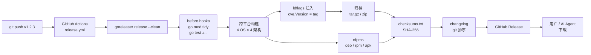

# 发布与 goreleaser

`cve` CLI 通过 [goreleaser](https://goreleaser.com) 发布为跨平台预编译二进制，由 [`.goreleaser.yaml`](https://github.com/scagogogo/cve-skills/blob/main/.goreleaser.yaml) 驱动，并在每个 `v*` tag 上由 [`release.yml`](/zh/reference/ci-cd#release-yml-跨平台发布) 工作流触发。本页记录构建矩阵、ldflags 版本注入、归档/包/校验和/changelog 产物，以及 AI Agent 或用户如何获取结果二进制。

:::tip 📂 查看源码
[`.goreleaser.yaml`](https://github.com/scagogogo/cve-skills/blob/main/.goreleaser.yaml) — 127 行，goreleaser v2。
:::

## 发布总览



## 构建矩阵

`builds` 段以 `CGO_ENABLED=0`（纯 Go、静态链接、零 C 依赖）交叉编译 `./cmd/cve`（`main` 包），覆盖：

| OS（`goos`） | 架构（`goarch`） | 说明 |
|---|---|---|
| `linux` | `amd64`、`arm64`、`arm`、`386` | 完整矩阵 |
| `darwin`（macOS） | `amd64`、`arm64` | 忽略 `arm`/`386`（macOS 无此架构） |
| `windows` | `amd64`、`arm64` | 忽略 `arm`/`386` |
| `freebsd` | `amd64`、`arm64` | 忽略 `arm`/`386` |

`ignore` 列表排除无效组合（如 `darwin/arm`、`windows/386`），得到 **12 个有效 OS×架构目标**。每个产出独立的 `cve` 二进制。

:::tip 📌 为何 CGO_ENABLED=0
纯 Go 静态二进制无 C 运行时依赖即可运行——同一二进制可在 Alpine、scratch 容器、最小化嵌入式 Linux、旧 glibc 系统上工作。这正是 CLI 可被 AI Agent 下载并在未知主机上安全运行的原因。
:::

## 版本注入（ldflags）

版本字符串在链接期烘焙进二进制，覆盖包级 [`cve.Version`](/zh/api/functions/version) 变量（声明于 `cve.go:41` 的 `var Version = "dev"`）：

```text
ldflags:
  - -s -w # 去除符号表与 DWARF，缩小体积
  - -X github.com/scagogogo/cve-skills.Version={{.Version}}
```

- `-s -w` 去除符号表与 DWARF 调试信息，使每个二进制缩小约 30–40%。
- <code v-pre>-X github.com/scagogogo/cve-skills.Version=<span v-pre>{{.Version}}</span></code> 用 goreleaser 模板值 <code v-pre><span v-pre>{{.Version}}</span></code>（解析为 git tag，如 `v1.2.3`）覆盖 `Version` 变量。
- <code v-pre><span v-pre>{{.Version}}</span></code> 来自 push 的 tag。不带 ldflags 的源码构建留 `cve.Version == "dev"`；发布二进制报告 tag。

这就是 `Version` 声明为 `var` 而非 `const` 的原因——链接器的 `-X` 标志只能覆盖包级 `string` `var`。见 [Version](/zh/api/functions/version#为什么是-var-而非-const)。

## 构建钩子

```yaml
before:
  hooks:
    - go mod tidy
    - go test ./...
```

构建任何二进制前，goreleaser 运行 `go mod tidy`（确保 `go.mod`/`go.sum` 一致）与 `go test ./...`（运行完整测试套件）。测试失败则发布中止——红的 `main` 上切 tag 无法产出二进制。这是 `go-test.yml` CI 门禁之外的发布时安全网。

## 归档

```text
archives:
  - id: default
    name_template: >-
      {{ .ProjectName }}_{{ .Version }}_
      {{- if eq .Os "darwin" }}macos
      {{- else }}{{ .Os }}{{ end }}_
      {{- if eq .Arch "amd64" }}x86_64
      {{- else if eq .Arch "386" }}i386
      {{- else }}{{ .Arch }}{{ end }}
    format: tar.gz
    format_overrides:
      - goos: windows
        format: zip
    files:
      - README.md
      - README.zh.md
      - LICENSE
```

- **命名**：`cve_<version>_<os>_<arch>.tar.gz`，其中 `darwin`→`macos`、`amd64`→`x86_64`、`386`→`i386` 以求更友好的名称。例：`cve_v1.2.3_macos_arm64.tar.gz`。
- **格式**：Unix 用 `tar.gz`，Windows 用 `zip`（`format_overrides`）。
- **捆绑文件**：每个归档除二进制外含 `README.md`、`README.zh.md`、`LICENSE`，下载一个归档即得全部。

## Linux 包（nfpms）

```text
nfpms:
  - file_name_template: "{{ .ProjectName }}_{{ .Version }}_{{ .Os }}_{{ .Arch }}"
    formats:
      - deb
      - rpm
      - apk
```

对 Linux 目标，goreleaser 还产出原生包：`.deb`（Debian/Ubuntu）、`.rpm`（Fedora/RHEL）、`.apk`（Alpine）。用户可用 `dpkg -i`、`rpm -i`、`apk add` 安装，无需解压 tar 包。每个包携带 `MIT` 许可证、主页、维护者元数据。

## 校验和

```yaml
checksum:
  name_template: "checksums.txt"
  algorithm: sha256
```

单一 `checksums.txt` 文件列出每个归档与包的 SHA-256 哈希。用户（与 AI Agent）可验证下载：

```bash
sha256sum -c checksums.txt --ignore-missing
```

## 更新日志

```yaml
changelog:
  use: git
  sort: asc
  filters:
    exclude:
      - "^docs:"
      - "^test:"
      - "^chore:"
      - "Merge pull request"
      - "Merge branch"
```

- **`use: git`**——使用 git 原生日志，介于前一个 tag 与新 tag 之间。
- **`sort: asc`**——最旧提交在前。
- **排除**：`docs:`、`test:`、`chore:` 提交与合并提交，故 changelog 仅展示有意义变更。

## 发布

```text
release:
  github:
    owner: scagogogo
    name: cve-skills
  draft: false
  prerelease: auto
  name_template: "{{ .Tag }}"
```

- **`draft: false`**——Release 立即发布，不存为草稿。
- **`prerelease: auto`**——`v1.2.3-rc1` 这类 tag 自动标记为预发布。
- **<code v-pre>name_template: "<span v-pre>{{ .Tag }}</span>"</code>**——Release 标题为 tag 名。
- Release 头部含一行 `go install` 命令；尾部链接安装脚本（见 [获取二进制](#获取二进制)）。

## 获取二进制

三种方式获取 `cve` CLI，按便捷度排序：

```bash
# 1. 安装脚本（从最新 Release 下载与 OS/架构匹配的归档）
curl -fsSL https://raw.githubusercontent.com/scagogogo/cve-skills/main/scripts/install.sh | bash

# 2. go install 从源码编译（cve.Version 即为 tag）
go install github.com/scagogogo/cve-skills/cmd/cve@v1.2.3

# 3. 从 GitHub Release 页面手动下载
#    https://github.com/scagogogo/cve-skills/releases
#    选 cve_<version>_<os>_<arch>.tar.gz，解压，把 `cve` 放入 PATH
```

安装后验证版本已注入：

```bash
cve version
# 发布二进制输出：v1.2.3
# 源码构建输出：  dev
```

## 本地预发布检查

切 tag 前，本地复现发布但不发布：

```bash
# 校验配置语法
goreleaser check

# 完整本地构建（所有目标，不发布）——产出 dist/ 但不创建 Release
goreleaser release --snapshot --clean

# 单目标快速构建（ci.yml 在每个 PR 上运行的就是这个）
goreleaser build --snapshot --clean --single-target
```

`--snapshot` 使用假版本（`<tag>-next`）并跳过发布，本地运行安全。`--clean` 先清 `dist/` 以防残留产物。

## 数据流

```text
+----------------+     +----------------------+     +-----------------------------------+
| git tag v1.2.3 | --> | release.yml 工作流   | --> | goreleaser release --clean        |
+----------------+     +----------------------+     +----------------+------------------+
                                                                    |
                                                    before.hooks: go mod tidy, go test ./...
                                                                    |
                                                                    v
                                       +-------------------------------------------+
                                       | 跨平台构建（CGO_ENABLED=0）               |
                                       |  linux/darwin/windows/freebsd             |
                                       |  × amd64/arm64/arm/386（12 个有效目标）   |
                                       +----------------+--------------------------+
                                                        |
                                          ldflags: -s -w -X ...Version=v1.2.3
                                                        |
                          +-----------------------------+-----------------------------+
                          |                             |                             |
                          v                             v                             v
                +-------------------+         +-------------------+         +-------------------+
                | 归档              |         | nfpms             |         | checksums.txt     |
                | tar.gz / zip      |         | deb / rpm / apk   |         | 所有产物的        |
                | +README +LICENSE  |         |（仅 Linux）       |         | SHA-256           |
                +---------+---------+         +---------+---------+         +---------+---------+
                          |                             |                             |
                          +-----------------------------+-----------------------------+
                                                        |
                                          changelog（git 日志，已过滤）
                                                        |
                                                        v
                                          +-------------------------------+
                                          | GitHub Release v1.2.3         |
                                          |  - 12 个归档中的二进制        |
                                          |  - Linux 包                   |
                                          |  - checksums.txt              |
                                          |  - CHANGELOG                  |
                                          +---------------+---------------+
                                                          |
                                          用户 / AI Agent 下载
                                                          |
                                          install.sh / go install / 手动
```

## 深入解析

- **`CGO_ENABLED=0` 是基石。** 它让每个二进制成为无 C 运行时依赖的自包含静态可执行文件。这正是同一 `cve` 二进制无需重编译即可在 Alpine（musl）、Ubuntu（glibc）、macOS、Windows 上运行，也是 AI Agent 能下载一个归档并在未知主机上运行而无需担心共享库的原因。
- **`-s -w` 用可调试性换体积。** 剥离的二进制无法用 `delve` 调试或栈追踪符号化，但小约 30–40%。对于发给终端用户的 CLI（非长跑服务），体积收益值得牺牲可调试性。需要符号请本地不带此标志构建：`go build ./cmd/cve`。
- **`ignore` 列表是显式的，非推断。** goreleaser 不自动跳过无效 OS×架构组合；配置列出每个要排除的组合（`darwin/arm`、`darwin/386`、`windows/arm`、`windows/386`、`freebsd/arm`、`freebsd/386`）。新增 OS 或架构需复查此列表。
- **<code v-pre>mod_timestamp: "<span v-pre>{{ .CommitTimestamp }}</span>"</code>** 将构建时间戳设为提交时间而非 `time.Now()`。这使构建可复现：同一提交跨运行产出字节相同的二进制，对供应链验证很重要。
- **`prerelease: auto`** 按后缀（`-rc1`、`-beta` 等）检测预发布 tag 并自动将 GitHub Release 标记为预发布。稳定的 `v1.2.3` tag 成为稳定 Release；`v1.2.3-rc1` 成为需用户主动选择的预发布。
- **changelog 排除 `docs:`/`test:`/`chore:` 提交。** 让面向用户的 changelog 聚焦功能与修复。内部重构与文档更新仍在 git 历史中，只是不呈现在 Release 说明里。
- **`before.hooks` 在发布时运行 `go test ./...`。** 这是最后防线：即便直接 push tag（绕过 `main` 的 CI 门禁），goreleaser 在构建前重跑测试。测试失败则发布中止，故不会发布坏二进制。
- **三种安装路径是刻意的。** `install.sh`（无需工具链）、`go install`（需 Go，得精确 tag）、手动归档下载（完全控制）。无 Go 工具链的 AI Agent 用 `install.sh`；有 Go 的用 `go install` 固定版本。

## 相关

- [CI/CD 流水线](/zh/reference/ci-cd) — 调用 goreleaser 的 `release.yml` 工作流
- [Version](/zh/api/functions/version) — 被 ldflags 覆盖的 `var Version = "dev"`
- [下载与安装](/zh/download) — 面向用户的安装说明
- [测试策略](/zh/guide/testing) — `before.hooks` 运行的 `go test ./...`
